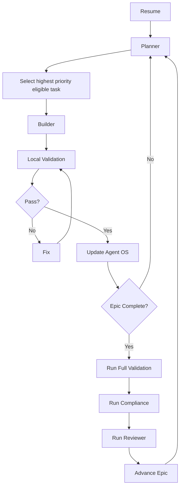

# Ask AI Agent OS — Master Loop

**Stability:** Permanent operating policy. Change only when the development process itself changes.
**Scope:** Ask AI work governed by the frozen documents in this directory.
**Last initialized:** 2026-07-26

## 1. Source-of-truth order

When documents disagree, use this order and record the conflict in [08_BLOCKERS.md](./08_BLOCKERS.md):

1. [ASK_AI_PRODUCT_SPEC.md](./ASK_AI_PRODUCT_SPEC.md) — user-visible behavior.
2. [ASK_AI_DECISION_ENGINE.md](./ASK_AI_DECISION_ENGINE.md) — deterministic routing and confidence.
3. [ASK_AI_ORCHESTRATOR.md](./ASK_AI_ORCHESTRATOR.md) — capability cooperation.
4. [ASK_AI_IMPLEMENTATION_PLAN.md](./ASK_AI_IMPLEMENTATION_PLAN.md) — delivery sequence.
5. [ASK_AI_AUDIT.md](./ASK_AI_AUDIT.md) — current-state evidence at revision `c7e28ae`.
6. The current repository — evidence of what has actually been implemented.

Do not silently resolve a specification contradiction. Stop only the affected task, document it, and continue independent work.

## 2. Resume sequence

Every development session begins by reading:

1. this file;
2. [04_CURRENT_STATE.md](./04_CURRENT_STATE.md);
3. [08_BLOCKERS.md](./08_BLOCKERS.md);
4. the active item in [03_TASKS.md](./03_TASKS.md);
5. the linked frozen specification sections;
6. the latest entry in [06_PROGRESS.md](./06_PROGRESS.md);

Then inspect the working tree and current revision. Existing user changes are preserved.

Resume Optimization

Do not reread frozen specifications unless

- current task requires them
- architecture changed
- reviewer detected a conflict

Otherwise rely on Current State and Tasks.

## 3. Execution loop

## 4. Task selection

Select work in this order:

1. active task already named in `04_CURRENT_STATE.md`;
2. unresolved P0 defect blocking that task;
3. next unchecked task in dependency order in `03_TASKS.md`;
4. P1 work only when its P0 dependencies are complete;
5. P2 cleanup only after the compatibility window permits it.

Do not begin more than one state-changing task at a time. Read-only investigation may be parallelized.

## 5. Completion criteria

### Task complete

A task is complete only when:

- its task-specific Definition of Done passes;
- implementation and tests are present in the same reviewable change;
- required migrations are additive, rehearsed, and documented;
- legacy/flag-off behavior remains covered;
- affected security and authorization checks pass;
- documentation memory is updated;
- no known failure is hidden as success.

### Iteration complete

An iteration is complete only when:

- `03_TASKS.md` reflects status changes;
- `04_CURRENT_STATE.md` names the next task;
- `06_PROGRESS.md` has a new append-only entry;
- `08_BLOCKERS.md` contains only unresolved blockers;
- `09_CHANGELOG.md` is updated for completed user-visible or operational capability;
- `05_DECISIONS.md` is updated only if an approved architectural decision changed.

### Epic complete

An epic is complete only when all epic acceptance criteria in `ASK_AI_IMPLEMENTATION_PLAN.md` and the mapped tests in `07_TEST_PLAN.md` pass.

## 6. Documentation ownership

| Document                | Update rule                                                                                              |
| ----------------------- | -------------------------------------------------------------------------------------------------------- |
| `00_MASTER_LOOP.md`   | Rarely; only process-policy changes.                                                                     |
| `01_PRODUCT_SPEC.md`  | Derived summary; update only after an approved frozen-spec change.                                       |
| `02_ARCHITECTURE.md`  | Update when implemented architecture or planned/implemented status changes.                              |
| `03_TASKS.md`         | Update status after every task iteration. Never mark complete from documentation alone.                  |
| `04_CURRENT_STATE.md` | Rewrite the snapshot after every successful iteration.                                                   |
| `05_DECISIONS.md`     | Append or supersede decisions; never erase historical decisions.                                         |
| `06_PROGRESS.md`      | Append only. Never edit earlier entries except factual typo correction marked as such.                   |
| `07_TEST_PLAN.md`     | Update when behavior, risks, or test commands change.                                                    |
| `08_BLOCKERS.md`      | Keep unresolved blockers only. Remove resolved entries after recording resolution in Progress/Changelog. |
| `09_CHANGELOG.md`     | Keep a Changelog style; record completed changes, not plans.                                             |

The five `ASK_AI_*.md` source documents are frozen. Do not edit them inside an implementation task.

## 7. Testing rules

1. Establish a baseline before changing behavior.
2. Add the narrowest test that fails for the missing behavior.
3. Run unit/contract tests first, then affected integration and UI tests.
4. Run legacy regression tests whenever a shared path changes.
5. Database changes require empty-schema and `0022`-upgrade validation, ownership/RLS tests, and a rollback note.
6. Provider boundaries require deterministic mocks and failure injection.
7. Never call a task complete with skipped required tests. Record unavailable infrastructure as a blocker.
8. Do not weaken assertions to make a failure pass.
9. Required commands and acceptance suites live in [07_TEST_PLAN.md](./07_TEST_PLAN.md).
10. Run the compliance gate described in [AGENT_OS_COMPLIANCE.md](./AGENT_OS_COMPLIANCE.md) before handoff or commit.

## 8. Retry policy

Retries are bounded:

1. **Attempt 1 — Diagnose:** reproduce, isolate, and identify the failed assumption.
2. **Attempt 2 — Correct:** apply the smallest direct fix and rerun the narrow test.
3. **Attempt 3 — Alternate safe path:** use an approved fallback without expanding product scope.

After three failures caused by the same condition:

- revert incomplete local changes if necessary to restore a verified baseline;
- record a blocker with evidence and attempted solutions;
- move to the highest-priority independent task;
- request human input only when no independent progress remains.

Never loop on model generation, provider calls, migrations, or destructive operations.

## 9. Blocker policy

A blocker is an unresolved condition that prevents a task's Definition of Done, not merely difficult work.

- Record severity, evidence, possible solutions, dependencies, owner role, and status in `08_BLOCKERS.md`.
- Use `TODO(owner)` when ownership or a required decision is unknown.
- Do not guess credentials, legal/source policy, provider contracts, production data volume, or approval thresholds.
- Continue independent work when possible.
- Critical security, data-loss, provenance-mixing, or migration-integrity blockers stop affected rollout.
- When resolved, remove the blocker and record its resolution in `06_PROGRESS.md` and `09_CHANGELOG.md` if material.

## 10. Commit policy

- One task or one coherent review unit per commit.
- Commit only after required checks pass and Agent OS files are current.
- Use an intent-revealing message, preferably `feat(ask-ai):`, `fix(ask-ai):`, `test(ask-ai):`, `docs(ask-ai):`, or `chore(ask-ai):`.
- Never commit secrets, generated credentials, transient logs, or unrelated user changes.
- Never amend or rewrite shared history without explicit authorization.
- Migrations are committed with their verifier/tests and are never edited after application.
- If the current session does not authorize committing, leave the verified changes uncommitted and report exact status.

## 11. Rollback policy

- Prefer feature-flag rollback over destructive schema rollback.
- New schema follows expand/backfill/validate/contract.
- Preserve user research and v2 artifacts during rollback.
- Never delete production data to restore the legacy path.
- Every task affecting serving behavior must state its flag-off behavior.

## 12. Resume after interruption

On resume:

1. inspect `git status`, revision, and active processes;
2. read the latest Progress entry and Current State;
3. verify whether the prior task's tests actually completed;
4. do not assume uncommitted changes are yours;
5. continue the active task only if its scope and dependencies remain valid;
6. otherwise restore the last verified non-destructive baseline and record the interruption.

The Agent OS is the project memory. A future agent must not require hidden chat context to identify the next safe action.
