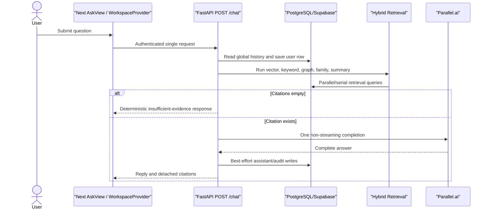
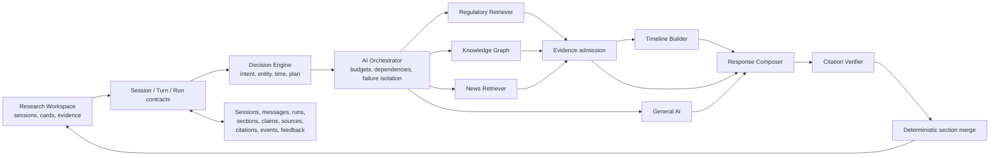
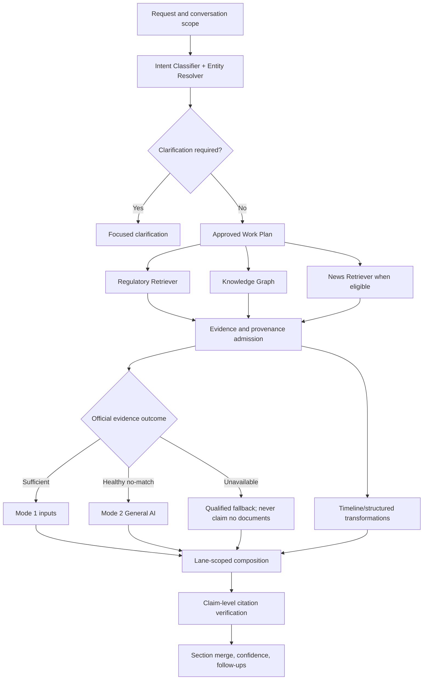

# Ask AI Agent OS — Architecture

**Current-state source:** [ASK_AI_AUDIT.md](./ASK_AI_AUDIT.md)  
**Target decision model:** [ASK_AI_DECISION_ENGINE.md](./ASK_AI_DECISION_ENGINE.md)  
**Target cooperation model:** [ASK_AI_ORCHESTRATOR.md](./ASK_AI_ORCHESTRATOR.md)  
**Delivery details:** [ASK_AI_IMPLEMENTATION_PLAN.md](./ASK_AI_IMPLEMENTATION_PLAN.md)

## 1. Status legend

- **Current:** verified in repository revision `c7e28ae`.
- **Planned:** frozen design, not yet implemented.
- **Transitional:** compatibility mechanism planned during rollout.

## 2. Current architecture

### Current frontend

- `/ask` renders `ResolvenApp` → global `WorkspaceProvider` → default-off `AskRoute` → legacy `AskView`.
- `NEXT_PUBLIC_ASK_AI_V2_UI_ENABLED`/`VITE_ASK_AI_V2_UI_ENABLED` are parsed
  strictly; flag-off fails closed to legacy, while flag-on now mounts the
  default Research shell over the feature-scoped E9.1 provider.
- Structured Ask error codes map to safe client copy; unknown legacy errors keep the prior raw-body fallback, and failed Ask submissions restore the draft.
- React local state holds transient messages; TanStack Query separately holds history.
- An isolated E9.1 Research Workspace boundary now provides explicit
  flag/auth gating, owner-scoped session/message/run query keys, typed
  E2 reads, and optional exact E8.1 structured-result parsing over canonical
  TanStack Query state.
- The E9.2 shell provides semantic left navigation, structured center canvas,
  and right evidence regions with desktop columns and mutually exclusive
  tablet/mobile overlays. Its composer owns only local draft/submission
  presentation and calls no server unless a typed submit capability is
  injected; no fake lifecycle or evidence actions are exposed.
- The E9.3 rail consumes E2.3/E2.4 through E9.1: two owner-scoped paginated
  active/pinned projections plus submitted server search/filter projections,
  with canonical query invalidation after lifecycle mutations. Only the active
  session ID is local view state; session records remain query-owned.
- The shared legacy workspace controller derives one isolated-v2-Ask state
  from normalized route plus the strict UI flag. In that state its digest,
  subscription, sources/runs admin probes, and flat chat-history queries remain
  mounted but disabled, and digest cannot gate shell readiness. The health
  check remains active and nonblocking; all flag-off/non-Ask enablement is
  unchanged.
- Page boot starts unrelated digest, subscription, and admin queries.
- `MarkdownLite` renders prose; citation buttons open `EvidenceDrawer`.
- “Sessions,” history search, save, feedback, regeneration, and streaming are incomplete or misleading.

### Current backend

- FastAPI `POST /chat` and `GET /chat/history`.
- All nine frozen Ask rollout settings exist as typed booleans and default off; the v2 session create/list/detail path is implemented behind `ASK_AI_V2_API_ENABLED` and is unavailable while that flag is off.
- Ask-scoped middleware attaches one server-generated correlation ID to responses; handled model/retrieval failures retain status and `detail` while adding safe codes and correlated internal logs.
- Correlation-linked baseline events measure auth boundary, user/assistant persistence, retrieval, model, and terminal outcomes using a payload-safe fixed schema.
- An isolated, immutable `ask.decision` domain package now defines the version-1 Decision Record, all frozen intent/entity/time/mode/capability/outcome/response/confidence taxonomies, ordered intent precedence, deterministic serialization, and fail-closed validation. No route imports it yet.
- Synchronous SQLAlchemy and provider calls execute inside an async route.
- One Parallel.ai completion is used when any citation exists.
- Retrieval errors are broadly converted into empty hit lists.
- No explicit live-news capability or claim-support verifier exists.

### Current storage

- `chat_messages`: user/event/role/content/time; no conversation entity or structured response linkage.
- `chat_retrieval_audit`: best-effort JSON retrieval/citation snapshot, not linked to a message.
- Regulatory corpus includes chunks, embeddings, document families/versions, summaries, and graph tables.
- Authentication-session storage is unrelated to Ask conversation sessions.

## 3. Planned logical architecture

The Decision Engine decides the approved plan. The Orchestrator executes it. Capabilities cannot promote their own mode, provenance, or confidence.

## 4. Frontend — implemented foundation and planned workspace

- **Implemented:** feature-scoped Research Workspace provider/read hooks with
  TanStack Query as canonical server state, owner-scoped session/message/run
  identity, opaque session/turn pagination, shared message/run cache records,
  exact access-token requests, and strict E2/E8 parsing.
- **Implemented:** strict client-generated message/idempotency identity,
  query-cache-only saving/unsynced/synced records, exact persisted-turn
  reconciliation across page-size variants, recoverable pending overlays, and
  remount-safe derived turns.
- **Implemented:** a default-registered shell behind only the existing UI
  flag, with semantic three-pane regions, responsive overlay/sheet behavior,
  stable local composer drafts, safe asynchronous acknowledgement, and
  explicit disabled submit state when no capability is present.
- **Implemented:** real session rail list/search/filter/pagination; recency,
  pinned, and archived presentation; stable-ID selection; and rename, pin,
  duplicate, JSON export, archive/restore, and confirmed soft-delete actions
  with strict contracts, safe failures, and owner-scoped cache refresh.
- **Implemented:** route/flag-aware suppression of legacy digest,
  subscription, admin-probe, and flat-history boot for v2 Ask, including
  authentication/remount isolation and unchanged non-Ask behavior.
- **Planned:** canvas, evidence behavior, exact restoration, and streaming.
- The shell owns layout and capability injection; E9.1 remains the canonical
  server-state boundary.
- Stable session/message/run identities and optimistic reconciliation.
- Provenance-aware cards, timelines, comparisons, compliance checklists, and entity pages.
- Actual run-event progress, safe stop/resume/retry/regeneration/refresh.
- Exact restoration of historical content and view state.
- Legacy `AskView` remains behind a rollout flag until retirement.

## 5. Backend — planned

- Versioned Decision Engine and capability Orchestrator.
- Async-safe v2 execution with bounded concurrency, shared provider clients, and finite budgets.
- Typed outcomes: Satisfied, Partial, No match, Ambiguous, Contradictory, Timed out, Unavailable, Invalid output, Superseded, Cancelled, Skipped.
- Selective retrieval rather than all branches on every query.
- Durable run/section transitions and capability-specific retry.
- Legacy routes remain through compatibility adapters during rollout.

## 6. API surface

### Current

- `POST /chat`
- `GET /chat/history`
- `POST /chat/sessions` behind `ASK_AI_V2_API_ENABLED`
- `GET /chat/sessions` behind `ASK_AI_V2_API_ENABLED`
- `GET /chat/sessions/{session_id}` behind `ASK_AI_V2_API_ENABLED`
- `GET /chat/sessions/{session_id}/messages` behind `ASK_AI_V2_API_ENABLED`
- admin RAG diagnostics listed in the audit.

### Planned families

- session create/list/detail/lifecycle/search;
- paginated session messages;
- stable message/source/evidence reads;
- run state and resumable events;
- cancellation and capability retry;
- versioned regeneration and refresh;
- feedback and saved items;
- entity/federated/manual-document search.

Exact planned paths and compatibility rules are maintained in sections E2, E10, and E11 of [ASK_AI_IMPLEMENTATION_PLAN.md](./ASK_AI_IMPLEMENTATION_PLAN.md); this file does not duplicate them.

## 7. Orchestration and AI pipeline

The first Decision Engine foundation is implemented as policy-only domain code.
It accepts already-extracted intent signals, applies the frozen precedence
order, and returns a typed primary/secondary/subtype/response decision. It does
not parse language, resolve entities or time, select retrieval branches, execute
capabilities, persist shadow records, or affect serving. Those behaviors remain
owned by E3.2–E3.7 and later orchestration tasks.

E3.2 now adds deterministic time/status normalization beneath that boundary.
An injected aware clock and IANA user zone produce visible half-open absolute
windows, exact elapsed rolling windows, frozen current/draft/consultation
filters, live-eligibility signals, and intent defaults. Calendar periods use
local boundaries; rolling 90-day/30-day/72-hour periods subtract in UTC so DST
cannot change elapsed duration. The normalizer remains route-independent and
does not select or execute retrieval capabilities.

Independent branches run in parallel only after scope resolution. General AI does not race official retrieval to decide provenance.

## 8. Storage — partially implemented

Migration `0023` now implements the expand-only conversation foundation:

- owner-scoped `chat_sessions` with UUID identity, optional event scope, workspace metadata/lifecycle timestamps, cursor indexes, least-privilege authenticated grants, and RLS;
- nullable, unique `public_id` and nullable `session_id` on legacy `chat_messages`;
- composite `(session_id, user_id)` linkage so a linked message cannot cross session ownership;
- no backfill, non-null enforcement, repository cutover, or legacy row reinterpretation.

The internal v2 persistence boundary now has immutable typed session/message records, owner-filtered repositories, and a transaction-owning service. It creates stable caller-identified user/assistant placeholders in order, derives event scope from the locked owned session, updates session activity only after both inserts, propagates SQL failures, and rolls the whole turn back on error. The legacy `core.repository` chat methods and routes do not call this boundary.

The E2.1 API boundary now exposes versioned session creation, active-session listing, and owned detail reads. List pagination uses an opaque descending `(updated_at, id)` keyset cursor, excludes archived and deleted sessions, and returns no cross-owner existence signal. Detail reads include archived sessions but exclude soft-deleted sessions. The API gate returns a non-disclosing 404 while off; the legacy `/chat` and `/chat/history` contracts remain independent. Backend Pydantic and frontend Zod schemas parse the same recorded JSON fixture.

The E2.2 read model pages complete persisted turns oldest-to-newest using an opaque `(created_at, id)` keyset cursor. A run-linked turn restores its user and assistant messages plus ordered sections, sources, claims, citations, and follow-ups. Raw decision/orchestration/verifier payloads are not exposed. Messages without a persisted run remain explicit singleton turns, preserving backfilled or interrupted history without guessing role pairs. The endpoint reuses session ownership/deletion rules and does not alter legacy history.

The isolated E2.6 compatibility boundary maps a selected completed persisted
response version to the unchanged legacy `ChatResponse` and flattens persisted
turns to the legacy descending/event-scoped history meaning. It derives intent
from the persisted Decision Record, reconstructs only official citation
snapshots, and preserves related-question order. Missing model/intent,
incomplete or mismatched versions, broken source linkage, and General AI/live
provenance that the legacy shape cannot label fail closed. No legacy route or
repository imports the adapter yet.

Migration `0024` now adds the research-result artifact graph:

- owned runs linked to both messages in the same session;
- ordered/versioned sections with explicit official, General AI, live, or system provenance lanes;
- immutable official/live source snapshots, with no General AI source class;
- material claims carrying knowledge-mode and model/policy/disclosure metadata;
- official citations and live-source links constrained to matching claim/source lanes;
- durable follow-ups and monotonically sequenced run events;
- composite ownership foreign keys, owner-only RLS reads, and least-privilege grants on all seven tables.

The E1.5 operational backfill now maps every incomplete legacy message identity in bounded transactions:

- one permanent UUIDv5 session identity per `(user_id, event_id-or-global)` scope;
- one permanent UUIDv5 public identity per legacy bigint message ID;
- one session marker/version for verification without changing message content or order;
- dry-run counts, bounded/max-batch execution, natural restart/resume, duration/count metrics, and streamed reconciliation;
- refusal/reporting rather than overwrite when non-null identity conflicts.

Migration `0025` now validates the post-backfill boundary:

- migration-time refusal for pending identity, owner/event drift, duplicate legacy scope, or invalid marker metadata;
- a validated public/session paired-identity check that still permits flag-off null/null writes;
- unique owner/global-or-event legacy sessions;
- an owner/session/created message cursor index;
- explicit deferral of true non-null contraction until dual-write/read cutover.

Migration `0026` now adds the Decision Engine's shared regulatory catalogue:

- stable canonical IDs/names, frozen entity classes, jurisdiction, optional legacy graph linkage, workspace priority, and required provenance;
- approved aliases/acronyms/former names plus query-expansion relationships, with normalized jurisdiction-scoped lookup keys;
- first-class glossary terms with definitions and source provenance;
- duplicate mapping rejection without forbidding one acronym from representing multiple entities, so material ambiguity remains expressible;
- authenticated read-only RLS/grants, with no serving or legacy graph mutation.

Migration `0027` now completes the local E1 response-version and feedback
foundation:

- run-backed assistant messages carry completed/pending/failed/cancelled status,
  an owning user-message reply, a positive response version, and an exact
  previous-assistant parent for regenerations;
- database keys reject duplicate, skipped, cross-question, cross-session, and
  cross-owner version chains;
- runs and sections are constrained to their assistant response version;
- one RLS-protected feedback record belongs to an exact owned run/version and
  repeated feedback updates preserve its durable identity and creation time;
- typed internal reads restore every version in order with its exact artifacts
  and feedback, while existing complete-turn reads select the latest version;
- exact-version evidence and feedback routes now expose these records only
  through the off-by-default v2 API boundary.

E2.3 completes the session lifecycle boundary over migration `0023` without a
new schema change. Owner-locked rename/pin/archive/restore/soft-delete updates
are idempotent and timestamp-stable; archive clears pin and deleted sessions
remain recoverable in storage but are excluded from product reads/actions.
Context duplication creates a fresh active draft from event/entity/topic/scope
only and resets knowledge/freshness metadata so no grounded claim appears
without copied provenance. JSON export uses one repeatable-read transaction and
composes only existing public session, turn/artifact, and saved-item schemas.
All actions share the v2 flag/auth/non-disclosing ownership boundary; no
frontend controls or legacy route are switched.

Migration `0030` and E2.4 complete the owner-scoped session-search backend.
Expression GIN indexes cover weighted session title/entity/topic metadata,
message content, and immutable source/document snapshots without denormalizing
or rewriting stored user content. Partial indexes support completed
knowledge-mode, normalized entity, pin, and active/archived filtering. The v2
session list now applies deterministic `500/400/300` session/message/source
relevance tiers followed by `updated_at`/ID ties, and its version-2 cursor binds
that order to the normalized query/filter identity while accepting the prior
version-1 cursor only for the unchanged unfiltered list. Owner predicates plus
existing RLS/least-privilege boundaries prevent cross-user matches. The E9.1
client normalizes the same query fields into request and cache identity; no
session rail, semantic/global search, or legacy route is enabled.

Migration `0028` and E2.5 add the owned saved-evidence API boundary:

- one saved-item table accepts exact source, citation, card, catalogue-entity,
  or document targets with durable label/metadata snapshots;
- artifact saves retain their run/response version, and composite keys reject
  cross-owner or cross-session targets;
- repeated saves and feedback posts update/return one stable durable identity;
- owned `GET /chat/messages/{message_id}` and `/sources` reads restore the exact
  assistant version, sections, sources, claims, citations, and feedback;
- session saved-item list/create/delete and message feedback mutations use the
  existing v2 API gate, authenticated ownership, and non-disclosing 404s;
- backend Pydantic and frontend Zod schemas share recorded contracts without
  switching the UI or legacy routes.

The isolated entity resolver consumes immutable catalogue entries and applies exact canonical, approved alias/acronym, reinforced glossary, interaction context, conversation scope, jurisdiction context, fuzzy assumption, and clarification in frozen order. It emits the exact `1.00/0.95/0.85/0.70/0.50/<0.50` confidence ladder, displays canonical expansion and assumptions, and blocks obligation/deadline/current-status/amendment answers below `0.85`. It is not imported by a route.

The E3.4 context boundary is also isolated from routes and language-model/provider execution. Structured layers resolve field by field in the fixed interaction-context, explicit-current-turn, conversation-scope, regulatory-default, clarification order. Explicit resets block retained scope; material pronoun ambiguity emits one focused question while preserving independently resolved jurisdiction/stakeholder/time/exclusion scope. Structured clauses become stable ordered atomic questions with per-part intent sets, shared entity/jurisdiction/stakeholder/exclusion scope, closest-clause or explicitly global time scope, local overrides, and separately retained conflicting scopes.

The E3.5 plan boundary consumes only resolved structured questions and never executes a capability. It holds a complete required/supporting/conditional/skipped decision for all nine capabilities, the fixed five planning stages, evidence gates and conditional fallbacks, and one canonical response blueprint. General AI is an intent-evidence capability only for explicit non-regulatory/general-source work; regulatory use remains conditional behind official evidence. Live and lineage activate only from eligible time/version signals. Multi-part plans retain per-question roles and produce one aggregate deduplicated capability view plus a Research Report blueprint.

E3.6 adds a shadow-only serving integration without making the Decision Engine
authoritative. After successful legacy retrieval has produced its fixed legacy
intent, the enabled route schedules a synchronous deterministic lexical adapter
as a post-response background task. The adapter constructs the existing
immutable Decision Record, time interpretation, and selected plan; a versioned
comparison maps the legacy taxonomy to canonical intents and records
agreement, disagreement, or a fixed unavailable outcome. Default telemetry
contains only correlation, policy/taxonomy values, duration, and safe codes—no
question, evidence, answer, owner, or provider detail. Evaluator, factory, and
recorder failures cannot change the legacy retrieval/model/response path. A
separate row-locked repository may idempotently attach the exact Decision
Record and policy version to an existing owned run, but refuses cross-owner or
nonempty/different records and never fabricates a run for legacy chat. No
migration, routing cutover, Orchestrator execution, or user-visible
interpretation field is added.

E3.7 now has a strict, immutable calibration-artifact boundary but no approved
artifact. The versioned contract binds the Decision policy, intent-confidence
and high-risk entity thresholds, labeled query expectations, regulatory
rationale, and approval provenance to one canonical SHA-256 payload digest.
Approval requires an identified reviewer/role, timezone-aware timestamp, and
non-placeholder reference; malformed, duplicated, unknown, or checksum-drifted
material fails closed. Engineering tests use synthetic data only. Regulatory
labels and thresholds are not inferred from existing engineering fixtures, and
the contract is not imported by routing or serving code. B-013 therefore blocks
authoritative calibration while independent Orchestrator work continues.

The isolated E4.1 Orchestrator contract boundary now defines the distinct
ten-capability execution roster, all six participation classes, eleven
capability terminal states, seven section terminal states, and thirteen shared
semantic artifact kinds. Capability requests carry immutable typed admitted
artifacts; results repeat exact scope and expose typed outputs, safe failure
codes, timings, and confidence dimensions without assigning final confidence.
Artifact envelopes enforce producer authority, provenance-pure source lanes,
timezone-aware source identity, immutable transformation ancestry, provenance
non-escalation, and deterministic JSON round trips. Frozen registries declare
each capability's accepted inputs and allowed outputs. This package does not
execute, schedule, persist, publish, or route any capability.

E4.2 now adds a pure immutable lifecycle layer over those contracts. It
separates ten forward-only Orchestrator phases, queued/active/terminal
capability states, the documented section work/terminal states, and four run
terminal outcomes. Approved plans expand into scoped state nodes at the frozen
`capability × atomic question × section × provenance lane` failure boundary;
node-level dependencies are acyclic, scope-narrowed, and phase-gated. Citation
Verifier has distinct evidence-integrity and claim-support operations, so its
two frozen passes cannot collapse into one premature terminal result. The
machine admits only typed outputs, preserves safe artifacts, requires terminal
grounded material-claim verification before section readiness, lets optional
sections remain nonterminal during core merge, and derives completion,
degraded, clarification, or cancellation outcomes deterministically. It
performs no scheduling, I/O, budget/fallback decision, persistence, or serving.

E4.3 adds an async-safe execution seam over the immutable lifecycle nodes.
Only selected queued nodes whose declared dependencies are terminal can enter
an execution wave. Independent ready nodes share a bounded overall concurrency
limit; temporary synchronous adapters also pass through a smaller blocking-work
limit and execute off the event loop. Capability implementations and request
construction remain injected, so one shared provider/client lifecycle can serve
all admitted invocations without a scheduler-owned connection or client. Wave
application preserves plan order, and missing, raising, or malformed adapters
become fixed safe terminal results without exposing provider details. This layer
does not add latency cutoffs, fallback decisions, durable resume/cancellation,
production adapters, persistence, routes, or serving changes.

E4.4 adds a versioned run-scoped latency policy over that scheduler. Five
immutable profiles encode the exact first-result, core, soft, hard, and
verification-reserve boundaries plus the frozen optional-work stopping order.
A shared injected monotonic clock makes checkpoints deterministic across
phases. Optional and supporting work stop at their allocated soft boundary,
while Citation Verifier remains eligible through protected reserve time;
mandatory, conditional-mandatory, and activated fallback work retain the hard
deadline. Scheduler deadlines cover semaphore waits and async/blocking adapter
execution, discard late results, and emit fixed safe cutoff outcomes. At the
hard boundary, safe admitted artifacts remain while unverified grounded claims
are detached from terminal sections; required sections degrade and empty
optional sections omit. This policy does not choose cooperative fallbacks,
persist events, resume/cancel runs, install production adapters, or serve UI/API
traffic.

E4.5 adds a pure immutable failure-transition policy over terminal capability
results. It preserves the original terminal state while classifying partial,
healthy no-match, ambiguity, timeout, unavailable, invalid output,
evidence-integrity rejection, and single/all-claim rejection distinctly. The
full ten-capability matrix yields a scoped section disposition, fixed safe
notice, cooperative artifact/manual action, declared propagation mode, and
at-most-one fallback or claim-revision bound. Graph traversal follows only
declared node dependencies, stops propagation at an admitted fallback boundary,
and admits General AI substitution only when both a dependency edge and
fallback/conditional role exist. Affected and unaffected section identities
remain disjoint across question/section/provenance lanes; safe admitted
artifacts are never removed. Optional live/timeline failures omit only their
own sections, and evidence-integrity failures cannot become claim correction
passes. The layer decides transitions but does not execute retries, persist
events, cancel/resume runs, or serve responses.

E4.6 adds an owner-scoped durable execution boundary over `ask_runs` and
`ask_run_events`. Additive migration `0029` introduces one monotonic execution
version, one row-locked event-sequence allocator, expiring worker leases with
heartbeats, and durable cancellation-request identity while retaining the
existing event and RLS ownership model. The repository appends each lease,
state, and cancellation event atomically with the run snapshot, fences stale
workers through expected execution versions, supports idempotent event
identities, reconstructs state from ordered events, and releases the lease when
cancellation is applied at a safe persisted artifact boundary. Cancellation
plans retain admitted artifacts and terminal sections while identifying
unverified grounded claims that cannot be published. This boundary is not
wired to production providers, legacy routes, streaming, retry, or
regeneration.

E10.1 adds the read/reconstruction boundary over those persisted events. A
version-1 owner-neutral read model retains typed orchestration state but omits
owner/session and raw worker payload fields. Opaque cursors bind exact
run/event/sequence/execution identity and are checked against the persisted
anchor before bounded snapshot-aware pages are returned. Full reconstruction
requires a contiguous zero-based sequence, stable aggregate/policy identity,
unique events, monotonic state, and an immutable terminal boundary. No new
migration, route, stream transport, worker, or frontend reducer is introduced.

E10.2 adds an injected durable execution/recovery coordinator over E4.6. Its
SQLAlchemy store runs lease/snapshot/event/cancellation transactions off the
event loop. A worker takes only an unowned or expired lease, converts any
persisted Active capability into an explicit interrupted terminal result,
executes bounded TTL-scoped driver steps, validates forward progress, and
persists each accepted state. Durable cancellation is rechecked after a driver
step and reconciled even when it races the final append; stale workers cannot
overwrite takeover results. The driver remains injected, so this boundary adds
no production capability adapter, route, event transport, or frontend switch.

E10.3 exposes the E10.1 read model through an authenticated, owner-authorized
SSE endpoint behind both the v2 API and streaming flags. `Last-Event-ID` and
the query cursor share the same exact persisted event anchor; conflicting,
cross-run, missing, or stale anchors fail before streaming starts. A primed
bounded page makes owner/cursor/storage failures ordinary safe HTTP responses,
then off-loop repeatable-read polling emits only contiguous persisted events,
opaque cursor IDs, schema-validated heartbeat/completion/error controls, and
terminal closure. Disconnects stop polling. No generated answer content, raw
worker payload, frontend reducer, cancellation, retry, provider, or migration
is added.

E10.6 keeps the E10.1 terminal journal immutable and represents a capability
retry as a separate durable execution in migration `0031`. The client UUID is
both mutation idempotency and retry-request identity; one unique
run/node/original-request tuple permits only one bounded attempt. The exact
official, live, General AI, or verification request, E4.5 failure decision,
source execution version, and preserved artifact identities are frozen in the
retry plan. An expiring retry-worker lease permits restart takeover while
fencing stale workers; run-version or cancellation drift fails before adapter
invocation or result persistence. The owner-only v2 endpoint enqueues the
attempt, and an injected async executor performs only the selected node under
the 30-second maximum frozen hard budget. Retry results remain separate from
the prior run state; E10.7 owns new answer-version lineage.

E10.7 adds append-only response mutation lineage in migration `0032`. The
client request UUID binds one selected historical assistant answer to one new
assistant message and valid pending durable run. Allocation locks the exact
original user turn, appends after its current branch head, and retains the
selected answer separately so regenerating an older version still records both
the requested source and immediate parent. A frozen plan records all historical
source snapshot IDs: same-source regeneration reuses that exact ordered set,
while official refresh and live inclusion reuse none and mark fresh official
or official-plus-live retrieval. Concise, beginner, and legal-detail modifiers
remain orthogonal. Owner-only v2 endpoints return a minimized pending identity;
global client idempotency, owner FKs, linear-version constraints, and RLS make
duplicate/concurrent requests deterministic without updating prior messages,
runs, artifacts, feedback, or saved state.

E10.9 adds an isolated synchronous compatibility boundary over E10.2 and
E8.7. It awaits one exact owned durable run under a positive worker lease and
the approved maximum 30-second outer budget, admits only Completed or Partial
terminal snapshots, then loads an exact run/session/user-bound terminal
artifact and returns the unchanged legacy `ChatResponse`. Cancellation,
deadline expiry, failed/nonterminal runs, missing or crossed artifacts,
malformed output, and execution/storage faults become fixed safe outcomes;
caller cancellation still propagates. The outer deadline covers execution,
artifact loading, validation, and rendering, and an internal provider timeout
cannot masquerade as expiry of that deadline. This service is injected and is
not imported by `/chat`, so v2 serving/cutover remains unchanged.

E4.7 adds an isolated versioned shadow execution boundary over the completed
E4.3 scheduler and E4.1–E4.6 contracts. A selected fixture supplies an
immutable initial Orchestration State plus exact expected phase, terminal, and
ordered node outcomes. Only literal `True` opens the early kill switch; every
other value performs zero validation, timing, execution, or recording. Enabled
work revalidates copied inputs and the Scheduler Report, executes only injected
adapters under the existing scheduler limits, and records exact agreement,
disagreement, or one fixed unavailable outcome. Default logging contains only
correlation/policy, phase, terminal, duration, safe code, and fixed
terminal-state counts—never fixture/node IDs or request/evidence/answer
content. Evaluator and recorder failures cannot escape, while task cancellation
still propagates. The harness is not imported by a route and adds no production
adapter, persistence, migration, provider, or serving authority.

E4.8 adds a pure immutable conversation-context selection boundary. It accepts
already structured context keys rather than performing natural-language
classification, removes candidates outside the active owner/session and any
noncompleted or inheritance-ineligible turn, and chooses the newest relevant
turns under an explicit bounded count before serializing complete
user/assistant pairs chronologically. Explicit reset returns no prior context;
an upstream-resolved immediate follow-up may retain the latest eligible turn
even when it has no repeated entity term. The output declares that conversation
context has no factual authority and always requires fresh retrieval for facts.
It does not query storage, call a provider, or change legacy/v2 routes.

E5.1 adds a typed diagnostic boundary around the five existing retrieval
branches: vector, keyword, graph, family/version, and summary. Each branch now
produces an immutable versioned status, health, duration, match count, and fixed
safe failure code; satisfied and healthy no-match are distinct from partial,
timeout, unavailable, and invalid output. The hybrid result carries these
outcomes in deterministic branch order. Existing public branch methods still
return their legacy hit lists and remain fail-closed, and hybrid selection,
ranking, and citation construction are unchanged. Graph's four internal query
units preserve healthy hits when one SQL unit fails and report Partial rather
than mislabeling that coverage as no-match. No selective routing, thresholds,
deduplication, provider cutover, route, persistence, or frontend behavior is
added.

E5.2 adds an isolated approved-plan adapter and executor above that typed
boundary. Internal document search owns vector and keyword work, Knowledge
Graph owns graph work, document metadata or version lineage owns family/version
work, and an approved official-source summarization question additionally owns
summary retrieval. Branch ownership and atomic-question identities are
deduplicated in enum order; only selected synchronous branch seams enter a
bounded worker-thread pool. Every nonselected branch emits an explicit
Skipped/Not run zero-duration outcome, while selected failure or healthy
no-match cannot activate skipped work. General AI remains outside official
retrieval, and the legacy hybrid route continues to execute all five branches.
No threshold, hit deduplication, graph query, provider, route, persistence,
migration, or frontend cutover is added.

E5.3 adds an isolated quality-admission boundary after selected retrieval.
Because frozen policy does not approve numeric cutoffs until E5.8, callers must
supply a versioned complete set of branch floors, with optional atomic-intent
overrides; there are no silent production defaults. Exact-boundary hits pass,
weaker healthy hits are excluded and turn a pre-policy Satisfied branch into
healthy No match, while non-finite or malformed hit data becomes Invalid output
or Partial rather than false absence. Admitted vector and keyword hits sharing
the same document/version/chunk identity become one deterministic Evidence Unit
with both ordered match reasons and maximum source-native scores. All other
source rows remain distinct—especially graph facts, which have no durable fact
identity until E5.4. The legacy ranker and serving path are unchanged.

E5.4 adds a pure entity-aware graph boundary after E3.3 resolution and E5.3
evidence admission. Requests carry one canonical entity, jurisdiction,
resolution confidence/assumption, only resolver-approved expansion terms,
declared frozen relation types, atomic-question/section scope, and a bound.
Injected providers return edge candidates; every candidate is revalidated
against exact relation/direction/entity scope and exact admitted Evidence Unit
and question identity. Distinct edge IDs remain distinct deterministic
Structured Facts even when their text or endpoints match. Backed facts retain
the complete canonical Evidence Units; unbacked edges and every `relates_to`
edge are forced to discovery-only and cannot establish legal applicability.
Invalid neighbors are excluded without suppressing valid facts, while
no-match, partial, unavailable, and invalid-output remain distinct. The layer
performs no SQL, so the existing graph schema/indexes require no migration; the
legacy graph search and serving path remain unchanged.

E5.5 adds a pure official-metadata version/status policy over the existing
family registry shape. Immutable records and lineage relationships distinguish
current, historical-as-of, draft/consultation, superseded, repealed, and
unknown states. Complete snapshots resolve supersession/repeal events by their
effective date, retain prior in-force history, return connected active
amendment sets, and allow current claims only for validated-current outcomes.
Partial/unavailable coverage, newer unknown status, conflicting same-date
facts, missing endpoints, cross-family edges, invalid chronology, and cycles
fail closed with fixed safe codes. Document publication and legal effectiveness
remain separate, input order is normalized, and no title inference, migration,
database query, legacy route, or frontend behavior is added.

E5.6 adds a pure Timeline Builder transformation over scoped official
Evidence Units, E5.4 Structured Facts, and live event inputs. It retains every
date semantic, timezone-aware value, weakest-source confidence ceiling,
materiality decision, source/provenance lane, and input ancestry in existing
Timeline Event payloads. Official and live events share one deterministic
chronology without sharing provenance. Missing dates remain `None` and sort
last with inferred-order/warning metadata; event relationships resolve to
actual output IDs and missing links remain warnings. Same-key/same-semantic
different dates form stable conflict sets that retain every source independent
of input order; different date semantics never conflict. Discovery-only graph
facts cannot gain legal force. Finalization requires the evidence-input cutoff
and adds no narrative, provider, persistence, migration, route, frontend, or
serving behavior.

E5.7 adds strict embedding compatibility health around the real vector seam.
The effective configured provider/model/dimension is compared with grouped
stored identities and the physical PostgreSQL `vector(N)` column dimension.
Ready, compatible empty, partial, provider unavailable, provider/model/dimension
mismatch, metadata unavailable, and invalid metadata remain distinct. Only a
compatible empty index produces healthy No match; chunks without matching
embeddings are Partial, and mismatches become fixed Invalid output/Unavailable
vector outcomes before embedding or SQL similarity search. The vector store
health probe exposes deterministic grouped inventory, the typed branch is
protected, and legacy public hit-list behavior remains fail-closed and
unchanged. No provider-selection enforcement, reindex, migration, route, or
frontend cutover is added.

E5.9 adds an isolated v2 provider-configuration boundary ahead of provider
construction. V2 supports the existing Supabase retrieval and vector
implementations plus offline, OpenAI-compatible, and Parallel embedding
implementations at the existing physical dimension; the declared offline
model must name the implementation's effective deterministic model. Memory or
unknown providers, missing remote credentials, unsupported dimensions/models,
constructor failures, class-versus-declaration drift, health-reported identity
drift, and nonhealthy startup compatibility fail explicitly with fixed safe
codes. Successful bundles inject the validated embedding/vector instances into
both retrieval execution and retrieval health. Legacy factories remain
available when no v2 bundle is requested; no provider, reindex, migration,
route, or frontend cutover is added.

E5.8 adds a pure retrieval-evaluation boundary over explicitly labeled cases
and typed E5.1 branch observations. A versioned immutable dataset carries one
intent per case, expected exact evidence identities or an expected healthy
no-match, observed ranked evidence, end-to-end latency, branch status/health,
regulatory rationale, and complete per-intent thresholds. Evaluation produces
deterministic precision@K, recall@K, case coverage, non-skipped branch-health
rate, and nearest-rank p95 end-to-end latency. A canonical digest binds every
reviewed input and threshold. Draft data always remains Unapproved; only a
matching attributable approval can produce Pass or Fail. No approved artifact
exists, so B-014 blocks calibration and the harness changes no runtime
retrieval floor, provider, route, persistence, migration, frontend, or serving
behavior.

E6.1 adds a pure, versioned knowledge-mode decision boundary per response
section. Official evidence, partial official evidence, healthy official
no-match, official outage, explicit general questions, attributed live
sources, live no-match, live outage, and pending work produce distinct
immutable policies. Each policy fixes its provenance lane, official-citation
or live-attribution treatment, disclosure, prohibited claims, legal-force
rule, and confidence ceiling. The exact no-documents disclosure is reachable
only from healthy scoped no-match; outage uses different copy and a Low ceiling.
Mode 2 has no source identity or citation cards, Mode 3 cannot establish legal
force, repeated same-mode sections remain valid for multi-part work, and a
single section cannot cross provenance lanes. This contract selects no
capability and changes no route, provider, persistence, migration, flag, or UI.

E6.2 adds an isolated, async Parallel-only General AI executor after the E6.1
mode gate. It makes one bounded call for the complete assigned Mode 2 section
set, revalidates request and nested policy at the execution boundary, accepts
only exact section-keyed versioned JSON, and emits the canonical Orchestrator
General Knowledge payload. Approved disclosures, confidence ceilings,
provenance, and prohibited claims come from E6.1 policy rather than provider
text. Provider-authored citations, links, official-absence claims, binding
applicability language, duplicate disclosure, malformed/oversized output,
provider drift/unavailability, and timeout fail closed with fixed safe codes
and no artifacts. Legacy LLM selection/chat behavior and all serving remain
unchanged.

E6.5 adds isolated frontend knowledge-mode primitives without mounting them on
the legacy or default Ask route. Typed discriminated bands render Official
Regulatory Corpus, General AI Knowledge, and Live Web Sources with visible
mode/state text rather than color alone. General AI healthy no-match and
official-outage triggers use the exact distinct E6.1 disclosures and require a
manual official-document search action; explicit/background General AI does
not fabricate the no-documents message. Live cards retain publisher, source
type, publication/retrieval timezone-aware timestamps, direct HTTP(S) link,
coverage note, and non-legal-force copy. Pending, empty, refresh-unavailable,
official-search-unavailable, and synthesis-unavailable states use quiet
accessible status regions. Runtime guards reject zero-source evidence bands,
unsafe targets, naive timestamps, and confidence above the official-outage
ceiling.

The remaining planned storage sequence adds:

- search/graph indexes only when needed.

General AI has section/claim provenance but no synthetic source or citation row.

Migration model: **expand → dual-write → backfill → verify → dual-read → read cutover → validate → contract**. Rollback is flag-based and preserves user research.

## 9. Citations and provenance

- Mode 1: every retained material claim references admitted official evidence and passes claim-support verification.
- Mode 3: live links retain publisher, publication time, retrieval time, and source class; they are not official citations.
- Mode 2: no citation cards.
- Graph and timeline artifacts retain backing-source ancestry.
- A transformation cannot increase source authority.
- Citation failure removes or qualifies only the affected claim.

E7.1 implements the first deterministic Mode 1 trust boundary before claim
verification. It joins the canonical E5.3 Evidence Unit, its Orchestrator
artifact envelope, and the exact E5.5 status request/decision pair. Admission
requires an inspectable official document and positive chunk identity, usable
excerpt/locator, exact approved-scope echo, unchanged relevance metadata,
direct pending official provenance, ancestry, and a successful retrieval
terminal state. Status decisions are recomputed at the boundary; a current,
historical-as-of, or draft unit is retained only when its document version is
in the selected official set and its displayed status matches the resolved
status. Rejections are isolated per unit and expose only fixed safe codes.
This layer establishes evidence integrity, not semantic support for a claim.

E7.2 implements the next isolated handoff from Response Composer to Citation
Verifier. A Candidate Claim is admitted only when it is material, remains
pending verification, is assigned to exactly one approved atomic question and
one section, and references one or more E7.1-admitted official Evidence Units
in that exact narrowed scope. The final composer transformation names the same
support IDs in the same order, and claim, evidence, scope, and provenance
identities cannot collide or cross lanes. Invalid claims are excluded
independently so a valid neighboring claim remains available to the verifier.
This contract records proposed support references; it neither generates claims
nor decides whether the referenced passages semantically support the text.

E7.4 implements the Decision Engine's pure confidence arithmetic without
allowing any capability or model to award a final label. Each material claim
contributes six 0–100 dimensions to the exact 25/15/20/15/15/10 weighted sum,
then receives every applicable frozen penalty and a bounded numeric score.
High gates, hard-Unknown facts, the E6 section-policy ceiling, and the weakest
critical input determine the final claim label separately from that score.
Sections aggregate 70% coverage-weighted claim mean plus 30% lowest material
claim; overall confidence aggregates 70% importance-weighted section mean plus
30% lowest critical section. Weakest critical sections and strict
compliance/deadline/current-status/version-comparison claims cap labels, while
multi-mode section labels remain individually visible.

E7.5 adds a pure graph-wide provenance trace over exact E7.1-admitted official
Evidence Units, E5.4 Structured Facts, E5.6 Timeline Events, Candidate Claims,
and Section Drafts. Concrete adapters revalidate each existing contract, and
the trace resolves a deterministic acyclic parent graph with scope narrowing,
one local kind-authorized transformation, immutable source identity, complete
transitive source union, and unchanged verification-independent origins.
Every output lane equals its weakest contributing lane. Only source identities
in that lane remain citable while stronger origins stay visible in ancestry;
General AI exposes no citation source. Unbacked or discovery-only graph
ancestry has zero effective authority, taints downstream timeline artifacts,
and cannot support claims or sections. The boundary adds no route, provider,
persistence, migration, frontend, or serving change.

E7.8 adds an isolated strict frontend projection of E7.4 confidence snapshots
without mounting it on the legacy or default Ask route. Overall and per-section
indicators retain numeric score, final policy label, coverage, categorized
evidence-based reasons, gaps, evidence counts, freshness, and improvement
guidance. Labels can be capped below their numeric band but never elevated;
General AI cannot be High, and overall confidence cannot exceed the weakest
critical section. Official/live counts must agree with the modes on display,
mixed provenance sections remain individually visible, and Unknown/Limited
states have explicit non-color identity. The collapsed explanation panel is
keyboard and screen-reader accessible and states that confidence is not a
probability of legal correctness.

E8.1 freezes the structured response transport shared by backend and frontend.
One versioned envelope contains an ordered set of provenance-pure sections,
each with a frozen response strategy, terminal state, mode/lane identity,
confidence snapshot, claim/source references, assumptions, gaps, and ordered
cards. Card envelopes freeze all twelve product card identities while leaving
card-specific payload rules to E8.2–E8.4. Actions state whether a real target is
available or expose only a fixed disabled reason. Unknown future lower-snake-
case card types retain JSON payload through an explicit fallback title and
cannot impersonate a known card. A compatibility-summary field is carried for
later E8.7 rendering; E8.1 does not derive or serve it.

E8.2 replaces generic payload acceptance for Answer Summary, Definition,
Official Source, and Confidence/Coverage cards with matching strict version-1
Pydantic/Zod payload contracts. Structured text/date fields preserve explicit
`Not established` values, core cards revalidate their own mode/provenance
identity, and confidence labels cannot exceed their numeric band or the
General AI ceiling. Summary source counts and confidence evidence counts must
match exact card references; grounded definitions require official definition
and source identity; Official Source cards require one exact official source,
complete metadata or truthful Partial state, and explicit Open/Save/Compare
availability. Isolated accessible renderers retain visible mode/state, safe
generated DOM identity, evidence excerpts, coverage meters, non-color missing
states, and keyboard actions. Available actions without a real injected
handler remain hidden; disabled actions remain explicitly unavailable. No
composer, merge, persistence, migration, provider, route, or serving behavior
is added.

E11.1 connects the existing E3.3 catalogue and resolver to an authenticated,
off-by-default v2 lookup boundary without changing Decision authority. The
repository reads the owner-neutral, authenticated catalogue with deterministic
alias and glossary ordering; the service returns one strict resolved,
ambiguous, or no-match shape containing only canonical identity, public
aliases, jurisdiction, entity class, match reason, confidence, and a
canonical-ID route. The flagged Research Workspace restores that route from
URL state, renders the expanded canonical header for a dominant bare entity,
and requires an explicit keyboard-operable choice when the resolver preserves
material ambiguity. Choosing a candidate re-resolves its canonical ID rather
than promoting a UI candidate or increasing confidence locally. Failures use
fixed safe copy, the legacy Ask route remains unchanged, and no entity content
section, corpus fact, search result, or live-source assertion is synthesized.

E11.2 adds one strict version-1 Entity Core Page projection over the existing
E8.1 response envelope and E8.2 core-card contracts. A canonical entity ID
binds exactly five ordered slots: Overview, Definition, Official Regulations,
Official Documents, and Confidence. Each slot fixes its title, response
strategy, and permitted card family; ready slots require content, non-content
terminal slots cannot smuggle cards, singleton slots cannot duplicate
content, and live provenance is outside this task. The flagged entity page
renders each section independently with its knowledge mode before content,
explicit terminal state, assumptions, gaps, and existing card provenance.
Malformed or cross-entity projections fail closed as one safe unavailable
surface, while a degraded or empty slot never suppresses healthy neighbors.
Available card actions remain hidden without real handlers. The projection
does not add an API, database cache, source-of-truth table, corpus fact,
provider call, or migration.

E11.5 adds an authenticated, off-by-default federated read boundary over the
existing canonical entity catalogue, official document/version/deadline
metadata, and owner-filtered session/message search lanes. One strict
version-1 contract preserves the original query, exposes the actually applied
spelling/acronym expansion, supports an explicit original-query reversal, and
returns fixed Best Match, Entities, Official Regulations, Official Documents,
Amendments, Consultations, Deadlines, and Previous Research groups. Every item
has a bounded deterministic relevance tier, stable tie identity, fixed
why-matched copy, minimized provenance lane, and an internal canonical route.
Group-specific keyset cursors are bound to normalized query, correction mode,
and filters; owner predicates and existing session RLS protect prior
research. A failed group is explicitly unavailable and cannot become healthy
no-match, while total storage failure remains a safe 503.

Migration `0033` adds only expression GIN indexes whose weighted
`simple`-text vectors exactly match the production entity, alias, document,
family, version, and deadline predicates. Existing E2.4 session/message
indexes remain canonical, and source rows are neither copied nor rewritten.
The Research Workspace debounces typeahead, rejects stale responses, renders
grouped match reasons and the frozen provenance/jurisdiction/regulator/
document/entity/status/stakeholder/topic/lifecycle/date filters, supports
complete arrow/Escape/Enter focus movement, re-resolves entity IDs, restores
owned-session routes, and uses normal same-origin navigation for official
artifacts. No live provider, manual-document-search engine, natural-language
Decision authority, or default-route switch is introduced.

E11.6 adds a second authenticated, off-by-default read-through dedicated to
manual official-document discovery. Its strict contract binds every request,
status-as-of day, result identity, deterministic rank/date/tie boundary, and
filter to an opaque keyset cursor. The repository reads the existing document,
latest or explicitly selected registry version, family/assignment, and chunk
stores in one nested savepoint; healthy no-match remains distinct from a fixed
safe storage-unavailable outcome. Exact phrase search is literal, ordinary
query search uses the established weighted lexical predicates, and
within-document matching retains page/section/excerpt identity. Status is
derived as current, superseded, draft, or `Not established` from canonical
registry dates and lineage rather than copied into a search projection.

Migration `0034` adds only registry status/date cursor and document/version
chunk lookup indexes that match production predicates. The flagged `/browse`
surface restores document and historical registry-version identities from
same-origin URL state, exposes all frozen exact filters, fences stale pages,
and renders official source metadata, fixed why-matched copy, excerpts,
explicit empty/degraded states, and opaque pagination. Flag-off `/browse`
retains the legacy Latest view; no live provider, semantic dependency,
generated answer, corpus copy, natural-language Decision authority, or
default-route switch is introduced.

## 10. History and continuity

Legacy history remains a newest-first, 20-row global/event snapshot without
session identity or citations. V2 now provides chronological, cursor-stable,
owned complete-turn reads with persisted display artifacts, and internal
persistence can restore ordered response versions with version-specific
feedback. Remaining history work includes:

- durable workspace sessions;
- chronological cursor pagination;
- newest relevant active-session context for AI;
- exposing exact persisted messages, sections, sources, citations, cards, news,
  timeline, feedback, and versions through owned APIs;
- explicit refresh that creates a new version rather than rewriting history.

## 11. Audit and observability

Current audit storage is best-effort and not message-linked. Planned observability records:

- correlation identity;
- policy and prompt versions;
- decision record;
- capability states and timings;
- evidence and provenance lineage;
- verification outcomes;
- confidence dimensions/penalties;
- run events and terminal state;
- safe error codes.

Hidden chain-of-thought is never stored or exposed.

## 12. Security

- Existing authentication remains required.
- Every new user-owned table requires RLS and ownership tests.
- Session identifiers must not permit existence leakage.
- Least-privilege grants and soft deletion preserve recoverability.
- Idempotency prevents duplicate turns/actions.
- Raw provider, SQL, stack, and credential details never reach the client.
- Live-source policy, licensing, and allowlists require approval before Mode 3 rollout.

## 13. Rollout architecture

All v2 behavior is additive and feature-flagged:

1. guardrails;
2. durable model and APIs;
3. shadow Decision Engine/Orchestrator/retrieval;
4. knowledge modes, verification, composition;
5. Research Workspace and streaming;
6. structured journeys;
7. internal cohort, beta, GA, compatibility window, later cleanup.

Current implementation status and the next task are in [04_CURRENT_STATE.md](./04_CURRENT_STATE.md).
