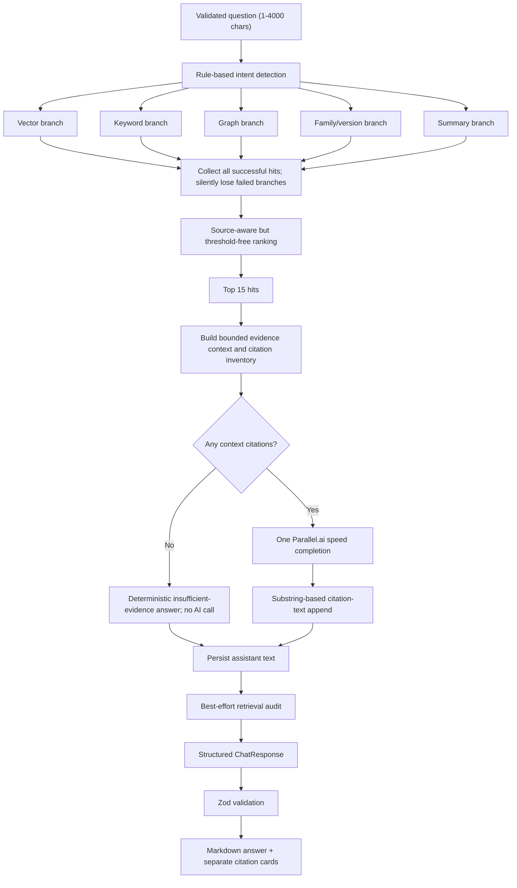

# Ask AI End-to-End Architecture Audit

**Audit date:** 2026-07-26  
**Repository revision:** `c7e28aee3c091bf52076fb91122a5098fad637f5` (`master`)  
**Scope:** The complete user flow from the `/ask` route through authentication, history loading, request submission, hybrid retrieval, AI synthesis, persistence, response validation, and final rendering.  
**Change policy:** No application code was modified. This file is the only audit artifact created.

## Executive verdict

Ask AI is a synchronous, authenticated, single-threaded chat experience on the client backed by a partially parallel hybrid-retrieval pipeline. It has useful RAG building blocks, but the product UI presents capabilities—sessions, history search, saving, feedback, streaming, news-aware answers, and durable citations—that the data model and request flow do not actually implement.

The most important findings are:

| Severity | Finding | Consequence |
|---|---|---|
| Critical | There is no chat-session or conversation entity. “Sessions” are individual user-message rows. | Sessions cannot be created, selected, searched, titled, or restored correctly. |
| Critical | `chat_messages` persists only role/content/event/time. Citations, intent, model, related questions, status, and errors are not attached to messages. | Citations and answer metadata disappear on reload. |
| Critical | The client never invalidates or updates the chat-history query after `POST /chat`. | A new search can disappear after navigation/remount because stale cached history replaces local state. |
| Critical | Retrieval errors are broadly swallowed and converted to empty hit lists. Empty citations then bypass the LLM. | Database, embedding, schema, and retrieval failures look like “insufficient evidence”; citation failure prevents synthesis without exposing the real cause. |
| High | The conversation-history slice given to the LLM selects the oldest 8 of the latest 20 rows, not the newest 8. | Follow-up questions lose their immediately preceding context. |
| High | The `async` FastAPI route performs blocking database, thread-pool, and `httpx.post` work. | One slow AI request blocks an event-loop worker and sharply limits concurrency. |
| High | Citation “validation” only appends the top retrieved sources if the word `citation` is absent. It does not validate claims or source references. | A fluent response can be paired with unrelated local citations. |
| High | Parallel.ai is a web-research model, but provider basis/citations are discarded while local RAG citations are returned. | Provider-side web claims and UI citations can have different provenance. |
| High | All five retrieval strategies run for every query even though intent declares preferred sources. | Avoidable database work and latency; intent routing is only a rank boost. |
| High | Search result deduplication retains the same chunk once per retrieval source; graph deduplication collapses distinct graph facts from one document. | Duplicate chunk evidence and lost graph facts. |
| Medium | Ask page boot waits for an unrelated latest-digest request and starts unrelated subscription/admin probes. | Slow initial page display and unnecessary backend/auth/database traffic. |
| Medium | No Ask AI test suite exists beyond anonymous-auth rejection. | History, citation, provider, retrieval, and failure behavior are unprotected. |

The existing June 30 repository benchmark reports **2,525 ms average retrieval latency before AI generation**, with one of six test queries returning no hits/citations. Its “citation accuracy” is only a presence/absence proxy, not claim-level accuracy (`reports/STEP26_HYBRID_RAG_EVALUATION.md:5-30`).

## 1. Current architecture

### 1.1 Exact execution flow

```mermaid
sequenceDiagram
    autonumber
    actor User
    participant Page as Next /ask page
    participant Auth as AuthProvider / Supabase browser auth
    participant WS as WorkspaceProvider
    participant RQ as TanStack Query
    participant APIClient as web/lib/api.ts
    participant FastAPI as FastAPI /chat routes
    participant AuthAPI as backend current_user
    participant DB as PostgreSQL / Supabase
    participant Retrieval as SupabaseHybridRetrieval
    participant Embed as Offline hash embedding
    participant LLM as Parallel.ai Chat API

    User->>Page: Navigate to /ask
    Page->>Auth: ProtectedRoute waits for browser session
    Auth->>Auth: supabase.auth.getSession()
    Page->>WS: Mount ResolvenApp(initialRoute="ask")

    par Eager page-load queries
        WS->>RQ: GET /health
        WS->>RQ: GET /digests/latest
        WS->>RQ: GET /subscriptions
        WS->>RQ: GET /admin/sources
        WS->>RQ: GET /admin/runs
        WS->>RQ: GET /chat/history
    end

    RQ->>APIClient: validatedFetch()
    APIClient->>Auth: supabase.auth.getSession() again per request
    APIClient->>FastAPI: Bearer-authenticated request
    FastAPI->>AuthAPI: current_user()
    AuthAPI->>AuthAPI: Supabase auth.get_user(token)
    AuthAPI->>DB: SELECT profile role
    FastAPI->>DB: SELECT last 20 global chat rows DESC
    DB-->>WS: role/content/event/time only
    WS->>WS: Replace chatMessages; force citations=[] and related_questions=[]

    User->>WS: Submit question
    WS->>WS: Clear input, append optimistic user message, set chatLoading
    WS->>APIClient: POST /chat {message,event_id:null}
    APIClient->>Auth: supabase.auth.getSession()
    APIClient->>FastAPI: POST /chat with Bearer token
    FastAPI->>FastAPI: Per-IP in-memory rate limit
    FastAPI->>AuthAPI: Validate token and load role
    FastAPI->>DB: SELECT chat history DESC LIMIT 20
    FastAPI->>DB: INSERT user chat_message (failure suppressed)

    FastAPI->>Retrieval: hybrid_search(question, top_k=15)
    par Five retrieval workers
        Retrieval->>Embed: Deterministic hash query embedding
        Embed->>DB: pgvector similarity search
        Retrieval->>DB: Chunk full-text/title keyword search
        Retrieval->>DB: 4 serial graph searches
        Retrieval->>DB: Family/version-registry search
        Retrieval->>DB: Summary search
    end
    Retrieval->>Retrieval: Rank and truncate hits
    FastAPI->>FastAPI: Build token-bounded context and citations

    alt No context citations
        FastAPI->>FastAPI: Skip AI generation
        FastAPI->>DB: INSERT deterministic assistant fallback
        FastAPI->>DB: INSERT retrieval audit (failure suppressed)
        FastAPI-->>APIClient: 200 ChatResponse with citations=[]
    else Citations exist
        FastAPI->>LLM: One synchronous POST /chat/completions, stream=false
        LLM-->>FastAPI: One complete response or upstream error
        FastAPI->>FastAPI: Append citation text if word "citation" is absent
        FastAPI->>DB: INSERT assistant chat_message (failure suppressed)
        FastAPI->>DB: INSERT retrieval audit with citation JSON (failure suppressed)
        FastAPI-->>APIClient: 200 ChatResponse
    end

    APIClient->>APIClient: Zod-validate entire response
    APIClient-->>WS: reply, model, intent, citations, related_questions
    WS->>WS: Append transient assistant message; do not update history cache
    WS->>Page: MarkdownLite + citation buttons
    User->>Page: Click citation
    Page->>Page: Open EvidenceDrawer from response snapshot
```

### 1.2 Frontend architecture

#### Routing and composition

- `apps/web/app/ask/page.tsx:1-5` is a thin Next App Router page. It renders `ResolvenApp` with a constant `initialRoute="ask"`.
- `apps/web/app/resolven-app.tsx:14-28` wraps the route in a new `WorkspaceProvider` and `ProtectedRoute`.
- `apps/web/app/features/RouteView.tsx:19-32` switches the workspace route to `AskView`.
- Navigation to Ask AI is a normal Next `Link` to `/ask` (`apps/web/app/workspace/nav.ts:15-21`).
- Each product page constructs its own `ResolvenApp`/`WorkspaceProvider`; Ask-specific local state is not a route-independent conversation store.
- `apps/web/app/events/[eventId]/page.tsx` provides an event ID to `ResolvenApp`, but `EventDetailView` does not render or call chat. The event-scoped chat capability supported by the backend is therefore unreachable from the current frontend.

#### Components

| Component | Responsibility | Audit result |
|---|---|---|
| `ProtectedRoute` | Redirects unauthenticated users to `/login?next=/ask`. | Real and active. |
| `AuthProvider` | Restores/persists/refreshes Supabase browser sessions. | Real and active; first-party identity is not used by the frontend. |
| `WorkspaceProvider` | Owns almost all application state and all page queries/mutations. | Active but over-broad; Ask AI is coupled to unrelated product data. |
| `AskView` | Sidebar, transcript, suggestions, loading state, composer, feedback/copy/regenerate controls. | Active; several controls are cosmetic or misleading. |
| `MarkdownLite` | Custom block parser for headings, lists, code, tables, paragraphs, limited inline bold/code. | Active; not a full Markdown/citation renderer. |
| `Citations` inside `AskView` | Renders up to 8 citation buttons. | Active only for the current in-memory response. |
| `EvidenceDrawer` | Displays selected citation metadata/evidence and external source link. | Active; it does not fetch or verify document/chunk contents. |

#### State management

- TanStack Query owns server query state. Global defaults are stale for 30 seconds, garbage-collected after 5 minutes, retry once, and do not refetch on focus (`apps/web/app/providers.tsx:8-27`).
- React `useState` inside `WorkspaceProvider` owns `chatInput`, `chatMessages`, `chatLoading`, and `selectedEvidence` (`WorkspaceContext.tsx:144-147`).
- `AskView` separately owns local thumbs-up/down feedback state; it is never sent to the backend (`AskView.tsx:35, 162-178`).
- There is no reducer/state machine for request status. A failed request is represented as a normal transient assistant message.
- The mutation closure captures `chatMessages` at submission time. The handler has no internal `chatLoading` guard or request ID, so concurrent calls can race and the last completion can overwrite the other result.

#### Session handling

There are two unrelated meanings of “session”:

1. **Authentication session:** Supabase browser auth is persisted and refreshed by the Supabase JS client. Each API request re-reads the session token. The backend also supports first-party identity sessions, but the frontend does not use them.
2. **Chat session:** It does not exist. No frontend or backend session/conversation ID is created or passed. The UI heading “Sessions” is a list of user messages from one global history stream (`AskView.tsx:69-87`).

The identity `identity.auth_sessions` schema is an authentication/security schema, not an Ask AI conversation schema.

#### API calls made while loading `/ask`

The workspace eagerly starts these calls:

| Endpoint | Why it fires | Needed to answer a question? |
|---|---|---|
| `GET /health` | Global pipeline status. | No. |
| `GET /digests/latest` | Global workspace boot data; `ResolvenShell` waits for it. | No. It delays Ask page readiness. |
| `GET /subscriptions` | Global workspace preferences. | No. |
| `GET /admin/sources` | Used as an admin capability probe. | No. |
| `GET /admin/runs` | Used with sources to infer admin state. | No. |
| `GET /chat/history` | Loads global non-event chat history. | Yes. |

Submitting invokes:

| Endpoint | Request | Response |
|---|---|---|
| `POST /chat` | `{ "message": string, "event_id": null }` | `{reply, model, event_id, intent, citations, related_questions}` |

Supporting admin-only diagnostic endpoints exercise the same RAG system but are not called from the user Ask page:

- `GET /admin/rag/retrieval`
- `GET /admin/rag/context`
- `GET /admin/rag/prompt`
- `GET /admin/rag/vector-search`
- `GET /admin/rag/status`
- `GET /admin/rag/chunks`
- `GET /admin/rag/chunks/{document_id}`

#### API client and response validation

- `sendChat()` calls `validatedFetch("/chat", chatResponseSchema, ...)` (`apps/web/lib/api.ts:248-253`).
- `getChatHistory()` calls `GET /chat/history`, optionally supporting `event_id`, but its query hook always calls the global form and uses the null query key (`api.ts:255-258`; `queries.ts:120-125`).
- The `_token` parameter accepted throughout the API client is ignored. `authorizedFetch()` instead calls `supabase.auth.getSession()` on every request (`api.ts:96-115, 137-149`).
- Non-2xx responses become `ApiError` containing raw response text. FastAPI JSON error bodies therefore appear to users as strings such as `{"detail":"..."}`.
- A 2xx response with any unexpected required shape throws `ValidationError`; no partial reply is rendered.

#### History persistence and restoration

On history load, the frontend explicitly reconstructs each row as:

```text
role + content + created_at + citations=[] + related_questions=[]
```

It does not restore intent, model, citations, related questions, errors, or retrieval status (`WorkspaceContext.tsx:269-281`).

After a successful `POST /chat`, the client:

- updates only local `chatMessages`;
- does not update `queryKeys.chatHistory(null)`;
- does not invalidate or refetch chat history;
- does not attach live `created_at` values;
- has no pending message ID with which to reconcile server state.

#### Final rendering

- User messages are flattened with `cleanText`.
- Assistant text is parsed by `MarkdownLite`; there is no support for citation tokens that link directly to structured citation cards.
- Structured citations are separately rendered as buttons, at most 8.
- Clicking a citation copies its response payload into `selectedEvidence`; the drawer performs no document/chunk lookup.
- History-restored assistant messages always render the “No structured citations” warning because citations were not stored with the message.
- The loading card is styled/labeled as “streaming,” but `POST /chat` is a single non-streaming request and the Parallel call sets `stream: false`.
- Chat-history query errors are not rendered. `AskView` checks only `chatStatus.isLoading`, not `isError`.

### 1.3 Backend architecture

#### API entry and middleware

- `apps/api/app.py` re-exports the FastAPI app.
- `backend/api/main.py` configures CORS, includes the chat router, and exposes health.
- `POST /chat` is protected by:
  - the `current_user` dependency;
  - an in-memory, per-process `TokenBucket` of 30 requests/60 seconds keyed by client IP.
- Authentication accepts either Supabase bearer tokens or first-party identity credentials. The web app supplies Supabase bearer tokens.

#### Request lifecycle for `POST /chat`

Exact order in `backend/api/routes/chat.py:31-106`:

1. FastAPI/Pydantic validates `ChatRequest`.
2. Rate limit and authentication dependencies execute.
3. The route records start time and chooses `LLM_MODEL_CHAT` or `"offline-demo"`.
4. It queries history.
5. It saves the user message.
6. It constructs `SupabaseHybridRetrieval`.
7. It performs hybrid retrieval.
8. It builds prompt context and citations.
9. If citations are empty, it skips the LLM and returns a deterministic response.
10. Otherwise it performs one LLM completion.
11. It conditionally appends a textual citation list.
12. It saves the assistant message.
13. It writes the retrieval audit.
14. It serializes `ChatResponse`.

There is no transaction spanning the user message, retrieval, assistant message, and audit. Partial writes are normal outcomes.

#### AI service

`backend/core/llm.py` defines `OfflineClient`, `AnthropicClient`, `OpenAIClient`, and `ParallelClient`.

Current non-secret runtime configuration resolves to:

- `LLM_PROVIDER=parallel`
- Parallel API key configured
- `PARALLEL_BASE_URL=https://api.parallel.ai`
- `LLM_MODEL_CHAT=speed`
- embedding provider not overridden, therefore `offline`
- vector provider default `supabase`
- retrieval provider default `supabase`
- top K default `15`
- context limit default `6500`

For a cited Ask request, `get_llm_client()` selects `ParallelClient`, which performs exactly one blocking `httpx.post` to:

```text
https://api.parallel.ai/chat/completions
```

with model `speed`, a system message, up to 8 history messages, the newly built user/context prompt, `stream=false`, and a 60-second timeout.

The current endpoint, bearer header, and `speed` model match Parallel’s official OpenAI-compatibility quickstart. Parallel documents `speed` as a web-research chat model with roughly 3-second streaming TTFT; this implementation does not stream. See [Parallel OpenAI ChatCompletions compatibility](https://docs.parallel.ai/chat-api/chat-quickstart).

#### Retrieval

`SupabaseHybridRetrieval.hybrid_search()` detects rule-based intent, then starts a new five-worker `ThreadPoolExecutor` for every request.

| Branch | Service/method | Actual work | Failure behavior |
|---|---|---|---|
| Vector | `vector_search` | Offline deterministic-hash query embedding, then pgvector similarity over stored embeddings. | Catches every exception and returns `[]`. |
| Keyword | `keyword_search` | PostgreSQL `websearch_to_tsquery` over chunk vectors plus full-query `ILIKE` on document/family fields. | Catches `SQLAlchemyError` and returns `[]`. |
| Graph | `graph_search` | Deadline, obligation, stakeholder, and entity-edge searches. These four searches are serial inside one worker. | Each catches `SQLAlchemyError` and returns `[]`. |
| Family | `family_search` | Full-query `ILIKE` against document family/version registry. | Catches `SQLAlchemyError` and returns `[]`. |
| Summary | `summary_search` | Full-text and full-query `ILIKE` against event summary JSON. | Catches `SQLAlchemyError` and returns `[]`. |

The parent fan-in catches every future exception and continues. There is no branch timeout, structured status, log, metric, or minimum number of healthy retrieval sources.

Intent does **not** route or prune branches. It supplies only a `0.12` ranking boost to sources declared dominant for that intent.

#### Ranking and deduplication

Ranking combines vector, keyword, graph, freshness, authority, latest-version, quality, and intent boost (`backend/rag/ranker.py:15-36`).

Important defects:

- No minimum relevance threshold exists. pgvector’s top K can be accepted even when semantically weak.
- Deduplication key is `(document_id, chunk_id, source)`. The same chunk returned by vector and keyword search remains twice.
- Graph facts have `chunk_id=None` and source `graph`. All graph facts for the same document collapse to one hit, even if they represent different deadlines, obligations, stakeholders, and relationships.
- Retrieval separately computes deduplicated `result.citations`, but `build_context()` ignores that collection and recreates citations directly from the duplicate `result.hits`.
- `related_documents` is populated but unused.

#### Context and citation generation

`build_context()`:

1. Iterates ranked hits.
2. Converts each hit to a `Citation`.
3. Adds up to 1,800 characters of hit text while under the context token limit.
4. Adds graph facts again in a separate “Knowledge graph facts” section.
5. Appends a citation inventory.

Consequences:

- Graph evidence can be duplicated in the prompt.
- Vector/keyword copies of a chunk can be duplicated in the prompt and returned citations.
- Citation inventory additions are counted after the evidence budget but are not themselves stopped at the budget.
- A citation proves that a retrieval hit existed; it does not prove the model used it for a particular claim.

`_ensure_citation_text()` is not a verifier. It returns the answer unchanged if the substring `citation` appears anywhere. Otherwise it appends the first five citation descriptions. It does not:

- require source IDs in claims;
- validate quoted text;
- validate document/chunk existence at response time;
- validate claim-to-source entailment;
- compare model citations with the structured response;
- reject unsupported claims.

#### News retrieval

There is **no explicit Ask AI news retrieval service**.

- Ask does not call `/digests/latest` as retrieval context; that endpoint is only an unrelated workspace boot query.
- The backend does not query the latest digest or event feed during `POST /chat`.
- It has no time parser, “today/this week” filter, publication-date cutoff, news-source policy, or live-news connector.
- Freshness is only a ranking score based on document issue date.
- A suggested prompt such as “What changed this week?” is passed as plain search text. The repository benchmark’s similar “What changed today?” query returned zero hits after 4,679 ms.

Parallel Chat is itself web-research capable, so provider-side web search may occur during synthesis. However:

- the app sends no explicit source policy or date filter;
- the `speed` model has no research Basis support according to Parallel’s model table;
- the code ignores top-level provider `basis` even for models that return it;
- the UI receives only local RAG citations.

Therefore there is no application-controlled, auditable news retrieval. Any provider-side web retrieval is hidden and can create provenance mismatch.

#### Parallel AI usage

“Parallel” has three different meanings here:

1. **Parallel.ai vendor:** Yes, currently used for one final synthesis call when citations exist.
2. **Parallel AI agents/models:** No. There is no ensemble, agent fan-out, judge, verifier, or parallel LLM call.
3. **Parallel retrieval:** Yes. Five non-LLM retrieval branches run in a thread pool. The graph branch still makes four serial database calls.

Parallel embeddings are not currently used. `ParallelEmbeddingProvider` exists, but the active/default embedding provider is the offline deterministic hash. The repository implementation report also states Parallel embeddings were not validated against an official endpoint (`reports/STEP26_HYBRID_RAG_IMPLEMENTATION.md:344-349`).

#### Knowledge graph usage

Ask AI queries these graph tables:

- `regulatory_graph_deadlines`
- `regulatory_graph_obligations`
- `regulatory_graph_stakeholders`
- `regulatory_graph_edges`
- `regulatory_graph_entities`

Every graph query compares the **entire natural-language question** with fields through `%query%` `ILIKE`. For normal sentences this is unlikely to match short deadline types, stakeholder names, relationship types, or evidence fragments. The graph path is real, but query formulation makes it much less effective than the UI loading card suggests.

Graph facts are treated as citations even though they have no chunk/page ID. The Evidence Drawer labels them “Graph or summary evidence.”

#### Document search

Ask searches the internal corpus through:

- `document_chunks` full-text search;
- `document_chunk_embeddings` pgvector similarity;
- document title and issuing-body keyword matches;
- `document_families` and `document_version_registry`;
- event `summaries`;
- graph-derived facts linked back to `documents`.

The current stored vectors were generated under the configured embedding provider/model recorded per embedding. Query-time vector filtering requires an exact provider/model match. With the current offline query provider it searches only embeddings stored as `offline` / `deterministic-hash-v1`; changing providers without reindexing silently makes vector retrieval empty because the vector branch catches the resulting lack/failure.

### 1.4 Database architecture

#### Chat/conversation schema

The only Ask conversation table is:

```sql
chat_messages (
  id bigint identity primary key,
  user_id uuid not null references auth.users(id) on delete cascade,
  event_id bigint references events(id) on delete set null,
  role text not null,
  content text not null,
  created_at timestamptz not null default now()
)
```

Source: `backend/migrations/0001_init.sql:168-177`.

It has:

- no `session_id` or `conversation_id`;
- no parent session table;
- no message status;
- no request/idempotency key;
- no reply-to/turn relationship;
- no model, intent, prompt version, latency, or token fields;
- no error state;
- no citation relationship;
- no database constraint limiting `role`;
- only an index on `(user_id, created_at)` without explicit descending order or event/session component.

RLS restricts authenticated users to their own rows (`0002_rls.sql:20-29`). Backend access additionally filters by `user_id`.

#### Authentication session schema

`identity.auth_sessions` stores first-party authentication sessions with:

- `sid`, `user_id`, `auth_version`;
- created/last-seen/expiry/revocation timestamps;
- revocation reason;
- device and hashed network/user-agent metadata;
- refresh token fields added by later migrations.

This is not referenced by `chat_messages` and is not a conversation model. The active frontend uses Supabase sessions, not this first-party session flow.

#### Search history

There is no `search_history` table.

Questions survive only as `chat_messages` rows with `role='user'`. The “Search history” input:

- has no controlled value;
- has no `onChange`;
- has no filtering;
- has no API call;
- has no database index or endpoint.

#### Citation storage

Citations are stored only as a JSON snapshot in `chat_retrieval_audit.citations`, alongside retrieved chunks, graph entities, related questions, provider names, model, and latency (`0014_hybrid_rag.sql:84-105`).

This audit row:

- is not linked to a particular `chat_messages.id`;
- is written after the assistant message;
- is not returned by `GET /chat/history`;
- has no uniqueness/idempotency key;
- has no foreign key on `user_id`;
- is not subject to an RLS policy in the migration shown;
- is silently dropped on `SQLAlchemyError`;
- is not a durable message-citation relationship.

There is therefore citation **audit storage**, but no citation **conversation storage**.

#### History query behavior

`chat_history()` returns:

```sql
order by created_at desc
limit 20
```

and scopes `event_id IS NULL` for global Ask history (`repository.py:2142-2157`).

Effects:

- The transcript is restored newest-first, unlike normal conversation order.
- Only 20 message rows—typically 10 complete turns—are available.
- Older questions disappear without pagination.
- Global and event-scoped histories are isolated.
- The UI does not expose event history.

The LLM history construction is worse:

```python
reversed(get_chat_history(...)[-8:])
```

Because the database result is newest-first, `[-8:]` selects the **oldest 8 among the latest 20**, then reverses those into chronological order. Once more than 8 rows exist, the model excludes the immediately preceding messages.

## 2. Exact endpoint and service inventory

### 2.1 Endpoints in the Ask path

| Layer | Method/path | Handler/service chain | Errors visible at this layer |
|---|---|---|---|
| Frontend | `GET /ask` | Next App Router → `ResolvenApp` → `ProtectedRoute` → `WorkspaceProvider` → `AskView` | Render/runtime errors reach root error boundary. |
| External auth | Supabase `auth.getSession()` | Browser Supabase client | Client auth error before fetch. |
| Backend boot | `GET /health` | `health()` → DB health check | Always responds ok/degraded; internal error suppressed. |
| Backend boot | `GET /digests/latest` | auth → repository latest digest | 401/500/response validation. |
| Backend boot | `GET /subscriptions` | auth → repository | 401/500/response validation. |
| Backend boot | `GET /admin/sources` | auth/admin → repository | Expected 403 for non-admin. |
| Backend boot | `GET /admin/runs` | auth/admin → repository | Expected 403 for non-admin. |
| History | `GET /chat/history?event_id?` | auth → `chat_history()` | 401; DB errors propagate as 500. |
| Ask | `POST /chat` | rate limit → auth → history → persistence → retrieval → context → AI → persistence/audit | 401, 422, 429, 500, 502; retrieval/write failures are often suppressed. |
| External auth | Supabase `auth.get_user(token)` | Backend Supabase client | Converted to backend 401. |
| External AI | `POST https://api.parallel.ai/chat/completions` | `ParallelClient.complete_text()` | Upstream 4xx/5xx converted to backend 502; connection/parse errors also 502. |

### 2.2 Services in the Ask path

| Service | File | Function |
|---|---|---|
| Auth state | `apps/web/app/components/auth/AuthProvider.tsx` | Browser session restoration/login/logout. |
| Route protection | `apps/web/app/components/auth/ProtectedRoute.tsx` | Redirect and loading boundary. |
| Workspace controller | `apps/web/app/workspace/WorkspaceContext.tsx` | Queries, mutations, transient chat state. |
| API transport | `apps/web/lib/api.ts` | Token lookup, fetch, HTTP errors, Zod validation. |
| Query cache | `apps/web/lib/queries.ts` | Global history query and unrelated boot queries. |
| Ask UI | `apps/web/app/features/AskView.tsx` | Submission and final rendering. |
| Markdown | `apps/web/app/components/ui/MarkdownLite.tsx` | Assistant text parsing/rendering. |
| Evidence UI | `apps/web/app/components/ui/EvidenceDrawer.tsx` | Citation snapshot display. |
| Authentication | `backend/api/auth.py` | Supabase/identity credential validation and role lookup. |
| Rate limit | `backend/api/ratelimit.py` | Per-process, per-IP rolling-window limiter. |
| Chat route | `backend/api/routes/chat.py` | Request orchestration. |
| Chat repository | `backend/core/repository.py` | History and individual message inserts. |
| Intent | `backend/rag/intent.py` | First-match substring intent classification. |
| Hybrid retrieval | `backend/rag/retrieval.py` | Five-branch retrieval and fan-in. |
| Embeddings | `backend/rag/embeddings.py` | Active offline deterministic hash; optional external providers. |
| Vector store | `backend/rag/vector_store.py` | Supabase/PostgreSQL pgvector search. |
| Ranking | `backend/rag/ranker.py` | Deduplication and weighted score. |
| Context builder | `backend/rag/context_builder.py` | Evidence prompt and citations. |
| AI client | `backend/core/llm.py` | Active Parallel.ai completion. |
| Retrieval audit | `backend/rag/audit.py` | JSON audit snapshot and latency. |
| Database | `backend/core/db.py` | Synchronous SQLAlchemy engine/session scope. |

## 3. AI pipeline



### Grounding assessment

The pipeline is retrieval-augmented, but not citation-verified:

- retrieval hits are structured and include evidence snapshots;
- the prompt instructs the model to use only evidence;
- the response carries structured citations;
- no code proves that claims correspond to those citations;
- no structured output forces claim-to-citation IDs;
- provider web research can introduce a second, discarded evidence set;
- no confidence or relevance threshold blocks weak top-K vector results;
- the benchmark’s citation metric measures only whether citation objects exist.

## 4. Where latency happens

### Page load

1. Browser Supabase session restoration.
2. `ProtectedRoute` wait.
3. Workspace starts six API requests.
4. Every authenticated backend request validates the token through Supabase `get_user`.
5. Every request also performs a profile-role database query.
6. Ask shell boot waits for `/digests/latest`, even though chat does not need it.
7. The API client calls browser `getSession()` separately for every request.

### Question request

| Stage | Latency source | Bound/measurement |
|---|---|---|
| Auth | External Supabase user validation + DB profile query. | No route-level budget. |
| History | One DB round trip and transaction commit on read session. | DB connect/pool timeout up to 5 seconds. |
| User persistence | Separate DB transaction. | Failure hidden. |
| Retrieval | Five-worker fan-out; vector/keyword/family/summary DB work; graph worker makes 4 serial DB calls. | Repository benchmark average 2,525 ms, max sample 4,679 ms. |
| Query embedding | Current hash across 1,536 dimensions and tokens. | Local CPU, usually small. External provider path allows 60 seconds. |
| AI | Blocking Parallel `speed` completion with `stream=false`. | 60-second `httpx` timeout. Official ~3s figure is streaming TTFT, not full non-streaming completion. |
| Assistant persistence | Separate DB transaction. | Failure hidden. |
| Audit persistence | JSON serialization + separate DB transaction. | Included before HTTP response; SQL failure hidden. |
| Client | Waits for complete JSON, then full Zod parse and one render. | No client timeout or cancellation. |

The response audit timer covers the complete route from before history through audit, but it is itself persisted only best-effort. No frontend timing, per-branch retrieval timing, auth timing, model timing, or distributed request ID is recorded.

### Concurrency risks

- `async def chat()` calls synchronous functions directly, blocking the event loop.
- A new thread pool is created per request.
- SQLAlchemy pool defaults here are 5 connections + 5 overflow; multiple simultaneous five-branch retrievals can wait on the same small pool.
- The in-memory rate limiter is not shared across processes/instances and trusts `X-Forwarded-For` without an explicit trusted-proxy policy.
- The client allows only one apparent request, but the handler itself does not prevent concurrent submissions.

## 5. Where errors are thrown or suppressed

### Frontend

| Location | Error |
|---|---|
| `AuthProvider` / API token lookup | Supabase session/auth errors. |
| `fetch` | Network/CORS/DNS failure (`TypeError`). |
| `apiFetch` | Any non-2xx becomes `ApiError` with raw body text. |
| `validatedFetch` | Any response-contract mismatch becomes `ValidationError`. |
| `handleAsk` | Catches all and appends an ordinary transient assistant message. |
| `GET /chat/history` | Query error exists in `chatStatus`, but Ask UI does not render it. |

### Backend

| Location | Behavior |
|---|---|
| FastAPI body parsing/Pydantic | Invalid/missing/empty/>4000 `message` returns **422**, not 400. |
| `current_user` | Missing/invalid auth returns 401; first-party CSRF can return 403; unavailable identity can return 503. |
| `limit_chat` | Returns 429. |
| `chat_history` | Database exceptions propagate; likely 500. |
| `save_chat_message` | Catches only `SQLAlchemyError` and silently returns. |
| Retrieval branches | Catch SQL/database/all exceptions and silently return empty hits. |
| Retrieval fan-in | Catches every future exception and silently continues. |
| `ParallelClient` | Upstream status error or connection/parse error becomes `RuntimeError`. |
| Chat route LLM wrapper | Catches only `RuntimeError` and returns 502. Anthropic/OpenAI-specific unwrapped exceptions can become 500. |
| `_ensure_citation_text` | No validation errors by design. |
| Retrieval audit | Catches only `SQLAlchemyError` and silently returns. Other serialization/runtime errors can propagate after assistant persistence. |
| Response-model serialization | Unexpected citation types can produce a server response-validation failure. |

The central observability defect is that “no evidence” and “every retrieval backend failed” are represented by the same empty list.

## 6. Where HTTP 400 originates

The Ask AI application code does not deliberately return HTTP 400.

- Invalid `POST /chat` bodies originate from FastAPI/Pydantic as 422.
- Authentication is 401/403.
- Rate limiting is 429.
- The two explicit 400s elsewhere in the backend are unrelated: unsupported export format and an admin self-role change.

The only Ask-path source that can produce the text **`HTTP 400`** is the upstream Parallel.ai response:

1. `httpx.post(.../chat/completions)` receives upstream 400.
2. `response.raise_for_status()` throws `httpx.HTTPStatusError`.
3. `ParallelClient` logs the provider’s safe error detail, then raises `RuntimeError("AI service returned an error (HTTP 400)...")`.
4. `/chat` converts that to **backend HTTP 502**.
5. The frontend throws an `ApiError` whose status is 502 but whose raw body contains the text `HTTP 400`.

Therefore:

- If browser DevTools shows status **502** and body text mentions **HTTP 400**, the 400 originated at Parallel.ai.
- If browser DevTools truly shows status **400** for `/chat`, that response originates in infrastructure/proxy code not present in this repository.
- A current static audit cannot identify which provider validation rule rejected the payload because the detailed provider message is intentionally not returned to the browser, no correlation ID is propagated, and the available repository logs contain no failed `POST /chat`.

The configured base URL and model match Parallel’s current compatibility documentation, so there is no static evidence that `https://api.parallel.ai/chat/completions` or `speed` is intrinsically invalid. Plausible payload-specific causes must be confirmed from the server log entry produced at `backend/core/llm.py:192-197`, not guessed.

## 7. Why searches disappear

There is not one cause; there are several deterministic loss paths.

### 7.1 Stale query cache overwrites local success

`POST /chat` updates only React local state. It does not update or invalidate `["chat","history",null]`. On route remount/navigation:

- the new workspace starts with `chatMessages=[]`;
- TanStack Query may return the still-fresh pre-submit history for 30 seconds;
- the history effect replaces all chat state with that stale array;
- the just-completed search disappears until a later refetch, or remains absent if persistence also failed.

### 7.2 Best-effort persistence silently fails

Both user and assistant inserts suppress `SQLAlchemyError`. The HTTP request can succeed while one or both messages were never stored. They are visible only until local state is lost.

### 7.3 LLM failure creates an orphan user row

The user row is saved before retrieval/LLM. If AI generation returns 502:

- the frontend creates a local error “assistant” message;
- the backend does not persist that error message;
- reload restores only the user question, if its best-effort insert succeeded.

### 7.4 History is capped at 20 rows

`GET /chat/history` provides no cursor and returns only 20 message rows. Older searches permanently fall outside the UI’s available window even though rows may still exist in the database.

### 7.5 History is replaced, not merged

When the history request resolves, its effect calls `setChatMessages(mappedHistory)`. If the user submitted while history was loading, the result can temporarily overwrite optimistic messages. There is no message ID reconciliation.

### 7.6 Global/event scoping hides rows

Global Ask history queries only `event_id IS NULL`. Any event-scoped messages are intentionally excluded, and the frontend has no session/event selector to explain that boundary.

### 7.7 The sidebar is not history search

The sidebar is a projection of currently loaded user messages. It does not search storage. Clicking a row copies its content into the composer; it does not open the original turn or session.

## 8. Why citation failures stop the response

The precise behavior is:

- Missing citations do **not** stop the HTTP response.
- Missing citations **do stop AI synthesis**.
- The route returns a deterministic 200 insufficient-evidence answer instead.

This gate is at `backend/api/routes/chat.py:47-71`:

```text
if not context.citations:
    save and return fallback
    do not call get_llm_client()
```

The architectural problem is upstream: citations are the only health signal. Because retrieval failures are suppressed into empty lists, any of these can trigger the same gate:

- no genuinely relevant document;
- database timeout/schema error;
- vector-provider/model mismatch;
- embedding failure;
- graph-table error;
- family/summary query error;
- every thread future failing;
- token-budget context producing no accepted hit.

The code cannot distinguish evidence insufficiency from infrastructure failure, so citation failure becomes a circuit breaker for answer generation. This is a reasonable hallucination guard implemented with an inadequate health model.

Conversely, once at least one citation object exists, there is no citation-quality or claim-support gate. The system is simultaneously too strict on availability and too weak on correctness.

## 9. Dead and misleading code/UI

### Confirmed dead or unreachable behavior

- Ask “Search history” input and its header search button have no handlers.
- “Sessions” have no session model or selection behavior.
- “Save question” only copies text to the clipboard.
- Helpful/Needs work feedback is local state only.
- “Regenerate” on every assistant turn regenerates the latest global user message, not the user turn associated with that answer.
- Event-scoped chat request/history support exists in the API client/backend, but no current frontend chat component uses it.
- `getChatHistory(token, eventId)` supports `eventId`; `useChatHistoryQuery` always hardcodes null.
- `queryKeys.chatHistory(eventId)` is parameterized; the only current query use passes null.
- `HybridRetrievalResult.related_documents` is populated but never read.
- Retrieval source type `"version"` is declared but no retrieval result is constructed with that source.
- `settings.retrieval_provider` is never consulted by `RetrievalProviderFactory`.
- `settings.vector_provider` accepts `"memory"`, but `VectorStoreFactory` always returns `SupabasePgVectorStore`; the setting is only written to audit metadata.
- API helper token parameters are functionally dead; every call re-reads the Supabase session.
- The UI “streaming” state is not streaming.
- The frontend D1 Drizzle schema is intentionally empty and is unrelated to Ask persistence.

### Misleading or stale documentation

Older repository reports describe pre-hybrid chat behavior or say history was not used by the frontend. They are not current runtime truth. Code and migrations must take precedence:

- `reports/STEP26_RAG_READINESS.md` describes the state before hybrid RAG implementation.
- `reports/API_SURFACE_REPORT.md` says frontend history is unused, which is no longer true.
- `reports/CURRENT_ROUTE_API_DATABASE_INVENTORY.md` describes older route composition and chat behavior.

## 10. Duplicate logic

- Citations are generated once in `hybrid_search()` and again from hits in `build_context()`. The second path ignores the first path’s deduplication.
- Graph hits appear in the general evidence list and again in “Knowledge graph facts.”
- Provider/model selection is repeated through settings, factories, health, and audit, but two factories ignore their declared provider settings.
- Authentication token state is held in `AuthProvider`, passed into workspace/query helpers, ignored by `apiFetch`, and then re-read from Supabase.
- Chat loading has both a mutation status internally and a separate manual `chatLoading` boolean; only the manual boolean drives UI.
- The assistant response contains a textual citation list and a separate structured citation list with no consistency check.
- Current messages exist in both local React state and TanStack Query cache without a reconciliation strategy.
- `chat_messages` and `chat_retrieval_audit` separately store question/model context but have no message/run foreign key.

## 11. Architecture violations

1. **UI/domain mismatch:** The interface presents sessions, search, save, feedback, regeneration, and streaming without domain models or APIs.
2. **Server-state duplication:** Query-backed history is copied into independent local state and later mutated without cache synchronization.
3. **Blocking I/O in async route:** Synchronous SQLAlchemy, `httpx.post`, and thread-pool orchestration run directly inside `async def`.
4. **Fail-silent infrastructure:** Retrieval and persistence errors are treated as valid empty/best-effort outcomes.
5. **Configuration that does not control behavior:** Retrieval and vector provider settings imply pluggability that factories do not implement.
6. **Intent router that does not route:** Intent affects rank only; all branches always execute.
7. **No aggregate boundary:** A conversation turn spans multiple unrelated transactions and cannot be atomically reconciled.
8. **Audit model used as product persistence:** Citations exist in audit JSON but cannot restore the user experience.
9. **Mixed provenance:** Internal regulatory RAG and a web-research AI provider are combined without retaining provider basis or enforcing internal-only generation.
10. **Citation theater:** Source cards exist, but claim-level support is neither generated nor verified.
11. **Unbounded orchestration resources:** One thread pool per request, no branch budget/cancellation, blocking AI timeout up to 60 seconds.
12. **Global workspace coupling:** Ask page readiness and network traffic depend on unrelated digest, subscription, and admin queries.
13. **No pagination:** Conversation history is a fixed 20-row snapshot.
14. **No test boundary:** The critical flow lacks unit, integration, contract, failure, concurrency, and UI tests.
15. **No request identity:** There is no end-to-end request/message ID for idempotency, logs, audit linkage, or client reconciliation.

## 12. Suggested redesign

### 12.1 Target data model

```text
chat_sessions
  id UUID PK
  user_id UUID FK
  event_id BIGINT NULL FK
  title TEXT
  status TEXT
  created_at / updated_at / last_message_at

chat_messages
  id UUID PK
  session_id UUID FK
  reply_to_message_id UUID NULL FK
  role TEXT CHECK (...)
  content TEXT
  status TEXT CHECK (pending, completed, failed, cancelled)
  model / intent / prompt_version
  request_id / idempotency_key UNIQUE
  error_code / error_message
  created_at / completed_at

retrieval_runs
  id UUID PK
  message_id UUID UNIQUE FK
  provider configuration snapshot
  overall_status
  branch_statuses JSONB
  retrieval/context/model/total latency
  token counts
  created_at

retrieval_hits
  retrieval_run_id UUID FK
  source_type / rank / score
  document_id / version_id / chunk_id / graph_fact_id
  evidence snapshot
  metadata JSONB

message_citations
  message_id UUID FK
  ordinal
  claim_id
  document_id / version_id / chunk_id / graph_fact_id
  evidence snapshot
  source URL/title/issuer/date snapshot
  support score / verification status
```

Do not create a separate search-history table unless product analytics requires search-event logging. Session/message full-text search should power the sidebar.

### 12.2 Target APIs

```text
POST /chat/sessions
GET  /chat/sessions?q=&cursor=&limit=
GET  /chat/sessions/{session_id}/messages?cursor=&limit=
POST /chat/sessions/{session_id}/messages
POST /chat/sessions/{session_id}/messages/{message_id}/regenerate
POST /chat/messages/{message_id}/feedback
DELETE or archive /chat/sessions/{session_id}
```

`POST .../messages` should accept an idempotency key and return a stable pending message ID immediately. Stream progress/final output through SSE or a resumable event endpoint. If streaming is not wanted, use an explicit job/poll lifecycle rather than a 60-second opaque request.

### 12.3 Target request pipeline

1. Authenticate once and attach a request/correlation ID.
2. Authorize session ownership.
3. Create a pending user turn and assistant placeholder transactionally.
4. Classify intent and parse temporal constraints.
5. Select only relevant retrieval branches, with a fallback branch set.
6. Run branches with async I/O, per-branch deadlines, bounded concurrency, and typed status.
7. Distinguish:
   - successful retrieval with zero evidence;
   - partial retrieval degradation;
   - total retrieval infrastructure failure.
8. Apply relevance thresholds and cross-source deduplication.
9. Build context from one canonical hit/citation collection.
10. Require structured model output with claims referencing citation IDs.
11. Verify that every referenced citation exists and, for high-risk answers, run a claim-support verifier.
12. Persist answer, citations, retrieval run, and terminal status with durable linkage.
13. Emit/return the persisted message representation used by history.
14. Update the client query cache from that representation.

### 12.4 Provider and news strategy

- For internal-corpus answers, prefer a plain inference model with external web tools disabled, or retain and reconcile all provider basis.
- Implement news as an explicit retrieval provider with:
  - source allowlist;
  - publication/event date fields;
  - `today/week/month` filters;
  - fetched-at timestamps;
  - separate “internal corpus” and “live web” provenance labels.
- Never attach local regulatory-document citations to unsupported provider web claims.
- Make `RetrievalProviderFactory` and `VectorStoreFactory` honor configuration or remove unsupported settings.
- Validate embedding provider/model/dimension compatibility at startup and expose degraded health rather than returning empty vector results.

### 12.5 Latency redesign

- Use an async SQLAlchemy engine/session and shared `httpx.AsyncClient`.
- Replace per-request `ThreadPoolExecutor` with `asyncio.gather` plus a process-wide semaphore.
- Combine four graph searches into one typed SQL query/`UNION ALL`, or run them concurrently under one branch budget.
- Skip family/version or graph branches when intent does not need them; preserve a general fallback.
- Add per-stage timers: auth, history, each retrieval branch, ranking, context, model TTFT/total, persistence.
- Do not block Ask page on digest/subscription/admin queries.
- Stream actual progress from server state; do not animate hard-coded retrieval steps.

### 12.6 Error contract

Return stable JSON error codes:

```text
AUTH_REQUIRED
RATE_LIMITED
INVALID_QUESTION
RETRIEVAL_DEGRADED
RETRIEVAL_UNAVAILABLE
NO_GROUNDED_EVIDENCE
MODEL_REJECTED_REQUEST
MODEL_UNAVAILABLE
CITATION_VERIFICATION_FAILED
PERSISTENCE_FAILED
```

Preserve the upstream status/detail in secured logs with request ID, while returning an appropriate safe status and actionable UI message. Do not convert every retrieval failure to “no evidence.”

### 12.7 Frontend redesign

- Give Ask AI its own feature-scoped provider/hooks rather than the global workspace controller.
- Treat TanStack Query as the canonical server-state store.
- Use stable message/session IDs, not array indexes or content-derived keys.
- Implement real session create/select/archive/search.
- Use cursor pagination and normal chronological message order.
- Optimistically insert by ID, then reconcile the persisted response.
- Invalidate/update both session list and message queries on mutation.
- Persist feedback and regeneration lineage.
- Render history, errors, partial retrieval, and citation verification status explicitly.
- Fetch full document/chunk evidence when a citation opens, then compare it with the stored snapshot.

## 13. Estimated complexity

Assumption: two experienced engineers, existing PostgreSQL/Supabase and deployment retained, with product/design support available.

| Workstream | Complexity | Estimate |
|---|---:|---:|
| Stabilize existing history ordering, cache synchronization, explicit errors, logging, and tests | Medium | 4-7 engineer-days |
| Chat-session/message schema, migrations, repositories, pagination, idempotency | High | 8-12 engineer-days |
| Session UI, real history search, saved state, feedback/regeneration lineage | High | 8-12 engineer-days |
| Async orchestration, bounded retrieval, branch health, timing, provider configuration | High | 8-12 engineer-days |
| Structured claim citations and deterministic citation validation | High | 8-15 engineer-days |
| Explicit news provider and provenance separation | High | 6-10 engineer-days |
| Streaming/resumable request lifecycle | Medium-high | 5-8 engineer-days |
| Evaluation suite, load/failure testing, migration rollout, observability dashboards | High | 8-12 engineer-days |

**Total:** approximately **55-88 engineer-days**, or **6-10 calendar weeks for two engineers**, depending on citation-verification depth and whether live-news retrieval is in the first release.

### Recommended delivery phases

1. **Reliability hotfix phase (1-2 weeks):** history/cache correctness, error taxonomy, request IDs, logs, tests, remove misleading UI.
2. **Conversation foundation (2-3 weeks):** sessions, durable message/citation linkage, pagination/search, idempotency.
3. **Pipeline modernization (2-3 weeks):** async bounded retrieval, typed branch health, thresholds, provider separation, real streaming.
4. **Trust and quality (2-3 weeks):** structured claim citations, verifier, live-news provenance, evaluation/load rollout.

## 14. Verification coverage and limitations

This audit used:

- complete static tracing of the current frontend and backend Ask paths;
- current migration/schema inspection;
- non-secret current runtime-provider selection;
- repository logs;
- repository RAG implementation/evaluation reports;
- current official Parallel API documentation for endpoint/model behavior;
- TypeScript static checking as a read-only diagnostic.

No chat/provider request was issued, no database row was changed, no migration was run, and no application code was modified. Exact diagnosis of a particular production Parallel 400 requires the corresponding backend log detail/request ID; the repository contains neither a failed chat log nor sufficient telemetry to reconstruct it.

