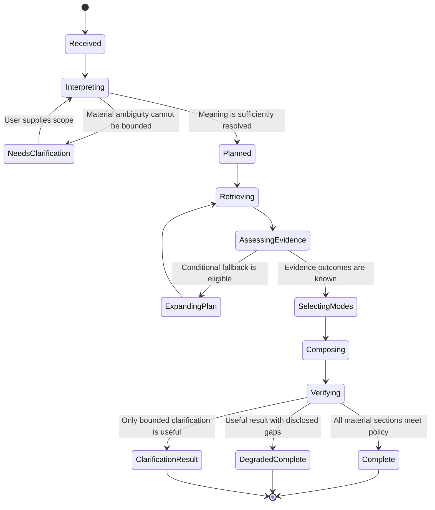
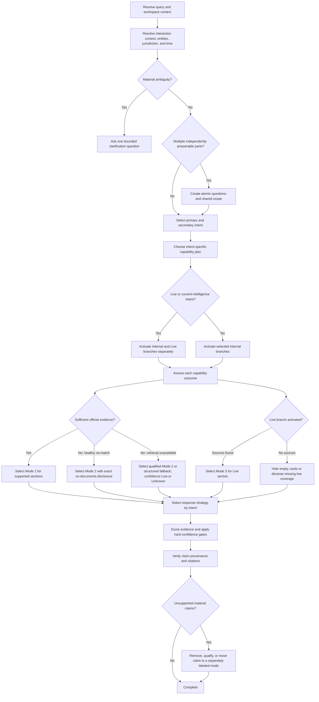
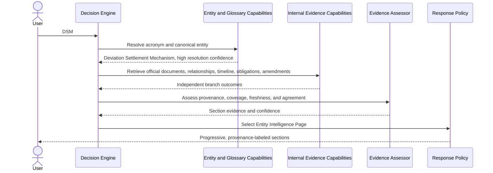
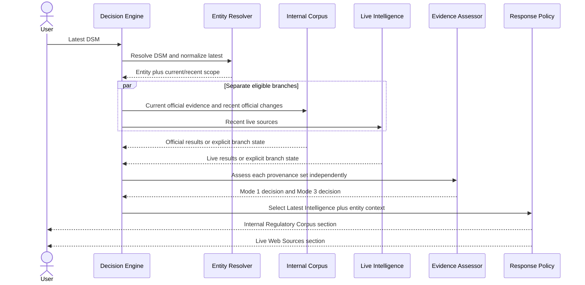
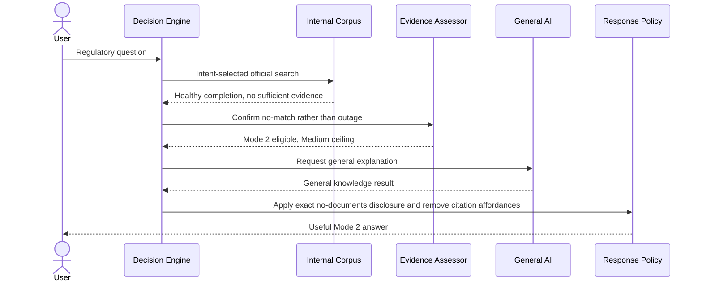
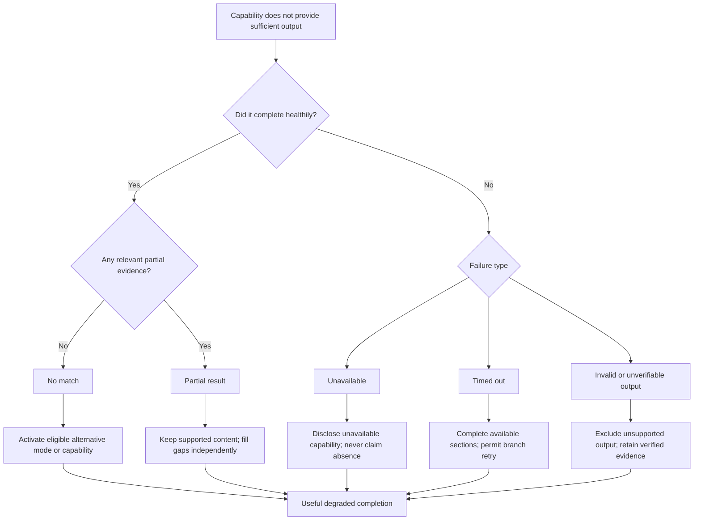
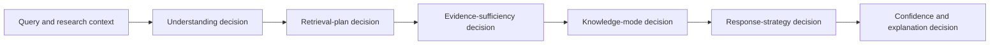

# Ask AI Decision Engine

**Product:** Resolven Regulatory AI  
**Document type:** Decision policy and orchestration specification  
**Status:** Proposed  
**Audience:** Product, AI, search, regulatory research, design, and engineering  
**Source documents:** `ASK_AI_AUDIT.md` and `ASK_AI_PRODUCT_SPEC.md`

---

# Executive summary

The Ask AI Decision Engine is the deterministic policy layer that decides what each query means, which knowledge capabilities are eligible, which should run, what evidence is sufficient, how the result should be presented, and how the experience remains useful when any capability fails.

It is not a chatbot prompt and it is not a backend architecture. It is a set of observable decisions.

The core contract is:

> Given the same query, conversation scope, policy version, capability health, and evidence results, the engine produces the same interpretation, retrieval plan, knowledge modes, response strategy, confidence, and explanation.

Language understanding may produce probabilistic candidates. It does not have final authority. Fixed thresholds, precedence rules, evidence gates, and failure policies turn those candidates into deterministic product decisions.

The engine preserves three knowledge modes:

1. **Grounded Regulatory Knowledge** — claims supported by Resolven's indexed regulatory corpus. Material claims require official citations.
2. **General AI Knowledge** — a clearly disclosed explanation from Parallel.ai when official evidence is not available. It never receives fabricated citations.
3. **Live Intelligence** — current information from live sources. Internal regulatory evidence and live web evidence remain separate.

The most important distinction in the entire design is:

- **No official evidence found:** the official search completed successfully and returned no sufficiently relevant evidence. General AI may answer with the required no-documents disclosure.
- **Official retrieval unavailable:** Resolven could not determine whether official evidence exists. General AI may still be useful, but it must disclose that official verification was unavailable and cannot claim that no documents were found.

No single capability is allowed to veto the complete response. Citation verification can remove or qualify an unsupported grounded claim; it cannot erase verified content, structured retrieval results, live intelligence, or a clearly labeled general explanation.

---

# 1. Scope

## 1.1 In scope

This specification defines decisions for:

- query interpretation;
- intent selection;
- entity extraction and resolution;
- jurisdiction and scope resolution;
- time interpretation;
- multi-part query decomposition;
- knowledge-mode selection;
- capability eligibility;
- retrieval branch selection;
- parallel versus sequential work;
- evidence sufficiency;
- response shape;
- confidence;
- explainability;
- independent failure degradation;
- conversation-context use;
- follow-up selection;
- future capability admission.

## 1.2 Out of scope

This document deliberately does not define:

- APIs or endpoints;
- databases or schemas;
- services, queues, workers, or deployment topology;
- model prompts;
- search-index design;
- implementation pseudocode;
- frontend component architecture;
- persistence implementation;
- vendor integration details.

Those concerns may implement this policy, but they must not redefine it.

---

# 2. Decision principles

## 2.1 Evidence determines authority

The writing model does not determine whether an answer is official, current, or trustworthy. Authority comes from evidence provenance, relevance, coverage, agreement, and freshness.

## 2.2 Provenance is assigned before prose

Every response section receives a knowledge-mode label before content is generated or shown. A section cannot begin as official and later become general knowledge.

## 2.3 Absence and failure are different states

`No match`, `unavailable`, `timed out`, `partial`, and `contradictory` have different consequences. They must never collapse into an empty result.

## 2.4 Retrieval is selective

Intent, entity type, time scope, and requested response shape determine eligible branches. The engine does not run every capability for every query.

## 2.5 Capabilities degrade independently

Glossary, internal documents, knowledge graph, live news, General AI, and future tools each succeed or fail independently. An optional branch cannot cancel successful required or supporting branches.

## 2.6 Claims inherit source boundaries

A claim supported by an official document is grounded. A claim taken from live reporting is live intelligence. A model-generated explanation unsupported by retrieved evidence is general knowledge. Combining these in one workspace does not merge their provenance.

## 2.7 The user sees material assumptions

Jurisdiction, entity resolution, time window, document version, and stakeholder scope are visible when they materially affect the answer.

## 2.8 Compliance claims use the strictest policy

Applicability, obligations, deadlines, exceptions, penalties, and current legal status require stronger evidence gates than educational explanations.

## 2.9 Latency is optimized through useful early certainty

Fast exact matches and structured evidence can appear before long-form synthesis. Optional slow branches do not block sections that are already trustworthy.

## 2.10 Conversation context is evidence for meaning, not evidence for facts

Prior turns may resolve pronouns and scope. They never make an old factual claim current and never replace a fresh source check when the user asks for current information.

---

# 3. The canonical decision record

For every user turn, the engine produces a human-inspectable decision record. This is a conceptual product contract, not a storage or API schema.

| Decision area | Required result |
|---|---|
| User request | Original query and any selected document, card, entity, or workspace context |
| Conversation scope | Inherited entities, jurisdiction, stakeholder, time scope, and exclusions |
| Primary intent | The dominant user goal |
| Secondary intents | Additional goals that affect retrieval or response sections |
| Intent confidence | Confidence that the request was interpreted correctly |
| Atomic questions | Independently answerable parts of a multi-part query |
| Entities | Mention, canonical entity, type, aliases, and resolution confidence |
| Time interpretation | Normalized time window, date semantics, status filters, and user time zone |
| Assumptions | Defaults used because the query omitted material scope |
| Required capabilities | Capabilities without which the requested result cannot be fully satisfied |
| Supporting capabilities | Capabilities that improve the result but do not define its validity |
| Skipped capabilities | Ineligible capabilities and the reason they were skipped |
| Retrieval plan | Parallel groups, evidence gates, and conditional fallbacks |
| Capability outcomes | Success, no match, partial, unavailable, timed out, or contradictory |
| Knowledge modes | Mode for every response section |
| Response strategy | Page, card, table, timeline, checklist, summary, report, or conversational answer |
| Evidence assessment | Authority, relevance, coverage, agreement, freshness, and scope fit |
| Confidence | Claim, section, and overall levels with reasons |
| Degradation | Missing capabilities and retained useful output |
| Explanation | Why the interpretation, sources, modes, response, and confidence were selected |
| Policy version | The version of decision rules used |

Two different outcomes are permitted only when at least one input to this record differs.

---

# 4. Decision lifecycle



## 4.1 Terminal product states

| State | Meaning |
|---|---|
| Complete | Every requested material section met its evidence and response policy. |
| Degraded complete | The answer remains useful, but one or more capabilities or evidence requirements were unavailable or incomplete. |
| Clarification result | A specific user choice is required because proceeding would likely answer a materially different question. |

There is no terminal `HTTP 400`, `citation failure`, or undifferentiated `error` product state.

---

# 5. Query understanding

## 5.1 Interpretation layers

The engine interprets each query in this order:

1. **Interaction context** — selected document, highlighted passage, open entity page, active comparison, or clicked follow-up.
2. **Explicit words in the current turn** — named entities, requested action, dates, status, audience, and output form.
3. **Conversation scope** — unresolved pronouns and deliberately retained scope from prior turns.
4. **Regulatory defaults** — jurisdiction, current version, and entity aliases defined by product policy.
5. **Clarification** — only if the remaining ambiguity materially changes the result.

An earlier turn never overrides an explicit current-turn instruction.

## 5.2 Intent taxonomy

Each turn has one primary intent and zero or more secondary intents. A multi-part query has one intent set per atomic question plus an overall `Multi-part Question` intent.

| Intent | User goal | Typical cues | Default response strategy |
|---|---|---|---|
| Definition | Understand a term or acronym | “what is,” “define,” “meaning of” | Definition Card |
| Entity Lookup | Explore a regulatory concept, acronym, scheme, body, or market mechanism | bare entity, “show DSM” | Entity Intelligence Page |
| Regulation Lookup | Find a named regulation, policy, act, order, or instrument | exact title, “regulation on” | Official Documents with overview |
| Deadline | Find a date, due date, effective date, or compliance window | “deadline,” “by when,” “due” | Deadline Cards and focused timeline |
| Stakeholder | Identify regulator, responsible party, affected class, or institutional role | “who regulates,” “who is affected” | Stakeholder Cards |
| Comparison | Compare two entities, instruments, versions, obligations, or periods | “compare,” “versus,” “difference” | Comparison Table |
| News | Find current developments, announcements, consultations, or reporting | “latest,” “today,” “news,” “breaking” | Latest Intelligence |
| Timeline | Explain events and changes over time | “timeline,” “history,” “evolution” | Timeline |
| Compliance Question | Determine applicability, duties, exceptions, evidence, or consequences | “must,” “required,” “comply,” “applicable” | Compliance Checklist |
| Summarization | Condense a known document, result set, or conversation | “summarize,” “executive summary” | Executive Summary |
| Document Explanation | Explain a selected or named document, provision, table, or passage | “explain this section,” “what does clause 4 mean” | Document Explanation |
| Amendment | Find or explain changes to an instrument | “amendment,” “what changed,” “revised” | Amendment Cards |
| Consultation | Find an open, historical, or recent consultation | “consultation,” “comments due,” “draft for comments” | Consultation and Deadline Cards |
| General Question | Answer a question that does not resolve to a supported regulatory research intent | broad educational question | Conversation |
| Multi-part Question | Satisfy two or more independently verifiable requests | “and,” enumerated questions, multiple requested outputs | Research Report with section-level modes |

`Regulator Lookup`, `Obligation Discovery`, `Version Comparison`, `Beginner Explanation`, and `Official Document Search` are retained as policy subtypes:

- Regulator Lookup is a Stakeholder subtype.
- Obligation Discovery is a Compliance Question subtype.
- Version Comparison is a Comparison subtype.
- Beginner Explanation is a Definition or Document Explanation presentation modifier.
- Official Document Search is a Regulation Lookup subtype.

## 5.3 Intent precedence

When more than one intent is plausible, the following fixed rules apply in order:

1. A selected document, passage, citation, or card plus “explain,” “summarize,” or a pronoun selects Document Explanation or Summarization.
2. Two or more independently answerable requests select Multi-part Question. Each part still receives its own intent.
3. Explicit compliance language selects Compliance Question over Definition or Entity Lookup.
4. Explicit comparison language selects Comparison when two operands can be resolved.
5. Explicit amendment or version-change language selects Amendment; explicit side-by-side change selects Comparison with Version Comparison subtype.
6. Explicit deadline language selects Deadline. A consultation comment deadline adds Consultation as a secondary intent.
7. Explicit timeline/history language selects Timeline.
8. Explicit consultation/draft-for-comments language selects Consultation.
9. Explicit live recency language selects News as primary unless the requested object is clearly a current deadline, amendment, or compliance status; in those cases News becomes secondary.
10. A named regulation or document title selects Regulation Lookup.
11. “What is” or “define” selects Definition.
12. A bare resolved regulatory entity selects Entity Lookup.
13. A responsible-party question selects Stakeholder.
14. A known result set plus “summarize” selects Summarization.
15. Otherwise, select General Question.

## 5.4 Intent-confidence bands

Intent confidence describes interpretation quality, not answer truth.

| Band | Rule | Product behavior |
|---|---|---|
| Certain | At least 0.90 and no competing intent within 0.10 | Proceed and show interpretation unobtrusively. |
| Strong | 0.75–0.89 and no material collision | Proceed and show intent/scope chips. |
| Bounded | 0.55–0.74, but top candidates share the same safe retrieval scope | Proceed with a visible assumption and offer a scope correction. |
| Ambiguous | Below 0.55, or competing candidates would produce materially different research | Ask one focused clarification question. |

A classifier score alone cannot force an intent. Explicit interaction context and precedence rules have priority.

## 5.5 Clarification policy

Clarification is required only when at least one of these is true:

- an acronym maps to multiple materially different regulatory entities and context does not distinguish them;
- jurisdiction changes the governing instrument or obligation;
- a comparison has fewer than two resolved operands;
- “this,” “it,” or “the regulation” has multiple plausible antecedents;
- the requested date type is material and ambiguous, such as issue date versus effective date;
- compliance applicability depends on an unstated stakeholder class that cannot be safely generalized.

Otherwise, the engine proceeds with a visible assumption and makes correction easy.

---

# 6. Entity extraction and resolution

## 6.1 Entity classes

| Entity class | Examples |
|---|---|
| Regulatory concept or mechanism | DSM, ABT, REC, RPO |
| Regulation family | DSM Regulations, Tariff Regulations |
| Legal instrument | Electricity Act, Tariff Policy, a named CERC order |
| Regulator or authority | CERC, SERC, MNRE |
| Scheme or policy | Green Hydrogen Mission, Tariff Policy |
| Market or commodity | power exchange, renewable energy certificate |
| Stakeholder | generator, distribution licensee, obligated entity |
| Obligation | renewable purchase obligation, reporting duty |
| Document | draft regulation, order, consultation paper, amendment |
| Jurisdiction | India, central, state, a named state |
| Status | draft, in force, repealed, superseded, consultation |

Words such as `draft`, `consultation`, and `latest` are not automatically entities. They are status or time constraints unless part of a canonical title.

## 6.2 Resolution order

Entity resolution uses this fixed order:

1. Exact canonical title or identifier.
2. Exact approved alias or acronym.
3. Exact glossary term.
4. Interaction-context entity.
5. Conversation-scope entity.
6. Jurisdiction-compatible contextual match.
7. Fuzzy candidate with a visible assumption.
8. Clarification when no bounded choice exists.

## 6.3 Resolution confidence

| Level | Conditions |
|---|---|
| 1.00 | Exact unique canonical identifier or title |
| 0.95 | Exact unique approved acronym or alias |
| 0.85 | Exact glossary match reinforced by jurisdiction or context |
| 0.70 | Unique contextual/fuzzy match with no material competitor |
| 0.50 | Two plausible candidates, but one is contextually favored |
| Below 0.50 | Unresolved material ambiguity |

An answer about obligations, deadlines, current status, or amendments requires entity-resolution confidence of at least 0.85. Below that threshold, the engine either limits the answer to a non-specific explanation or asks for clarification.

## 6.4 Acronym policy

For a bare acronym such as `DSM`:

- if the acronym has one canonical regulatory meaning in the active jurisdiction, resolve it and select Entity Lookup;
- if it has multiple meanings but one dominates the current regulatory workspace, proceed with a visible expansion;
- if multiple meanings would produce different official corpora, ask the user to choose;
- always display the expanded name beside the acronym;
- query expansion includes the acronym, full name, recognized former names, regulation-family names, and regulator associations;
- query expansion never changes the entity shown to the user without disclosing the mapping.

## 6.5 Entity relationship rules

Entity relationships from the knowledge graph can guide discovery but do not prove a legal claim by themselves unless the relationship retains official evidence.

The engine distinguishes:

- canonical identity;
- alias;
- regulated by;
- issued by;
- amends;
- supersedes;
- applies to;
- creates obligation;
- has deadline;
- relates to.

`Relates to` is discovery evidence, not legal applicability.

---

# 7. Time understanding

## 7.1 Time dimensions

The engine must determine which date dimension the query refers to:

- publication or issue date;
- effective date;
- compliance deadline;
- consultation opening or closing date;
- event date;
- validity period;
- document version date;
- retrieval timestamp.

Dates from different dimensions are never silently compared as though they were equivalent.

## 7.2 Interpretation precedence

1. Explicit absolute date or year.
2. Explicit range.
3. Explicit relative period.
4. Current-status word.
5. Document-status word.
6. Intent-specific default.
7. No time filter.

## 7.3 Normalized time rules

All relative periods use the user's configured time zone. The interpreted absolute range is shown to the user.

| User expression | Deterministic meaning |
|---|---|
| today | Current calendar day in the user's time zone |
| this week | Current local calendar week |
| this month | First through last day of the current local calendar month |
| recent | Rolling 90 days ending now |
| latest | Newest relevant item available, plus current validity check; activates Live Intelligence eligibility |
| current | In-force or operative status as of now, not merely the newest publication |
| 2023 | 1 January through 31 December 2023 |
| before 2021 | Strictly before 1 January 2021 |
| after 2021 | On or after 1 January 2022 unless a precise date is supplied |
| since 2021 | On or after 1 January 2021 |
| draft | Status filter for draft instruments; not a recency window by itself |
| consultation | Consultation status; defaults to open/current first, then recent closed items |
| breaking | Live sources from the most recent 72 hours, widened only if results are insufficient |

The product may change the configurable duration for `recent` or `breaking`, but the selected absolute range must always be visible and policy-versioned.

## 7.4 Intent-specific time defaults

| Intent | Default when the user supplies no time |
|---|---|
| Definition | Current official definition, with superseded meaning noted if material |
| Entity Lookup | Current overview plus a bounded recent-update section |
| Regulation Lookup | Current/in-force instrument first; historical versions available |
| Deadline | Upcoming active deadlines first; elapsed deadlines only when relevant |
| Compliance Question | Law and guidance current as of the answer date |
| Amendment | Most recent effective amendment first |
| Timeline | Full known range, summarized to material events |
| News | Rolling 30 days, visibly labeled |
| Consultation | Open consultations first, then closed within 90 days |
| Summarization | The selected source's own time context |

## 7.5 Freshness requirements

| Query type | Minimum freshness treatment |
|---|---|
| Historical year or closed event | Source date must fall within the requested range; present-day retrieval freshness is secondary |
| Current legal status | Validate current/superseded status against the freshest available official metadata |
| Latest, today, breaking | Run Live Intelligence and current official-corpus checks independently |
| Deadline | Validate extensions, withdrawals, and superseding notices |
| General definition | Prefer current official definition; flag historical or jurisdictional variants |

---

# 8. Multi-part questions

## 8.1 Decomposition rules

A query is multi-part when it asks for two or more outcomes that could independently succeed, fail, carry different provenance, or require different response formats.

Example:

> Explain DSM, list its current obligations for generators, and show the latest consultation.

This becomes:

1. Definition — DSM.
2. Compliance Question — current generator obligations.
3. Consultation — latest/open DSM consultation.

## 8.2 Shared-scope rules

- Explicit entities, jurisdiction, and stakeholder scope are shared unless a clause overrides them.
- Time language applies only to the closest clause unless grammar clearly scopes it to the whole request.
- Retrieval branches are deduplicated across parts.
- Each part receives its own knowledge mode, evidence assessment, failure result, and confidence.
- One failed part cannot suppress successful parts.
- The combined response is a Research Report with a coverage summary.

## 8.3 Contradictory scopes

If two parts imply incompatible scopes, the response separates them. It does not average or silently reconcile jurisdictions, versions, or time windows.

---

# 9. Knowledge-mode selection

## 9.1 Mode definitions

### Mode 1 — Grounded Regulatory Knowledge

Use when relevant internal regulatory evidence supports the material claims.

Requirements:

- official or corpus-approved regulatory provenance;
- sufficient relevance to the resolved entity and question;
- claim-linked citations for material statements;
- current-status validation when the query is current;
- no unsupported facts presented inside the grounded section.

Default confidence ceiling: High, subject to evidence quality.

### Mode 2 — General AI Knowledge

Use when:

- official retrieval completed successfully and found no sufficient official evidence; or
- the user explicitly asks a non-regulatory general question; or
- official retrieval is unavailable and a useful, carefully qualified explanation is safer than silence.

When official retrieval is healthy and no official documents were found, show exactly:

> This explanation is generated from general AI knowledge because no official regulatory documents were found.

No citations are generated for Mode 2 content. A link or source from another mode is never attached to a Mode 2 claim to make it appear grounded.

Default confidence ceiling:

- Medium when official retrieval was healthy and scope is resolved;
- Low when official retrieval was unavailable;
- Unknown when material entity, jurisdiction, or legal-status questions remain unresolved.

### Mode 3 — Live Intelligence

Use when the user asks for current developments or when current-source discovery is a required part of the response.

Requirements:

- live provenance label;
- publisher and publication time;
- retrieval time;
- source-specific links;
- separate presentation from Internal Regulatory Corpus;
- no inference that a live report is law merely because it discusses a regulation.

Live sources can be official or non-official. Official live pages may support high-confidence event claims, but a news report alone cannot establish a binding legal obligation.

## 9.2 Initial versus final mode

The query determines **eligible modes**. Evidence outcomes determine **final modes**.

Examples:

- `What is DSM?` initially prefers Mode 1. It becomes Mode 2 only if healthy official retrieval finds no sufficient evidence.
- `Latest DSM` initially requires Mode 3 and prefers Mode 1. The final answer may contain both, one, or degraded sections.
- `Explain this regulation to a beginner` remains Mode 1 if the simplification is constrained by the selected official document. The presentation style does not turn it into Mode 2.

## 9.3 Knowledge-mode matrix

| Query condition | Internal corpus health/result | Live result | Final mode decision |
|---|---|---|---|
| Regulatory question | Sufficient official evidence | Not requested | Mode 1 |
| Regulatory question | Healthy, no sufficient evidence | Not requested | Mode 2 with exact no-documents disclosure |
| Regulatory question | Unavailable | Not requested | Mode 2 only if useful, with verification-unavailable disclosure; Low or Unknown |
| Latest/current/news | Sufficient official evidence | Live sources found | Separate Mode 1 and Mode 3 sections |
| Latest/current/news | Healthy, no official evidence | Live sources found | Mode 3 plus optional Mode 2 background; never merge them |
| Latest/current/news | Sufficient official evidence | No live sources found | Mode 1; hide empty news cards and state live coverage if material |
| Latest/current/news | Unavailable | Live sources found | Mode 3 with official-verification warning |
| Latest/current/news | Healthy, no official evidence | Healthy, no live evidence | Mode 2 with exact disclosure; state that no live results were found |
| Explicit general educational question | Not required | Not requested | Mode 2 |
| Selected official document explanation | Selected evidence is readable and relevant | Not requested | Mode 1 |
| Selected document unavailable | Cannot inspect the referenced content | Not requested | Ask for the document or passage; do not pretend to explain it |

## 9.4 Combination rules

- A response may use multiple modes.
- A section uses only one mode.
- A comparison row may contain separate Mode 1 and Mode 3 evidence cells, but every cell retains its label.
- General AI may explain the significance of live or official evidence only in a separate clearly labeled synthesis section unless every statement is constrained by cited evidence.
- A grounded composer may use an AI model to phrase retrieved facts. That does not make the content Mode 2.
- General AI as a knowledge source is a distinct decision from AI as a writing tool.

---

# 10. Retrieval planning

## 10.1 Capability catalogue

| Capability | Best use | Required for | Skip when | Primary fallback |
|---|---|---|---|---|
| Glossary | Exact acronyms, definitions, aliases | Fast definitions and acronym resolution | No term-like entity is present | Entity index, then official document search |
| Entity index | Canonical entity, aliases, type, regulator, known families | Entity pages and scope resolution | Query is strictly about a selected document | Glossary or document metadata |
| Internal document search | Official instruments, passages, orders, policies | Grounded regulatory claims | Explicit non-regulatory general question | General AI after a healthy no-match result |
| Document metadata | Title, issuer, dates, status, version | Regulation lookup and source cards | No document-like target | Internal search |
| Knowledge graph | Relationships, stakeholders, obligations, deadlines, related regulations | Structured entity, compliance, deadline, stakeholder, and timeline outputs | Pure general question or isolated summarization | Extract equivalent facts from official documents |
| Version and amendment lineage | Predecessors, successors, amendments, versions | Amendment, comparison, current-status, timeline | No version/change intent | Document metadata plus official search |
| Live news | Current announcements, consultations, recent reporting | News and explicit recency intent | No live/current intent and no current-intelligence card is requested | Internal recent documents; otherwise hide live section |
| General AI knowledge | Educational fallback and broad general questions | Mode 2 | Mode 1 fully satisfies all requested claims | Return structured retrieval without generated explanation if unavailable |
| Conversation context | Pronouns, retained scope, research continuity | Follow-ups | Current turn explicitly resets scope | Clarification or visible assumption |
| Future tools | Modality- or domain-specific evidence | Only when declared eligible | Input, provenance, or intent does not match | Existing eligible capability plan |

## 10.2 Planning stages

### Stage A — Resolve cheaply

Eligible exact-match capabilities run first:

- glossary;
- entity index;
- selected-document context;
- exact document metadata.

These results establish canonical entities, aliases, document families, and scope. A direct exact result may be shown immediately.

### Stage B — Run intent-selected evidence branches

After resolution, eligible independent branches run in parallel:

- internal document search;
- knowledge graph;
- version/amendment lineage;
- live news, when activated;
- document-specific evidence.

Only branches selected by the routing table execute.

### Stage C — Assess sufficiency

The engine distinguishes:

- sufficient evidence;
- relevant but incomplete evidence;
- no relevant evidence after a healthy search;
- capability unavailable;
- contradictory evidence.

### Stage D — Activate conditional fallbacks

- General AI knowledge is activated only after the evidence gate for regulatory questions, unless the query is explicitly general.
- Document-derived relationship extraction substitutes for unavailable graph data.
- Internal recent documents substitute for unavailable live news but remain Mode 1.
- Manual document search is offered when internal retrieval is unavailable or ambiguity remains.

### Stage E — Select response and verification depth

Response cards and verification strictness follow intent, knowledge mode, and risk.

## 10.3 Parallelization rules

Branches run in parallel only when their inputs are resolved and neither depends on the other's result.

| Branch combination | Decision |
|---|---|
| Internal document search + knowledge graph | Parallel after entity resolution |
| Internal document search + live news | Parallel for live/current queries |
| Knowledge graph + version lineage | Parallel for timeline/amendment/entity work |
| Glossary + exact entity index | Parallel for a bare or definitional term |
| General AI fallback + unresolved official search | Do not run as competing knowledge sources; wait for the official evidence outcome |
| Grounded prose composition + citation verification | Composition may begin from verified evidence units; unverified claims cannot be finalized |
| Independent atomic questions | Parallel after shared-scope resolution |

Parallel.ai is actually used as a General AI knowledge capability only when Mode 2 is selected, and may also be used as a constrained writing model for Mode 1. These are different roles. Running multiple retrieval branches concurrently does not mean multiple independent AI knowledge calls are being used.

## 10.4 Latency policy

The engine favors the smallest plan that can satisfy the intent:

| Plan class | Typical queries | Decision policy |
|---|---|---|
| Fast exact | `DSM`, `What is DSM?`, exact document title | Resolve glossary/entity/document metadata first; reveal structured match immediately |
| Focused grounded | obligation, deadline, stakeholder, document explanation | Run only the relevant official and graph branches |
| Live combined | latest, today, recent, consultation, news | Run internal and live branches concurrently; render separate sections independently |
| Deep research | timeline, amendment history, comparison | Add lineage and relationship branches; allow progressive section completion |
| Composite | multi-part question | Deduplicate shared retrieval; complete sections independently |

Optional branches never delay a complete required section. A slow timeline does not block an exact definition, and slow live news does not block official documents.

---

# 11. Intent-to-retrieval routing table

Legend: **R** = required, **S** = supporting, **C** = conditional, **—** = skipped by default.

| Intent | Glossary | Entity | Internal docs | Graph | Lineage | Live | General AI | Primary response |
|---|---:|---:|---:|---:|---:|---:|---:|---|
| Definition | R | S | S | — | — | — | C | Definition Card |
| Entity Lookup | S | R | R | R | S | C for recent section | C | Entity Intelligence Page |
| Regulation Lookup | — | S | R | S | S | — | C | Official Documents |
| Deadline | — | S | R | R | S | C when current/latest | C | Deadline Cards |
| Stakeholder | — | R | R | R | — | — | C | Stakeholder Cards |
| Comparison | S | R | R | S | R for versions | C if current | C per unsupported side | Comparison Table |
| News | S | R | S | S | C | R | C for background only | Latest Intelligence |
| Timeline | — | R | R | R | R | C for current tail | C | Timeline |
| Compliance Question | S | R | R | R | S | C if current/latest | C only after no evidence | Compliance Checklist |
| Summarization | — | C | R for known sources | — | — | C for live set | C only for general source set | Executive Summary |
| Document Explanation | S | S | R | S | C | — | C only if document unavailable and user accepts | Document Explanation |
| Amendment | — | R | R | S | R | C if recent/latest | C | Amendment Cards |
| Consultation | — | R | R | S | S | R for current/open discovery | C | Consultation Cards |
| General Question | C | C | C if regulatory entity resolves | — | — | C if current | R when no regulatory grounding applies | Conversation |
| Multi-part Question | Per atomic intent | Per atomic intent | Deduplicated | Deduplicated | Deduplicated | Per time intent | Per evidence gate | Research Report |

`R` means required for a fully satisfied result, not required for any useful result. If it fails, the engine follows the independent degradation policy.

---

# 12. Primary decision tree



---

# 13. Response strategy

## 13.1 Selection rules

The response strategy is determined by primary intent, entity specificity, number of atomic questions, and evidence shape. The model does not choose an arbitrary format.

| Primary intent | Required primary surface | Supporting cards | Degraded fallback |
|---|---|---|---|
| Definition | Definition Card | Official Source, related terms | Mode 2 Definition Card |
| Entity Lookup | Entity Intelligence Page | Definition, timeline, documents, stakeholders, obligations, news, related regulations | Partial page with available sections |
| Regulation Lookup | Official-document result and status summary | Source, amendment, related regulation | Search guidance or Mode 2 background |
| Deadline | Deadline Cards ordered by status/date | Official Source, stakeholder, timeline | Retrieved dates with verification warning; never invent a deadline |
| Stakeholder | Stakeholder Cards | Obligations, related regulations | Document-derived roles or qualified general explanation |
| Comparison | Comparison Table with independent evidence per side | Source, confidence/coverage | Partial comparison with `Not established` cells |
| News | Latest Intelligence with provenance-separated sections | News, official source, timeline | Internal-only or general background; hide empty news list |
| Timeline | Chronological Timeline | Amendment, source, confidence | Partial timeline with missing-range disclosure |
| Compliance Question | Compliance Checklist | Obligation, deadline, source, applicability assumptions | General educational checklist clearly marked non-authoritative |
| Summarization | Executive Summary | Source list, key dates, obligations | Extractive/structured source view if model unavailable |
| Document Explanation | Explanation anchored to selected source | Definition, source excerpt, related provisions | Show document/excerpt and ask user to select a passage |
| Amendment | Amendment Cards | Comparison, timeline, official source | Known documents without unsupported change summary |
| Consultation | Consultation Cards | Deadline, live news, official source | Internal consultation documents or no-live-results state |
| General Question | Conversational answer | Optional definitions or related entities | Short unavailable state if General AI fails |
| Multi-part Question | Research Report | Intent-specific cards per section | Partial report with section-level failures |

## 13.2 Entity Intelligence Page rule

A bare, resolved regulatory entity such as `DSM` must not produce only a paragraph. It selects an Entity Intelligence Page.

The decision engine plans these sections:

1. Overview.
2. Definition.
3. Latest News, only when live evidence exists.
4. Timeline.
5. Official Regulations.
6. Stakeholders.
7. Related Regulations.
8. Key Obligations.
9. Recent Amendments.
10. Official Documents.
11. Suggested Follow-up Questions.
12. Confidence and Coverage.

Each section completes, degrades, or hides independently. Overview and definition may appear before timeline and news.

## 13.3 Compliance response rules

A Compliance Checklist must distinguish:

- who may be in scope;
- the obligation;
- trigger or applicability condition;
- action required;
- deadline or frequency;
- exception or uncertainty;
- official basis;
- current-status check.

If official evidence does not establish one of these fields, show `Not established from available official evidence`. General AI may provide an educational explanation in a separate section, but it cannot fill the official checklist cell as fact.

## 13.4 Comparison response rules

- Resolve both operands before retrieval.
- Use equivalent dimensions on both sides.
- Cite each side independently.
- Never infer equality from missing evidence.
- A missing side displays `Not established`, not a fabricated symmetric answer.
- If versions have different effective periods, show those periods before differences.
- Confidence is assigned per row and for the overall comparison.

## 13.5 Research Report rule

Use a Research Report when:

- the query is multi-part;
- the user explicitly asks for a report;
- three or more structured response strategies are required;
- the answer spans distinct time periods or provenance modes.

The report begins with scope and coverage, not a generic conversational preamble.

---

# 14. Sequence diagrams

## 14.1 Bare entity: `DSM`



## 14.2 Combined current query: `Latest DSM`



## 14.3 Healthy official no-match



## 14.4 Official retrieval unavailable

```mermaid
sequenceDiagram
    actor U as User
    participant D as Decision Engine
    participant C as Internal Corpus
    participant G as General AI
    participant R as Response Policy

    U->>D: Compliance question
    D->>C: Search official evidence
    C-->>D: Unavailable
    D->>D: Do not conclude that no documents exist
    D->>G: Request qualified educational explanation
    G-->>D: General knowledge result
    D->>R: Mark official verification unavailable; cap confidence at Low
    R-->>U: General explanation plus manual document-search action
```

---

# 15. Capability outcome model

Every capability returns one decision state:

| State | Meaning | May trigger fallback? | May be described as “nothing found”? |
|---|---|---:|---:|
| Success | Completed with sufficient eligible results | No | No |
| Partial | Completed with some usable results but incomplete coverage | Yes, for missing coverage | No |
| No match | Completed healthily with no result meeting relevance policy | Yes | Yes, with exact scope |
| Unavailable | Could not execute or validate results | Yes | No |
| Timed out | Did not complete within the response policy | Yes; may retry independently | No |
| Contradictory | Credible evidence conflicts materially | Yes, through qualification or more evidence | No |
| Skipped | Policy determined capability was ineligible | No | No |

The response may say “No official documents were found” only after a healthy `No match` outcome from all required official-retrieval branches for the disclosed scope.

---

# 16. Failure strategy

## 16.1 Failure tree



## 16.2 Independent degradation table

| Failure | Decision | User still receives | Confidence effect |
|---|---|---|---|
| No official documents after healthy search | Select Mode 2 | General explanation with exact required disclosure | Medium ceiling |
| Internal retrieval unavailable | Do not claim no documents; offer qualified Mode 2 and manual document search | Scope interpretation, any cached/selected sources, optional general explanation | Low ceiling; Unknown for legal status or applicability |
| Knowledge graph unavailable | Derive available facts from official documents; omit unsupported relationship cards | Documents, definitions, prose, live results | Lower only affected structured sections |
| Glossary unavailable | Use entity aliases and official definitions | Entity page or definition from other evidence | No penalty if equivalent official definition is found |
| Version lineage unavailable | Search named versions and amendments directly | Known documents and partial timeline | Comparison/amendment confidence reduced |
| Live news returns no matches | Hide empty news cards; disclose no live coverage when material | Internal evidence and other sections | No penalty to historical Mode 1 sections |
| Live news unavailable | Label live search unavailable; do not imply no news exists | Internal recent documents and prior saved live results labeled with age | Current-intelligence section Low or Unknown |
| Parallel.ai unavailable in Mode 2 | Show resolved query, structured search outcome, related entities, and manual search actions | Useful retrieval/navigation state | Unknown for unanswered prose |
| Writing model unavailable in Mode 1 | Show retrieved official cards, excerpts, dates, and structured graph facts | Cached/verified retrieval without generated narrative | Evidence confidence unchanged; completeness reduced |
| Citation verification fails for one claim | Remove or qualify that claim; keep verified claims and evidence cards | Partial grounded response | Reduce affected claim/section only |
| All citations fail verification | Do not present generated prose as Mode 1; show retrieved sources and optional separate Mode 2 | Source list, excerpts, search actions, or general explanation | Grounded narrative Unknown; source cards retain their own confidence |
| Conflicting official sources | Show conflict, dates, status, and unresolved issue | Both sources and a bounded explanation | No High confidence for affected claim |
| Entity ambiguity | Ask one focused choice or provide parallel labeled interpretations when small | Candidate entities and why they differ | Unknown until resolved for material claims |
| One part of a multi-part query fails | Complete all other parts | Partial Research Report | Section-level only; overall shows incomplete coverage |

## 16.3 Citation-failure policy

Citation verification is a claim-level gate, not a response-level kill switch.

When a citation fails:

1. The unsupported claim is isolated.
2. A different official source may be used only if it supports the same claim.
3. If no support exists, the claim is removed, weakened, or moved to a separately labeled Mode 2 section.
4. Verified claims, evidence cards, timelines, live results, and conversation state remain visible.
5. The completion state explains the coverage gap.

The product never fails merely because citations were not found.

## 16.4 Model-failure policy

The engine distinguishes AI roles:

- **General AI knowledge role:** required to create a Mode 2 explanation.
- **Grounded writing role:** optional for presenting Mode 1 evidence in polished prose.

If the knowledge role fails, Mode 2 prose is unavailable. If the writing role fails, official retrieval can still provide a useful structured answer.

---

# 17. Confidence model

## 17.1 What confidence means

Confidence answers:

> How strongly do the available sources support this claim for the resolved entity, jurisdiction, time, and requested purpose?

It does not mean:

- how fluent the prose sounds;
- how certain the model says it is;
- how many tokens were generated;
- how many documents were returned without regard to relevance;
- whether a response contains citation-shaped text.

## 17.2 Evidence-source classes

| Class | Typical source | Authority score range |
|---|---|---:|
| A | In-force primary legislation, regulation, official order, official current notice | 90–100 |
| B | Official draft, consultation paper, amendment notice, regulator-issued explanatory material | 80–94 |
| C | Official metadata or official secondary summary that does not contain the operative provision | 70–84 |
| D | Credible live reporting, recognized professional analysis, or non-official primary reporting | 50–74 |
| E | General AI knowledge without retrieved evidence | 35–55 |
| U | Unknown, inaccessible, or unverifiable provenance | 0–34 |

Authority is domain-specific. A company policy may be authoritative for company procedure but cannot prove a statutory requirement.

## 17.3 Exact score

Each material claim receives six dimension scores from 0 to 100:

| Dimension | Weight | Meaning |
|---|---:|---|
| Evidence authority | 25% | Source class and legal authority for this type of claim |
| Retrieval relevance | 15% | Direct match to entity, jurisdiction, provision, and question |
| Claim coverage | 20% | Degree to which the evidence supports the complete claim |
| Source agreement | 15% | Agreement among relevant independent sources and versions |
| Freshness/status validity | 15% | Fitness for the requested time and current legal status |
| Scope resolution | 10% | Confidence in entity, jurisdiction, stakeholder, and date interpretation |

The base score is the weighted sum of these six dimensions.

Apply all relevant penalties:

| Condition | Penalty |
|---|---:|
| Unresolved contradiction between credible material sources | −25 |
| Evidence is stale for a current/latest query | −20 |
| A required evidence capability was unavailable | −15 |
| Legal applicability is inferred rather than directly established | −10 |
| High-impact compliance claim relies on only one source when independent confirmation is reasonably expected | −10 |
| Material date type is inferred rather than explicit | −5 |

The final score is bounded from 0 to 100.

## 17.4 Confidence labels

| Label | Numerical rule | Mandatory gates |
|---|---:|---|
| High | 80–100 | Material claim has official or equivalently authoritative evidence; coverage at least 85; scope resolution at least 85; no unresolved contradiction; freshness meets the query |
| Medium | 60–79 | Evidence is relevant and useful but has limited coverage, authority, freshness, or corroboration |
| Low | 35–59 | Material gaps, degraded required capabilities, weak provenance, or significant inference |
| Unknown | 0–34, or a hard unknown condition | Evidence is insufficient to assess, material scope is unresolved, or required verification could not occur |

Hard unknown conditions override the numeric score:

- the referenced document cannot be inspected;
- the governing jurisdiction is materially unresolved;
- current legal status is requested but current official retrieval is unavailable and no saved official status evidence is fit for purpose;
- credible sources conflict on the central claim and status cannot be resolved;
- a deadline or obligation has no inspectable basis.

## 17.5 Mode ceilings

| Mode/evidence condition | Maximum label |
|---|---|
| Mode 1 with complete official evidence | High |
| Mode 1 with partial official evidence | Medium |
| Mode 2 after healthy official no-match | Medium |
| Mode 2 while official retrieval is unavailable | Low |
| Mode 3 based on an official live source | High for the event claim, subject to all High gates |
| Mode 3 based only on credible reporting | Medium |
| Unverified live or unknown-provenance content | Low or Unknown |

The product requirement that standard Mode 2 is Medium is preserved as a ceiling, not an automatic award. Poor scope resolution can still make it Low or Unknown.

## 17.6 Claim, section, and overall confidence

- **Claim confidence** uses the exact calculation above.
- **Section score** is 70% of the coverage-weighted mean claim score plus 30% of the lowest material-claim score.
- **Overall score** is 70% of the importance-weighted mean section score plus 30% of the lowest critical-section score.
- For compliance, deadline, current-status, and version-comparison answers, the overall label cannot exceed the lowest material claim's label.
- For multi-mode responses, confidence is shown per section. An overall label never hides that an official section is High while a live background section is Medium.

## 17.7 Confidence matrix

| Evidence pattern | Agreement | Freshness | Scope | Expected label |
|---|---|---|---|---|
| Current official provision directly supports all material claims | Consistent | Current | Resolved | High |
| Official source directly supports most, but not all, details | Consistent | Current | Resolved | Medium |
| Official documents support one side of a comparison only | No conflict | Current | Resolved | Medium for supported side; Unknown for missing side |
| Healthy official no-match followed by General AI | Not evidence-backed | General | Resolved | Medium ceiling |
| Official retrieval unavailable followed by General AI | Cannot assess | Unknown | Resolved | Low ceiling |
| Credible live reports agree, no official confirmation | Consistent | Fresh | Resolved | Medium |
| Official source and live report conflict | Contradictory | Fresh | Resolved | Low or Unknown for disputed claim |
| Strong official evidence but wrong/uncertain jurisdiction | Irrelevant to scope | Current | Unresolved | Unknown |
| Historical official source for a historical question | Consistent | Fit for requested year | Resolved | High possible |
| Old official source for “current” status without validity check | Unknown | Stale | Resolved | Low or Unknown |

---

# 18. Explainability

## 18.1 Required answer explanation

Every completed answer makes the following inspectable:

1. **Interpreted request** — primary intent and any secondary intents.
2. **Resolved scope** — entities, jurisdiction, stakeholder, document/version, and time window.
3. **Knowledge modes used** — by section.
4. **Why information was shown** — the relationship between the query and each response section.
5. **Why sources were selected** — authority, directness, date fitness, and relationship to the claim.
6. **Why confidence has its level** — strongest evidence, coverage gaps, conflicts, and unavailable capabilities.
7. **What was not established** — unsupported claims or missing scope.
8. **What degraded** — capability failures stated in product language.

## 18.2 Explanation layers

The default view remains concise. Detail is progressively inspectable:

- **At a glance:** intent chips, entity expansion, time scope, mode, confidence.
- **Section level:** source count, freshness, and coverage.
- **Claim level:** cited provision or live source and why it supports the claim.
- **Decision detail:** branches searched, skipped, degraded, or unavailable and why.

## 18.3 Source-selection reasons

Each selected source receives one or more plain-language reasons:

- Directly defines the entity.
- Governs the requested stakeholder.
- Contains the operative obligation.
- Establishes the deadline.
- Is the current in-force version.
- Amends or supersedes the cited instrument.
- Falls within the requested time window.
- Is the issuing regulator's official source.
- Provides independent live confirmation.
- Adds context but is not an official legal source.

## 18.4 Confidence explanation template

Confidence explanations contain evidence facts, not model introspection.

Examples:

- **High:** “High confidence because two current CERC instruments directly establish the definition and applicability, the sources agree, and the provisions cover all material claims.”
- **Medium:** “Medium confidence because an official consultation paper supports the proposal, but it is not yet an in-force requirement.”
- **Low:** “Low confidence because official search was unavailable and the explanation could not be checked against the current corpus.”
- **Unknown:** “Confidence is unknown because the governing jurisdiction was not specified and the applicable rules differ by state.”

## 18.5 Explainability prohibition

The engine must not display hidden chain-of-thought, model reasoning traces, or fabricated descriptions of work. It exposes decisions, inputs, evidence, rules, and outcomes.

---

# 19. Loading and streaming decisions

Visible progress is derived from the selected plan and actual capability state.

| Stage | Show when | Complete when | Degraded when |
|---|---|---|---|
| Understanding Query | Every query | Intent and atomic questions are decided | Bounded assumption was required |
| Resolving Entities | Entity candidates exist | Required entities are resolved | A non-critical entity remains uncertain |
| Searching Regulations | An internal evidence branch is selected | All required official branches complete | Any required official branch is partial/unavailable |
| Searching News | Live Intelligence is selected | Live branch returns a terminal outcome | Live branch is unavailable/timed out |
| Building Timeline | Timeline output is selected | Material events are ordered and sourced | Date coverage is partial |
| Comparing Versions | Version Comparison is selected | Both operands and dimensions are assessed | One version or dimension is incomplete |
| Generating Summary | Narrative or summary is selected | Mode-labeled prose completes | Writing model fails but structured results remain |
| Verifying Citations | Mode 1 generated claims exist | Every retained material claim is verified or removed | Some claims are excluded or qualified |
| Saving Research | A durable turn is part of the experience | The visible state is preserved | The state remains locally/visibly unsynced |
| Complete | All selected stages are terminal | Result is Complete or Degraded complete | Shows a coverage summary |

Skipped stages are either hidden or explicitly marked skipped in detailed progress. They are never animated as though they ran.

---

# 20. Conversation decisions

## 20.1 Context inheritance

The engine may inherit:

- active entity;
- jurisdiction;
- stakeholder;
- selected document/version;
- explicit time scope;
- chosen comparison operands;
- desired explanation level.

It does not inherit:

- an old `latest` result as current;
- a prior assumption that the user corrected;
- a source's legal status without a required freshness check;
- hidden facts from a different session.

## 20.2 Follow-up interpretation

| Follow-up | Decision |
|---|---|
| “What about generators?” | Retain entity, jurisdiction, and time; replace stakeholder scope |
| “Show the latest” | Retain entity; activate current time and Mode 3 |
| “Compare it with ABT” | Use active entity as first operand and ABT as second |
| “Explain clause 4” | Use selected/open document; choose Document Explanation |
| “Is that still current?” | Retain referenced claim/document; activate current-status validation |
| “Start over” | Clear inherited research scope before interpretation |

## 20.3 Refresh policy

A follow-up triggers fresh retrieval when it:

- asks for latest/current/today/recent;
- asks whether a law is still in force;
- asks for an upcoming deadline;
- changes jurisdiction or stakeholder;
- requests new supporting evidence;
- compares with a newly introduced entity or version.

A stylistic transformation such as “explain that more simply” reuses the same evidence unless its freshness is already inadequate.

---

# 21. Follow-up suggestion decisions

Suggestions advance research and are selected from unresolved or adjacent intents.

## 21.1 Selection order

After each result, choose up to five non-duplicate suggestions in this order:

1. Resolve a material gap or assumption.
2. Deepen official evidence.
3. Explore compliance impact.
4. Explore change over time.
5. Explore a related entity.
6. Add current intelligence when relevant.

At least one suggestion should deepen evidence when confidence is below High.

## 21.2 Suggestion eligibility

- Do not suggest a question already answered in the current result.
- Do not suggest live news if the entity cannot be resolved.
- Do not suggest comparison without a plausible second operand.
- If retrieval failed, suggest manual document search or retry, not a claim that no evidence exists.
- If evidence is weak, prefer “Show the official provision” over broader speculation.
- Preview the expected response type: `Timeline`, `Compare`, `Official sources`, `Compliance`, or `Live`.

---

# 22. Representative query decisions

| Query | Primary intent | Entities | Time/status | Retrieval plan | Modes | Response |
|---|---|---|---|---|---|---|
| `DSM` | Entity Lookup | DSM → Deviation Settlement Mechanism | Current overview | Glossary/entity first; documents, graph, lineage in parallel; live only for populated recent section | Mode 1; optional Mode 3 | Entity Intelligence Page |
| `What is DSM?` | Definition | DSM | Current definition | Glossary, entity, official definition search | Mode 1; Mode 2 on healthy no-match | Definition Card |
| `Latest DSM` | News | DSM | Latest/current | Entity resolution; internal recent/current and live in parallel; lineage for changes | Separate Mode 1 + Mode 3 | Latest Intelligence with entity context |
| `DSM amendment` | Amendment | DSM regulation family | Most recent effective amendment | Entity, documents, lineage, graph relationships | Mode 1; optional Mode 3 if newly announced | Amendment Cards |
| `DSM consultation` | Consultation | DSM | Open/current, then recent closed | Internal consultation search and live discovery in parallel; deadline facts | Mode 1 + Mode 3 where found | Consultation and Deadline Cards |
| `Compare DSM and ABT` | Comparison | DSM, ABT | Current unless stated | Resolve both; official documents and graph in parallel; comparable dimensions | Mode 1 per side; Mode 2 only for explicitly unsupported background | Comparison Table |
| `Who regulates DSM?` | Stakeholder | DSM, regulator relationship | Current | Entity, graph, official issuing instruments | Mode 1 | Stakeholder Card |
| `DSM timeline` | Timeline | DSM | Full known range | Documents, graph, lineage in parallel | Mode 1; optional Mode 3 current tail | Timeline |
| `Explain DSM to a beginner` | Definition + beginner modifier | DSM | Current | Same evidence as Definition | Mode 1 if officially grounded | Plain-language Definition Card |
| `What DSM deadlines apply to generators?` | Deadline + Compliance | DSM, generator | Current/upcoming | Documents, graph deadlines/obligations, lineage/current status | Mode 1; Mode 2 only as separate education fallback | Compliance Checklist + Deadline Cards |
| `What changed in the 2023 DSM amendment?` | Amendment | DSM, 2023 amendment | Year 2023 | Resolve exact version; documents and lineage; compare affected provisions | Mode 1 | Amendment plus Comparison Cards |
| `DSM before 2021` | Timeline or Entity Lookup, bounded by phrasing | DSM | Before 1 Jan 2021 | Historical documents, graph, lineage; no live branch | Mode 1 | Historical overview/timeline |
| `Is the latest DSM draft binding?` | Compliance Question | DSM draft | Latest, draft, current status | Internal status and lineage plus live; distinguish draft from in-force instrument | Mode 1 + Mode 3; qualified Mode 2 only if no official evidence | Compliance answer with status card |
| `Summarize this regulation` with a selected document | Summarization | Selected document | Document's own period | Selected-document evidence only; entity enrichment optional | Mode 1 | Executive Summary |
| `Explain clause 4` with no selected document | Document Explanation | Unresolved document | None | No speculative retrieval | None until resolved | Focused clarification |
| `Compare DSM and ABT and show the latest consultation` | Multi-part Question | DSM, ABT | Current/latest for consultation only | Shared entity/doc search; comparison branches and live consultation branch independently | Mode 1 + Mode 3 by section | Research Report |
| `What is green hydrogen?` | Definition | Green Hydrogen | Current | Glossary/entity and official policy definition; general fallback | Mode 1 if corpus evidence, otherwise Mode 2 | Definition Card |
| `Write a poem about electricity` | General Question | None required | None | Skip regulatory retrieval | Mode 2 | Conversation |
| `Latest tariff policy changes this month` | News + Amendment | Tariff Policy | Current calendar month | Internal changes/lineage and live sources in parallel | Mode 1 + Mode 3 | Latest Intelligence + Amendment Cards |

---

# 23. Architecture of decisions, not services

The engine separates six decision concerns:



Each concern consumes the prior decision record and explicit capability outcomes. No concern can silently rewrite an earlier scope decision.

Examples:

- Retrieval cannot rename the entity without returning to entity resolution.
- A writing model cannot upgrade Mode 2 to Mode 1.
- Citation formatting cannot upgrade confidence.
- Response design cannot merge internal and live provenance.
- A failed optional branch cannot convert a successful response into a total error.

---

# 24. Determinism and policy conflicts

## 24.1 Conflict precedence

When policies conflict, use this order:

1. User safety and truthful provenance.
2. Explicit current-turn scope.
3. Evidence authority and legal status.
4. Intent-specific requirements.
5. Conversation scope.
6. Latency preference.
7. Presentation preference.

For example, a request for a “quick definitive answer” cannot bypass an unresolved jurisdiction or turn general knowledge into official advice.

## 24.2 Tie-breaking

When two eligible capability plans can satisfy the same intent:

1. Prefer the plan with authoritative direct evidence.
2. Then prefer the plan with better time and scope fit.
3. Then prefer the plan with fewer required branches.
4. Then prefer lower expected latency.
5. Then prefer lower cost.

Cost and latency never outrank required evidence quality.

## 24.3 Policy versioning

Changes to:

- intent precedence;
- acronym mappings;
- relative time ranges;
- confidence weights or thresholds;
- source-authority classes;
- capability eligibility;
- failure disclosures;
- response selection;

constitute a new decision-policy version. Saved research retains the policy version that produced it.

---

# 25. Future extensibility

## 25.1 Capability admission contract

A future capability can participate only after declaring:

- supported input modalities;
- supported intents;
- supported entity types;
- jurisdictions and domains;
- provenance class;
- time/freshness semantics;
- evidence granularity;
- response-card compatibility;
- whether it is required, supporting, or fallback for each eligible intent;
- expected latency class;
- independent health states;
- confidence dimensions it can affect;
- failure disclosure;
- prohibited claims;
- authorization or confirmation requirements.

This contract lets the policy select a capability by declared properties rather than adding special-case logic to every existing route.

## 25.2 Extension rules

1. New capabilities are ineligible by default.
2. Eligibility must be explicit for intent, entity, modality, and provenance.
3. A capability cannot assign its own knowledge mode or confidence.
4. A capability's content retains its original provenance.
5. Every new required capability must define a useful degraded result.
6. Optional capabilities cannot block established routes.
7. New response cards must state which evidence classes can populate each field.
8. New tools cannot silently broaden jurisdiction, time, or stakeholder scope.
9. Action-taking tools require a separate confirmation decision from research decisions.
10. Adding a capability must not change existing routing unless a policy version explicitly changes eligibility or precedence.

## 25.3 Future capability matrix

| Future capability | New decision input | Eligible intents | Provenance treatment | Key decision constraint |
|---|---|---|---|---|
| PDF upload | User-provided document | Summarization, Document Explanation, Comparison | User-provided source, not automatically official | Validate document identity before treating it as authoritative |
| Image understanding | User-provided image/page | Document Explanation, extraction | User-provided visual evidence | Distinguish extracted text from interpretation |
| Spreadsheet analysis | User-provided data/workbook | Comparison, Summarization, compliance calculations | User-provided structured data | Calculations may be exact while legal applicability remains separately evidenced |
| Company policy documents | Enterprise private corpus | Compliance, policy comparison, document explanation | Enterprise-authoritative for internal policy only | Never represent company policy as statutory law |
| Enterprise knowledge base | Private organizational knowledge | Entity lookup, internal procedure, research | Enterprise provenance | Keep private and official regulatory evidence visibly separate |
| Email | User-authorized communication context | Deadline discovery, stakeholder workflow | Personal/enterprise communication | An email may indicate an action but does not establish law |
| Calendar | User-authorized schedule | Deadline planning and workflow | Personal operational context | Calendar entries do not verify regulatory deadlines |
| Agent workflows | Requested actions | Research follow-through | Action provenance and audit state | Research may suggest an action; execution requires confirmation |
| New live-source provider | Live web evidence | News, consultation, current status | Mode 3 | Must disclose publisher, timestamp, and source quality |
| New official corpus | Additional primary evidence | All grounded regulatory intents | Mode 1 if accepted as authoritative | Authority and jurisdiction must be declared |

## 25.4 Provenance overlays

The three public knowledge modes remain stable. Future private or user-provided evidence appears as an explicit provenance overlay:

- Official Regulatory Corpus.
- Live Web Sources.
- General AI Knowledge.
- User-provided document.
- Enterprise knowledge.
- Personal operational context.

The overlay does not silently become Mode 1. It may be authoritative for a narrower domain, such as a company's own policy, while remaining distinct from official regulation.

## 25.5 Future-tool selection

When multiple future capabilities are eligible, the engine applies the same tie-breaking policy:

1. Direct authoritative source for the requested claim.
2. Correct scope and time.
3. Complete evidence coverage.
4. Independent corroboration.
5. Lower latency.
6. Lower cost.

The selected capability and selection reason appear in decision detail.

---

# 26. Governance and validation

## 26.1 Decision test catalogue

Every policy version must be validated against a stable catalogue containing:

- every representative query in this document;
- ambiguous acronyms;
- missing jurisdiction;
- historical and current date expressions;
- healthy no-match versus retrieval-unavailable outcomes;
- partial graph and live-news failures;
- citation failure affecting one claim and all claims;
- conflicting official sources;
- multi-part partial success;
- conversation follow-ups and scope resets;
- each confidence boundary;
- each future capability's eligibility and prohibition rules.

The expected test result is the decision record, not exact generated prose.

## 26.2 Decision observability

Product and quality teams must be able to inspect:

- chosen intent and alternatives;
- resolved entities and confidence;
- normalized time range;
- selected/skipped branches;
- capability outcomes;
- mode assigned to each section;
- evidence and penalties behind confidence;
- degradation reason;
- response strategy;
- policy version.

This enables explainability, regression analysis, and correction without exposing private model reasoning.

## 26.3 Quality measures

The Decision Engine should be evaluated on:

- correct intent rate;
- correct entity and jurisdiction resolution;
- official no-match versus outage discrimination;
- material-claim citation coverage;
- provenance-separation violations;
- current-status freshness;
- useful degraded completion rate;
- unnecessary branch rate;
- time to first trustworthy result;
- clarification precision;
- confidence calibration;
- reopen-and-reproduce consistency.

High answer completion with incorrect provenance is a failure, not a success.

---

# 27. Acceptance criteria

The Decision Engine is ready for implementation design only when all of the following are true:

- Every query receives a primary intent or a focused clarification.
- Multi-part queries produce independently recoverable atomic decisions.
- Entity, jurisdiction, stakeholder, document, and time scope are explicit when material.
- `No official documents found` is emitted only after a healthy, scoped no-match.
- Official retrieval failure never masquerades as absence of evidence.
- Mode 1 material claims require verified official citations.
- Mode 2 uses the exact required disclosure when healthy official retrieval finds no documents.
- Mode 2 never invents citations.
- Mode 3 keeps Internal Regulatory Corpus and Live Web Sources separate.
- Live or current language activates time-aware live planning.
- Citation failure affects claims or sections, not the entire response.
- Parallel.ai unavailability does not erase retrieved official evidence.
- Knowledge graph, glossary, lineage, news, and document search degrade independently.
- A bare entity such as `DSM` selects an Entity Intelligence Page.
- Compliance, deadline, comparison, and current-status questions use stricter confidence gates.
- Confidence is derived from evidence rather than model self-assessment.
- Every response can explain interpretation, source selection, knowledge mode, confidence, and gaps.
- Progress stages correspond only to work selected and actually performed.
- A future capability can be admitted through the capability decision contract without silently changing existing routes.
- The same decision inputs under the same policy version produce the same decision outcome.

---

# Final decision contract

For every Ask AI query, Resolven will:

1. determine what the user is trying to accomplish;
2. resolve the relevant entity, jurisdiction, stakeholder, document, and time scope;
3. decompose independently answerable parts;
4. select only the capabilities eligible for those decisions;
5. run independent evidence branches in parallel where their inputs are resolved;
6. distinguish evidence absence from capability failure;
7. select knowledge mode per response section after evidence assessment;
8. choose a structured response appropriate to the intent;
9. preserve strict provenance boundaries;
10. calculate confidence from evidence quality, retrieval quality, agreement, freshness, coverage, and scope;
11. explain why information and sources were selected;
12. degrade each failed capability independently;
13. preserve useful verified results even when generation or citations fail;
14. expose assumptions and invite the smallest useful correction;
15. remain extensible through explicit capability eligibility and provenance rules.

This changes Ask AI from a one-shot chatbot into a predictable regulatory research decision system whose behavior can be trusted, tested, explained, and extended.
