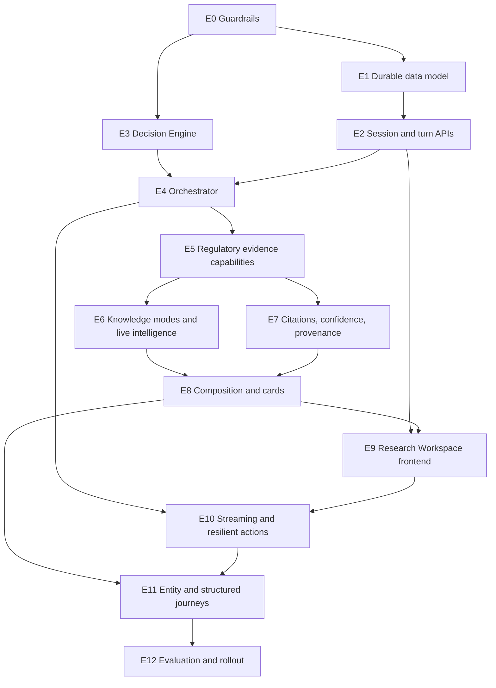

# Ask AI Redesign — Implementation Plan

**Product:** Resolven Regulatory AI  
**Document type:** Production implementation plan  
**Status:** Proposed delivery baseline  
**Date:** 2026-07-26  
**Frozen specifications:**

- `ASK_AI_AUDIT.md`
- `ASK_AI_PRODUCT_SPEC.md`
- `ASK_AI_DECISION_ENGINE.md`
- `ASK_AI_ORCHESTRATOR.md`

---

# Executive summary

This plan implements the frozen Ask AI specifications without redesigning them.

The current product is a synchronous `/chat` request backed by transient frontend state, a flat `chat_messages` table, broad fail-silent retrieval, one Parallel.ai completion, and citations that are neither durable nor claim-verified. The target is a persistent Regulatory Intelligence Workspace with deterministic query decisions, capability orchestration, three explicit knowledge modes, structured outputs, claim-linked evidence, live intelligence, true sessions, and independently useful failure states.

The work is organized into 13 production epics:

1. Delivery guardrails and compatibility foundation.
2. Durable research-workspace data model.
3. Session, turn, and evidence APIs.
4. Query understanding and Decision Engine.
5. AI Orchestrator and capability lifecycle.
6. Regulatory retrieval, Knowledge Graph, and Timeline evidence.
7. Knowledge modes, General AI, and Live Intelligence.
8. Citation verification, confidence, and provenance.
9. Response composition, cards, and follow-ups.
10. Frontend Research Workspace and exact session continuity.
11. Streaming, cancellation, retry, regeneration, and feedback.
12. Entity Intelligence, federated search, and structured research journeys.
13. Production evaluation, staged rollout, and legacy retirement.

The rollout is additive:

- existing `/chat` and `/chat/history` behavior remains available during migration;
- new schema is introduced through ordered migrations beginning at `0023`;
- new APIs are side-by-side rather than breaking existing clients;
- the new UI is feature-flagged;
- legacy history is backfilled and verified before any old path is retired;
- every PR is independently deployable, backward compatible, and tested.

Estimated total: **203–279 engineer-days**, approximately **14–20 calendar weeks with three experienced engineers**, plus product/design/regulatory review. Live-source procurement or a higher-assurance claim-verification model could extend this range.

---

# 1. Frozen-specification policy

## 1.1 Authority order

Implementation must follow:

1. `ASK_AI_PRODUCT_SPEC.md` for user-visible behavior.
2. `ASK_AI_DECISION_ENGINE.md` for deterministic routing and confidence decisions.
3. `ASK_AI_ORCHESTRATOR.md` for capability cooperation.
4. `ASK_AI_AUDIT.md` for current-state facts and known defects.

The audit describes the current system; it does not override target behavior.

## 1.2 Contradiction protocol

If implementation reveals a genuine contradiction:

1. Stop only the affected PR.
2. Record the conflicting clauses and concrete implementation evidence.
3. Identify the smallest viable resolution and affected acceptance criteria.
4. Obtain product, regulatory, and engineering approval.
5. Version the affected specification through a separate documentation decision.
6. Resume implementation only after the decision is recorded.

Do not silently reinterpret or edit a frozen specification inside a feature PR.

## 1.3 Current repository constraints

- Backend: FastAPI, Pydantic, synchronous SQLAlchemy, PostgreSQL/Supabase, pytest.
- Frontend: Next/Vinext, React 19, TanStack Query, Zod, TypeScript.
- Current migration ledger ends at `0022`; applied migrations are checksum-protected.
- Current Ask endpoints are `POST /chat` and `GET /chat/history`.
- Existing public message IDs are bigint values.
- Existing chat history is flat, capped, and citation-free.
- The web package currently treats `tsc --noEmit` as its only test.
- Existing untracked integration-test files are outside this plan and must not be overwritten.

---

# 2. Delivery principles

## 2.1 Backward compatibility

- No existing response field is removed during rollout.
- New response fields are additive and optional until the new client is live.
- Existing `/chat` remains operational behind a legacy adapter until explicit retirement.
- Existing bigint message IDs remain valid; stable UUID public IDs are additive.
- Database changes use expand/backfill/validate/contract sequencing.
- Feature flags default to legacy behavior in production.
- Rollback disables new reads/writes before any schema rollback is considered.

## 2.2 PR requirements

Every PR in this plan must:

- take one to three engineer-days;
- compile independently;
- keep the prior production path working;
- include unit or contract tests appropriate to its scope;
- add integration tests for database or external-boundary behavior;
- include an explicit migration and rollback note when schema changes;
- include flag defaults and operational impact;
- avoid unrelated refactors;
- update decision fixtures when routing behavior intentionally changes;
- contain no unreviewed changes to the frozen specifications.

Every PR description inherits the following merge gate, even when its row does not repeat the wording:

| Gate | Required proof |
|---|---|
| Independent build | The repository compiles, backend checks pass, and frontend typecheck/build remain green at that PR alone. |
| Backward compatibility | Existing `/chat`, `/chat/history`, persisted bigint message identities, and flag-off UI behavior remain valid unless a later explicitly approved retirement PR says otherwise. |
| Tests | New behavior has unit/contract tests; database and provider boundaries have integration tests; affected legacy behavior has regression coverage. |
| Migration declaration | The PR states either `No database migration` or names one new ordered additive migration, its preflight, rollout, and non-destructive rollback strategy. |
| Regression control | The PR contains no unrelated cleanup, does not edit applied migration files, and passes the affected end-to-end smoke path. |
| Feature safety | New serving behavior is off by default until the epic's rollout gate is satisfied. |

## 2.3 Definition of done

An epic is complete only when:

- all epic acceptance criteria pass;
- backend lint, type checks where applicable, and pytest pass;
- frontend typecheck, component tests, and relevant end-to-end tests pass;
- migration verification passes from both an empty and a production-like prior schema;
- feature-flag-off behavior is unchanged;
- observability covers success, no-match, partial, unavailable, timeout, and invalid-output states;
- operational runbooks and rollback instructions are reviewed.

## 2.4 Feature flags

Initial flags:

| Flag | Purpose | Default |
|---|---|---|
| `ASK_AI_V2_WRITE_ENABLED` | Dual-write sessions/runs/artifacts | Off |
| `ASK_AI_V2_API_ENABLED` | Expose new session/turn APIs | Off |
| `ASK_AI_DECISION_ENGINE_ENABLED` | Use deterministic interpretation and routing | Off |
| `ASK_AI_ORCHESTRATOR_ENABLED` | Use capability orchestration | Off |
| `ASK_AI_GENERAL_MODE_ENABLED` | Enable Mode 2 fallback | Off |
| `ASK_AI_LIVE_MODE_ENABLED` | Enable live-news retrieval | Off |
| `ASK_AI_VERIFICATION_ENABLED` | Gate grounded claims through verifier | Off, then shadow |
| `ASK_AI_STREAMING_ENABLED` | Expose run-event streaming | Off |
| `ASK_AI_V2_UI_ENABLED` | Render Research Workspace | Off |

Flags are temporary rollout controls, not permanent product modes.

---

# 3. Target delivery sequence

Safe parallel work:

- E1 and E3 can proceed after E0.
- E5 evidence work and E2 session API work can overlap once common contracts are fixed.
- E6 live/general modes and E7 verification can overlap after E5.
- E9 frontend shell can begin against fixtures while E8 response composition is being completed.

---

# Epic E0 — Delivery guardrails and compatibility foundation

## Goal

Create the testing, contract, feature-flag, error, and observability foundation needed to change Ask AI safely.

## Why it exists

The current critical flow has almost no Ask-specific test coverage, no stable request identity, raw provider errors reach users, and failures are collapsed into generic outcomes. Implementing the redesign without guardrails would make regressions and rollback difficult to detect.

## User value

Users receive fewer regressions immediately, safer error messages, and a foundation for gradual rollout without losing access to the current feature.

## Backend changes

- Add a stable request/run correlation identity to Ask processing and logs.
- Define typed product error codes without exposing provider/database details.
- Add feature-flag evaluation and log the selected path.
- Add capability-status vocabulary for test fixtures.
- Add per-stage timing and outcome metrics around the existing path without changing behavior.
- Create frozen decision/orchestration fixture sets from specification examples.

## Frontend changes

- Add a typed safe-error mapping for Ask-specific error codes while retaining legacy fallback handling.
- Add a frontend feature-flag boundary for the current Ask view versus the future Research Workspace.
- Add Vitest, React Testing Library, and a minimal browser-level test setup.
- Preserve drafts when a safe authentication or service error is shown.

## Database changes

None. Correlation IDs are initially log/request metadata only.

## API changes

- Add a correlation ID response header.
- Add an optional structured error body while retaining current HTTP semantics.
- Do not remove the existing `detail` field until legacy clients are retired.

## Risk assessment

**Risk: Low–medium.** Cross-cutting error and flag code can affect all Ask requests if introduced globally.

Mitigation:

- scope flags and error mapping to Ask;
- default every new flag off;
- snapshot current success and failure contracts;
- do not change retrieval or AI behavior in this epic.

## Rollback strategy

- Disable new error/telemetry decorators through configuration.
- Retain existing exception flow.
- Revert frontend feature boundary without schema impact.

## Testing strategy

- Backend contract tests for current `/chat` success and errors.
- Tests confirming upstream details are logged but not returned.
- Request-ID propagation tests.
- Frontend safe-error rendering tests.
- Legacy UI smoke test with every new flag off.
- Frozen-query fixture validation for all specification examples.

## Acceptance criteria

- Existing Ask behavior is unchanged with all flags off.
- No newly handled error exposes raw HTTP/provider/database text.
- Every Ask request has one traceable correlation ID.
- Test runners support backend unit/integration tests and frontend component tests.
- CI fails on typecheck, lint, contract, or fixture regressions.
- Frozen specifications remain unchanged.

## Dependencies

None.

## Estimated complexity

**Medium: 8–11 engineer-days.**

## Reviewable PRs

| PR | Estimate | Scope | Tests and compatibility |
|---|---:|---|---|
| E0.1 Ask contract characterization | 2 days | Capture current `/chat`, history, citation, and error behavior as fixtures | Pytest contract suite; no runtime change |
| E0.2 Frontend test foundation | 2–3 days | Add component-test tooling and legacy Ask smoke tests | Existing typecheck remains; no UI behavior change |
| E0.3 Feature-flag boundary | 1–2 days | Add backend/frontend Ask flags with off defaults | Flag-off equivalence tests; no migration |
| E0.4 Safe errors and correlation identity | 2–3 days | Add product error codes, safe rendering, and request correlation | Backend/frontend error contract tests; legacy body retained |
| E0.5 Baseline stage metrics | 1–2 days | Measure current auth/retrieval/model/persistence latency and outcomes | Metrics emission tests; removable without data changes |

---

# Epic E1 — Durable research-workspace data model

## Goal

Introduce durable sessions, versioned turns, orchestration runs, sections, sources, claims, citations, follow-ups, and feedback while preserving all existing chat rows.

## Why it exists

The product requires exact session restoration, claim-linked evidence, response cards, news, timelines, AI metadata, feedback, and regeneration lineage. The current `chat_messages` table cannot represent these objects.

## User value

Research no longer disappears. Users can reopen a workspace exactly as they left it, inspect its evidence, and retain prior versions after refresh or regeneration.

## Backend changes

- Add repository models for sessions and durable message versions.
- Add transactional creation of user turn, assistant placeholder, and orchestration run.
- Add repositories for sections, sources, claims, citations, follow-ups, feedback, and run events.
- Add a legacy-history backfill tool with dry-run, metrics, resume, and verification modes.
- Stop suppressing persistence failures in the new path.

## Frontend changes

None beyond schema fixtures. New data remains behind `ASK_AI_V2_WRITE_ENABLED`.

## Database changes

Ordered additive migrations beginning at `0023`:

### Conversation foundation

- `chat_sessions`
  - UUID identity;
  - user and optional event ownership;
  - title, status, primary entity/topic, scope snapshot;
  - knowledge-mode summary, freshness state;
  - pinned/archive/delete lifecycle;
  - created, updated, and last-message timestamps.
- Extend `chat_messages`
  - stable UUID public identity while retaining bigint primary key;
  - nullable `session_id` during expansion;
  - reply-to and version lineage;
  - pending/completed/failed/cancelled status;
  - model, intent, request/idempotency identity;
  - policy and prompt version;
  - safe error metadata;
  - completion timestamp.

### Research result foundation

- `ask_runs` for decision/orchestration state and timing.
- `ask_sections` for ordered, versioned response blocks and cards.
- `ask_sources` for immutable official and live source snapshots.
- `ask_claims` for material claim identity and support state.
- `ask_citations` for claim-to-source evidence and verifier result.
- `ask_followups` for durable suggestions.
- `ask_feedback` for version-specific feedback.
- `ask_saved_items` for pinned sources, citations, cards, and entities within a workspace.
- `ask_run_events` for resumable progress history.

General AI is not represented as a source row. Its `General AI Knowledge` provenance, model/policy metadata, and required disclosure are stored with the run, section, and claims; no synthetic source identity or citation is created.

### Security and indexes

- RLS on every user-owned table.
- Ownership enforced through session/user linkage.
- Cursor indexes for sessions, messages, sections, and run events.
- Full-text indexes added later after backfill size is measured.
- Public grants remain least-privilege.

## API changes

None exposed in this epic. Repository/domain behavior is tested internally.

## Risk assessment

**Risk: High.** This is a material schema expansion on user-owned data.

Primary risks:

- locks during table alteration;
- incorrect RLS ownership;
- legacy rows not assigned to a session;
- duplicate backfill;
- migration checksum/history mistakes;
- write amplification.

Mitigation:

- expand nullable columns first;
- create indexes without rewriting existing columns where possible;
- use idempotent application-level backfill batches;
- validate counts and ownership before enforcing non-null constraints;
- use one legacy session per user and event scope;
- keep original rows and bigint IDs unchanged.

## Rollback strategy

- Turn off v2 writes.
- Continue reading legacy `chat_messages`.
- Leave additive tables/columns in place; do not destructively roll them back under load.
- If a migration itself fails, rely on the migration runner's transaction rollback.
- Remove new tables only in a later approved cleanup after v2 data is proven unused.

## Testing strategy

- Migration tests from empty schema and schema at `0022`.
- RLS tests for owner/non-owner access.
- Backfill tests for global, event-scoped, odd-row, and orphan-message histories.
- Idempotency and resume tests.
- Transaction tests proving no user turn exists without its assistant placeholder/run.
- Repository contract tests for exact artifact restoration.
- Volume test using production-like chat row counts.

## Acceptance criteria

- No existing chat row is deleted or changes public meaning.
- Every legacy row can be mapped to a recoverable session.
- New turns can persist messages, sections, claims, citations, sources, follow-ups, and feedback atomically at declared boundaries.
- RLS prevents cross-user access.
- Backfill is repeatable and produces a verification report.
- Feature-flag-off reads still use the legacy path.

## Dependencies

E0.

## Estimated complexity

**High: 15–20 engineer-days.**

## Reviewable PRs

| PR | Estimate | Scope | Tests and migration strategy |
|---|---:|---|---|
| E1.1 `0023` session expansion | 2–3 days | Add `chat_sessions` and nullable session/public identity fields | Empty/prior-schema migration tests; no backfill enforcement |
| E1.2 Session/message repositories | 2–3 days | Add typed repositories and transactional turn creation | Unit and PostgreSQL integration tests; legacy repository untouched |
| E1.3 `0024` run and section artifacts | 2–3 days | Add runs, sections, sources, claims, citations, follow-ups, events | RLS and FK tests; additive migration |
| E1.4 Feedback and version lineage | 2 days | Add response-version and feedback persistence | Version/ownership tests; no legacy API change |
| E1.5 Legacy backfill tool | 2–3 days | Dry-run/resumable session grouping and metadata backfill | Idempotency, batching, and failure-resume tests |
| E1.6 Constraint validation migration | 2–3 days | Validate backfill, add safe constraints/indexes | Preflight verifier; rollback is flag-off plus additive schema retention |
| E1.7 Production-volume migration rehearsal | 1–2 days | Rehearse timings/locks and write runbook | Automated count/hash reconciliation; no production mutation in PR |

---

# Epic E2 — Session, turn, and evidence APIs

## Goal

Expose backward-compatible APIs for creating, listing, reopening, searching, renaming, pinning, archiving, and continuing research workspaces.

## Why it exists

The current API exposes a single global history list and synchronous message request. The product requires stable sessions, cursor pagination, exact turn restoration, evidence access, feedback, and versioned regeneration.

## User value

Users can create and reopen actual research sessions, find old work, and see the same messages, sources, citations, cards, timeline, and feedback.

## Backend changes

- Add session ownership and authorization policies.
- Add cursor-based session and message repositories.
- Add complete turn serialization from persisted artifacts.
- Add title generation as a nonblocking post-turn behavior with deterministic fallback title.
- Add session search across title, messages, entities, sources, and structured artifacts.
- Add compatibility adapter from the new persisted turn to the legacy `ChatResponse`.

## Frontend changes

- Add API/Zod schemas without switching the UI yet.
- Add typed query keys for session list, session detail, messages, sources, and run state.
- Add contract fixtures for exact restoration.

## Database changes

- Add or refine full-text search vectors/indexes after measuring backfill.
- Add session lifecycle timestamps and indexes if not completed in E1.
- No destructive change.

## API changes

Add:

- `POST /chat/sessions`
- `GET /chat/sessions?q=&cursor=&limit=&mode=&entity=&archived=&pinned=`
- `GET /chat/sessions/{session_id}`
- `PATCH /chat/sessions/{session_id}`
- `POST /chat/sessions/{session_id}/archive`
- `POST /chat/sessions/{session_id}/restore`
- `POST /chat/sessions/{session_id}/duplicate`
- `GET /chat/sessions/{session_id}/export`
- `DELETE /chat/sessions/{session_id}` as recoverable soft delete
- `GET /chat/sessions/{session_id}/messages?cursor=&limit=`
- `POST /chat/sessions/{session_id}/messages`
- `GET /chat/sessions/{session_id}/saved-items`
- `POST /chat/sessions/{session_id}/saved-items`
- `DELETE /chat/sessions/{session_id}/saved-items/{saved_item_id}`
- `GET /chat/messages/{message_id}`
- `GET /chat/messages/{message_id}/sources`
- `POST /chat/messages/{message_id}/feedback`

Compatibility:

- retain `POST /chat`;
- retain `GET /chat/history`;
- legacy endpoints can internally use new persistence only after dual-write validation.

## Risk assessment

**Risk: Medium–high.**

Risks:

- authorization leakage through session IDs;
- contract drift between backend Pydantic and frontend Zod;
- pagination ordering defects;
- search performance;
- legacy adapter inconsistencies.

## Rollback strategy

- Disable `ASK_AI_V2_API_ENABLED`.
- Keep legacy endpoints and repositories active.
- New API data remains durable for later re-enable.
- Avoid deleting sessions during rollback; soft-delete state can be restored.

## Testing strategy

- API authorization tests for every session/message/source endpoint.
- Cursor stability tests under concurrent inserts.
- Exact-restoration golden tests.
- Backend Pydantic/frontend Zod contract fixtures.
- Search relevance and filter tests.
- Legacy adapter equivalence tests.
- Rate-limit and idempotency tests for message creation.

## Acceptance criteria

- A user can create, list, reopen, rename, pin, duplicate, export, archive, restore, and soft-delete a session.
- Sources, citations, cards, and entities can be saved to and restored from the workspace.
- Session/message pagination is chronological and stable.
- A reopened turn includes all persisted structured artifacts.
- Search finds matching titles, message content, entities, documents, and sources.
- Cross-user access is rejected without existence leakage.
- Legacy endpoints remain unchanged with v2 flags off.

## Dependencies

E1.

## Estimated complexity

**High: 12–16 engineer-days.**

## Reviewable PRs

| PR | Estimate | Scope | Tests and compatibility |
|---|---:|---|---|
| E2.1 Session create/list/detail | 2–3 days | Add owned session read/write contracts | API/RLS tests; flag-gated |
| E2.2 Cursor message history | 2–3 days | Add chronological paginated messages and full turn serializer | Cursor/exact-restoration tests |
| E2.3 Session lifecycle actions | 2–3 days | Rename, pin, duplicate, export, archive, restore, soft delete | Ownership/state-transition and export tests |
| E2.4 Session search | 2–3 days | Add full-text search and filters | Additive index migration plus query-plan tests |
| E2.5 Evidence, saved-item, and feedback reads/writes | 2–3 days | Add sources, citations, artifacts, saved items, and feedback endpoints | Version-linkage and authorization tests |
| E2.6 Legacy compatibility adapter | 2–3 days | Map persisted v2 result to current `ChatResponse` and history | Golden equivalence tests; legacy routes retained |

---

# Epic E3 — Query understanding and Decision Engine

## Goal

Implement the frozen deterministic intent, entity, time, knowledge-mode eligibility, retrieval-plan, response-strategy, and clarification policies.

## Why it exists

The current first-match substring detector does not cover the required taxonomy, does not resolve entities or time, and does not route retrieval. The redesigned experience depends on a stable, inspectable decision record.

## User value

Queries such as `DSM`, `Latest DSM`, `DSM amendment`, and `Compare DSM and ABT` reliably open the correct research experience without repeated reformulation.

## Backend changes

- Add a versioned Decision Engine domain package separate from capability execution.
- Expand intent taxonomy and fixed precedence rules.
- Add atomic-question decomposition.
- Add time/status normalization using user time zone.
- Add entity mention and scope representation.
- Add deterministic capability-plan and response-blueprint selection.
- Persist the decision record and policy version in shadow mode.
- Keep classifier confidence separate from answer confidence.

## Frontend changes

- Add read-only interpretation chips to fixture/demo components.
- Add correction/clarification response contracts.
- Do not switch production Ask routing until later epics.

## Database changes

- Add canonical regulatory entity and alias/glossary tables only if existing graph entity data cannot provide unique aliases, canonical names, types, and jurisdiction.
- If new tables are needed, use an additive `0025` migration with source/provenance fields and unique normalized aliases scoped by jurisdiction.
- Persist decision records in `ask_runs`; no additional turn table.

## API changes

- Add optional `interpretation` and `decision_summary` fields to v2 run/message representations.
- Add an internal/admin-only decision-preview endpoint for evaluation, not user execution.
- Do not alter legacy `/chat` response requirements.

## Risk assessment

**Risk: High.** Wrong classification or entity resolution can route a user to the wrong evidence and undermine trust.

Mitigation:

- deterministic precedence after probabilistic candidates;
- shadow evaluation before routing;
- explicit clarification thresholds;
- fixture catalogue covering every specification example;
- correction telemetry.

## Rollback strategy

- Disable `ASK_AI_DECISION_ENGINE_ENABLED`.
- Fall back to legacy intent detection for legacy requests.
- Retain decision records for analysis without affecting answers.

## Testing strategy

- Table-driven tests for every intent and precedence collision.
- Entity resolution tests for DSM, ABT, REC, RPO, CERC, MNRE, Green Hydrogen, Tariff Policy, Electricity Act, and ambiguous acronyms.
- Time tests using fixed clocks and multiple time zones.
- Multi-part decomposition tests.
- Property tests ensuring explicit current-turn scope overrides conversation scope.
- Snapshot tests for approved work plans and response blueprints.
- Shadow disagreement analysis against curated regulatory-review labels.

## Acceptance criteria

- Every frozen example produces the specified primary/secondary intents.
- Bare resolved entities select Entity Intelligence Page.
- Material ambiguity produces one focused clarification.
- Time expressions normalize exactly as specified and remain visible.
- Same inputs and policy version produce the same decision record.
- Decision Engine selects capabilities; it does not execute them.
- Shadow mode has no user-visible effect.

## Dependencies

E0. Can run in parallel with E1/E2.

## Estimated complexity

**High: 13–18 engineer-days.**

## Reviewable PRs

| PR | Estimate | Scope | Tests and compatibility |
|---|---:|---|---|
| E3.1 Decision record and taxonomy | 2–3 days | Add versioned decision types and intent precedence | Frozen fixture tests; no routing change |
| E3.2 Time and status understanding | 2 days | Normalize absolute, relative, current, draft, consultation scopes | Fixed-clock/time-zone tests |
| E3.3 Entity/glossary resolution | 2–3 days | Canonical aliases, acronym resolution, confidence, ambiguity | Additive entity migration only if required; resolver tests |
| E3.4 Multi-part and context policy | 2–3 days | Atomic questions, pronouns, scope inheritance/reset | Conversation fixture tests |
| E3.5 Retrieval/response plan selection | 2–3 days | Map decisions to capability roles and response blueprints | Golden plan matrix |
| E3.6 Shadow decision recording | 2 days | Run beside legacy intent and record disagreements | Flag-off tests and metrics |
| E3.7 Regulatory review calibration | 1–2 days | Review fixture labels and thresholds | Approved labels become permanent regression tests; no runtime change |

---

# Epic E4 — AI Orchestrator and capability lifecycle

## Goal

Implement the frozen capability-cooperation model with typed artifacts, dependency-aware parallelism, finite stopping rules, latency budgets, independent outcomes, and deterministic section state.

## Why it exists

The current route directly performs retrieval, prompt construction, one model call, and best-effort persistence. It has no capability lifecycle, no typed branch health, no partial section completion, and no budget enforcement.

## User value

Users receive faster trustworthy partial results, truthful progress, useful degraded answers, and no total failure when one capability is unavailable.

## Backend changes

- Add capability contracts for inputs, outputs, provenance, confidence signals, terminal states, and timings.
- Add immutable orchestration context and approved-work-plan execution.
- Implement interpretation, evidence fan-out, admission, transformation, composition, verification, merge, and completion phases.
- Add an async-safe v2 execution seam: nonblocking database access, shared async provider clients, and explicit isolation for any temporary legacy synchronous adapters.
- Add bounded concurrency, per-capability soft/hard cutoffs, and reserved verification time.
- Add a capability registry/admission contract so future capabilities declare roles, artifacts, provenance, confidence effects, budgets, dependencies, and fallbacks without bypassing orchestration gates.
- Add user cancellation and stop-at-safe-artifact behavior.
- Select conversation context from the active session's newest relevant turns, preserve chronological order, and exclude unrelated/global history.
- Persist run/capability/section transitions.
- Add compatibility adapters for existing retrieval and LLM clients.
- Ensure no capability publishes directly to the final response.

## Frontend changes

- Add development-only run-state visualizer against fixtures.
- Add typed capability/section status schemas.
- No production UI switch.

## Database changes

- Extend `ask_runs`/`ask_run_events` only if E1 lacks capability-level state, cancellation, lease, or policy-version fields.
- Additive migration only; no changes to legacy chat tables.

## API changes

- V2 message creation returns stable message/run identities and initial state.
- Add read model for run, capability, and section status.
- Legacy `/chat` continues to use its current synchronous contract until E10.

## Risk assessment

**Risk: Very high.** This becomes the central coordination path and must not create deadlocks, infinite correction loops, unbounded fan-out, or lost partial output.

Mitigation:

- pure capability contracts;
- deterministic state-transition tests;
- one bounded interpretation reconciliation;
- one citation correction pass;
- hard terminal states;
- shadow execution before serving user content;
- kill switch to legacy.

## Rollback strategy

- Disable `ASK_AI_ORCHESTRATOR_ENABLED`.
- Keep v2 session data and shadow run records.
- Route new user requests through the legacy adapter.
- Cancel outstanding v2 runs through their durable state; do not delete artifacts.

## Testing strategy

- State-machine transition tests.
- Dependency graph and forbidden-parallelism tests.
- Fake-clock latency-budget tests.
- Cancellation tests at every phase.
- Partial-failure matrix tests for all ten capabilities.
- Determinism tests for identical plans/outcomes.
- Event-loop responsiveness, provider-client reuse, database-pool pressure, and newest-context ordering tests.
- Load tests for bounded concurrency.
- Shadow comparison tests against current answers and specification fixtures.

## Acceptance criteria

- Only selected capabilities execute.
- Every selected capability becomes terminal.
- Healthy no-match is distinct from timeout/unavailable/invalid.
- Optional work never blocks core completion.
- Mode 1 claims cannot become Ready before verification.
- One failed capability affects only declared dependent sections.
- User stop preserves admitted evidence and verified sections.
- Hard cutoff produces Degraded complete rather than a raw error.
- V2 orchestration performs no blocking database or provider I/O on the event loop.
- Conversation context contains the newest relevant active-session turns in chronological order.
- A test capability can be admitted through the declared registry without changing existing capability implementations or merge policy.

## Dependencies

E2 and E3.

## Estimated complexity

**Very high: 18–25 engineer-days.**

## Reviewable PRs

| PR | Estimate | Scope | Tests and compatibility |
|---|---:|---|---|
| E4.1 Capability artifact contracts | 2–3 days | Define semantic artifacts, statuses, and adapters | Serialization/contract tests; no execution switch |
| E4.2 Orchestration state machine | 2–3 days | Add deterministic phases and terminal transitions | Exhaustive transition tests |
| E4.3 Async-safe dependency scheduler | 2–3 days | Execute selected independent capabilities with bounded concurrency, nonblocking data/provider access, and shared client lifecycles | Fake-capability order/parallel tests plus event-loop and pool-pressure tests; no migration |
| E4.4 Latency and stopping policy | 2–3 days | Add plan profiles, soft/hard cutoffs, reserved verification | Fake-clock tests |
| E4.5 Partial failure and fallback transitions | 2–3 days | Isolate failures and apply declared substitutes | Full failure-matrix tests |
| E4.6 Durable run events and cancellation | 2–3 days | Persist transitions and safe cancellation | Resume/cancel integration tests; additive migration if needed |
| E4.7 Shadow orchestrator | 2–3 days | Run selected fixtures/traffic without serving results | Kill-switch and no-user-effect tests |
| E4.8 Conversation-context selection | 1–2 days | Select newest relevant active-session turns and serialize them chronologically | Long-session, cross-session isolation, and immediate-follow-up regression tests; no migration |

---

# Epic E5 — Regulatory retrieval, Knowledge Graph, and Timeline evidence

## Goal

Make official retrieval selective, health-aware, thresholded, deduplicated, explainable, and capable of supplying structured graph and timeline evidence.

## Why it exists

Current retrieval runs every branch, suppresses failures, accepts weak top-K results, duplicates chunks, collapses graph facts, and searches graph fields with the entire natural-language question.

## User value

Users receive more relevant official sources, better obligations/deadlines/stakeholders, trustworthy timelines, lower latency, and honest coverage gaps.

## Backend changes

- Refactor retrieval branches behind the capability contract.
- Add per-branch terminal state and timing.
- Select vector, keyword, family/version, summary, and graph work from the approved plan.
- Add relevance thresholds and canonical cross-source deduplication.
- Preserve one evidence unit with multiple match reasons.
- Use resolved entities/aliases instead of full-question `%query%` graph matching.
- Preserve distinct graph facts from the same document.
- Add version/current-status checks.
- Implement Timeline Builder date semantics and conflict handling.
- Keep one canonical evidence/citation collection.
- Make v2 retrieval/vector provider selection honor supported configuration; remove unsupported choices from the v2 capability catalogue rather than recording configuration that does not control behavior.

## Frontend changes

- Add “why this matched,” coverage, and degraded-source fixture renderers.
- No production switch until E9/E11.

## Database changes

- Add indexes required by entity-aware graph/document queries after query-plan review.
- Add stable graph-fact identity if current tables cannot distinguish multiple facts per document.
- Add source/version status indexes.
- Validate embedding provider/model/dimension compatibility; do not rewrite vectors in this epic unless evaluation requires reindexing.

## API changes

- Add v2 evidence-unit and capability-outcome fields to run/source representations.
- Admin diagnostics expose branch health, timing, thresholds, and match reasons.
- Existing admin RAG endpoints remain during transition.

## Risk assessment

**Risk: High.** Thresholds can reduce recall; graph query changes can expose data-quality issues; embedding compatibility may reveal currently hidden empty branches.

Mitigation:

- offline evaluation before serving;
- shadow old/new retrieval;
- per-intent thresholds;
- manual document search escape hatch;
- reindex plan separated from retrieval code rollout.

## Rollback strategy

- Switch orchestrator capability adapter back to legacy hybrid retrieval.
- Keep new indexes.
- Disable thresholds individually only through versioned policy, not silent configuration.
- Revert graph query path without deleting graph data.

## Testing strategy

- Unit tests for deduplication, thresholding, source identity, and graph fact keys.
- Integration tests against representative corpus fixtures.
- Retrieval regression suite covering all specification examples.
- Failure injection per branch.
- Query-plan and latency tests.
- Timeline tests for issue/effective/deadline/publication date distinctions.
- Embedding compatibility startup/health tests.

## Acceptance criteria

- Nonselected retrieval branches are skipped.
- Every selected branch reports a typed outcome and latency.
- No-match requires healthy branch completion.
- Weak evidence below policy threshold does not become Mode 1.
- Duplicate vector/keyword hits produce one evidence unit.
- Distinct graph facts remain distinct.
- Timeline events retain date type, certainty, source, and provenance.
- Current/legal-status queries validate version status.
- V2 provider configuration selects the declared implementation or fails health validation explicitly; it never silently records a provider that was not used.

## Dependencies

E4; E3 entity resolution.

## Estimated complexity

**High: 18–25 engineer-days.**

## Reviewable PRs

| PR | Estimate | Scope | Tests and migration strategy |
|---|---:|---|---|
| E5.1 Typed retrieval outcomes | 2–3 days | Wrap existing branches with health/timing/status | Failure-injection tests; legacy adapter retained |
| E5.2 Selective branch execution | 2–3 days | Execute only Decision Engine-selected branches | Routing and skipped-branch tests |
| E5.3 Thresholds and canonical deduplication | 2–3 days | Add relevance policy and one evidence collection | Retrieval golden tests |
| E5.4 Entity-aware graph retrieval | 2–3 days | Query relation types with canonical entities/aliases | Additive graph indexes/identity migration if needed |
| E5.5 Version/current-status evidence | 2–3 days | Add lineage/status checks and supersession handling | Historical/current fixtures |
| E5.6 Timeline Builder | 2–3 days | Normalize and relate official/live date-bearing evidence | Date/conflict/provenance tests |
| E5.7 Embedding compatibility health | 1–2 days | Expose provider/model/dimension mismatch distinctly | Startup and empty-index tests |
| E5.8 Retrieval evaluation and tuning | 2–3 days | Measure recall/precision/latency by intent | Reproducible report and threshold regression tests; no silent change |
| E5.9 Provider-configuration enforcement | 1–2 days | Make supported retrieval/vector settings select the declared v2 capability and reject unsupported choices | Configuration matrix and health tests; legacy factories remain available behind the legacy path; no migration |

---

# Epic E6 — Knowledge modes, General AI, and Live Intelligence

## Goal

Implement the three knowledge modes and truthful transitions among internal regulatory evidence, General AI, and live sources.

## Why it exists

Current behavior skips AI when citations are empty, discards Parallel.ai web provenance, and has no explicit news retrieval. The product must remain useful without official evidence while never mixing provenance.

## User value

Users receive a useful explanation when official documents are absent, current information when requested, and clear labels showing exactly where every section came from.

## Backend changes

- Separate Parallel.ai's General AI knowledge role from grounded composition.
- Add healthy-no-match Mode 2 activation with the exact disclosure.
- Add a different retrieval-unavailable disclosure and Low/Unknown ceiling.
- Add explicit live-source capability with source policy, date filters, publication/retrieval timestamps, and typed outcomes.
- Keep official live pages and non-official reporting distinguishable.
- Prevent hidden provider web content from entering Mode 1 or Mode 3 without retained provenance.
- Add independent internal/live deduplication and event linkage.

## Frontend changes

- Add knowledge-mode banners and distinct visual treatments.
- Add live source cards with publisher/date/retrieved-at.
- Add empty/hidden/degraded news behavior.
- Add manual official-document search action from Mode 2.

## Database changes

- Extend `ask_sources` for live publisher/source type, publication time, retrieval time, and URL snapshot.
- Add live-source policy/audit metadata.
- No live result is inserted into the official corpus by this feature.

## API changes

- Add section-level `knowledge_mode`, disclosure, freshness, and source-provenance fields.
- Add capability-specific retry affordance for official/live/general generation.
- Existing legacy citation list remains unchanged.

## Risk assessment

**Risk: High.**

Risks:

- false claim that no official documents exist;
- live-source quality or licensing;
- hidden Parallel.ai web research contamination;
- incorrect current-time filtering;
- Mode 2 used for legal conclusions.

Mitigation:

- require healthy official no-match;
- approved live-source policy;
- source attribution and retrieval timestamps;
- Mode 2 prohibited-claim rules;
- regulatory review of disclosures and examples.

## Rollback strategy

- Disable Mode 2 and/or Mode 3 flags independently.
- Continue Mode 1 evidence-only results.
- Retain stored live results with provenance but stop new retrieval.
- Do not fall back to mixed provider citations.

## Testing strategy

- Full knowledge-mode matrix tests.
- Exact disclosure string test.
- Healthy no-match versus unavailable tests.
- Live time-window tests with fixed clocks.
- Source-allowlist and attribution tests.
- Provenance contamination tests.
- Parallel.ai error/rejection/timeout contract tests.
- UI visual and accessibility tests for all mode banners.

## Acceptance criteria

- Missing citations never stop the whole response.
- Mode 2 exact disclosure appears only after healthy official no-match.
- Retrieval-unavailable copy never claims no documents exist.
- Mode 2 creates no citation cards.
- Mode 3 separates Internal Regulatory Corpus and Live Web Sources.
- No live report establishes legal force without official evidence.
- Live failure leaves internal sections usable.

## Dependencies

E4 and E5.

## Estimated complexity

**High: 14–19 engineer-days**, excluding external live-provider contracting.

## Reviewable PRs

| PR | Estimate | Scope | Tests and compatibility |
|---|---:|---|---|
| E6.1 Knowledge-mode domain contract | 2 days | Add section mode rules, disclosures, and ceilings | Matrix tests; no behavior switch |
| E6.2 General AI fallback | 2–3 days | Add Parallel.ai Mode 2 capability after evidence gate | No-match/unavailable/provider-failure tests |
| E6.3 Live-source capability | 2–3 days | Add approved live retrieval and source metadata | Mocked provider and time-filter tests |
| E6.4 Internal/live event reconciliation | 2–3 days | Consolidate duplicate events while retaining both origins | Provenance/dedup tests |
| E6.5 Mode UI primitives | 2–3 days | Add banners, live cards, disclosures, empty states | Component/a11y tests; not routed by default |
| E6.6 Capability-specific degradation | 2 days | Add retry/manual-search actions and safe copy | Failure-state tests |
| E6.7 Shadow live/general evaluation | 2–3 days | Compare coverage, safety, latency before enabling | Approved cases become regression tests; flags remain off |

---

# Epic E7 — Citation verification, confidence, and provenance

## Goal

Create claim-linked citations, evidence-integrity checks, claim-support verification, exact confidence propagation, and immutable provenance lineage.

## Why it exists

Current citation behavior appends a source list based on a substring check and cannot prove claim support. The frozen specifications require claim-level evidence, mode ceilings, confidence derived from evidence, and failure isolation.

## User value

Users can inspect which source supports each material claim, understand why confidence is High/Medium/Low/Unknown, and retain useful verified content when another claim fails.

## Backend changes

- Add evidence-integrity admission for official sources.
- Make Response Composer emit material candidate claims referencing evidence IDs.
- Add claim-support verifier outcomes: supported, partial, unsupported, contradictory, unverifiable.
- Allow one bounded correction pass.
- Implement Decision Engine confidence dimensions, penalties, hard gates, mode ceilings, and aggregation.
- Propagate source and transformation ancestry through graph, timeline, composition, and merge.
- Prevent citations from crossing provenance lanes.

## Frontend changes

- Render inline claim citations and evidence cards.
- Add confidence/coverage card and explanation panel.
- Show unsupported/unknown fields rather than generic failure.
- Preserve stored citation snapshot if source fetch later fails.

## Database changes

- Finalize indexes and constraints on claims/citations/sources.
- Store verifier policy/model version, support result, evidence snapshot, and claim ordinal.
- Store confidence dimensions and penalties needed for reproducibility.

## API changes

- Add claim, citation, verifier result, confidence dimensions, and provenance lineage to v2 section contracts.
- Add evidence-detail read with stored snapshot and current-source status.
- Keep legacy flat `citations` array as a derived compatibility field.

## Risk assessment

**Risk: Very high.**

Risks:

- verifier false positives/negatives;
- latency;
- source excerpt drift;
- overconfident aggregation;
- claims too coarse for verification;
- confidential model reasoning accidentally exposed.

Mitigation:

- deterministic identity/integrity checks before model verification;
- material-claim granularity rules;
- reserved verification latency;
- bounded correction;
- evidence-based explanations only;
- evaluation against regulatory-review labels.

## Rollback strategy

- Run verifier in shadow mode while preserving existing citations.
- If blocking mode regresses availability, switch to source-card/evidence-only Mode 1 rather than unverified prose.
- Disable generated grounded prose while keeping retrieval and stored evidence.
- Never promote unverified claims during rollback.

## Testing strategy

- Claim/evidence support fixtures with positive, partial, negative, and contradictory cases.
- Confidence formula boundary tests.
- Mode ceiling and hard-unknown tests.
- Provenance lineage property tests.
- Citation persistence/restoration tests.
- Evidence snapshot versus live-source-unavailable tests.
- Latency and verifier-failure tests.
- Human regulatory-review sample for calibration.

## Acceptance criteria

- Every retained material Mode 1 claim has a verified citation.
- A citation's existence alone cannot pass verification.
- One failed citation affects only its claim/section.
- All failed citations still leave official source cards available.
- Confidence matches the frozen formula and hard gates.
- Composer/verifier cannot increase source authority.
- Confidence explanations cite evidence facts, not model introspection.

## Dependencies

E5. Can overlap with E6.

## Estimated complexity

**Very high: 18–25 engineer-days.**

## Reviewable PRs

| PR | Estimate | Scope | Tests and migration strategy |
|---|---:|---|---|
| E7.1 Evidence identity and admission | 2–3 days | Validate source/chunk/scope/status before composition | Integrity and stale-source tests |
| E7.2 Candidate claim contract | 2 days | Add material claims and evidence references from composer fixtures | Contract tests; no serving change |
| E7.3 Claim-support verifier | 2–3 days | Add support outcomes and bounded correction | Calibration fixtures and failure tests |
| E7.4 Confidence calculation | 2–3 days | Implement weights, penalties, gates, ceilings, aggregation | Exact numeric boundary tests |
| E7.5 Provenance lineage | 2–3 days | Propagate origins through graph/timeline/claims/sections | Property and contamination tests |
| E7.6 Citation persistence and API | 2–3 days | Store/restore claim links, snapshots, verifier version | Additive indexes/constraints and API tests |
| E7.7 Inline citation and evidence UI | 2–3 days | Render claim links, drawer, support states | Component/a11y tests |
| E7.8 Confidence/coverage UI | 2 days | Render section/overall reasons and gaps | Snapshot and mode-mix tests |
| E7.9 Shadow verification evaluation | 2–3 days | Measure support precision/recall and latency | Regulatory labels become verifier regression tests |

---

# Epic E8 — Response composition, cards, and follow-ups

## Goal

Produce deterministic, provenance-pure structured sections and reusable response cards for every required response strategy.

## Why it exists

The current response is one Markdown string plus detached citation buttons. The product requires Entity Pages, timelines, comparisons, compliance checklists, news, deadlines, amendments, confidence, and research reports.

## User value

Users receive answers in the form best suited to the task instead of decoding long chatbot prose.

## Backend changes

- Implement section blueprints selected by the Decision Engine.
- Compose each section inside one provenance lane.
- Add schemas for Summary, Definition, Official Source, Live News, Obligation, Deadline, Timeline Event, Amendment, Comparison, Stakeholder, Related Regulation, and Confidence/Coverage cards.
- Add deterministic merge order and multi-part report assembly.
- Add `Not established` semantics for missing structured fields.
- Implement Follow-up Generator using resolved scope, answered intents, gaps, and prior suggestions.
- Keep follow-ups nonblocking.

## Frontend changes

- Add reusable typed card components.
- Add responsive comparison tables and timelines.
- Add section-level modes, confidence, sources, and degraded notices.
- Add card actions as disabled/hidden until corresponding behavior exists; never ship cosmetic actions.

## Database changes

- Use `ask_sections` versioned JSON card snapshots plus normalized claims/sources.
- Add response-schema version to support exact restoration and future migrations.
- No separate table per card type unless operational evidence later requires it.

## API changes

- Add a versioned structured response envelope with ordered sections/cards.
- Add rendering fallback for unknown future card types.
- Preserve `reply` as a derived plain-text/Markdown compatibility summary.

## Risk assessment

**Risk: High.**

Risks:

- unstable model-shaped JSON;
- schema evolution;
- provenance mixing during merge;
- inaccessible or overloaded UI;
- cosmetic actions reappearing.

Mitigation:

- validate composer output against strict schemas;
- deterministic fallback templates from evidence;
- version section/card contracts;
- independent rendering fixtures;
- action availability driven by real capability.

## Rollback strategy

- Render compatibility `reply` and source cards.
- Preserve stored structured output for later re-enable.
- Disable individual card types without affecting message retrieval.
- Do not delete card snapshots.

## Testing strategy

- Strict schema tests for every card.
- Merge conflict and provenance-lane tests.
- Multi-part partial-success fixtures.
- Deterministic evidence-only fallback tests.
- Component tests for all cards/states.
- Responsive and accessibility tests.
- Visual regression fixtures for entity, compliance, timeline, comparison, and live results.

## Acceptance criteria

- Every frozen response strategy has a structured representation.
- Sections are provenance-pure.
- Missing comparison/compliance data displays `Not established`.
- A slow/failing supporting section does not block ready sections.
- Unknown card types fail gracefully.
- Follow-ups are distinct, contextual, nonduplicate, and optional.
- No action is shown as functional unless it performs the named behavior.

## Dependencies

E6 and E7.

## Estimated complexity

**High: 15–21 engineer-days.**

## Reviewable PRs

| PR | Estimate | Scope | Tests and compatibility |
|---|---:|---|---|
| E8.1 Section and card contracts | 2–3 days | Add versioned schemas and compatibility summary | Backend/frontend shared fixtures |
| E8.2 Core cards | 2–3 days | Summary, Definition, Official Source, Confidence | Schema/component tests |
| E8.3 Compliance cards | 2–3 days | Obligation, Deadline, Stakeholder, applicability fields | `Not established` and citation tests |
| E8.4 Change/intelligence cards | 2–3 days | Timeline, Amendment, Comparison, Live News, Related Regulation | Provenance and responsive tests |
| E8.5 Deterministic section merge | 2–3 days | Order, dedup, conflict, multi-part assembly | Merge golden tests |
| E8.6 Follow-up Generator | 2 days | Generate typed, contextual, nonblocking suggestions | Duplicate/safety/gap tests |
| E8.7 Compatibility rendering | 1–2 days | Derive legacy `reply` and flat citation list | Legacy contract equivalence tests |

---

# Epic E9 — Frontend Research Workspace and exact session continuity

## Goal

Replace Ask-specific state inside the global `WorkspaceProvider` with a feature-scoped Research Workspace that treats server data as canonical.

## Why it exists

Current local state races with TanStack Query, stale history overwrites successful searches, the page waits on unrelated data, and “Sessions” are only message snippets.

## User value

Users can open Ask immediately, navigate real research sessions, reopen exact prior state, inspect evidence without leaving context, and never lose completed work after navigation.

## Backend changes

- No new core behavior beyond E2/E8.
- Add only missing read projections identified during frontend integration.

## Frontend changes

- Introduce feature-scoped Research Workspace provider/hooks.
- Remove Ask dependency on digest, subscription, and admin boot queries.
- Use TanStack Query as canonical server state.
- Add stable session/message/run query keys.
- Add optimistic creation reconciled by stable IDs and idempotency keys.
- Add left research rail, center structured canvas, and right evidence panel.
- Add session list grouping, search, filters, pin/duplicate/export/archive/rename.
- Restore messages, cards, citations, modes, timeline state, saved items, feedback, and expansion state.
- Preserve historical state and show available-refresh notices.
- Retain legacy Ask view behind the UI flag.

## Database changes

None expected. User-visible expansion/scroll state may be stored in existing session/artifact metadata only if required for cross-device exact restoration.

## API changes

- Consume E2 session/message/source contracts.
- Add a small presentation-state update only if exact cross-device restoration requires it.
- No breaking changes.

## Risk assessment

**Risk: High.**

Risks:

- state duplication reintroduced;
- optimistic-message reconciliation bugs;
- large-session rendering performance;
- responsive complexity;
- auth expiry losing drafts.

Mitigation:

- server-state ownership rules;
- stable IDs;
- paginated messages and virtualized long sections if needed;
- fixture-driven UI;
- preserve local draft until server acknowledgement;
- side-by-side legacy route.

## Rollback strategy

- Disable `ASK_AI_V2_UI_ENABLED`.
- Route `/ask` to the legacy `AskView`.
- Preserve all v2 sessions and artifacts.
- No database rollback.

## Testing strategy

- Query-cache reconciliation tests.
- Navigation/remount persistence tests.
- Exact-restoration end-to-end tests.
- Auth-expiry/draft preservation tests.
- Session search/lifecycle component tests.
- Long-history performance tests.
- Responsive and keyboard-navigation tests.
- Evidence-panel source-unavailable tests.

## Acceptance criteria

- Ask shell does not wait for unrelated digest/admin/subscription requests.
- New messages never disappear after remount or refetch.
- Reopening restores the exact saved research result.
- Session search, save/pin, duplicate, export, and lifecycle actions are real.
- Evidence inspection preserves canvas position.
- Legacy UI remains available through flag rollback.

## Dependencies

E2 and E8. UI shell work may begin against fixtures after E2 contracts stabilize.

## Estimated complexity

**Very high: 19–26 engineer-days.**

## Reviewable PRs

| PR | Estimate | Scope | Tests and compatibility |
|---|---:|---|---|
| E9.1 Feature-scoped data layer | 2–3 days | Add session/message/run hooks and stable query keys | Cache/contract tests; legacy provider untouched |
| E9.2 Research shell | 2–3 days | Add flag-gated three-pane layout and immediate composer | Component/responsive tests |
| E9.3 Session rail | 2–3 days | Real list, groups, search, pin, duplicate, export, rename, archive | Lifecycle tests |
| E9.4 Structured canvas | 2–3 days | Render sections/cards/modes/confidence | Fixture and accessibility tests |
| E9.5 Evidence panel | 2 days | Claim-linked evidence and stored/current source status | Navigation/source-failure tests |
| E9.6 Optimistic turn reconciliation | 2–3 days | Stable pending IDs, idempotency, cache updates | Race/remount tests |
| E9.7 Exact restoration | 2–3 days | Restore artifacts, feedback, filters, expansions, draft | End-to-end reopen tests |
| E9.8 Remove Ask boot coupling | 1–2 days | Stop unrelated queries from blocking v2 shell | Network-call assertion tests |
| E9.9 Responsive/keyboard hardening | 2–3 days | Mobile sheets, focus, keyboard navigation | Accessibility and viewport tests |

---

# Epic E10 — Streaming, cancellation, retry, regeneration, and feedback

## Goal

Expose actual orchestrator events, support resumable progress, and make every interaction control perform its stated product behavior.

## Why it exists

The current UI labels a non-streaming request as streaming, cannot resume or cancel, regenerates the wrong turn, and stores feedback only in component state.

## User value

Users see real progress, can inspect early sources, stop safely, retry only the failed capability, regenerate the intended answer version, and trust that feedback/save actions persist.

## Backend changes

- Add durable run-job lifecycle with claim-safe cancellation.
- Add a resumable ordered event stream from persisted run events.
- Support capability-specific retry.
- Add regeneration with same sources, refreshed official sources, live inclusion, concise/beginner/legal-detail modifiers.
- Preserve prior answer versions.
- Add refresh official/live operations as new run versions.
- Persist feedback and completion state.
- Ensure model/network disconnect does not lose already admitted artifacts.

## Frontend changes

- Render actual queued/active/complete/skipped/degraded/unavailable stages.
- Stream structured section updates by stable ID.
- Add stop, continue in background, retry capability, refresh, and regeneration controls.
- Attach feedback to the exact response/card version.
- Show unsynced/save state and recover drafts.
- Never show fake percentages.

## Database changes

- Add durable run-job lease/recovery fields if not present.
- Add event sequence uniqueness and terminal-state constraints.
- Add regeneration parent/version relationships if E1 requires extension.
- Use additive migrations.

## API changes

Add:

- `GET /chat/runs/{run_id}`
- `GET /chat/runs/{run_id}/events` as resumable event stream
- `POST /chat/runs/{run_id}/cancel`
- `POST /chat/runs/{run_id}/retry`
- `POST /chat/messages/{message_id}/regenerate`
- `POST /chat/messages/{message_id}/refresh`

The feedback endpoint introduced in E2 is reused; this epic adds its streaming-era interaction and version semantics rather than a duplicate contract.

Legacy `/chat` remains synchronous until final cutover.

## Risk assessment

**Risk: Very high.**

Risks:

- duplicate/out-of-order events;
- disconnected clients;
- process restart during run;
- cancellation after persistence;
- idempotency failures;
- regenerated answer overwriting history.

Mitigation:

- durable monotonic event sequence;
- idempotency keys;
- resumable read model;
- terminal-state transition checks;
- append-only versions;
- dedicated failure/restart testing.

## Rollback strategy

- Disable streaming and fall back to polling the durable run.
- Disable v2 run path and use synchronous legacy `/chat`.
- Preserve created messages/runs; mark abandoned work terminal through recovery process.
- Never delete partial artifacts.

## Testing strategy

- Event order, replay, resume, and duplicate suppression tests.
- Disconnect/reconnect tests.
- Worker/process restart recovery tests.
- Cancellation at every phase.
- Capability-specific retry tests.
- Regeneration lineage tests.
- Feedback-version linkage tests.
- Frontend stream reducer tests.
- End-to-end stop/resume/reopen tests.

## Acceptance criteria

- Visible progress corresponds to actual selected capability events.
- Reconnecting resumes without duplicate content.
- Stop preserves sources and verified sections.
- Retry affects only the selected degraded capability.
- Regenerate targets the correct original turn and retains prior versions.
- Feedback is durable and version-specific.
- No raw provider/HTTP error appears.

## Dependencies

E4, E8, and E9.

## Estimated complexity

**Very high: 18–25 engineer-days.**

## Reviewable PRs

| PR | Estimate | Scope | Tests and migration strategy |
|---|---:|---|---|
| E10.1 Durable run-event contract | 2–3 days | Add sequence/replay/read model | Additive constraints and replay tests |
| E10.2 Run execution and recovery | 2–3 days | Add durable job/lease lifecycle and restart recovery | Integration/failure tests |
| E10.3 Resumable event stream | 2–3 days | Expose ordered events with cursor/reconnect | Contract and disconnect tests |
| E10.4 Frontend stream reducer | 2–3 days | Merge stable section/capability events | Out-of-order/duplicate tests |
| E10.5 Cancellation/background continuation | 2–3 days | Safe stop and persistent continuation | Phase-by-phase cancellation tests |
| E10.6 Capability retry | 2 days | Retry official/live/general/verification independently | Dependency and idempotency tests |
| E10.7 Regeneration and refresh | 2–3 days | Versioned same-source/refresh/style variants | Lineage and no-overwrite tests |
| E10.8 Feedback UI and save state | 2 days | Integrate version-specific feedback and unsynced-state actions with E2 persistence | Exact-version tests |
| E10.9 Legacy synchronous adapter | 1–2 days | Allow old client to wait on v2 run and receive legacy shape | Timeout/equivalence tests |

---

# Epic E11 — Entity Intelligence, federated search, and structured journeys

## Goal

Deliver the product's entity-first experience and complete the primary definition, lookup, compliance, deadline, comparison, timeline, amendment, consultation, and document-search journeys.

## Why it exists

The redesign is not complete if the new backend still appears as a chat transcript. Bare entities must open Intelligence Pages, and users need structured research and manual-search paths.

## User value

Users can type `DSM` and receive a navigable intelligence page; compare regulations, explore amendments, inspect timelines, and perform defensible compliance research.

## Backend changes

- Add entity-page section projection from existing orchestrated results.
- Add federated search across entities, official documents, amendments, consultations, deadlines, live intelligence, and prior research.
- Add grouped typeahead suggestions for entities, official regulations, likely questions, current intelligence, and previous research.
- Add “why this matched” reasons.
- Add manual official-document search with title, issuer, number, type, date/effective date, family/version, status, and within-document filters.
- Add structured comparison and compliance applicability projections.
- Add entity-specific follow-up inputs.

## Frontend changes

- Entity header and anchored Intelligence Page sections.
- Disambiguation panel.
- Federated search results and filters.
- Keyboard-accessible grouped typeahead with reversible spelling/acronym corrections.
- Manual document-search interface.
- Interactive timeline filters.
- Version/concept comparison view.
- Compliance checklist and applicability assumptions.
- Latest/consultation split provenance view.
- Beginner and executive presentation modifiers.

## Database changes

- Add/verify search indexes for entity aliases, titles, document numbers, issuer, family/version, status, dates, and structured artifacts.
- Add entity-page projection/cache only if measured query cost requires it; source artifacts remain canonical.
- No duplicate source-of-truth tables without measured need.

## API changes

Add:

- entity search/lookup and disambiguation read models;
- federated research search with grouped results;
- manual document search;
- entity intelligence section reads/refresh;
- compare inputs and structured results.

All endpoints remain behind v2 flag until complete.

## Risk assessment

**Risk: High.**

Risks:

- entity ambiguity;
- search-result overload;
- false symmetry in comparisons;
- compliance UI implying legal advice;
- large entity-page latency.

Mitigation:

- Decision Engine thresholds;
- section-independent loading;
- explicit `Not established`;
- applicability assumptions and not-legal-advice boundary;
- cached projection only after measurement.

## Rollback strategy

- Fall back from entity page to v2 Research Workspace result.
- Keep manual document search accessible during structured-section failures.
- Disable individual journey routes without disabling sessions or evidence.
- Retain generated artifacts.

## Testing strategy

- End-to-end journeys for every query example.
- Disambiguation tests.
- Search filter/relevance tests.
- Comparison independent-citation tests.
- Compliance hard-gate tests.
- Timeline and amendment version tests.
- Entity-page partial-section tests.
- Responsive and accessibility tests.

## Acceptance criteria

- `DSM` opens an Intelligence Page, not a paragraph.
- All specification examples select their required structured experience.
- Entity ambiguity produces the required selector.
- Comparison cites each side independently.
- Compliance fields show official basis or `Not established`.
- Latest results separate internal and live sources.
- Manual document search remains available during degraded retrieval.
- Sections load independently.

## Dependencies

E8, E9, and E10.

## Estimated complexity

**Very high: 20–27 engineer-days.**

## Reviewable PRs

| PR | Estimate | Scope | Tests and migration strategy |
|---|---:|---|---|
| E11.1 Entity lookup/disambiguation | 2–3 days | Add entity header, aliases, selector, page routing | Resolver and component tests |
| E11.2 Entity core sections | 2–3 days | Overview, definition, regulations, documents, confidence | Partial-page fixtures |
| E11.3 Timeline/amendment sections | 2–3 days | Interactive timeline, amendment cards, version links | Historical/version tests |
| E11.4 Stakeholder/obligation sections | 2–3 days | Stakeholders, obligations, related regulations | Evidence/coverage tests |
| E11.5 Federated research search | 2–3 days | Grouped typeahead plus entity/document/live/research results and corrections | Additive search indexes, keyboard, and relevance tests |
| E11.6 Manual document search | 2–3 days | Exact/filter/within-document search and degraded entry | Filter and failure tests |
| E11.7 Comparison journey | 2–3 days | Concept/version comparison with independent support | Missing-side and citation tests |
| E11.8 Compliance/deadline journey | 2–3 days | Applicability, obligation, deadline, assumption cards | High-risk acceptance suite |
| E11.9 Latest/consultation journey | 2–3 days | Internal/live sections and open/recent filters | Time/provenance tests |
| E11.10 Presentation levels and follow-ups | 1–2 days | Beginner, analyst, legal detail, executive summary | Same-evidence provenance tests |

---

# Epic E12 — Production evaluation, staged rollout, and legacy retirement

## Goal

Prove quality, safety, latency, reliability, data integrity, and rollback before progressively replacing the legacy Ask experience.

## Why it exists

The redesign changes persistence, routing, retrieval, generation, verification, UI, and live-source behavior. Unit tests alone cannot establish production trust.

## User value

Users receive a stable transition with no lost research, no sudden feature removal, calibrated confidence, and fast recovery if a release regresses.

## Backend changes

- Build evaluation harness for decisions, retrieval, citations, confidence, provenance, latency, and failure degradation.
- Add production dashboards and alerts.
- Add data-integrity reconciliation between legacy and v2 dual writes.
- Add run recovery and stale-run reconciliation.
- Add load and chaos tests.
- Remove fail-silent behavior only after new error states are proven.
- Retire legacy routing in stages, then remove dead code in a later cleanup release.

## Frontend changes

- Add opt-in/beta cohort rollout.
- Add user-visible fallback to legacy during early rollout only when safe.
- Add quality feedback funnels by mode and response type.
- Remove misleading legacy controls after v2 reaches general availability.
- Remove the global Ask state only after rollback window closes.

## Database changes

- Validate every migration and backfill in production-like staging.
- Add no destructive migration during initial GA.
- Contract migrations that make `session_id` non-null or remove legacy fields occur only after a measured rollback window.
- Archive rather than delete legacy audit data.

## API changes

- Version and publish the v2 contract.
- Announce deprecation of `/chat/history` and legacy synchronous `/chat`.
- Keep compatibility adapter for at least one release after v2 GA.
- Remove legacy endpoints only in a separately approved major contract change.

## Risk assessment

**Risk: Very high**, but controlled through cohorts and independent kill switches.

Release blockers:

- provenance mixing;
- unsupported High-confidence claims;
- data-loss/reopen failures;
- cross-user authorization failure;
- raw technical errors;
- citation verifier below approved precision;
- latency beyond hard-cutoff expectations;
- inability to roll back with preserved sessions.

## Rollback strategy

Roll back in layers:

1. Disable live mode.
2. Disable claim-generated prose but retain evidence cards.
3. Disable orchestrator and use v2 persistence with legacy answer adapter.
4. Disable v2 API/UI and return to legacy `/chat`.
5. Keep additive schema and v2 data intact.

No rollback deletes user research.

## Testing strategy

- Regulatory-review evaluation set.
- Decision accuracy and ambiguity calibration.
- Retrieval recall/precision and no-match/outage discrimination.
- Claim-support verification precision/recall.
- Confidence calibration by mode.
- Provenance contamination tests.
- Load, soak, cancellation, restart, and dependency-failure tests.
- Migration/backfill/reconciliation tests.
- Cross-browser end-to-end tests.
- Security/RLS and abuse testing.
- Accessibility audit.

## Acceptance criteria

- Product acceptance checklist from the frozen Product Spec passes.
- Decision Engine and Orchestrator acceptance criteria pass.
- Zero raw provider/database/HTTP errors appear in cohort testing.
- Exact reopen succeeds for all sampled sessions.
- No cross-user data access is possible.
- Mode disclosures and citation requirements reach 100% policy compliance.
- Latency profiles meet approved percentile targets or degrade at specified cutoffs.
- Rollback drill completes without losing v2 sessions.
- Legacy retirement occurs only after the compatibility window.

## Dependencies

All prior epics.

## Estimated complexity

**High: 15–21 engineer-days**, plus observation time between rollout stages.

## Reviewable PRs

| PR | Estimate | Scope | Tests and compatibility |
|---|---:|---|---|
| E12.1 Unified evaluation harness | 2–3 days | Score decision, retrieval, support, confidence, provenance, latency | Reproducible frozen dataset |
| E12.2 Production observability | 2–3 days | Dashboards, alerts, run/data reconciliation | Metric and alert tests |
| E12.3 Load/chaos/security suite | 2–3 days | Dependency failures, restart, cancellation, RLS, abuse | Automated release gate |
| E12.4 Internal cohort rollout | 2 days | Enable v2 writes/API/UI for staff cohort | Kill-switch and reconciliation validation |
| E12.5 External beta rollout | 2–3 days | Progressive percentage/cohort enablement | Cohort-selection and rollback-flag tests plus quality review |
| E12.6 General availability gate | 2–3 days | Validate all frozen acceptance criteria and rollback drill | Full automated release-gate suite plus signed checklist |
| E12.7 Legacy deprecation | 2 days | Default to v2; retain compatibility adapter | Legacy-client smoke tests |
| E12.8 Post-window cleanup | 2–3 days | Remove dead UI/code only after rollback window | Separate PR, full regression suite, no destructive DB cleanup yet |

---

# 4. Cross-epic database migration strategy

## 4.1 Migration sequence

Tentative sequence; exact filenames are assigned when the corresponding PR lands:

| Version | Purpose | Safety model |
|---|---|---|
| `0023` | Session table and additive message identity/session fields | Expand only |
| `0024` | Runs, sections, sources, claims, citations, follow-ups, feedback, events | New tables only |
| `0025` | Entity/glossary aliases if required | New tables/indexes only |
| `0026` | Search vectors and indexes | Additive; query-plan reviewed |
| `0027` | Graph fact identity/index improvements if required | Additive/backfilled |
| `0028` | Run recovery/event sequencing constraints | Expand/validate |
| Later contract migration | Enforce fully backfilled non-null/session constraints | Only after rollback window |

Existing migration files are never edited after application.

## 4.2 Expand/backfill/validate/contract

1. **Expand:** create nullable columns and new tables.
2. **Dual-write:** write legacy and new representations behind a flag.
3. **Backfill:** assign existing rows to legacy research sessions in bounded batches.
4. **Verify:** reconcile counts, ownership, ordering, and sample restoration.
5. **Dual-read:** compare new and legacy projections without changing UI.
6. **Cut over reads:** cohort-based.
7. **Validate constraints:** only when all rows pass.
8. **Contract:** remove old fields/routes only after the rollback window.

## 4.3 Migration release gates

- Backup and restore rehearsal completed.
- Migration runner status clean at `0022`.
- Production-like duration and lock profile measured.
- RLS policies tested with authenticated owner and non-owner roles.
- Backfill dry run reports expected session/message counts.
- Rollback is flag-based and does not require destructive DDL.

---

# 5. Cross-epic API compatibility strategy

## 5.1 Side-by-side contracts

Legacy:

- `POST /chat`
- `GET /chat/history`

V2:

- session resources;
- paginated messages;
- durable runs and events;
- structured sections, claims, citations, and sources;
- capability-specific actions.

The old client is never required to parse v2-only fields.

## 5.2 Idempotency

All v2 message, retry, refresh, feedback, and regeneration mutations use stable client-generated idempotency keys. Repeating a request returns the existing durable result rather than creating duplicate turns.

## 5.3 Contract versioning

- Pydantic models and frontend Zod schemas share recorded JSON fixtures.
- Structured response/card schema carries a version.
- Additive optional fields do not require a version bump.
- Meaning changes, removals, or required-field additions do.

## 5.4 Error contract

Stable product error codes:

- `AUTH_REQUIRED`
- `RATE_LIMITED`
- `INVALID_QUESTION`
- `AMBIGUOUS_SCOPE`
- `RETRIEVAL_DEGRADED`
- `RETRIEVAL_UNAVAILABLE`
- `NO_GROUNDED_EVIDENCE`
- `MODEL_REJECTED_REQUEST`
- `MODEL_UNAVAILABLE`
- `CITATION_VERIFICATION_FAILED`
- `PERSISTENCE_FAILED`
- `RUN_CANCELLED`

The UI never exposes raw provider status, stack traces, SQL, or JSON errors.

---

# 6. Cross-epic testing matrix

| Layer | Required coverage |
|---|---|
| Decision policy | Frozen query fixtures, precedence, time, entity, ambiguity, multi-part |
| Orchestration | State transitions, dependencies, parallelism, budgets, cancellation, fallbacks |
| Retrieval | Relevance, dedup, branch health, current status, graph facts, timeline dates |
| Modes | Healthy no-match, retrieval outage, live/internal separation, exact disclosure |
| Verification | Claim support, contradictions, confidence, provenance contamination |
| Persistence | Transactions, RLS, backfill, pagination, exact restoration, idempotency |
| API | Pydantic/Zod fixtures, authorization, cursoring, retries, legacy compatibility |
| Frontend | Cache reconciliation, cards, evidence, sessions, streaming, accessibility |
| End-to-end | Every Product Spec journey and failure mode |
| Nonfunctional | Load, latency cutoffs, restart recovery, security, migration timing |

## Mandatory production scenarios

1. `DSM` → Entity Intelligence Page.
2. `What is DSM?` → grounded definition or correct Mode 2 fallback.
3. `Latest DSM` → separate internal and live sections.
4. `DSM consultation` → consultation and deadline behavior.
5. `Compare DSM and ABT` → independently cited comparison.
6. Compliance question with resolved and unresolved jurisdiction.
7. Healthy official no-match.
8. Official retrieval unavailable.
9. News no-match and news unavailable.
10. Parallel.ai unavailable.
11. Knowledge Graph unavailable.
12. One citation fails; all citations fail.
13. User cancels during every orchestration phase.
14. Client disconnects and resumes.
15. Session reopens with exact historical state.
16. Legacy history is backfilled without loss.

---

# 7. Risk register

| Risk | Likelihood | Impact | Primary mitigation | Owning epic |
|---|---|---|---|---|
| Session migration loses or misgroups history | Medium | Critical | Additive schema, dry-run backfill, reconciliation | E1 |
| Cross-user data exposure | Low | Critical | RLS and API ownership tests | E1/E2 |
| Wrong entity routes to wrong regulation | Medium | Critical | Thresholds, clarification, shadow calibration | E3 |
| Orchestrator never terminates | Medium | High | Finite states, hard cutoffs, bounded loops | E4 |
| Retrieval thresholds reduce recall | Medium | High | Shadow evaluation and manual search | E5 |
| Mode 2 claims legal authority | Medium | Critical | Prohibited claims and disclosure tests | E6 |
| Live/internal provenance mixes | Medium | Critical | Separate lanes and contamination tests | E6/E7 |
| Verifier accepts unsupported claim | Medium | Critical | Regulatory evaluation and evidence-only fallback | E7 |
| Streaming duplicates or loses sections | Medium | High | Durable sequence and replay tests | E10 |
| UI reintroduces server/local state race | Medium | High | Canonical query cache and stable IDs | E9 |
| Latency exceeds product budgets | High | High | Selective execution, progressive output, cutoffs | E4/E5/E10 |
| Big-bang cutover prevents rollback | Low | Critical | Side-by-side flags and cohorts | E12 |

---

# 8. Staffing and schedule

Recommended core team:

- one backend/platform engineer;
- one AI/retrieval engineer;
- one frontend/product engineer;
- fractional database/SRE support;
- recurring product/design and regulatory/legal review.

Approximate schedule:

| Phase | Epics | Calendar estimate with three engineers |
|---|---|---:|
| Foundation | E0–E2 | 4–5 weeks |
| Intelligence core | E3–E5 | 4–6 weeks, partly parallel |
| Trust and composition | E6–E8 | 4–5 weeks, partly parallel |
| Workspace and interaction | E9–E11 | 5–7 weeks, partly parallel |
| Production rollout | E12 | 2–4 weeks plus observation windows |

Total elapsed work is estimated at **14–20 weeks** because several phases overlap. Regulatory-review availability, live-provider readiness, data quality, and verifier calibration are the largest schedule variables.

---

# 9. Release milestones

## Milestone A — Safe foundation

Epics E0–E2 complete.

Exit:

- v2 schema and APIs exist behind flags;
- legacy data is backfilled and reconcilable;
- current product remains unchanged.

## Milestone B — Shadow intelligence engine

Epics E3–E5 complete.

Exit:

- deterministic decisions and orchestrated retrieval run in shadow;
- branch health and latency are measurable;
- official evidence is selective and structured.

## Milestone C — Trust-complete response

Epics E6–E8 complete.

Exit:

- all three knowledge modes work;
- citations are claim-verified;
- confidence and provenance are reproducible;
- structured response contracts are stable.

## Milestone D — Regulatory Intelligence Workspace beta

Epics E9–E11 complete.

Exit:

- real sessions and exact restoration;
- live progress and resilient actions;
- entity pages and structured journeys;
- internal cohort can perform end-to-end research.

## Milestone E — General availability

Epic E12 complete.

Exit:

- frozen acceptance criteria pass;
- rollback drill succeeds;
- cohort metrics are approved;
- v2 becomes default;
- legacy compatibility remains for the stated window.

---

# 10. Final implementation acceptance

The redesign is implemented only when:

- the four frozen specifications' acceptance criteria pass;
- no product flow depends on transient-only chat state;
- no missing citation prevents all useful output;
- healthy no-match and retrieval failure are distinguishable;
- General AI and live sources never borrow official provenance;
- every material grounded claim is verified;
- confidence is evidence-derived and reproducible;
- all required capabilities degrade independently;
- every progress state reflects actual orchestrator work;
- every research session reopens exactly;
- save, feedback, regenerate, refresh, retry, and stop are real;
- `DSM` opens an Entity Intelligence Page;
- all APIs are authorized, paginated, idempotent, and backward compatible through rollout;
- migrations and backfills are rehearsed and reversible through flags;
- production cutover and rollback are proven without deleting user research.

No production PR may claim completion merely because the model generates a plausible answer. Completion requires persistence, provenance, verification, failure recovery, exact restoration, and all frozen product behaviors.
