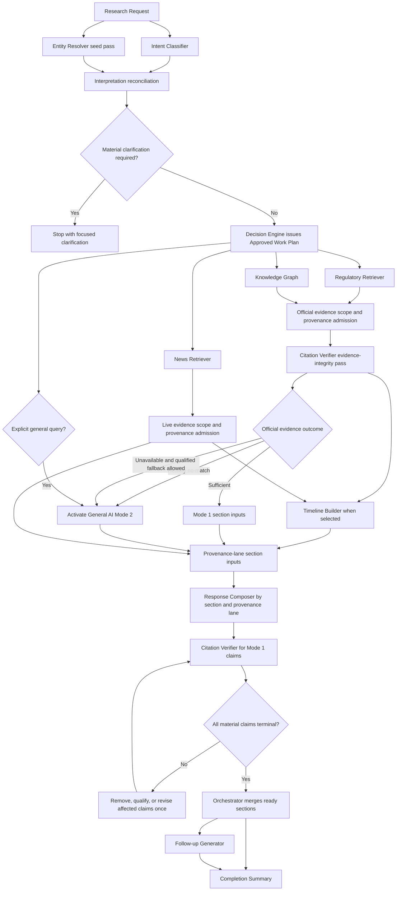
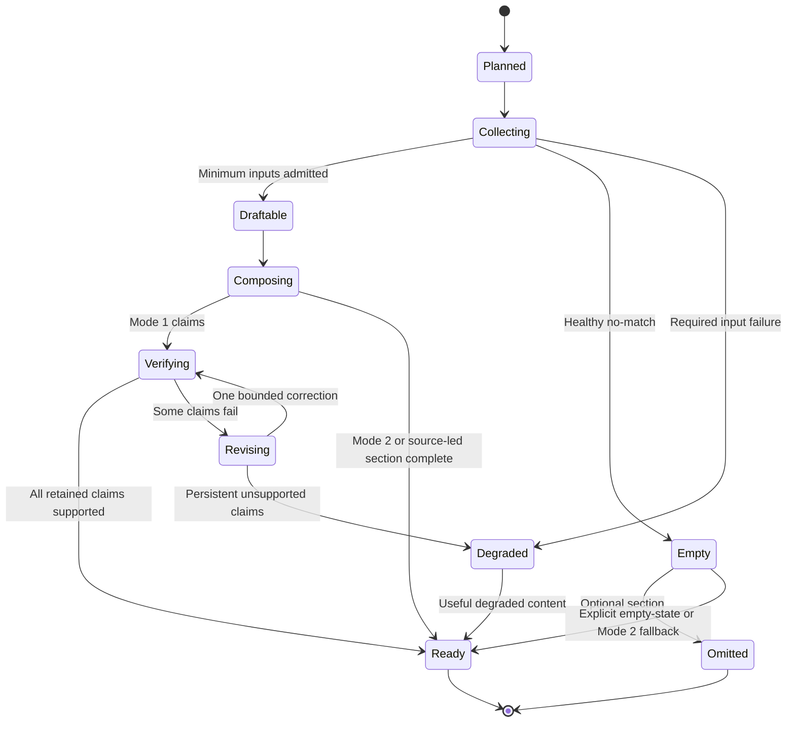
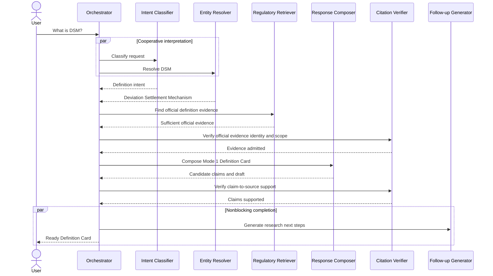
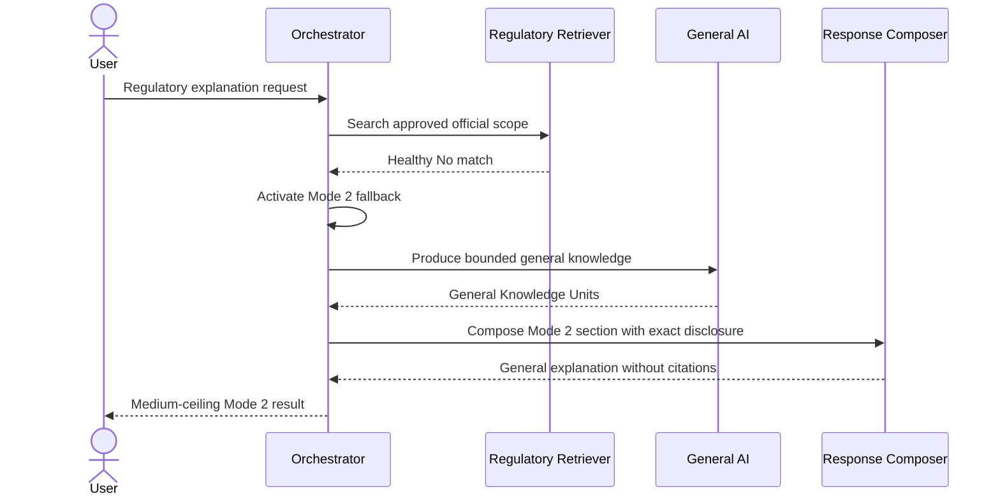
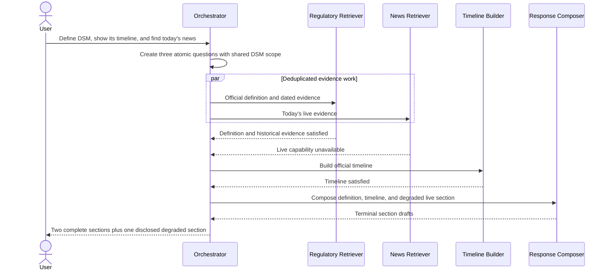
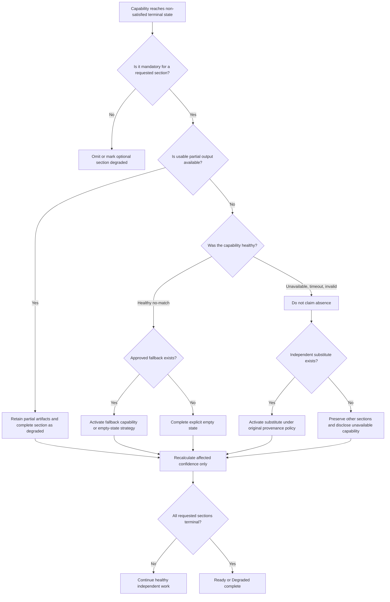
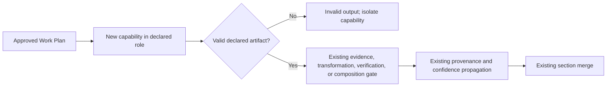

# Ask AI Orchestrator

**Product:** Resolven Regulatory AI  
**Document type:** AI capability cooperation specification  
**Status:** Proposed  
**Audience:** Product, AI, search, regulatory research, design, and engineering  
**Source documents:** `ASK_AI_AUDIT.md`, `ASK_AI_PRODUCT_SPEC.md`, and `ASK_AI_DECISION_ENGINE.md`

---

# Executive summary

The Ask AI Orchestrator defines how selected AI and knowledge capabilities cooperate to turn one research request into a trustworthy, progressively useful result.

It is not backend architecture. It does not define services, APIs, databases, queues, deployment, model prompts, or implementation. It defines the semantic execution contract among these capabilities:

- Intent Classifier;
- Entity Resolver;
- Regulatory Retriever;
- Knowledge Graph;
- Timeline Builder;
- News Retriever;
- General AI (Parallel.ai);
- Citation Verifier;
- Response Composer;
- Follow-up Generator.

The Decision Engine and the Orchestrator have different authority:

| Layer | Authority |
|---|---|
| Decision Engine | Decides intent, scope, eligible knowledge modes, required response strategy, capability plan, evidence policy, and confidence rules. |
| AI Orchestrator | Executes that approved plan, coordinates capability dependencies, enforces budgets and gates, propagates provenance and confidence, merges sections, and reaches a terminal result. |
| Capability | Performs one declared task and returns a bounded, inspectable result. It cannot alter the plan or promote its own authority. |

The Orchestrator's core contract is:

> Every capability contributes through explicit artifacts, terminates with a typed outcome, retains its provenance, and can fail without erasing useful work from other capabilities.

The cooperation model is a directed execution graph, not a chain of one model asking another model what to do. Independent evidence capabilities fan out after query resolution. Transforming capabilities consume admitted evidence. General AI is activated only when its knowledge mode is eligible. Citation verification gates grounded claims, not the entire response. The Response Composer writes within preassigned provenance lanes. The Orchestrator, not the composer, performs the final section merge.

---

# 1. Scope and boundary

## 1.1 In scope

This specification defines:

- capability responsibilities and prohibited behavior;
- mandatory, conditional, supporting, and optional participation;
- execution dependencies and parallel groups;
- semantic communication between capabilities;
- capability and turn stopping rules;
- latency-budget allocation and cutoff behavior;
- partial-failure containment;
- evidence admission;
- confidence propagation;
- provenance propagation;
- section readiness and merging;
- progressive completion;
- General AI activation;
- citation-verification gates;
- follow-up generation;
- future-capability participation.

## 1.2 Out of scope

This document does not define:

- endpoints or request formats;
- network communication;
- services or process boundaries;
- persistence schemas;
- queues or scheduling infrastructure;
- framework or vendor implementation;
- model prompts;
- source-index design;
- concurrency primitives;
- retry libraries;
- code or pseudocode.

Terms such as “artifact,” “packet,” “lane,” “gate,” and “budget” describe semantic cooperation. They are not implementation prescriptions.

## 1.3 Relationship to the three source documents

- The **audit** establishes current defects to avoid: all-branch retrieval, swallowed failures, lost provenance, missing citation verification, one opaque model call, fake streaming, and citation absence as a response kill switch.
- The **product specification** establishes user-visible outcomes: a persistent research workspace, structured entity experiences, three knowledge modes, independent degradation, real progress, and exact restoration.
- The **Decision Engine** establishes deterministic policy: what a query means, which capabilities are eligible, what evidence is sufficient, which mode each section uses, and how confidence is calculated.
- This **Orchestrator specification** establishes cooperation: how the selected capabilities exchange bounded artifacts and reach those outcomes.

---

# 2. Orchestration principles

## 2.1 The plan is authoritative

Capabilities execute only work selected by the Decision Engine. A capability cannot add an unapproved live search, broaden jurisdiction, introduce another entity, or switch knowledge mode.

## 2.2 Evidence capabilities and generative capabilities are different

Regulatory Retriever, Knowledge Graph, and News Retriever provide evidence or evidence-derived facts. General AI provides ungrounded general knowledge. Response Composer transforms admitted material into user-facing sections. These roles cannot be blurred.

## 2.3 Cooperation uses artifacts, not hidden conversational handoffs

Capabilities communicate through inspectable semantic artifacts. One capability does not privately instruct another or pass untraceable prose as evidence.

## 2.4 Provenance never improves through transformation

Summarization, extraction, timeline construction, composition, and verification can preserve or lower authority. They cannot turn a weak source into an official source.

## 2.5 Confidence never increases because prose is fluent

Only stronger evidence coverage, better scope resolution, corroboration, fresher status, or successful verification may improve confidence.

## 2.6 Optional work cannot block core work

Follow-ups, related entities, background context, and nonessential timeline enrichment cannot delay a complete direct answer.

## 2.7 Required capability failure changes completion status, not usefulness

A failed required capability prevents a fully satisfied result for its section. It does not discard healthy evidence, other sections, or safe fallbacks.

## 2.8 Verification is claim-scoped

A failed citation removes or qualifies its claim. It does not invalidate unrelated verified claims or source cards.

## 2.9 Provenance lanes are established before composition

Internal Regulatory Corpus, Live Web Sources, and General AI Knowledge are composed separately. The composer cannot mix them and label the result afterward.

## 2.10 The graph terminates

Every capability has a finite input scope, a stopping condition, and a terminal state. No capability can recursively expand research without a new approved plan.

---

# 3. Orchestration vocabulary

## 3.1 Participation classes

| Class | Meaning |
|---|---|
| Mandatory | Must reach a terminal outcome before the requested section can be fully complete. Failure produces a degraded section or clarification, not an endless wait. |
| Conditional mandatory | Mandatory only when a query, response strategy, or knowledge mode activates it. |
| Supporting | Improves coverage or structure. Its failure lowers only the affected coverage and does not prevent the core answer. |
| Optional | Adds value but cannot affect whether the requested result is complete. It is the first work stopped when the latency budget tightens. |
| Fallback | Activated only after an earlier capability returns a qualifying terminal outcome. |
| Skipped | Deliberately not executed because the plan makes it ineligible. |

“Mandatory” never means “the whole turn must fail if this capability fails.” It means “a fully satisfied version of the relevant section requires this capability.”

## 3.2 Capability terminal states

Every capability ends in exactly one state:

| State | Meaning |
|---|---|
| Satisfied | Required output and quality threshold were met. |
| Partial | Usable output exists, but declared coverage is incomplete. |
| No match | The capability completed healthily and found no qualifying result in the approved scope. |
| Ambiguous | Multiple materially different outputs remain and the capability cannot resolve them within policy. |
| Contradictory | Credible results conflict on a material point. |
| Timed out | The capability reached its allocated hard cutoff. |
| Unavailable | The capability could not perform its role. |
| Invalid output | Output failed its declared semantic or provenance contract. |
| Superseded | A higher-authority or more direct result made further work unnecessary. |
| Cancelled | The user stopped the turn or the Orchestrator deliberately cancelled optional work. |
| Skipped | The capability was not eligible in this plan. |

`No match` is a healthy result. `Unavailable`, `Timed out`, and `Invalid output` are failures. They never share the same fallback wording.

## 3.3 Section terminal states

| State | Meaning |
|---|---|
| Ready | Required claims are verified and presentation requirements are met. |
| Ready without synthesis | Structured evidence is usable, but generated narrative is unavailable or unnecessary. |
| Degraded | Useful content exists, with a disclosed missing capability or evidence gap. |
| Empty by evidence | Healthy eligible searches found no qualifying evidence; the product's empty or Mode 2 policy applies. |
| Omitted | The section is optional and has no useful content. |
| Needs clarification | Material scope ambiguity prevents a trustworthy answer. |
| Cancelled | User stopped before the section became ready. Already ready artifacts remain available. |

---

# 4. Capability roster and authority

## 4.1 Master capability table

| Capability | Sole authority | Cannot decide | Starts when | Stops when |
|---|---|---|---|---|
| Intent Classifier | Propose intent candidates, atomic questions, temporal cues, audience and output cues | Final routing, knowledge mode, answer confidence | Every research query | Intent candidates and decomposition reach the interpretation contract, or ambiguity is terminal |
| Entity Resolver | Canonicalize mentions, aliases, acronyms, entity types, jurisdiction-compatible candidates, and relationships needed for scope | Legal applicability, factual truth, knowledge mode | Entity mentions, pronouns, selected objects, or entity-dependent intent exist | Required entities meet threshold, bounded assumption is declared, or clarification is required |
| Regulatory Retriever | Find official-corpus evidence within resolved scope and report healthy no-match versus failure | Legal conclusion, final citation validity, prose | Mode 1 is preferred or official evidence is required | Evidence sufficiency, search exhaustion, approved cutoff, or terminal failure |
| Knowledge Graph | Supply structured relationships, stakeholders, obligations, deadlines, and related entities with backing provenance | Treat an unbacked edge as law, override documents | Requested output benefits from structured relationships | Required relation types are covered, graph scope is exhausted, or terminal state is reached |
| Timeline Builder | Normalize, order, relate, and classify dated evidence into events | Invent missing dates, determine legal force without evidence | Timeline, amendment, entity, deadline, or current-development section is selected | Input cutoff occurs and all admitted events are terminally classified |
| News Retriever | Find current live sources in the approved time, entity, source, and jurisdiction scope | Establish that reporting is legally operative, populate official citations | Live Intelligence is selected | Coverage/diversity threshold, time-scope exhaustion, approved cutoff, or terminal failure |
| General AI (Parallel.ai) | Produce Mode 2 general knowledge within resolved scope | Create official facts, citations, legal applicability, Mode 1 content | Explicit general query, healthy official no-match, or qualified retrieval-unavailable fallback | One bounded answer satisfies requested Mode 2 sections or terminal failure occurs |
| Citation Verifier | Decide whether a cited evidence unit supports a specific Mode 1 claim and whether citation identity is valid | Improve source authority, rewrite unsupported claims as fact | Official evidence is admitted and again when grounded candidate claims exist | Every material grounded claim is verified, rejected, or unresolved |
| Response Composer | Transform approved claims, facts, events, and source material into the selected response cards/sections | Change intent, add knowledge, select mode, upgrade confidence, merge provenance lanes | A section has sufficient admitted inputs or a safe degraded template | All assigned sections are drafted or terminally unavailable |
| Follow-up Generator | Propose distinct research-next-step candidates from resolved scope, coverage gaps, and completed sections | Initiate research, alter current answer, invent entities | Core section outcomes and gaps are known | Three to five eligible, nonduplicate suggestions exist or budget ends |

## 4.2 Authority hierarchy

When capability outputs disagree about a decision:

1. The Decision Engine policy prevails.
2. Explicit user scope prevails over inferred scope.
3. Entity Resolver controls canonical identity, subject to clarification policy.
4. Official evidence controls regulatory facts and legal status.
5. Citation Verifier controls whether a grounded claim may be published.
6. News evidence controls only its live-source observations.
7. General AI controls no official fact.
8. Response Composer controls wording and structure only.
9. Follow-up Generator controls no current-turn content.

---

# 5. Semantic communication contract

## 5.1 Shared artifacts

Capabilities cooperate through the following conceptual artifacts:

| Artifact | Produced by | Consumed by | Purpose |
|---|---|---|---|
| Research Request | User context plus Decision Engine | Intent Classifier, Entity Resolver | Original query, selected objects, active conversation scope, and explicit constraints |
| Interpretation Result | Intent Classifier | Decision Engine, Orchestrator, Entity Resolver | Intent candidates, atomic questions, temporal cues, audience, requested form, and interpretation confidence |
| Resolution Set | Entity Resolver | Decision Engine and all entity-dependent capabilities | Canonical entities, aliases, jurisdiction, stakeholder scope, ambiguity, and resolution confidence |
| Approved Work Plan | Decision Engine | Orchestrator and every selected capability | Capability participation class, dependencies, section targets, mode eligibility, time scope, and budget profile |
| Evidence Unit | Regulatory Retriever or News Retriever | Citation Verifier, Timeline Builder, Response Composer | One inspectable source fragment or live source with provenance, scope, time, relevance, and quality signals |
| Structured Fact | Knowledge Graph | Timeline Builder, Citation Verifier, Response Composer | A typed relationship or fact with backing evidence lineage and extraction confidence |
| Timeline Event | Timeline Builder | Response Composer and Citation Verifier | A dated event with event type, date semantics, relationships, provenance ancestry, and completeness |
| General Knowledge Unit | General AI | Response Composer | Mode 2 material, explicitly without official citation identity |
| Candidate Claim | Response Composer | Citation Verifier | One material claim, assigned section, assigned mode, and referenced supporting evidence |
| Verification Result | Citation Verifier | Response Composer and Orchestrator | Supported, partially supported, unsupported, contradictory, or unverifiable, with reasons |
| Section Draft | Response Composer | Orchestrator | One provenance-pure response section with claims, cards, confidence inputs, and gaps |
| Follow-up Candidates | Follow-up Generator | Orchestrator | Ranked, typed next questions with expected output form |
| Completion Summary | Orchestrator | Product experience | Section outcomes, modes, confidence, source coverage, assumptions, and degraded capabilities |

## 5.2 Required metadata on contributed knowledge

Any artifact that contributes factual content carries:

- originating capability;
- approved atomic question and section;
- resolved entity and jurisdiction scope;
- time scope and date semantics;
- provenance class;
- source identity where a source exists;
- publication, issue, effective, event, and retrieval dates as applicable;
- direct or derived status;
- relevance and coverage signals;
- transformation ancestry;
- capability terminal status;
- unresolved conflicts or warnings.

General AI knowledge carries no fabricated source identity. Its provenance is `General AI Knowledge`.

## 5.3 Communication prohibitions

Capabilities must not:

- pass unstructured generated prose as if it were evidence;
- strip source identity before handing material downstream;
- silently replace a resolved entity;
- silently broaden time or jurisdiction;
- assign themselves a final knowledge mode;
- assign final answer confidence;
- attach an internal citation to General AI or live-only content;
- treat another capability's failure as a healthy no-match;
- issue hidden research tasks outside the approved plan;
- ask one another to make policy decisions.

## 5.4 Scope echo

Every capability repeats the scope it actually used. The Orchestrator compares this with the approved scope.

Output outside approved scope is:

- excluded when materially different;
- retained only as a visibly labeled adjacent discovery when the plan permits discovery;
- never used to answer the requested legal or compliance question.

---

# 6. Overall execution graph



Only branches selected in the Approved Work Plan execute. The diagram shows all possible slots, not an all-capabilities default.

---

# 7. Execution phases

## 7.1 Phase 0 — Establish immutable request scope

The Orchestrator begins with:

- original user wording;
- selected document, citation, entity, card, or passage;
- active conversation scope;
- user time zone;
- Decision Engine policy version;
- user-requested output and depth.

The original request remains immutable. Later interpretation creates explicit normalized scope rather than rewriting the user's words.

## 7.2 Phase 1 — Cooperative interpretation

The Intent Classifier and Entity Resolver begin together because each can reduce the other's ambiguity:

- Intent Classifier identifies likely goals, atomic questions, time cues, and entity-like mentions.
- Entity Resolver tests those mentions against canonical entities, aliases, selected context, and jurisdiction.

They perform one bounded reconciliation:

- resolved entity types may disambiguate intent;
- intent may determine which entity interpretation is material;
- time/status cues remain Decision Engine inputs, not freeform assumptions.

The reconciliation does not loop indefinitely. After one exchange:

- proceed if policy thresholds are met;
- proceed with a visible bounded assumption if allowed;
- stop for one focused clarification if ambiguity is material.

## 7.3 Phase 2 — Approve the work plan

The Decision Engine assigns:

- atomic questions;
- shared and clause-specific scope;
- response sections;
- eligible knowledge modes;
- capability participation class;
- capability dependencies;
- provenance lanes;
- confidence gates;
- latency profile;
- fallback transitions.

The Orchestrator cannot add capabilities merely because they are available.

## 7.4 Phase 3 — Evidence fan-out

Eligible independent evidence capabilities execute in parallel after required entity scope is resolved:

- Regulatory Retriever;
- Knowledge Graph;
- News Retriever.

Parallel execution is allowed only when:

- all branches use the same approved scope;
- one branch does not depend on another's result;
- provenance remains independent;
- each branch has its own terminal state and budget.

Evidence may be progressively admitted. A fast official definition can become ready while graph, timeline, or live work continues.

## 7.5 Phase 4 — Evidence admission and mode activation

The Orchestrator groups results by atomic question and provenance lane, then applies the Decision Engine's evidence-sufficiency policy.

For official evidence:

- official units pass the Citation Verifier's evidence-integrity gate before becoming Mode 1 composition inputs;
- sufficient evidence activates Mode 1 inputs;
- partial evidence creates a bounded Mode 1 section plus explicit gaps;
- healthy no-match permits the prescribed Mode 2 fallback;
- unavailable retrieval does not permit “no documents found” wording;
- contradictory evidence creates a conflict set, not an averaged claim.

General AI begins:

- immediately after interpretation for an explicitly general, non-regulatory question;
- only after a healthy official no-match for a normal regulatory fallback;
- after an official-retrieval failure only when the Decision Engine allows a qualified educational fallback;
- never merely to race the official search.

## 7.6 Phase 5 — Structured transformations

Timeline Builder runs when selected and sufficient date-bearing inputs are available. It may begin incrementally, but it finalizes only after the section's evidence-input cutoff.

Knowledge Graph facts and timeline events remain derived artifacts:

- they retain source ancestry;
- their confidence cannot exceed critical source inputs;
- unsupported graph relationships remain discovery hints;
- inferred dates are marked as inferred;
- live and internal events retain separate provenance.

## 7.7 Phase 6 — Section composition

The Orchestrator provides the Response Composer with one section assignment at a time:

- one atomic question;
- one response-card blueprint;
- one knowledge mode;
- one provenance lane;
- admitted evidence or General AI units;
- material assumptions;
- confidence ceiling;
- prohibited claims.

The composer cannot see unrelated provenance as a free source of facts. It may receive a cross-section outline for coherence, but factual inputs remain lane-scoped.

## 7.8 Phase 7 — Verification

Citation Verifier has two passes:

1. **Evidence-integrity pass:** confirm that an official evidence unit has an inspectable identity, suitable provenance, relevant scope, and usable excerpt.
2. **Claim-support pass:** determine whether each material Mode 1 claim is supported by its cited evidence.

Mode 1 claims cannot become ready until the claim-support pass is terminal.

Rejected claims are:

- removed;
- narrowed to what the evidence supports;
- marked unresolved;
- or, when policy permits and the content remains useful, moved into a separate Mode 2 section.

There is at most one bounded correction pass for an affected claim. Persistent failure becomes a degraded result, not a model-verifier loop.

## 7.9 Phase 8 — Deterministic merge

The Orchestrator merges terminal sections according to the response blueprint. It does not ask the composer to write one monolithic cross-provenance answer.

The merge:

- preserves atomic-question boundaries;
- orders primary sections before supporting sections;
- keeps provenance lanes separate;
- consolidates duplicates without losing lineage;
- retains conflicts visibly;
- applies section and overall confidence;
- attaches section-specific failure notices;
- includes a coverage summary.

## 7.10 Phase 9 — Follow-ups and completion

Follow-up Generator receives:

- resolved scope;
- answered intents;
- gaps and assumptions;
- section confidence;
- available related entities;
- capability failures;
- prior suggestions in the workspace.

It never receives authority to initiate new retrieval. It proposes three to five next steps when time permits.

The turn completes when every mandatory section has a terminal state and all ready Mode 1 material claims are verified or removed.

---

# 8. Dependency and parallelization matrix

| Capability | Hard prerequisites | May execute in parallel with | Must wait for |
|---|---|---|---|
| Intent Classifier | Research Request | Entity Resolver seed pass | Nothing |
| Entity Resolver | Research Request and entity-like mentions/context | Intent Classifier | Nothing for seed pass; reconciliation uses classifier result |
| Regulatory Retriever | Approved intent, entity/scope sufficient for the query | Knowledge Graph, News Retriever | Material entity/jurisdiction resolution |
| Knowledge Graph | Approved relationship types and resolved entities | Regulatory Retriever, News Retriever | Material entity resolution |
| News Retriever | Approved live intent, entity/time/source scope | Regulatory Retriever, Knowledge Graph | Material entity and normalized time scope |
| Timeline Builder | Date-bearing evidence or structured facts | Continued optional retrieval after minimum inputs | Entity resolution and at least one admissible dated input |
| General AI | Explicit Mode 2 query or qualifying official-evidence outcome | Optional follow-up preparation only | Official search terminal outcome for regulatory fallback |
| Citation Verifier: evidence pass | Official evidence units | Other evidence branches and timeline construction | Individual evidence units only |
| Response Composer | Section blueprint and sufficient admitted inputs | Other independent section composers | Mode and provenance lane assignment |
| Citation Verifier: claim pass | Mode 1 candidate claims and cited evidence | Composition of other sections | Candidate claim |
| Follow-up Generator | Core outcomes, gaps, and resolved scope | Final noncritical merge work | At least one core section terminal |

## 8.1 Forbidden parallelism

The following work must not race:

- General AI knowledge against an unfinished official search for the purpose of choosing which answer wins.
- Entity-dependent retrieval against materially unresolved entities.
- Mode 1 publication against unfinished citation verification.
- Final timeline ordering against an open required date-evidence window.
- Overall confidence finalization against nonterminal critical sections.
- Follow-up publication before the engine knows which questions were actually answered.

---

# 9. Mandatory and optional execution by research pattern

Legend: **M** = mandatory, **C** = conditional mandatory, **S** = supporting, **O** = optional, **—** = skipped.

| Query pattern | Intent | Entity | Regulatory | Graph | Timeline | News | General AI | Citation | Composer | Follow-up |
|---|---:|---:|---:|---:|---:|---:|---:|---:|---:|---:|
| Bare entity | M | M | M | S | S | O | C | M for grounded claims | M | O |
| Definition | M | M | S | — | — | — | C | M for grounded claims | M | O |
| Regulation lookup | M | M | M | S | S for status lineage | — | C | M | M | O |
| Compliance question | M | M | M | S | C for deadlines/history | C for explicit current | C after evidence gate | M | M | O |
| Deadline | M | M | M | S | M | C for latest/current | C after evidence gate | M | M | O |
| Stakeholder | M | M | M | S | — | — | C after evidence gate | M | M | O |
| Comparison | M | M | M | S | C for versions/history | C for current comparison | C per unsupported nonlegal context | M | M | O |
| News/latest | M | M | S | S | C | M | C for background only | M for Mode 1 claims | M | O |
| Timeline | M | M | M | S | M | C for current tail | C after evidence gate | M | M | O |
| Amendment | M | M | M | S | M | C for current announcement | C after evidence gate | M | M | O |
| Consultation | M | M | M | S | C | M for open/current discovery | C for background | M for official claims | M | O |
| Selected-document summary | M | C | M for document access | — | C if dates matter | — | — | M | M | O |
| Explicit general question | M | C | — unless regulatory entity resolves | — | — | C for explicit current | M | — | M | O |
| Multi-part research | M | M per part | Per atomic plan | Per atomic plan | Per atomic plan | Per time-sensitive part | Per evidence gate | Per Mode 1 claim | M | O |

## 9.1 Meaning of mandatory in this table

- Intent Classifier is mandatory for all research turns.
- Entity Resolver is mandatory when the answer depends on entity identity; it may be skipped for a clearly non-entity general request.
- Regulatory Retriever is mandatory for a fully grounded regulatory answer.
- Citation Verifier is mandatory for every generated Mode 1 material claim.
- Response Composer is mandatory for a synthesized answer, but evidence-only results can complete without it.
- Follow-up Generator is always optional for turn completion.

---

# 10. Capability-specific cooperation rules

## 10.1 Intent Classifier

### Receives

- original query;
- interaction context;
- bounded conversation context;
- known selected objects;
- available intent taxonomy.

### Contributes

- primary and secondary intent candidates;
- atomic-question boundaries;
- intent confidence and competitors;
- entity-like mentions;
- time/status cues;
- audience and response-form modifiers;
- ambiguity reasons.

### Cooperation rules

- It proposes; the Decision Engine decides.
- It must not treat classifier confidence as answer confidence.
- It shares entity mentions with Entity Resolver.
- Resolved entity types may refine its ranking once.
- It does not classify capability failures or evidence sufficiency.

### Stop rule

Stop when the interpretation contract is complete, or when material ambiguity is explicitly identified. It does not continue classifying during retrieval unless the user changes the request.

## 10.2 Entity Resolver

### Receives

- mentions and pronouns;
- selected entity/document context;
- intent candidates;
- jurisdiction and conversation scope;
- approved entity taxonomy and aliases.

### Contributes

- canonical identity;
- type;
- acronym expansion and aliases;
- jurisdiction compatibility;
- regulator/document-family associations used for expansion;
- resolution confidence;
- alternatives and clarification need.

### Cooperation rules

- Exact canonical/alias matches outrank fuzzy inference.
- It may use intent to determine which ambiguity is material.
- It cannot infer legal applicability from a relationship.
- Every downstream capability uses canonical identifiers and retains the user's original mention.
- A downstream conflicting identity sends the turn back to the Decision Engine; it does not silently replace the entity.

### Stop rule

Stop when every material entity reaches the Decision Engine threshold, a bounded assumption is allowed, or clarification is required.

## 10.3 Regulatory Retriever

### Receives

- atomic question;
- resolved entities and jurisdiction;
- time and status semantics;
- requested evidence types;
- query expansions approved by the Decision Engine;
- evidence sufficiency target.

### Contributes

- official Evidence Units;
- healthy coverage description;
- source authority and status signals;
- relevance and scope-fit signals;
- source/version relationships known from the corpus;
- explicit branch terminal state.

### Cooperation rules

- It searches only approved scope.
- It distinguishes no qualifying evidence from inability to search.
- It does not manufacture an answer.
- It does not rank a source as legally controlling merely because it is textually similar.
- It exposes enough result diversity for agreement and conflict assessment.
- Duplicate fragments from multiple search methods are one evidence unit with multiple match reasons, not multiple sources.

### Stop rule

Stop when the section-specific evidence target is met, approved search scope is exhausted, or the branch budget reaches cutoff. For compliance/current-status work, simple top-result sufficiency is not enough; legal status and material-claim coverage must be assessed.

## 10.4 Knowledge Graph

### Receives

- canonical entities;
- allowed relationship types;
- stakeholder/time/jurisdiction scope;
- section targets.

### Contributes

- structured facts and relationships;
- backing evidence ancestry;
- extraction confidence;
- relationship type;
- scope and date qualifiers;
- coverage gaps.

### Cooperation rules

- A graph fact without inspectable official backing is a discovery hint.
- A graph edge cannot override a contradictory official document.
- Duplicate relationships with different dates or evidence remain distinct.
- The graph may help the Regulatory Retriever expand a document search only when that expansion is already permitted.
- When graph output is unavailable, document evidence can still populate prose and cards.

### Stop rule

Stop when required relationship types are sufficiently covered, the approved neighborhood is exhausted, or its budget ends. It may not recursively traverse unrelated entities.

## 10.5 Timeline Builder

### Receives

- admitted dated Evidence Units;
- structured graph facts;
- live events when the section includes a Mode 3 tail;
- entity, time, event-type, and materiality scope.

### Contributes

- normalized Timeline Events;
- date type and certainty;
- event relationships;
- official/live provenance ancestry;
- missing-period and conflict notes;
- event-level confidence inputs.

### Cooperation rules

- Issue, effective, deadline, and publication dates remain different.
- Official and live events can share a chronology but not a provenance label.
- An inferred order is marked as inferred.
- If two sources conflict on a date, both remain visible until resolved.
- It does not write the timeline narrative; Response Composer does.

### Stop rule

For a Timeline primary intent, stop after the required evidence window closes and all material events are classified. For a supporting timeline, stop at a coherent minimum timeline or the optional cutoff.

## 10.6 News Retriever

### Receives

- canonical entities and aliases;
- normalized live time window;
- approved source classes;
- jurisdiction;
- live intent and section target.

### Contributes

- live Evidence Units;
- publisher and source type;
- publication and retrieval time;
- direct link identity;
- relevance reason;
- source diversity and freshness coverage;
- duplicate relationship to an official source when known.

### Cooperation rules

- It never promotes reporting into the official corpus.
- It distinguishes official live notices from journalism while retaining both as Mode 3.
- It reports healthy no-match separately from outage.
- Duplicate reporting of the same event is consolidated for presentation but retained for source agreement.
- An official live document may be handed to the Regulatory lane only through the Decision Engine's official-source admission policy; the live observation remains Mode 3.

### Stop rule

Stop when the approved time range and source policy have adequate event and source diversity, the search space is exhausted, or budget ends.

## 10.7 General AI (Parallel.ai)

### Receives

- resolved question and scope;
- assigned Mode 2 sections;
- required disclosure condition;
- prohibited claim types;
- audience and output form;
- explicit uncertainty or unavailable-verification notice.

### Contributes

- General Knowledge Units;
- scope assumptions;
- uncertainty statements;
- no official citation identity.

### Cooperation rules

- It is a knowledge source only for Mode 2.
- It does not compete with retrieved official evidence.
- It cannot cite or imitate official documents that were not retrieved.
- It cannot fill binding obligation, deadline, applicability, or current legal-status fields as established facts.
- When official retrieval is unavailable, it must not say that no documents were found.
- Its model self-confidence is ignored.
- If Parallel.ai also performs hidden web research, that material cannot become Mode 3 unless source provenance is explicitly retained and admitted under the News Retriever contract.

### Stop rule

One bounded generation attempt per assigned section set. An invalid or unavailable result produces a structured fallback; it does not trigger repeated unbounded generations.

## 10.8 Citation Verifier

### Receives

- official Evidence Units and their identity;
- Mode 1 Candidate Claims;
- scope and time requirements;
- claim-to-source references.

### Contributes

- evidence identity status;
- support status per claim;
- supported claim boundary;
- contradiction notes;
- citation quality and freshness inputs;
- correction reason.

### Cooperation rules

- It verifies support, not writing style.
- A valid source identity does not imply claim support.
- A citation inventory is not verification.
- It can lower support confidence or reject a claim; it cannot improve authority beyond the source.
- It treats each material claim independently.
- It does not verify General AI claims as Mode 1.
- Live-source validation stays in its provenance lane unless the source qualifies as official evidence.

### Stop rule

Stop when every material grounded claim is supported, partially supported, unsupported, contradictory, or unverifiable. After one bounded correction pass, unresolved claims are removed or disclosed.

## 10.9 Response Composer

### Receives

- response blueprint;
- one provenance lane per section assignment;
- admitted evidence, structured facts, timeline events, or General Knowledge Units;
- confidence ceiling;
- required disclosures;
- unresolved assumptions and gaps;
- audience/style modifier.

### Contributes

- Candidate Claims;
- Section Drafts;
- structured card content;
- explicit unknown fields;
- concise explanations of evidence and limitations.

### Cooperation rules

- It may transform language, not knowledge mode.
- Every material grounded claim references admitted evidence before verification.
- It cannot attach citations to Mode 2 content.
- It cannot state a live report as operative law.
- It cannot fill missing comparison, obligation, deadline, or status fields through plausible completion.
- It drafts separate sections for separate modes.
- It does not perform the final merge.

### Stop rule

Stop when all assigned sections are drafted within their blueprints, or when required inputs are terminally unavailable. It may return `Ready without synthesis` when structured evidence already satisfies the user.

## 10.10 Follow-up Generator

### Receives

- resolved scope;
- answer coverage;
- confidence and gaps;
- completed intents;
- related entities;
- prior questions and suggestions;
- degraded capabilities.

### Contributes

- three to five distinct, typed suggestions;
- expected response strategy for each;
- reason the suggestion advances research.

### Cooperation rules

- It cannot repeat answered questions.
- It prioritizes evidence-deepening when confidence is below High.
- It proposes manual search or clarification after retrieval failure.
- It does not claim that an optional suggested capability is currently available unless declared.
- It cannot delay completion.

### Stop rule

Stop when the suggestion set satisfies diversity and safety rules or its optional budget ends. Zero suggestions is a valid terminal outcome.

---

# 11. Stopping model

## 11.1 Capability stopping hierarchy

A capability stops at the first applicable condition:

1. User cancellation.
2. Material clarification is required.
3. Required output meets sufficiency.
4. Approved scope is exhausted.
5. A higher-authority result supersedes optional work.
6. Soft cutoff converts remaining optional work to omitted or background continuation.
7. Hard cutoff produces `Timed out`.
8. Unavailable or invalid-output state is terminal.

## 11.2 Evidence sufficiency stopping

Evidence collection stops by section, not by a global top-result count.

| Section type | Minimum stopping condition |
|---|---|
| Definition | Direct definition evidence or healthy exhaustion |
| Regulation lookup | Canonical document/status evidence or healthy exhaustion |
| Compliance | Material applicability, obligation, trigger, date, and current-status fields terminal, even if some are `Not established` |
| Deadline | Date, date type, responsible stakeholder, status, and basis terminal |
| Comparison | Both operands terminal for every material comparison dimension |
| Timeline | Required time range processed and material event types terminal |
| News | Approved time window and minimum source/event diversity covered, or healthy exhaustion |
| Entity page | Core overview, definition, and official-document sections terminal; supporting sections may complete independently |

`Terminal` does not require a positive fact. A verified `Not established from available official evidence` is a valid terminal field.

## 11.3 Turn stopping

The turn may complete when:

- every core requested section is Ready, Ready without synthesis, Degraded, Empty by evidence, Omitted by policy, or Needs clarification;
- every retained Mode 1 material claim has a terminal verification result;
- General AI disclosure is attached where required;
- provenance lanes are assigned;
- confidence is final for terminal sections;
- no required capability remains merely queued or active.

Follow-up generation, optional related entities, and optional live enrichment do not block core completion.

## 11.4 User stop

When the user stops generation:

- no new capability work is started;
- active optional work becomes Cancelled;
- active mandatory work may stop at its next safe artifact boundary;
- already admitted evidence remains;
- already verified sections remain;
- unverified grounded prose is withheld;
- the turn completes as Cancelled or Degraded with preserved useful results.

---

# 12. Latency-budget model

## 12.1 Purpose

Latency budgets determine when to stop waiting for additional capability value. They never authorize false confidence, skipped provenance, or publication of unverified grounded claims.

## 12.2 Budget hierarchy

Each plan has:

1. **First-trustworthy-result target** — when the first resolved entity, official source, verified definition, or live result should be revealable.
2. **Core-result target** — when the primary requested section should normally be terminal.
3. **Full-result soft cutoff** — optional work may stop or continue in the background.
4. **Hard turn cutoff** — active capabilities become timed out and the turn completes with available material.
5. **Reserved verification budget** — protected time for grounded claim verification.

## 12.3 Product latency profiles

These are orchestration targets, not transport or infrastructure settings.

| Profile | Typical work | First trustworthy result | Core-result target | Full soft cutoff | Hard cutoff |
|---|---|---:|---:|---:|---:|
| Fast exact | Acronym, definition, exact regulation | 1.0 s | 3.5 s | 5 s | 7 s |
| Focused grounded | Compliance, deadline, stakeholder, document explanation | 1.5 s | 7 s | 10 s | 14 s |
| Live combined | Latest, news, open consultation | 1.5 s | 8 s | 12 s | 16 s |
| Deep structured | Timeline, amendment lineage, comparison | 2 s | 12 s | 18 s | 25 s |
| Composite research | Multi-part Research Report | 2 s | 15 s | 22 s | 30 s |

If product evidence shows these targets are unrealistic for a capability class, the profile may be versioned. The orchestration behavior at each cutoff remains the same.

## 12.4 Budget allocation

The Orchestrator reserves the turn budget conceptually:

| Work class | Default share | Rule |
|---|---:|---|
| Interpretation and resolution | 15% | Cannot consume the whole turn; ambiguity transitions to clarification |
| Primary evidence acquisition | 40% | Receives priority over optional enrichment |
| Structured transformation | 15% | Used only when timeline/comparison/entity structure is selected |
| Composition | 15% | May be bypassed with evidence-only output |
| Verification | 15% | Reserved for Mode 1; cannot be borrowed by optional work |

Parallel branches share elapsed time but have independent cutoffs. Shares express priority, not sequential duration.

## 12.5 Soft-cutoff behavior

At the soft cutoff:

- do not start new optional capabilities;
- stop accepting optional scope expansion;
- complete any core section already draftable;
- mark slow supporting sections degraded or continue them only under an explicit background-continuation experience;
- preserve progress and evidence already available;
- start no additional General AI embellishment.

## 12.6 Hard-cutoff behavior

At the hard cutoff:

- every active capability receives `Timed out`;
- verified and structured outputs are retained;
- unverified Mode 1 prose is withheld;
- section failures are isolated;
- the turn becomes Degraded complete;
- capability-specific retry remains available.

## 12.7 Budget priority

When budget pressure occurs, stop work in this order:

1. Follow-up Generator.
2. Optional related-entity expansion.
3. Optional news on a non-live query.
4. Optional timeline enrichment.
5. Supporting graph enrichment already replaceable by documents.
6. Nonessential narrative polish.
7. Supporting evidence beyond sufficiency.

Do not sacrifice:

- material entity resolution;
- required official retrieval;
- primary live retrieval for an explicit live query;
- citation verification for retained Mode 1 claims;
- required disclosures;
- provenance separation.

## 12.8 Late results

Before turn completion, a late result may update a collecting section if it preserves its scope and provenance.

After completion:

- it cannot silently rewrite the historical answer;
- it may appear as an available update;
- applying it creates a refreshed result or new turn/version.

---

# 13. Partial-failure model

## 13.1 Failure containment boundary

The smallest failure boundary is:

> capability × atomic question × response section × provenance lane

A News Retriever failure for the `Latest News` section does not lower confidence in a verified historical definition. A graph failure for stakeholder relationships does not erase official documents. A citation failure for one obligation does not erase other obligations.

## 13.2 Partial-failure decision table

| Failed capability | Immediate effect | Cooperative fallback | Result status |
|---|---|---|---|
| Intent Classifier | No reliable intent plan | Use explicit interaction action when unambiguous; otherwise clarify | Needs clarification or Degraded |
| Entity Resolver | Entity-dependent work cannot safely start | Present candidates; allow general non-specific explanation only when safe | Needs clarification |
| Regulatory Retriever: healthy no-match | No Mode 1 evidence for affected scope | Activate General AI with exact no-documents disclosure | Empty by evidence → Mode 2 |
| Regulatory Retriever: unavailable/timed out | Existence of official evidence is unknown | Use saved/selected evidence, manual search, and qualified General AI if allowed | Degraded |
| Knowledge Graph | Structured relationships incomplete | Derive supported facts from official documents; omit unsupported graph cards | Degraded section only |
| Timeline Builder | No trustworthy structured chronology | Show verified date cards or source list; omit narrative timeline | Degraded or Omitted |
| News Retriever: healthy no-match | No live evidence in disclosed period | Hide optional section or state no verified live updates when explicitly requested | Empty by evidence |
| News Retriever: unavailable | Live coverage unknown | Continue internal corpus; show refresh unavailable | Degraded live section |
| General AI | Mode 2 prose unavailable | Show interpretation, no-match state, manual search, related entities, or evidence cards | Ready without synthesis or Degraded |
| Citation Verifier: one claim | Claim cannot publish as grounded | Narrow/remove claim or move separate general orientation if allowed | Degraded claim/section |
| Citation Verifier: all claims | Grounded narrative unavailable | Show official source cards/excerpts; optional separate Mode 2 | Ready without synthesis |
| Response Composer | Narrative/cards cannot be generated | Present verified evidence, structured facts, and timeline events directly | Ready without synthesis |
| Follow-up Generator | No suggestions | Omit suggestions | Core result unchanged |

## 13.3 Failure propagation prohibition

A failure may propagate only through declared dependencies.

Examples:

- Entity Resolver failure may block entity-dependent retrieval.
- Regulatory Retriever failure may block Mode 1 composition and verification.
- Response Composer failure does not invalidate retrieved evidence.
- Follow-up failure propagates nowhere.
- News failure affects no internal-corpus section.
- Graph failure affects no fact independently established by official documents.

## 13.4 Retries

The Orchestrator permits one bounded retry or fallback transition when:

- the capability reports a transient failure;
- remaining budget is sufficient;
- retry does not delay a ready core section;
- user cancellation has not occurred.

Citation correction receives one bounded revision pass. General AI does not repeatedly regenerate until it produces a preferred answer. Persistent failure becomes a terminal degraded state.

---

# 14. Confidence propagation

## 14.1 Canonical authority

The Decision Engine owns the final confidence calculation. Capabilities contribute evidence-quality signals; they do not award final `High`, `Medium`, `Low`, or `Unknown` labels.

## 14.2 Confidence dimensions in cooperation

| Dimension | Primary contributors | Orchestrator responsibility |
|---|---|---|
| Evidence authority | Regulatory Retriever, News Retriever, source policy | Preserve source class and prevent transformation upgrades |
| Retrieval relevance | Regulatory Retriever, News Retriever | Reconcile with resolved scope and exclude out-of-scope evidence |
| Claim coverage | Citation Verifier | Map evidence support to complete material claims |
| Source agreement | Regulatory Retriever, News Retriever, Knowledge Graph | Preserve independent sources and expose conflicts |
| Freshness/status validity | Regulatory Retriever, News Retriever, Timeline Builder | Keep date semantics distinct and apply current-query requirements |
| Scope resolution | Entity Resolver and Decision Engine | Propagate entity/jurisdiction confidence as a cap |

## 14.3 Transformation rule

For every derived artifact:

> Its confidence cannot exceed the weakest critical input needed for that artifact.

Examples:

- A graph obligation extracted with 0.78 certainty from a High-authority source cannot exceed the extraction limit until verified against the source.
- A timeline event with a certain publication date but uncertain effective date has separate confidence for each date field.
- A fluent summary of Medium-confidence evidence remains at most Medium.
- Corroboration may improve source-agreement and coverage scores, but cannot improve the legal authority of a non-official source.

## 14.4 Scope caps

| Scope condition | Maximum affected confidence |
|---|---|
| Entity resolution at least 0.85 | No additional cap |
| Entity resolution 0.70–0.84 with bounded assumption | Medium |
| Material entity below 0.70 | Unknown for entity-dependent claims |
| Jurisdiction materially unresolved | Unknown for applicability and obligations |
| Time meaning inferred but noncritical | Apply Decision Engine date penalty |
| Current-status check unavailable | Low or Unknown for current-status claims |

## 14.5 Capability-status propagation

| Capability state | Confidence behavior |
|---|---|
| Satisfied | Contribute quality dimensions normally |
| Partial | Reduce coverage only for missing fields/claims |
| No match | No evidence score; may activate Mode 2 ceiling |
| Ambiguous | Cap affected scope; may require Unknown |
| Contradictory | Apply conflict penalty and prohibit High |
| Timed out/unavailable | Apply required-capability penalty only to dependent sections |
| Invalid output | Exclude output entirely |
| Superseded/skipped/cancelled optional | No confidence penalty to unaffected core sections |

## 14.6 Citation verification propagation

- `Supported` preserves the evidence-based claim score.
- `Partially supported` narrows the claim or lowers claim coverage.
- `Unsupported` excludes the claim from Mode 1.
- `Contradictory` retains the conflict and applies the Decision Engine penalty.
- `Unverifiable` makes the claim Unknown as grounded content.

The Citation Verifier cannot raise confidence merely because a source exists.

## 14.7 General AI propagation

General AI material:

- begins with Evidence Class E;
- has no retrieval-citation contribution;
- is capped at Medium after a healthy official no-match;
- is capped at Low when official retrieval was unavailable;
- becomes Unknown for unresolved legal applicability, deadline, or current-status claims;
- cannot improve a Mode 1 section's confidence.

## 14.8 Section and overall propagation

The Orchestrator sends terminal claim scores to the Decision Engine's established aggregation:

- section score: 70% coverage-weighted mean plus 30% lowest material claim;
- overall score: 70% importance-weighted section mean plus 30% lowest critical section;
- strict intents cannot exceed their lowest material claim;
- multi-mode confidence remains visible by section.

Optional-section failure does not lower overall confidence unless that section was material to the user's explicit request.

---

# 15. Provenance propagation

## 15.1 Provenance lineage

Every factual artifact carries an immutable lineage:

```text
origin → retrieval or generation → transformations → claim → section
```

The lineage records:

- original source class;
- source identity, when one exists;
- capability transformations;
- whether content is direct, extracted, inferred, summarized, or generated;
- knowledge mode;
- time and scope;
- verification status.

## 15.2 Provenance lanes

The Orchestrator maintains independent lanes:

| Lane | Eligible origins | Citation/source treatment |
|---|---|---|
| Internal Regulatory Corpus | Official indexed documents and verified internal regulatory facts | Claim-linked official citations |
| Live Web Sources | Current approved live sources | Live source links, publisher, publication time, retrieval time |
| General AI Knowledge | Parallel.ai general knowledge | No citation cards; mandatory disclosure when triggered by no official evidence |
| Future user-provided | Uploaded or selected user content | User-provided label and document identity |
| Future enterprise | Company policy and enterprise knowledge | Enterprise provenance, separate from official law |
| Future personal context | Email, calendar, personal operational data | Personal context label, never legal authority |

## 15.3 Propagation rules

1. A direct quotation retains source provenance.
2. An extracted fact retains source provenance plus extraction status.
3. A graph fact retains every backing source and graph-transformation status.
4. A timeline event retains the provenance of each supporting event fact.
5. A summary retains the union of supporting source lineage.
6. A claim with mixed official and live support remains decomposed into official-status and live-observation claims.
7. A claim containing unsupported General AI inference is Mode 2 unless it can be split.
8. Response composition never changes origin.
9. Verification changes support status, not origin.
10. Merging changes placement, not lineage.

## 15.4 Provenance contamination rule

If a candidate claim cannot be separated into independently supported provenance components, use the least authoritative contributing provenance for the whole claim.

Examples:

- “CERC issued the amendment on 10 July” from an official notice may be Mode 1.
- “The amendment will significantly increase market volatility” from General AI inference is Mode 2.
- These may appear next to each other only as separate claims or sections.

## 15.5 Duplicate internal/live events

When the same event appears in both internal and live sources:

- create one visual event identity when appropriate;
- retain an official-basis subsection and a live-coverage subsection;
- use official evidence for legal status;
- use live evidence for reporting context and freshness;
- retain both retrieval timestamps and source identities;
- do not count the live report as a second official citation.

## 15.6 Knowledge Graph provenance

Knowledge Graph output has two authority states:

- **Evidence-backed fact:** eligible for Mode 1 after claim verification against backing evidence.
- **Discovery relationship:** useful for navigation and follow-up generation, but not eligible as a grounded legal claim.

The graph label alone provides no authority.

---

# 16. Section construction and merge

## 16.1 Section lifecycle



## 16.2 Section blueprints

The Decision Engine supplies a blueprint for:

- section purpose;
- atomic question;
- required fields/cards;
- response order;
- allowed knowledge mode;
- eligible evidence types;
- material claim types;
- verification rule;
- confidence importance;
- empty and degraded behavior.

The Response Composer fills the blueprint. It does not invent a different structure.

## 16.3 Merge order

The Orchestrator merges in this deterministic order:

1. Interpretation and scope.
2. Direct answer or overview.
3. Primary requested structured section.
4. Internal Regulatory Corpus evidence.
5. Live Web Sources, when selected.
6. General AI background, when selected.
7. Supporting structured sections.
8. Confidence and coverage.
9. Degraded-capability notices.
10. Follow-up suggestions.

Entity Intelligence Pages use their product-defined section order. Multi-part Research Reports group by atomic question before applying provenance order inside each part.

## 16.4 Claim merge rules

| Situation | Merge behavior |
|---|---|
| Identical claim, same official evidence | Deduplicate claim; retain all relevant citation locations |
| Same claim, independent official sources | One claim with multiple supporting citations; agreement may improve confidence |
| Same event, official and live evidence | One event presentation with separate provenance subsections |
| Official and live sources disagree | Show conflict; official source controls only established legal status, not the fact that reporting differs |
| Official and General AI differ | Retain supported official claim; omit or separately qualify General AI background |
| Two official versions differ | Show version/effective-period distinction; never select one silently |
| Missing comparison cell | Show `Not established`; do not infer symmetry |
| Duplicate graph and document fact | Prefer document-backed claim; retain graph relationship as transformation metadata |

## 16.5 Section merge invariants

- One section has one primary provenance lane.
- Every material claim has a support state.
- Unsupported content cannot hide inside a verified paragraph.
- A section's displayed confidence cannot exceed its terminal claim confidence.
- Empty optional sections are omitted.
- Explicitly requested empty sections show a useful empty state.
- A degraded notice sits with the affected section, not only at the end.
- Later optional content cannot reorder already completed primary sections.

## 16.6 Multi-part merge

For a multi-part query:

- shared scope is shown once;
- shared evidence is retrieved once but referenced independently;
- each atomic question keeps its own modes, confidence, and failure status;
- successful sections render even when another part fails;
- overall coverage states exactly which parts are complete;
- one General AI fallback does not relabel official sections in other parts.

---

# 17. Response composition rules by provenance lane

## 17.1 Internal Regulatory Corpus

The composer may:

- summarize admitted official evidence;
- explain terminology;
- create structured cards;
- connect facts already supported by evidence;
- state `Not established` where evidence is missing.

It must:

- create Candidate Claims;
- reference evidence for every material claim;
- distinguish current, draft, superseded, and historical status;
- await citation verification before readiness.

## 17.2 Live Web Sources

The composer may:

- summarize what a source reports;
- explain relevance to the resolved entity;
- group duplicate coverage;
- relate live events chronologically.

It must:

- attribute the source;
- show publication and retrieval time;
- avoid legal-force language unless separately supported by official evidence;
- keep source links separate from official citation cards.

## 17.3 General AI Knowledge

The composer may:

- provide orientation;
- explain concepts in plain language;
- identify questions the user should verify;
- suggest official-search paths.

It must:

- show the exact mandatory disclosure after a healthy official no-match:

> **This explanation is generated from general AI knowledge because no official regulatory documents were found.**

- show a different truthful verification-unavailable disclosure after retrieval failure;
- create no official citation cards;
- avoid asserting binding legal applicability;
- respect the Mode 2 confidence ceiling.

---

# 18. Streaming and progressive completion

## 18.1 Event truth

Visible progress mirrors selected and actual capability transitions:

| Visible stage | Backing capability state |
|---|---|
| Understanding Query | Intent Classifier active/terminal |
| Resolving Entities | Entity Resolver active/terminal |
| Searching Regulations | Regulatory Retriever active/terminal |
| Searching Relationships | Knowledge Graph active/terminal, shown only when meaningful |
| Searching News | News Retriever active/terminal |
| Building Timeline | Timeline Builder active/terminal |
| Generating General Explanation | General AI active/terminal |
| Composing Response | Response Composer active/terminal |
| Verifying Citations | Citation Verifier active/terminal |
| Preparing Next Questions | Follow-up Generator active/terminal, normally hidden from critical path |
| Complete | All mandatory sections terminal |

No stage is shown if its capability was skipped.

## 18.2 Progressive reveal order

1. Interpretation chips after Phase 1.
2. Resolved entity header after Phase 1.
3. Official source cards after evidence-integrity admission.
4. Live source cards in their own lane.
5. Timeline events after date normalization.
6. Mode-labeled prose as its section becomes draftable.
7. Grounded claims only after verification.
8. Confidence after claim and section states are terminal.
9. Follow-ups after answer coverage is known.

## 18.3 Stability during streaming

- Provenance label appears before prose.
- A source card can be corrected for status before turn completion, with the change visible.
- An unverified claim is not presented as final grounded content.
- Ready sections do not disappear because another optional section fails.
- After completion, later results become an update rather than silently rewriting history.

---

# 19. Orchestration sequences

## 19.1 Grounded definition: `What is DSM?`



## 19.2 Live combined: `Latest DSM`

```mermaid
sequenceDiagram
    actor U as User
    participant O as Orchestrator
    participant I as Interpretation Pair
    participant R as Regulatory Retriever
    participant G as Knowledge Graph
    participant N as News Retriever
    participant T as Timeline Builder
    participant C as Response Composer
    participant V as Citation Verifier

    U->>O: Latest DSM
    O->>I: Resolve intent, entity, and recent/current scope
    I-->>O: News primary; DSM resolved; Mode 1 preferred and Mode 3 required
    par Independent evidence lanes
        O->>R: Search current and recent official evidence
        O->>G: Find related amendments and events
        O->>N: Search approved live sources
    end
    R-->>O: Official evidence outcome
    G-->>O: Backed relationships and dates
    N-->>O: Live evidence outcome
    O->>V: Verify official evidence identity and scope
    V-->>O: Official evidence admitted
    O->>T: Build provenance-retaining current timeline
    T-->>O: Official and live event artifacts
    par Lane-scoped composition
        O->>C: Compose Internal Regulatory Corpus section
        O->>C: Compose Live Web Sources section
    end
    C-->>O: Separate section drafts
    O->>V: Verify Mode 1 claims only
    V-->>O: Verification outcomes
    O-->>U: Merged result with separate provenance and confidence
```

## 19.3 Healthy no-match to General AI



## 19.4 Citation failure affects one claim

```mermaid
sequenceDiagram
    participant O as Orchestrator
    participant C as Response Composer
    participant V as Citation Verifier
    actor U as User

    C-->>O: Section with three grounded candidate claims
    O->>V: Verify all material claims
    V-->>O: Two supported; one unsupported
    O->>C: Narrow or remove unsupported claim
    C-->>O: Corrected section
    O->>V: Verify corrected claim once
    alt Corrected claim supported
        V-->>O: Supported
    else Still unsupported
        V-->>O: Rejected
        O->>O: Remove claim and mark coverage gap
    end
    O-->>U: Verified partial section; no turn-level failure
```

## 19.5 Multi-part partial success



---

# 20. Failure tree



---

# 21. Representative orchestration plans

## 21.1 Bare entity: `DSM`

### Core plan

1. Intent Classifier and Entity Resolver cooperate.
2. Decision Engine selects Entity Intelligence Page.
3. Regulatory Retriever and Knowledge Graph run in parallel.
4. Timeline Builder begins from admitted dated evidence.
5. News Retriever is optional unless the selected page policy requires a current section refresh.
6. Response Composer drafts core sections independently.
7. Citation Verifier gates grounded claims.
8. Orchestrator publishes Overview, Definition, and Official Documents first.
9. Timeline, Stakeholders, Obligations, Amendments, and News complete independently.
10. Follow-up Generator runs after core coverage is known.

### Stop condition

The core page is complete when Overview, Definition, Official Regulations/Documents, and Confidence/Coverage are terminal. Missing news is omitted. Missing graph data degrades only graph-dependent sections.

## 21.2 Compliance question

### Core plan

1. Intent Classifier identifies compliance and any deadline/obligation sub-intents.
2. Entity Resolver must resolve regulation, jurisdiction, and stakeholder to policy thresholds.
3. Regulatory Retriever is mandatory.
4. Knowledge Graph is supporting for structured obligations and deadlines.
5. Timeline Builder is conditional for effective dates, amendments, and deadlines.
6. News Retriever is conditional only for explicit current/latest scope.
7. General AI waits for the official evidence outcome.
8. Response Composer uses a Compliance Checklist blueprint.
9. Citation Verifier gates every material applicability, obligation, deadline, exception, and status claim.

### Stop condition

Each material checklist field is either verified, explicitly `Not established`, or unavailable with a reason. The Orchestrator never waits indefinitely for every field to become positive.

## 21.3 Timeline query

### Core plan

1. Resolve entity and requested period.
2. Regulatory Retriever and Knowledge Graph run in parallel.
3. News Retriever joins only for a current tail.
4. Timeline Builder is mandatory.
5. Citation Verifier admits official event evidence and later verifies generated event claims.
6. Response Composer creates the timeline explanation and cards.

### Stop condition

The requested time range and material event types are terminal. Gaps are shown. An optional current tail cannot block a complete historical timeline.

## 21.4 Explicit general question

### Core plan

1. Intent Classifier confirms General Question.
2. Entity Resolver runs only if a term requires canonical meaning.
3. Regulatory Retriever is skipped unless a regulatory entity or official-evidence request is present.
4. General AI is mandatory.
5. Response Composer creates Mode 2 content.
6. Citation Verifier is skipped.
7. Follow-up Generator is optional.

### Stop condition

The bounded Mode 2 section is terminal. No source cards are fabricated.

---

# 22. Future capability participation

## 22.1 Orchestration role types

Every future capability occupies one or more declared roles:

| Role | Examples | Allowed contribution |
|---|---|---|
| Interpreter | Language, modality, table, or image understanding | Interpretation candidates and extracted mentions |
| Resolver | Entity, document, company, or person resolution | Canonical scope |
| Evidence source | Official corpus, enterprise knowledge, uploaded document, email | Evidence Units with explicit provenance |
| Structured transformer | Timeline, comparison, obligation extraction, spreadsheet calculation | Derived artifacts with ancestry |
| Knowledge generator | General AI | Non-evidence knowledge in an assigned mode |
| Verifier | Citation, calculation, source identity, contradiction | Support and validity status |
| Composer | Narrative, cards, briefs | Provenance-constrained presentation |
| Recommender | Follow-ups, next actions | Nonblocking suggestions |
| Action capability | Calendar entry, email, agent workflow | Proposed or confirmed action, separate from research truth |

## 22.2 Capability participation declaration

A future capability must declare:

- role;
- supported intents and section types;
- required inputs;
- output artifact types;
- provenance class;
- authority boundaries;
- supported entity, jurisdiction, time, and modality scope;
- quality signals;
- dependencies;
- compatible parallel groups;
- mandatory/supporting/optional/fallback eligibility;
- soft and hard budget class;
- terminal states;
- stop conditions;
- fallback behavior;
- confidence dimensions it may contribute to;
- prohibited claims;
- user authorization or confirmation needs.

It is skipped until this declaration is accepted into a Decision Engine policy version.

## 22.3 Plug-in invariants

Future capabilities must not:

- call themselves official because they contain regulatory language;
- bypass entity or jurisdiction resolution;
- publish directly to the final response;
- mutate existing evidence lineage;
- promote their own confidence;
- merge provenance lanes;
- turn an unavailable result into no-match;
- create hidden recursive research;
- block existing routes when optional;
- execute external actions without the required confirmation decision.

## 22.4 Future-capability examples

| Capability | Orchestration role | Joins after | Provenance | Failure containment |
|---|---|---|---|---|
| PDF upload understanding | Evidence source + structured transformer | Document identity and user scope | User-provided document; official only after identity admission | Affects uploaded-document sections only |
| Image understanding | Interpreter + structured transformer | Image/page selection | User-provided visual | Extraction failure does not block other sources |
| Spreadsheet analysis | Structured transformer | Workbook/sheet/range resolution | User-provided data | Calculation confidence separate from legal confidence |
| Company policy retrieval | Evidence source | Organization and access scope | Enterprise knowledge | Never lowers official-corpus availability |
| Enterprise knowledge base | Evidence source | Enterprise scope | Enterprise provenance | Separate lane and confidence |
| Email research | Evidence source | User authorization and thread scope | Personal/enterprise communication | Cannot verify law or official deadlines |
| Calendar context | Evidence source/action capability | User authorization | Personal operational context | Calendar failure affects planning only |
| Agent workflow | Action capability | Completed research and explicit confirmation | Action/audit provenance | Research answer remains unchanged if action fails |
| Calculation verifier | Verifier | Structured numeric claim | Derived calculation lineage | Affects numeric claim only |
| Additional live provider | Evidence source | Mode 3 plan | Live Web Sources | Provider failure does not end live lane if others remain |

## 22.5 Multiple capabilities in one role

When multiple capabilities can fill the same role, the Decision Engine selects one or more based on:

1. required provenance authority;
2. scope and time compatibility;
3. evidence granularity;
4. declared quality;
5. independence value for corroboration;
6. latency profile;
7. cost.

The Orchestrator:

- runs selected independent sources in parallel when corroboration is valuable;
- keeps their terminal states separate;
- deduplicates content only after provenance is retained;
- never lets the fastest weak capability overwrite a slower required authoritative one;
- stops optional redundant work once sufficiency is reached.

## 22.6 Extension without changing existing cooperation

A new capability plugs into an existing artifact boundary:



Existing capabilities do not need private knowledge of the new participant. The shared semantic artifacts and Decision Engine policy determine cooperation.

---

# 23. Orchestration invariants

The following conditions must always hold:

1. No capability executes without an approved role in the work plan.
2. Every selected capability reaches a terminal state.
3. No-match and failure remain distinct.
4. Every factual artifact retains origin and transformation ancestry.
5. General AI content has no fabricated official citations.
6. Live and internal evidence remain separate.
7. Response Composer cannot create authority.
8. Citation Verifier gates material Mode 1 claims.
9. One failed claim cannot erase unrelated verified claims.
10. One failed capability cannot erase independent sections.
11. Optional work cannot block core completion.
12. Required verification time is reserved.
13. A capability cannot broaden scope silently.
14. A transformation cannot exceed the confidence of its critical inputs.
15. The final merge follows the approved response blueprint.
16. Progress reflects actual capability states.
17. User cancellation preserves completed artifacts.
18. Late results cannot silently rewrite completed research.
19. Future capabilities enter through declared artifact boundaries.
20. The final answer can explain which capabilities contributed, which stopped, which degraded, and why.

---

# 24. Orchestration observability

Without exposing hidden model reasoning, the completed turn must make these cooperation facts inspectable:

- selected capabilities;
- skipped capabilities and policy reason;
- dependency order;
- parallel groups;
- capability terminal state;
- section contribution;
- source and provenance lineage;
- scope used;
- confidence contribution and cap;
- budget cutoff, if any;
- fallback transition;
- verification outcome;
- section merge result;
- completion status.

This is the basis for truthful streaming, quality evaluation, failure diagnosis, and exact research restoration.

---

# 25. Acceptance criteria

The AI Orchestrator is ready for implementation design only when:

- Intent Classifier and Entity Resolver have a bounded cooperation loop.
- Every capability's authority and prohibited decisions are explicit.
- Mandatory, conditional, supporting, optional, fallback, and skipped work are distinguishable.
- Independent retrieval capabilities fan out only after material scope resolution.
- General AI waits for official evidence outcome on regulatory fallback queries.
- Explicit general questions can skip regulatory retrieval.
- Regulatory Retriever reports healthy no-match separately from unavailable or timed out.
- Knowledge Graph facts retain backing evidence or remain discovery-only.
- Timeline Builder preserves date semantics and provenance.
- News Retriever cannot establish legal force.
- Response Composer receives one knowledge mode and provenance lane per section.
- Citation Verifier operates at evidence and claim level.
- A failed citation removes or qualifies its claim rather than stopping the response.
- Every capability has a finite stopping condition.
- Every turn has first-result, core, soft, hard, and verification budget behavior.
- Optional work is stopped before required evidence or verification work.
- Confidence cannot increase through composition or transformation.
- Provenance survives every transformation and merge.
- Internal, live, and general sections are merged without provenance mixing.
- Multi-part questions complete independently by atomic section.
- Follow-up generation is nonblocking.
- User stop preserves admitted evidence and verified sections.
- Late results do not silently rewrite completed research.
- Future capabilities declare role, artifacts, provenance, confidence effects, dependencies, budgets, and failure behavior.
- No capability publishes directly to the final answer outside the Orchestrator's merge and policy gates.

---

# Final orchestration contract

For every approved Ask AI work plan, the Orchestrator will:

1. coordinate intent and entity understanding through one bounded reconciliation;
2. stop for clarification only when unresolved scope materially changes the answer;
3. start only policy-selected capabilities;
4. execute independent evidence capabilities in parallel;
5. keep every capability outcome distinct and terminal;
6. activate General AI only under its approved Mode 2 conditions;
7. retain evidence origin and transformation ancestry;
8. construct timelines and structured facts without upgrading authority;
9. compose each response section inside one provenance lane;
10. verify every retained material grounded claim;
11. remove or qualify unsupported claims without discarding healthy content;
12. calculate confidence through the Decision Engine from propagated evidence signals;
13. merge sections deterministically by atomic question, response blueprint, and provenance;
14. stop optional work when its value no longer justifies latency;
15. complete with useful partial results when any capability fails;
16. preserve trustworthy artifacts when the user stops;
17. expose actual progress and degraded capability states;
18. admit future capabilities only through declared cooperation contracts.

This orchestration model turns the Decision Engine's policy into coordinated AI behavior without creating a monolithic agent, an all-tools query, or a single point of failure.
