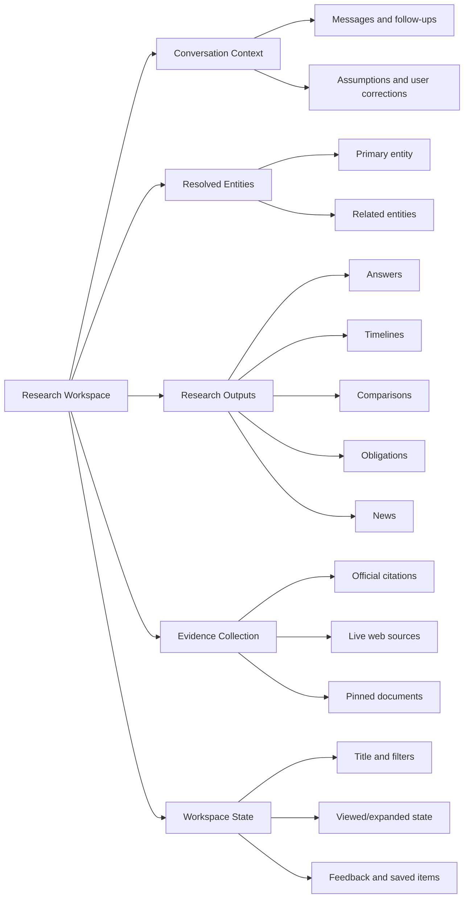

# Resolven Regulatory Intelligence Workspace

## Ask AI Product Experience Specification

**Document status:** Product definition  
**Date:** 2026-07-26  
**Source:** `ASK_AI_AUDIT.md`, read in full  
**Scope:** Product experience, interaction model, information architecture, and user-visible behavior  
**Out of scope:** Backend architecture, database design, API design, implementation code, infrastructure selection

---

## Executive summary

Ask AI should stop behaving like a chatbot and become a persistent Regulatory Intelligence Workspace.

The primary product object is not an answer. It is a **research workspace** that helps a user move from an ambiguous term or question to a defensible understanding of:

- what a regulation or market concept means;
- which official instruments govern it;
- who is affected;
- what obligations and deadlines exist;
- what has changed;
- what is happening now;
- where every material claim came from;
- what to investigate next.

The workspace must be useful in all three knowledge conditions:

1. **Grounded Regulatory Knowledge** when official corpus evidence is available.
2. **General AI Knowledge** when no official evidence is found.
3. **Live Intelligence** when the query asks for current or recent information.

Missing citations must never terminate the experience. They determine the knowledge mode, confidence, provenance labels, and available actions—not whether the user receives help.

The intended feel is:

- **Perplexity-like** in research momentum, source visibility, and follow-up discovery;
- **Notion-like** in durable, structured knowledge blocks that can be revisited and reused;
- **Linear-like** in information density, state clarity, keyboard efficiency, and restrained interaction design;
- explicitly **not ChatGPT-like** in presenting every task as an undifferentiated sequence of message bubbles.

---

# 1. Product Vision

## 1.1 Vision statement

Resolven is the trusted workspace for understanding, researching, and acting on regulatory intelligence.

A user should be able to begin with as little as `DSM`, a detailed compliance question, or a request for the latest consultation and leave with:

- a resolved regulatory entity;
- a clear explanation;
- official evidence where available;
- a timeline of relevant instruments and changes;
- stakeholder and obligation context;
- live updates when requested;
- an exact record of the research journey;
- obvious next questions.

## 1.2 Product promise

> Start anywhere. Understand the regulatory context. Verify the evidence. Continue the research.

## 1.3 Product principles

### Evidence before fluency

Official evidence is more valuable than a polished answer. When official evidence exists, it must be visible, inspectable, and attached to the claims it supports.

### Always useful, never falsely certain

The product should still explain a topic when official documents are not found. It must lower confidence, display the required general-knowledge disclosure, and never manufacture citations.

### Provenance is part of the interface

Users should not need to infer whether a claim came from an official document, general AI knowledge, or a live web source. Provenance must be visible at section and card level.

### Entities before paragraphs

A recognized acronym, regulation, regulator, scheme, tariff mechanism, or compliance concept should resolve to a structured intelligence experience—not a one-off paragraph.

### Research has continuity

Every conversation is a durable research workspace. A user should reopen it with the same messages, sources, citations, cards, timeline, news, filters, and follow-up state.

### Current information is explicitly current

Live information must show its source, publication time, retrieval time, and separation from the indexed internal corpus.

### Failure should reduce capability, not end usefulness

Each unavailable capability should degrade independently. Documents, extracted facts, cached results, general explanation, manual search, and saved research should remain accessible wherever possible.

### Progressive disclosure

The first view should answer “What is this and why does it matter?” Deeper evidence, timelines, document families, and source excerpts should be one click away.

## 1.4 Product goals

- Make acronym and entity discovery a first-class experience.
- Support defensible compliance and regulatory research.
- Make amendments and timelines understandable without reading every source document first.
- Separate official, general, and live knowledge unambiguously.
- Preserve complete research continuity across sessions.
- Turn follow-up questions into structured exploration rather than repetitive chat.
- Eliminate raw technical failures from the user experience.

## 1.5 Non-goals

- Resolven is not a substitute for legal advice.
- General AI knowledge must not be presented as an official interpretation.
- Live web results must not be silently promoted into the official corpus.
- Confidence is not a probability that a legal conclusion is correct.
- The workspace should not automate compliance decisions without human review.
- This specification does not define backend services, storage schemas, or APIs.

## 1.6 Success measures

### Trust

- Zero raw HTTP/provider/database errors shown to users.
- 100% of official-corpus claims expose inspectable official evidence.
- 100% of general-knowledge responses show the required disclosure.
- 100% of mixed internal/live responses separate provenance.
- Reopened conversations reproduce their previous visible state exactly.

### Research effectiveness

- Time from acronym search to useful entity overview.
- Percentage of searches that resolve to an entity, document, or actionable answer.
- Official document open rate from answer citations.
- Timeline and amendment-comparison engagement.
- Follow-up completion rate within a research workspace.

### Continuity

- Conversation reopen rate.
- Percentage of users who continue a previous workspace.
- Saved/pinned source and entity usage.
- Session-search success rate.

### Quality

- User feedback by knowledge mode.
- Unsupported-claim reports.
- Ambiguous-entity correction rate.
- “No official documents found” rate segmented by entity and query type.

---

# 2. User Personas

## 2.1 Regulatory and Compliance Manager

**Primary need:** Determine what the organization must do, by when, and under which authority.

**Typical questions**

- What obligations apply to open-access consumers under the latest DSM framework?
- Which compliance dates affect solar developers this quarter?
- Has this reporting requirement changed?

**What builds trust**

- official source documents;
- clear obligation and deadline cards;
- jurisdiction and applicability labels;
- distinction between binding rules, draft consultations, and explanatory material;
- visible confidence and caveats.

**Failure intolerance**

Very high. A plausible answer without traceable official evidence is not sufficient for action.

## 2.2 Regulatory Research Analyst

**Primary need:** Explore an unfamiliar concept, trace its evolution, and find related instruments efficiently.

**Typical questions**

- DSM
- Show the DSM timeline.
- Compare DSM and ABT.
- Which regulations introduced and later amended this mechanism?

**What builds trust**

- canonical entity resolution;
- aliases and acronym expansion;
- timelines;
- related regulations;
- amendment families;
- fast movement between summaries and source excerpts.

**Failure intolerance**

Moderate. General AI knowledge is useful if it is clearly labeled and provides paths to better evidence.

## 2.3 Legal Counsel or Policy Specialist

**Primary need:** Validate the exact legal basis, scope, definitions, and change history.

**Typical questions**

- Where is “deviation” defined?
- Which clause creates this obligation?
- What changed between the 2022 and 2024 amendments?

**What builds trust**

- claim-level citations;
- section/page context;
- document version and status;
- effective dates;
- side-by-side amendments;
- ability to inspect source text without losing research context.

**Failure intolerance**

Very high. General AI content is acceptable only as orientation and must never look authoritative.

## 2.4 Strategy and Market Intelligence Lead

**Primary need:** Understand what is changing now and what it could mean for markets, investments, or business strategy.

**Typical questions**

- Latest DSM developments
- What consultations could affect storage projects this month?
- What is the direction of regulation on ancillary services?

**What builds trust**

- current news and consultation signals;
- clean separation between official corpus and live web reporting;
- stakeholder implications;
- trend and timeline context;
- source freshness.

**Failure intolerance**

Moderate. Partial live intelligence is useful if coverage limitations are explicit.

## 2.5 Operations or Project Team Member

**Primary need:** Get a simple explanation and identify whether specialist review is required.

**Typical questions**

- Explain DSM to a beginner.
- Does this apply to our solar project?
- What should I ask our compliance team?

**What builds trust**

- plain language;
- “why it matters” summaries;
- concise applicability questions;
- escalation guidance;
- no unexplained regulatory jargon.

**Failure intolerance**

Low for general explanations, high for direct compliance conclusions.

## 2.6 Executive or Decision Maker

**Primary need:** Understand significance, change, exposure, and next action quickly.

**Typical questions**

- What changed and why does it matter?
- Which upcoming consultations deserve attention?
- What are the top regulatory risks this month?

**What builds trust**

- short executive summary;
- importance and urgency signals;
- evidence count and confidence;
- clear next action;
- access to deeper analyst detail without cluttering the first view.

---

# 3. User Journeys

## 3.1 Acronym to intelligence page

**Entry:** User types `DSM`.

1. The search recognizes a likely regulatory entity.
2. If one meaning is dominant in the user’s regulatory context, the product opens the DSM Intelligence Page directly.
3. If meanings are genuinely ambiguous, it shows a compact disambiguation panel.
4. The intelligence page opens with definition, overview, confidence, official instruments, latest news, timeline, stakeholders, obligations, amendments, and related entities.
5. The user selects “Show the DSM timeline.”
6. The page focuses the timeline while preserving the entity overview and sources.
7. A research workspace is created or updated automatically.

**Success:** The user moves from acronym to authoritative orientation without reformulating the query.

## 3.2 Compliance question

**Entry:** “What DSM obligations apply to solar generators in Karnataka?”

1. The query is classified as compliance + obligation discovery.
2. Entities are resolved: DSM, solar generator, Karnataka, relevant regulator/jurisdiction.
3. The workspace searches official sources first.
4. The response begins with an applicability summary and an explicit “not legal advice” boundary.
5. Obligations appear as structured cards with stakeholder, action, deadline/effective date, jurisdiction, and official evidence.
6. Unresolved applicability assumptions are shown as questions, not silently filled.
7. Suggested follow-ups include exceptions, reporting forms, latest amendments, and responsible regulator.

**Success:** The user can identify the official basis and unresolved questions before taking action.

## 3.3 Latest intelligence

**Entry:** “Latest DSM consultation.”

1. The query is classified as consultation + live intelligence with a recent time filter.
2. The product resolves DSM and searches both internal corpus and allowed live sources.
3. The response frame shows two independent provenance sections:
   - Internal Regulatory Corpus
   - Live Web Sources
4. Official consultation documents found internally appear first.
5. Live announcements or reporting appear in a separate news stream with dates and source labels.
6. Duplicate internal/live references to the same official publication are consolidated visually but keep both provenance records.
7. If no live results exist, the news section is hidden and the official result remains useful.

**Success:** The user sees what is officially indexed and what is newly observed without provenance mixing.

## 3.4 Amendment exploration

**Entry:** “DSM amendment.”

1. The product resolves the relevant regulation family.
2. Recent amendments are shown as a chronological set, not a generic answer.
3. The user can select any two versions.
4. A comparison card shows:
   - provision changed;
   - prior position;
   - new position;
   - effective date;
   - affected stakeholders;
   - evidence on both sides.
5. The user adds the comparison to the research workspace.
6. Follow-ups offer operational impact, deadlines, and earlier/later amendments.

**Success:** The user understands the change lineage and can inspect both source versions.

## 3.5 Concept comparison

**Entry:** “Compare DSM and ABT.”

1. Both entities are resolved.
2. The response uses a structured comparison rather than prose alone.
3. Comparison dimensions include definition, purpose, scope, regulator, participants, settlement mechanism, timeline, official instruments, and relationship.
4. Each entity retains separate official sources and confidence.
5. Unsupported dimensions are labeled “Not established from available official sources.”

**Success:** The user can understand similarities, differences, and relationships without false symmetry.

## 3.6 Beginner explanation

**Entry:** “Explain DSM to a beginner.”

1. The classifier identifies explanation + beginner audience.
2. The answer begins with a one-sentence definition, a simple example, and “why it matters.”
3. If official sources exist, the explanation is Mode 1 and cited.
4. If official sources do not exist, it becomes Mode 2 with the mandatory disclosure.
5. Technical details are collapsed under “Go deeper.”
6. Suggested follow-ups progress from basic to practical.

**Success:** Simplicity changes presentation, not provenance standards.

## 3.7 Reopen and continue research

**Entry:** User opens “DSM changes affecting solar generators” from Recent Research.

1. The workspace returns to the last viewed position.
2. Messages, cards, citations, sources, timeline state, filters, news, and feedback appear exactly as saved.
3. A subtle freshness notice identifies time-sensitive sections that may now have updates.
4. The user chooses either:
   - Continue with saved evidence;
   - Refresh live intelligence;
   - Refresh all sources.
5. New research is appended without rewriting the historical state.

**Success:** Continuity is exact, while freshness is an explicit user choice.

---

# 4. Information Architecture

## 4.1 Primary navigation

The product should organize around regulatory work, not model capabilities.

| Destination | Purpose |
|---|---|
| **Discover** | Search entities, regulations, documents, topics, and saved research. |
| **Research** | Start or continue a Regulatory Intelligence Workspace. |
| **Latest Intelligence** | Time-sensitive official updates, consultations, amendments, deadlines, and live signals. |
| **Entities** | Browse acronyms, concepts, regulators, schemes, stakeholders, and regulation families. |
| **Documents** | Search and inspect official documents directly. |
| **Saved** | Pinned entities, documents, citations, cards, and workspaces. |
| **Recent Research** | Durable conversations/workspaces, searchable by title, entity, source, and content. |

“Ask AI” may remain a familiar navigation label during transition, but the page title and internal model should be “Research.”

## 4.2 Research workspace layout

### Left rail: research navigation

- New Research
- Recent Research
- Pinned
- Search conversations
- Conversation groups by recency
- Entity and knowledge-mode indicators
- Archive and rename actions

### Center canvas: structured research

- Query/composer
- Active entity or topic header
- Knowledge-mode banner
- Answer and intelligence cards
- Timeline/comparison modules
- Follow-up actions
- Conversation turns where necessary

### Right evidence panel

- Selected citation or source
- Official/live/general provenance
- Document metadata
- Section/page/excerpt
- Version/effective status
- Related claims
- Open source
- Pin to workspace

The right panel should preserve the center-canvas position and make evidence inspection feel like research, not navigation away.

## 4.3 Workspace hierarchy



## 4.4 Core content objects

- **Entity:** A canonical concept, acronym, regulator, scheme, stakeholder, regulation, or document family.
- **Research Workspace:** The durable container for a user’s investigation.
- **Turn:** A user question or action plus the resulting structured output.
- **Claim:** A material statement with a knowledge mode and support state.
- **Source:** An official corpus document or live web source.
- **Citation:** A claim-to-official-evidence reference.
- **Timeline Event:** A dated regulatory milestone or live event.
- **Obligation:** An action, responsible party, scope, and date/effective condition.
- **Amendment:** A change relationship between official instruments or versions.
- **Research Card:** A reusable structured output saved in the workspace.

## 4.5 Responsive behavior

### Desktop

Three-column workspace with collapsible left rail and evidence panel.

### Tablet

Conversation rail becomes an overlay; evidence panel remains a slide-over.

### Mobile

Single canvas. Sources and sessions open as full-height sheets. Entity-page sections use anchored navigation. Complex comparisons allow horizontal scrolling but preserve row labels.

---

# 5. Conversation Model

## 5.1 Definition

A conversation is a **persistent research workspace**, not a transient chat log.

It contains:

- editable conversation title;
- primary and related entities;
- jurisdiction and time scope;
- user messages;
- AI responses;
- knowledge mode for each response section;
- official citations;
- live web sources;
- AI metadata visible at an appropriate level;
- response cards;
- timelines;
- related questions;
- pinned sources and documents;
- user feedback;
- regenerated-answer branches;
- viewed/expanded state;
- timestamps and freshness state.

## 5.2 Conversation creation

A workspace begins when the user:

- submits a free-form question;
- selects an entity;
- opens a document and asks a question;
- starts from a news item;
- chooses “Research this” from another product surface.

The first meaningful result generates a title. Examples:

- `DSM — Overview and Official Regulations`
- `DSM Obligations for Karnataka Solar Generators`
- `Latest CERC Consultations — July 2026`
- `DSM vs ABT`

The user can rename the workspace at any time.

## 5.3 Turn types

Not every turn must be rendered as a bubble.

| Turn type | Example | Preferred output |
|---|---|---|
| Entity navigation | `DSM` | Intelligence Page |
| Explanation | `What is DSM?` | Definition + overview cards |
| Compliance | `What must generators submit?` | Applicability + obligation cards |
| Latest | `Latest DSM` | Internal update stream + live sources |
| Timeline | `DSM timeline` | Interactive timeline |
| Amendment | `What changed?` | Amendment/change cards |
| Comparison | `DSM vs ABT` | Comparison matrix |
| Document lookup | `Show the 2024 regulation` | Document results |
| Follow-up | `What about solar generators?` | Context-aware scoped answer |
| Workspace action | Pin, rename, filter, refresh | State change, not assistant prose |

## 5.4 Context controls

Users should be able to see and change the active context:

- entity;
- jurisdiction;
- regulator;
- document family;
- date range;
- official-only / include live intelligence;
- audience level: beginner, analyst, legal detail;
- selected sources.

Context changes appear as compact chips above the composer. The system must not silently carry a high-impact assumption across turns without showing it.

## 5.5 Exact restoration

Reopening must restore:

- chronological turn order;
- complete answers;
- citation placement;
- source metadata and excerpts as originally shown;
- knowledge-mode banners;
- live-news cards and their retrieval timestamps;
- timelines and selected events;
- comparison selections;
- expanded/collapsed sections;
- pins and saved cards;
- feedback;
- scroll position when practical;
- draft text if the user left mid-composition.

Time-sensitive content must not silently mutate. A saved state can show a “New updates may be available” action.

## 5.6 Regeneration and branching

Regenerate belongs to a specific answer and its original user turn.

Options:

- Regenerate with same sources
- Refresh official sources, then regenerate
- Include live intelligence
- Make more concise
- Explain for a beginner
- Show legal detail

The previous answer remains available as a version. Regeneration never overwrites history invisibly.

## 5.7 Feedback

Feedback is attached to the specific response or card.

Quick options:

- Helpful
- Missing source
- Source does not support claim
- Outdated
- Too general
- Wrong entity
- Incorrect interpretation

Feedback should preserve the answer version and knowledge mode so later review is meaningful.

---

# 6. Entity Page Design

## 6.1 Entity-page trigger

An Intelligence Page should open when the query strongly resolves to:

- an acronym such as DSM, ABT, REC, or RPO;
- a named regulation or rule;
- a regulator or ministry;
- a market mechanism;
- a scheme;
- a stakeholder category;
- a document family.

If entity confidence is below the direct-navigation threshold, show disambiguation before opening the page.

## 6.2 Entity header

The header contains:

- canonical name;
- acronym and aliases;
- entity type;
- jurisdiction;
- responsible/associated regulator;
- current status;
- one-sentence definition;
- overall evidence coverage indicator;
- last internal-corpus update;
- last live-intelligence refresh;
- actions: Follow, Save, Share, Start Research.

Example:

```text
DSM
Deviation Settlement Mechanism
Market mechanism · India · CERC

Evidence coverage: Strong
12 official instruments · 4 amendments · Updated 18 Jul 2026
```

## 6.3 Required sections

### Overview

A concise synthesis of purpose, scope, regulatory importance, and current state. The first paragraph must identify its knowledge mode.

### Definition

- official definition where available;
- plain-language explanation;
- key terms;
- acronym expansion;
- “commonly confused with” entities.

Official wording and plain-language explanation must be visually distinct.

### Latest News

- shown only when verified live or newly indexed results exist;
- sorted by publication/event time;
- clearly labeled Internal Corpus or Live Web;
- includes source, date, freshness, and relationship to the entity;
- hidden when no results exist unless the user explicitly asked for latest/news.

### Timeline

Chronological events such as:

- original regulation;
- effective date;
- amendments;
- corrigenda;
- consultations;
- hearings;
- implementation milestones;
- major related orders;
- recent live developments.

Timeline filters:

- All
- Regulations
- Amendments
- Consultations
- Deadlines
- Live Intelligence

### Official Regulations

Canonical governing instruments, ordered by legal/current relevance rather than search score alone. Each card shows:

- title;
- regulator/issuer;
- document type;
- issue and effective date;
- current/superseded/draft status;
- relationship to entity;
- key cited provisions;
- open/save/compare actions.

### Stakeholders

Stakeholder groups with:

- role;
- how they are affected;
- relevant obligations;
- applicable jurisdiction;
- evidence coverage.

### Related Regulations

A relationship map or concise list grouped by:

- governs;
- implements;
- amends;
- supersedes;
- referenced by;
- operationally related;
- commonly compared.

Relationships inferred only from general AI knowledge must be labeled as such.

### Key Obligations

Structured obligation cards:

- responsible party;
- required action;
- trigger/condition;
- due date or frequency;
- jurisdiction;
- source provision;
- current status;
- confidence.

### Recent Amendments

- amendment title and date;
- instrument affected;
- change summary;
- effective date;
- affected stakeholders;
- before/after action;
- official evidence.

### Official Documents

A filterable document result set with:

- document type;
- regulator;
- date;
- status;
- version;
- family;
- source;
- relevance reason.

### Suggested Follow-up Questions

Entity-specific next steps grouped by intent, not generic prompts.

### Confidence Indicator

Confidence is section-specific:

- **High — Officially grounded**
- **Medium — General AI knowledge**
- **Live — Source-backed, time-sensitive**
- **Mixed — Multiple provenance modes**
- **Limited — Incomplete or degraded evidence**

The indicator opens a panel explaining what evidence exists and what is missing.

## 6.4 Entity disambiguation

For ambiguous terms, show a compact selector:

```text
Which DSM do you mean?

Deviation Settlement Mechanism
Indian electricity market · CERC

Demand-Side Management
Energy efficiency and load management

Something else
```

Use recent workspaces, selected jurisdiction, and product domain to rank choices, but never silently force an uncertain meaning.

## 6.5 Empty and partial entity pages

An entity page may still open with partial coverage.

- No official documents: definition and overview use Mode 2 disclosure; official sections show a manual-search action.
- No news: hide Latest News.
- No timeline: show key known dates only if supported; otherwise omit.
- No obligations: state “No structured obligations were identified in available official sources,” not “No obligations exist.”
- Ambiguous status: label as unresolved.

---

# 7. Search Experience

## 7.1 Universal research input

One prominent input should support:

- acronym/entity lookup;
- natural-language questions;
- exact regulation titles;
- document numbers;
- regulator names;
- compliance questions;
- date-aware intelligence requests;
- conversation-history search.

Placeholder:

> Search a regulation, acronym, obligation, amendment, or recent development

## 7.2 Typeahead suggestions

Suggestions are grouped:

### Entities

`DSM — Deviation Settlement Mechanism`

### Official Regulations

Named documents and document families.

### Questions

Likely intent completions such as “DSM timeline” or “DSM obligations for generators.”

### Latest Intelligence

Recent relevant consultations, amendments, or news.

### Previous Research

Matching conversation titles and content.

Keyboard navigation should be complete and predictable.

## 7.3 Query-understanding product contract

Every submitted query should resolve to a visible, inspectable interpretation with:

```text
intent
confidence
entities
time filters
query expansion
```

The classifier may assign one primary intent and multiple secondary intents.

### Intent taxonomy

| Intent | User goal | Typical output |
|---|---|---|
| `entity_overview` | Understand an acronym/entity broadly. | Intelligence Page |
| `definition` | Learn what something means. | Definition + simple explanation |
| `official_document_search` | Find a named or relevant instrument. | Document results |
| `compliance_question` | Determine applicability or required action. | Applicability + obligations |
| `obligation_discovery` | Find duties, filings, reporting, or conditions. | Obligation cards |
| `deadline_search` | Find due dates, hearing dates, or effective dates. | Deadline list/timeline |
| `amendment_exploration` | Find changes or amending instruments. | Amendment cards |
| `version_comparison` | Compare versions or concepts. | Comparison view |
| `timeline` | Understand historical evolution. | Timeline |
| `regulator_lookup` | Identify authority or jurisdiction. | Regulator/stakeholder view |
| `stakeholder_impact` | Understand who is affected and how. | Stakeholder cards |
| `consultation_search` | Find open/recent consultations. | Consultation cards |
| `live_intelligence` | Find latest/current/news information. | Internal + live sections |
| `beginner_explanation` | Reduce jargon and complexity. | Simple explanation |
| `follow_up` | Continue within active context. | Scoped response |

### Intent examples

| Query | Primary intent | Secondary intent | Time filter |
|---|---|---|---|
| `DSM` | `entity_overview` | `definition` | none |
| `What is DSM` | `definition` | `entity_overview` | none |
| `Latest DSM` | `live_intelligence` | `entity_overview` | recent/default |
| `DSM amendment` | `amendment_exploration` | `official_document_search` | latest relevant |
| `DSM consultation` | `consultation_search` | `live_intelligence` when current | open/recent |
| `Compare DSM and ABT` | `version_comparison` | `entity_overview` | current unless specified |
| `Who regulates DSM` | `regulator_lookup` | `entity_overview` | current |
| `DSM timeline` | `timeline` | `amendment_exploration` | all time |
| `Explain DSM to a beginner` | `beginner_explanation` | `definition` | none |

### Confidence

Classifier confidence is about interpretation, not answer correctness.

- **High:** One clear intent and entity resolution.
- **Medium:** Likely interpretation with minor ambiguity.
- **Low:** Multiple plausible entities, jurisdictions, or goals.

Low-confidence interpretations trigger clarification. Medium-confidence interpretations proceed but expose editable context chips.

### Entities

Each resolved entity should expose:

- canonical name;
- entity type;
- aliases/acronym;
- jurisdiction;
- regulator/issuer if relevant;
- resolution confidence;
- whether user confirmation is required.

### Time filters

Recognize:

- today;
- latest;
- recent;
- this week;
- this month;
- this quarter;
- explicit date range;
- before/after a date;
- currently open;
- historical/all time.

The interpreted range must be visible. “Latest” should not be an invisible, undefined filter.

### Query expansion

Expansion can add:

- acronym expansion;
- aliases and former names;
- regulator abbreviations;
- spelling variants;
- document family names;
- closely related legal terms;
- singular/plural and common terminology.

Example:

```text
Original: DSM amendment
Expanded concepts:
Deviation Settlement Mechanism
Deviation Settlement Mechanism Regulations
amendment, amended, corrigendum, addendum
CERC
```

Users can inspect expansions under “Search details.” Expansion must not silently broaden jurisdiction or replace the user’s actual intent.

## 7.4 Search-results page

When a query does not map directly to one entity page or answer, show federated results grouped by:

- Best Match
- Entities
- Official Regulations
- Amendments
- Consultations
- Deadlines
- Live Intelligence
- Previous Research

Filters:

- provenance;
- jurisdiction;
- regulator;
- document type;
- status;
- date;
- stakeholder;
- topic;
- current/superseded/draft.

Every result must answer “Why this matched.”

## 7.5 Search corrections

The product can suggest:

- corrected spelling;
- expanded acronym;
- likely regulator;
- broader or narrower date range;
- alternative entity.

It must preserve the original query and offer one-click reversal.

## 7.6 Manual document search

Manual search is always available, particularly during degraded retrieval.

It supports:

- exact phrase;
- title;
- issuer;
- document number;
- document type;
- date/effective date;
- family/version;
- current status;
- within-document text.

---

# 8. Knowledge Modes

## 8.1 Mode 1 — Grounded Regulatory Knowledge

### Entry condition

Relevant official documents or verified internal regulatory facts support the response.

### Product behavior

- Official evidence is the primary source.
- Material claims include citations.
- Citation cards identify document, issuer, date, status, section/page where available, and evidence excerpt.
- Confidence label: **High — Officially grounded**.
- General background can be included only when clearly marked if it is not supported by the official evidence.

### Visual treatment

Blue/neutral provenance band:

```text
Official Regulatory Corpus
High confidence · 6 official sources · Updated 18 Jul 2026
```

### Trust rule

The label “High” is allowed only for the portion supported by official evidence. It does not imply legal certainty or universal applicability.

## 8.2 Mode 2 — General AI Knowledge

### Entry condition

No relevant official regulatory documents were found after a healthy official-corpus search, or the user explicitly asks for a general conceptual explanation outside corpus coverage.

### Mandatory disclosure

The response must begin with:

> **This explanation is generated from general AI knowledge because no official regulatory documents were found.**

The wording must not be shortened, hidden in a tooltip, or moved below the answer.

### Product behavior

- Continue answering.
- Use plain, careful language.
- Do not create citation cards.
- Do not imitate official-document references.
- Do not state that a specific obligation legally applies unless supported.
- Label confidence: **Medium — General AI knowledge**.
- Offer:
  - Search official documents manually
  - Broaden jurisdiction
  - Try an expanded entity name
  - Notify me when official sources are indexed

### Visual treatment

Amber/neutral provenance band, clearly different from warnings:

```text
General AI Knowledge
Medium confidence · No official corpus evidence found
```

### Trust rule

Mode 2 is an orientation tool, not evidence. It must never borrow citations from loosely related documents.

## 8.3 Mode 3 — Live Intelligence

### Entry condition

The query includes an explicit or inferred current-information intent such as:

- latest;
- today;
- recent;
- this week/month;
- breaking;
- consultation;
- news;
- currently open;
- newly amended.

### Product behavior

The response is separated into independently labeled sections:

#### Internal Regulatory Corpus

- indexed official documents and structured facts;
- official citation model;
- indexed/updated date;
- High confidence where supported.

#### Live Web Sources

- current web results from approved sources;
- publication date and retrieval time;
- publisher/source type;
- direct source link;
- live-source confidence and coverage note.

These sections may appear in the same response but never in the same provenance block or citation list.

### Visual treatment

Green/teal live band:

```text
Live Web Sources
Time-sensitive · 4 sources · Retrieved 26 Jul 2026, 14:32 IST
```

### Trust rule

The live section must not imply that a web report is legally operative. Official status must come from official evidence.

## 8.4 Composed modes

A single research result can contain multiple modes:

```text
Overview                    Mode 1
Current official position   Mode 1
Latest media/reporting      Mode 3
Background explanation      Mode 2
```

Confidence and provenance attach to sections and claims, not only to the whole response.

## 8.5 Mode-selection clarity

The user should always be able to answer:

- What sources were searched?
- Which knowledge mode produced this section?
- Why is the confidence level shown?
- What evidence is missing?
- When was live information retrieved?

---

# 9. Failure Modes

The interface must never expose `HTTP 400`, `502`, stack traces, provider names in error strings, raw JSON errors, or database terminology.

## 9.1 Graceful-degradation matrix

| Condition | User experience | Still available |
|---|---|---|
| No official documents found | Continue in Mode 2 with mandatory disclosure. | General explanation, entity context, manual document search, follow-ups. |
| No live news found | Hide Latest News when not explicitly requested. If explicitly requested, say “No verified live updates were found for this period.” | Internal corpus, timeline, official documents. |
| AI model unavailable | Show retrieved official documents, extracted evidence, timeline, obligations, and cached summaries. Explain that synthesis is temporarily unavailable. | Source-led research and retry. |
| Official retrieval unavailable | Do not claim no documents exist. State that official search is temporarily unavailable. Offer manual document search and, if AI is available, a clearly labeled general explanation. | Manual filters, saved sources, prior cached evidence. |
| Live search unavailable | Continue with Internal Regulatory Corpus and show a quiet “Live sources could not be refreshed” notice. | All internal research. |
| Citation verification incomplete | Show verified claims and source excerpts. Withhold or label unsupported synthesis. | Evidence cards, document search, retry verification. |
| One source family unavailable | Show partial results and identify coverage limitation without technical detail. | Healthy sections and sources. |
| Entity ambiguous | Ask the user to choose among likely meanings. | Search results and free-form correction. |
| No structured timeline | Omit the timeline or show only verified dates. | Overview and documents. |
| No structured obligations | State that none were identified in available evidence—not that none exist. | Official documents and manual clause search. |
| Session save delayed | Keep the workspace locally visible with “Saving…” and retry automatically. | Continued reading and drafting. |
| Session save fails | Preserve a recoverable local copy and show “Changes are not yet synced.” | Export/copy and retry. |
| Authentication expires | Preserve draft and workspace state; request sign-in in place; resume afterward. | Read-only visible state where permitted. |
| Source link unavailable | Keep the stored citation metadata and excerpt; label source link unavailable. | Evidence context and document identity. |

## 9.2 Failure-copy principles

Good failure copy explains:

1. what is unavailable;
2. what remains available;
3. whether confidence/provenance changed;
4. what the user can do next.

Example:

> Official document search is temporarily unavailable. You can still view previously retrieved sources or search documents manually. Any explanation generated now will be labeled as general AI knowledge.

## 9.3 Partial-result behavior

Partial results are preferable to a blocking error when:

- at least one provenance section is healthy;
- saved evidence exists;
- source cards can be shown without synthesis;
- general knowledge can safely orient the user.

The product should never silently lower from Mode 1 to Mode 2. The mode transition must be visible.

## 9.4 Retry behavior

Retries are capability-specific:

- Retry official search
- Refresh live sources
- Retry explanation
- Retry citation verification
- Retry save

Avoid a generic “Try again” when another useful path exists.

---

# 10. Loading States

## 10.1 Initial workspace load

Show the research shell immediately:

- navigation;
- recent workspace placeholders;
- functional search/composer;
- no dependency on unrelated dashboards or feeds.

If history is loading, label only that region. Do not block the entire page.

## 10.2 Conversation restoration

Use stable skeletons matching the saved output types:

- answer block;
- source list;
- timeline;
- entity header.

If cached state is available, show it immediately with a “Checking for saved updates” indicator.

## 10.3 Search suggestions

Suggestions should appear progressively:

- recent/pinned items instantly;
- entity and document matches when ready;
- live results only when the user’s terms imply them.

## 10.4 Evidence panel

Open the panel immediately with known citation metadata, then load the full source excerpt. If the excerpt fails, retain the citation identity and actions.

## 10.5 Pagination and section loading

Load sections independently. A slow timeline must not prevent the definition or official-document list from appearing.

## 10.6 No fake percentages

Do not show a progress percentage unless the product knows the total work. Use named states and completed steps.

---

# 11. Streaming UX

## 11.1 Principle

Progress must reflect actual backend events. The interface must never animate hard-coded steps that did not run.

## 11.2 Event-driven progress model

Possible visible stages:

1. **Understanding Query…**
2. **Resolving Entities…**
3. **Searching Regulations…**
4. **Searching News…** — only for Mode 3
5. **Building Timeline…** — only for timeline/entity work
6. **Comparing Versions…** — only for amendment/comparison work
7. **Generating Summary…**
8. **Verifying Citations…** — only where official citations exist
9. **Saving Research…**
10. **Complete**

Each stage can be:

- queued;
- active;
- complete;
- skipped;
- degraded;
- unavailable.

## 11.3 Progressive result reveal

The workspace should reveal useful content as it becomes trustworthy:

1. Interpreted query chips appear after entity/intent resolution.
2. Matching official documents can appear before the generated explanation.
3. Live results fill only the Live Web Sources section.
4. Timeline events appear after date relationships are established.
5. Generated prose streams inside its already-labeled knowledge-mode section.
6. Official citations become interactive only after verification.
7. Completion summarizes coverage and any degraded capabilities.

## 11.4 Provenance before prose

Before text begins streaming, the section must already show its knowledge mode:

- Official Regulatory Corpus
- General AI Knowledge
- Live Web Sources

This prevents a response from appearing official and later changing to general knowledge.

## 11.5 Example: `Latest DSM`

```text
✓ Understanding Query
  Entity: Deviation Settlement Mechanism
  Intent: Latest intelligence
  Time: Recent

✓ Searching Regulations
  8 official documents found

✓ Searching News
  4 live sources found

✓ Building Timeline
  11 verified events

● Generating Summary

○ Verifying Citations
○ Saving Research
```

## 11.6 Degraded stream

```text
✓ Understanding Query
! Searching Regulations
  Official search is temporarily unavailable

✓ Generating General Explanation
  Medium confidence

✓ Saving Research
✓ Complete
```

## 11.7 User controls during streaming

- Stop generation
- Continue in background
- View sources already found
- Hide progress detail
- Retry one degraded stage after completion

Stopping generation must preserve sources and structured results already received.

## 11.8 Completion state

Completion displays:

- knowledge modes used;
- official source count;
- live source count;
- unresolved assumptions;
- confidence by section;
- freshness;
- suggested next actions.

---

# 12. Response Cards

Responses should be composed from reusable, provenance-aware cards rather than one monolithic assistant message.

## 12.1 Answer Summary Card

Contains:

- direct answer;
- why it matters;
- knowledge-mode label;
- confidence;
- unresolved assumptions;
- source count.

## 12.2 Definition Card

- official definition;
- plain-language explanation;
- acronym expansion;
- common confusion;
- official source where available.

## 12.3 Official Source Card

- title;
- issuer/regulator;
- document type;
- issue/effective date;
- current status;
- cited section/page;
- excerpt;
- relationship to claim/entity;
- Open, Save, Compare.

## 12.4 Live News Card

- headline;
- publisher/source;
- publication time;
- retrieval time;
- live-source label;
- short relevance explanation;
- link;
- “Find official basis” action.

## 12.5 Obligation Card

- who;
- must do what;
- when/frequency;
- trigger or scope;
- jurisdiction;
- official basis;
- confidence;
- “Check applicability” action.

## 12.6 Deadline Card

- date;
- deadline type;
- responsible stakeholder;
- status: upcoming, today, elapsed, extended, unverified;
- source;
- add-to-tracker action in a future phase.

## 12.7 Timeline Event Card

- date;
- event type;
- title;
- change/significance;
- official/live provenance;
- source;
- related prior/next event.

## 12.8 Amendment Card

- amending instrument;
- amended instrument;
- issue/effective date;
- provisions affected;
- change summary;
- stakeholders affected;
- compare action.

## 12.9 Comparison Card

Side-by-side dimensions with:

- value for entity/version A;
- value for entity/version B;
- relationship or difference;
- independent citations for each side;
- “Not established” where evidence is absent.

## 12.10 Stakeholder Card

- stakeholder;
- role;
- impact;
- obligations;
- relevant regulations;
- evidence coverage.

## 12.11 Related Regulation Card

- related entity/document;
- relationship type;
- explanation;
- confidence;
- provenance;
- open intelligence page.

## 12.12 Confidence and Coverage Card

Explains:

- modes used;
- official documents found;
- live sources found;
- unsupported or inferred areas;
- corpus freshness;
- what would improve confidence.

## 12.13 Card actions

Common actions:

- Inspect evidence
- Save
- Add to workspace
- Compare
- Open entity
- Ask follow-up
- Copy with sources
- Report issue

Actions must perform the named product behavior. “Save” must never mean “copy to clipboard.”

---

# 13. Session Architecture

This section defines the user-facing session model, not its technical implementation.

## 13.1 Session as a research workspace

Each session has:

- stable identity;
- editable title;
- owner;
- created and last-updated time;
- primary entity/topic;
- scope chips;
- knowledge-mode summary;
- source and citation counts;
- latest visible output;
- saved/pinned state;
- active, archived, or deleted lifecycle;
- freshness status.

## 13.2 Session list

Each row shows:

- title;
- primary entity icon/type;
- last user question or result summary;
- updated time;
- official/live/general mode indicators;
- source count;
- pinned state.

Grouping:

- Pinned
- Today
- Previous 7 Days
- Previous 30 Days
- Older

## 13.3 Session search

Search across:

- title;
- messages;
- entity names and acronyms;
- regulator;
- document title;
- cited source;
- timeline event;
- news headline;
- obligation text.

Filters:

- knowledge mode;
- entity;
- date;
- has official sources;
- has live intelligence;
- pinned;
- archived.

## 13.4 Session actions

- New Research
- Rename
- Pin/unpin
- Duplicate
- Archive/restore
- Export
- Delete with recovery window
- Refresh time-sensitive sections

Sharing and team collaboration belong to a later roadmap phase.

## 13.5 Session freshness

Saved research has two time concepts:

- **Historical state:** exactly what the user saw.
- **Available updates:** newer corpus or live information detected since then.

The product must not rewrite historical answers silently. It offers:

- Refresh live intelligence
- Refresh official sources
- Create updated answer

Updated answers are new versions or turns.

## 13.6 Session continuity rules

- New messages append chronologically.
- The associated answer and evidence remain linked.
- Regeneration retains previous versions.
- Feedback remains attached to the version reviewed.
- Citation cards reopen with the same saved excerpt plus current-source status.
- A session never becomes a flat list of unrelated user prompts.

## 13.7 Session states

| State | Meaning |
|---|---|
| Draft | Created but no completed research result yet. |
| Active | Current ongoing research. |
| Complete | Last requested work completed; can still continue. |
| Degraded | Saved with one or more unavailable capabilities. |
| Archived | Hidden from default recent list, fully recoverable. |
| Unsynced | Local changes are preserved but not yet confirmed saved. |

“Complete” is not a terminal state; research can always continue.

---

# 14. Follow-up Suggestions

## 14.1 Purpose

Follow-ups should advance research, not merely prolong conversation.

Each suggestion should:

- use resolved entities and current scope;
- represent a distinct research direction;
- predict a structured output;
- avoid repeating answered questions;
- preserve provenance expectations.

## 14.2 Suggestion categories

### Understand

- Explain this for a beginner
- Define the key terms
- Why does this matter?

### Verify

- Show the official provision
- Which documents support this?
- Is this regulation still current?

### Compliance

- Who must comply?
- What actions are required?
- What deadlines apply?
- What exceptions exist?

### Change

- What changed in the latest amendment?
- Compare this with the prior version
- Show the complete timeline

### Explore

- Show related regulations
- Which stakeholders are affected?
- Who regulates this?

### Current intelligence

- Find the latest consultation
- What changed this month?
- Refresh live sources

## 14.3 Presentation

Show three to five suggestions after a result:

- one natural next step;
- one evidence-deepening action;
- one compliance or impact question;
- one related-entity path;
- one current-intelligence action when relevant.

Examples for `DSM`:

- Show the DSM regulatory timeline
- What are the key obligations for generators?
- Compare DSM with ABT
- Find the latest DSM amendment
- Which CERC regulations govern DSM?

## 14.4 Suggestion labels

Suggestions can preview output type:

```text
Timeline · Show the DSM regulatory timeline
Compare · Compare DSM with ABT
Official sources · Which regulations govern DSM?
Live · Find the latest DSM consultation
```

## 14.5 Safe follow-ups

If evidence is limited, suggestions should help improve it:

- Search by full regulation name
- Select a jurisdiction
- Search official documents manually
- Try another regulator
- Include historical documents

---

# 15. Future Roadmap

The roadmap is product-led. It defines capability sequence, not technical implementation.

## Phase 0 — Trust and continuity

**Goal:** Make the existing experience honest, persistent, and recoverable.

- Replace raw technical errors with useful product states.
- Preserve conversations exactly.
- Implement real session list and search.
- Make save and feedback real.
- Show explicit knowledge modes.
- Continue with Mode 2 when official evidence is absent.
- Remove fake streaming and cosmetic controls.
- Correct regeneration semantics.

**Exit condition:** Users never lose a completed research turn and never confuse general knowledge with official evidence.

## Phase 1 — Regulatory Research Workspace

**Goal:** Move from chat transcript to structured research.

- Research canvas and evidence panel.
- Structured response cards.
- Claim-linked official citations.
- Scope chips and visible query interpretation.
- Manual document search.
- Saved sources/cards.
- Context-aware follow-ups.
- Exact session restoration.

**Exit condition:** A compliance analyst can complete and reopen a source-backed research task without leaving the workspace.

## Phase 2 — Entity Intelligence

**Goal:** Make acronyms and regulatory entities navigable product surfaces.

- Entity resolution and disambiguation.
- Intelligence Pages for DSM, ABT, REC, RPO, regulators, and regulation families.
- Definitions, timelines, stakeholders, obligations, amendments, related regulations, and official documents.
- Entity following and saved entities.
- Evidence-coverage indicators.

**Exit condition:** Searching a known acronym consistently produces a useful structured intelligence page.

## Phase 3 — Live Intelligence

**Goal:** Add current awareness without weakening provenance.

- Explicit live-intelligence mode.
- Internal vs live source separation.
- News and consultation cards.
- Date-aware search.
- Freshness and retrieval timestamps.
- Refresh controls for saved research.
- “Find official basis” from live items.

**Exit condition:** Users can research current developments and identify whether each item is official, live reporting, or general context.

## Phase 4 — Amendment and Compliance Workflows

**Goal:** Turn research into structured regulatory work.

- Version comparisons.
- Change summaries with before/after evidence.
- Obligation and deadline collections.
- Applicability checklists.
- Exportable research briefs.
- Deadline tracking and review workflows.
- Organization-specific scope profiles.

**Exit condition:** Users can trace a regulatory change into affected stakeholders, obligations, and review actions.

## Phase 5 — Collaboration

**Goal:** Make intelligence reusable across teams.

- Shared workspaces.
- Comments and mentions.
- Review/approval state.
- Team source collections.
- Shared entity watchlists.
- Research brief templates.
- Audit-friendly exports.

**Exit condition:** A team can review and hand off regulatory research without losing provenance or decision history.

## Phase 6 — Proactive Intelligence

**Goal:** Move from reactive search to continuously updated regulatory awareness.

- Follow entities and regulation families.
- Notify when official evidence changes.
- Highlight new amendments, deadlines, or consultations.
- Show “what changed since your last review.”
- Recommend affected saved workspaces.
- Personalized regulatory briefings based on explicit scope.

**Exit condition:** Resolven helps users discover material changes before they know what to search for.

---

## Product acceptance checklist

Before calling the redesigned experience complete:

- A search for `DSM` opens an Intelligence Page, not a one-paragraph answer.
- All example queries resolve to the intended structured experience.
- Mode 1 contains official citations.
- Mode 2 always includes the exact required disclosure and no fake citations.
- Mode 3 separates Internal Regulatory Corpus from Live Web Sources.
- No missing-citation state prevents an answer.
- No user sees raw HTTP or provider errors.
- Progress labels correspond to actual work performed.
- A reopened workspace reproduces messages, citations, cards, news, timelines, feedback, title, and visible state.
- Search history searches actual saved workspaces.
- Save, feedback, regenerate, and refresh actions perform their stated behavior.
- Entity, timeline, amendment, compliance, and latest-intelligence journeys work without forcing users into generic chat.
- Every material piece of content shows provenance and confidence appropriate to its knowledge mode.

