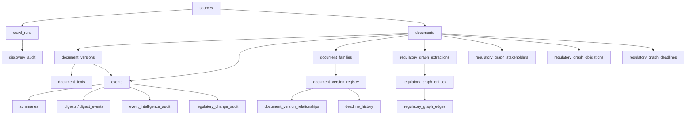

# SQL Tables Schema Report

Generated from the migration SQL files in `apps/api/backend/migrations`.

## Included SQL Files

- `0001_init.sql`
- `0002_rls.sql`
- `0003_profile_trigger.sql`
- `0004_seed_sources.sql`
- `0005_exports_docs.sql`
- `0006_discovery_audit.sql`
- `0007_event_intelligence_gate.sql`
- `0008_regulatory_change_audit.sql`
- `0009_document_family_registry.sql`
- `0010_regulatory_knowledge_graph.sql`

## Summary

- Total application tables found: **33**
- Total enum types found: **8**
- Tables with explicit RLS enabled in SQL: **12**
- Tables without explicit RLS enabled in SQL: **21**

## Enum Types

| Enum | Values | Used By |
|---|---|---|
| `jurisdiction_t` | `central`, `state` | `sources`, `documents`, `subscriptions` |
| `crawler_t` | `digest`, `agent`, `static` | `sources` |
| `event_t` | `NEW`, `CHANGED`, `REPLACEMENT`, `DUPLICATE` | `events` |
| `date_precision_t` | `day`, `month`, `year`, `unknown` | `documents` |
| `run_status_t` | `running`, `success`, `partial`, `failed` | `crawl_runs` |
| `notify_channel_t` | `email`, `slack`, `whatsapp` | `notifications_log` |
| `notify_status_t` | `pending`, `sent`, `failed`, `skipped` | `notifications_log` |
| `user_role_t` | `user`, `admin` | `profiles` |

## Table Inventory

| Table | Migration | Purpose | Primary Key | Explicit RLS |
|---|---|---|---|---|
| `sources` | `0001_init.sql` | Source configuration for portals/crawlers | `id` | Yes |
| `documents` | `0001_init.sql` | Canonical regulatory document records | `id` | Yes |
| `document_versions` | `0001_init.sql` | Version/download baseline per document | `id` | No |
| `events` | `0001_init.sql` | User-visible regulatory events | `id` | Yes |
| `summaries` | `0001_init.sql` | AI summaries attached to events | `id` | Yes |
| `digests` | `0001_init.sql` | Daily digest headers | `id` | Yes |
| `digest_events` | `0001_init.sql` | Join table for digest to event | `(digest_id, event_id)` | Yes |
| `profiles` | `0001_init.sql` | User profile rows mapped to Supabase auth users | `id` | Yes |
| `subscriptions` | `0001_init.sql` | User notification preferences | `id` | Yes |
| `user_event_state` | `0001_init.sql` | Per-user read/bookmark state | `(user_id, event_id)` | Yes |
| `crawl_runs` | `0001_init.sql` | Pipeline run log | `id` | No |
| `notifications_log` | `0001_init.sql` | Notification delivery/dedup log | `id` | No |
| `chat_messages` | `0001_init.sql` | User chat history | `id` | Yes |
| `audit_log` | `0001_init.sql` | Admin/system audit log | `id` | No |
| `app_documents` | `0005_exports_docs.sql` | In-app documentation pages | `slug` | Yes |
| `exports_log` | `0005_exports_docs.sql` | Export activity log | `id` | Yes |
| `discovery_audit` | `0006_discovery_audit.sql` | Candidate discovery and rejection audit | `id` | No |
| `document_texts` | `0006_discovery_audit.sql` | Extracted primary-document text by hash | `content_hash` | No |
| `event_intelligence_audit` | `0007_event_intelligence_gate.sql` | Freshness/significance/actionability audit | `id` | No |
| `regulatory_change_audit` | `0008_regulatory_change_audit.sql` | Change-detection audit trail | `id` | No |
| `document_families` | `0009_document_family_registry.sql` | Canonical regulatory instrument families | `family_id` | No |
| `document_family_assignments` | `0009_document_family_registry.sql` | Document-to-family assignment | `document_id` | No |
| `document_version_registry` | `0009_document_family_registry.sql` | Version lineage registry | `registry_version_id` | No |
| `document_version_relationships` | `0009_document_family_registry.sql` | Supersedes/amends/corrigendum links | `relationship_id` | No |
| `deadline_history` | `0009_document_family_registry.sql` | Durable family/version deadline history | `deadline_id` | No |
| `regulatory_graph_entities` | `0010_regulatory_knowledge_graph.sql` | Knowledge graph entities | `entity_id` | No |
| `regulatory_graph_document_entities` | `0010_regulatory_knowledge_graph.sql` | Document-to-entity links | `(document_id, entity_id, role)` | No |
| `regulatory_graph_edges` | `0010_regulatory_knowledge_graph.sql` | Knowledge graph relationships | `edge_id` | No |
| `regulatory_graph_extractions` | `0010_regulatory_knowledge_graph.sql` | Per-document graph extraction run result | `document_id` | No |
| `regulatory_graph_stakeholders` | `0010_regulatory_knowledge_graph.sql` | Extracted stakeholder mentions | `stakeholder_id` | No |
| `regulatory_graph_obligations` | `0010_regulatory_knowledge_graph.sql` | Extracted obligations | `obligation_id` | No |
| `regulatory_graph_deadlines` | `0010_regulatory_knowledge_graph.sql` | Extracted graph deadlines | `graph_deadline_id` | No |
| `regulatory_graph_family_enrichment` | `0010_regulatory_knowledge_graph.sql` | AI-assisted family assignment enrichment | `document_id` | No |

## Detailed Table Report

### 1. `sources`

Stores portal/source configuration used by crawlers.

| Column | Type | Notes |
|---|---|---|
| `id` | `bigint identity` | Primary key |
| `code` | `text` | Unique source code |
| `name` | `text` | Source display name |
| `jurisdiction` | `jurisdiction_t` | `central` or `state` |
| `url` | `text` | Base/listing URL |
| `crawler_type` | `crawler_t` | Defaults to `agent` |
| `allowed_domains` | `text[]` | Crawl/domain allowlist |
| `hint` | `text` | Human/system crawling hint |
| `enabled` | `boolean` | Defaults to `true` |
| `last_checked_at` | `timestamptz` | Last source health check |
| `last_status` | `int` | Last HTTP/source status |
| `consecutive_failures` | `int` | Defaults to `0` |
| `created_at` | `timestamptz` | Defaults to `now()` |
| `updated_at` | `timestamptz` | Defaults to `now()` |

Relationships and constraints:

- Unique: `code`
- Referenced by: `documents.source_id`
- RLS: enabled
- Policy: authenticated users can read all source rows

### 2. `documents`

Stores deduplicated regulatory document records.

| Column | Type | Notes |
|---|---|---|
| `id` | `bigint identity` | Primary key |
| `source_id` | `bigint` | FK to `sources.id`, `on delete set null` |
| `url_hash` | `text` | Unique URL hash |
| `source_url` | `text` | Canonical source URL |
| `title` | `text` | Document title |
| `issuing_body` | `text` | Issuer/regulator/ministry |
| `jurisdiction` | `jurisdiction_t` | Jurisdiction |
| `issue_date` | `date` | Extracted issue date |
| `issue_date_precision` | `date_precision_t` | Defaults to `unknown` |
| `doc_type` | `text` | Document classification |
| `first_seen_at` | `timestamptz` | Defaults to `now()` |
| `last_seen_at` | `timestamptz` | Defaults to `now()` |
| `created_at` | `timestamptz` | Defaults to `now()` |

Relationships and constraints:

- Unique: `url_hash`
- Indexes: `source_id`, `issue_date desc`
- Referenced by: `document_versions`, `events`, `event_intelligence_audit`, `regulatory_change_audit`, document family tables, graph tables
- RLS: enabled
- Policy: authenticated users can read all document rows

### 3. `document_versions`

Stores fetched/downloaded versions and content hashes for each document.

| Column | Type | Notes |
|---|---|---|
| `id` | `bigint identity` | Primary key |
| `document_id` | `bigint` | FK to `documents.id`, `on delete cascade` |
| `file_hash` | `text` | Raw file hash |
| `content_hash` | `text` | Extracted text/content hash |
| `raw_file_path` | `text` | Local/blob file path |
| `text_path` | `text` | Extracted text path |
| `page_count` | `int` | PDF/page count |
| `needs_ocr` | `boolean` | Defaults to `false` |
| `http_status` | `int` | Fetch status |
| `etag` | `text` | HTTP ETag |
| `last_modified` | `text` | HTTP Last-Modified |
| `fetched_at` | `timestamptz` | Defaults to `now()` |

Relationships and constraints:

- Unique: `(document_id, file_hash)`
- Indexes: `document_id`
- Referenced by: `events.version_id`, family registry, deadline history, graph tables
- RLS: not explicitly enabled in SQL

### 4. `events`

Stores user-facing regulatory events generated from documents.

| Column | Type | Notes |
|---|---|---|
| `id` | `bigint identity` | Primary key |
| `document_id` | `bigint` | FK to `documents.id`, `on delete cascade` |
| `version_id` | `bigint` | FK to `document_versions.id`, `on delete set null` |
| `event_type` | `event_t` | `NEW`, `CHANGED`, `REPLACEMENT`, `DUPLICATE` |
| `digest_origin` | `text` | Origin/source digest marker |
| `raw_summary` | `text` | Raw summary text |
| `topic_tags` | `text[]` | Defaults to empty array |
| `suppressed` | `boolean` | Defaults to `false` |
| `detected_at` | `timestamptz` | Defaults to `now()` |
| `created_at` | `timestamptz` | Defaults to `now()` |

Relationships and constraints:

- Indexes: `detected_at desc`, `suppressed`, GIN on `topic_tags`
- Referenced by: `summaries`, `digest_events`, `user_event_state`, `notifications_log`, `chat_messages`, audit tables
- RLS: enabled
- Policy: authenticated users can read all event rows

### 5. `summaries`

Stores model-generated summaries for events.

| Column | Type | Notes |
|---|---|---|
| `id` | `bigint identity` | Primary key |
| `event_id` | `bigint` | FK to `events.id`, `on delete cascade` |
| `model` | `text` | Model/provider identifier |
| `summary_json` | `jsonb` | Structured summary payload |
| `key_points` | `text[]` | Optional extracted points |
| `tokens_used` | `int` | Token usage |
| `created_at` | `timestamptz` | Defaults to `now()` |

Relationships and constraints:

- Unique: `(event_id, model)`
- RLS: enabled
- Policy: authenticated users can read all summary rows

### 6. `digests`

Stores daily digest headers.

| Column | Type | Notes |
|---|---|---|
| `id` | `bigint identity` | Primary key |
| `digest_date` | `date` | Unique digest date |
| `event_count` | `int` | Defaults to `0` |
| `created_at` | `timestamptz` | Defaults to `now()` |

Relationships and constraints:

- Unique: `digest_date`
- Referenced by: `digest_events.digest_id`
- RLS: enabled
- Policy: authenticated users can read all digest rows

### 7. `digest_events`

Join table linking digests to events.

| Column | Type | Notes |
|---|---|---|
| `digest_id` | `bigint` | FK to `digests.id`, `on delete cascade` |
| `event_id` | `bigint` | FK to `events.id`, `on delete cascade` |

Relationships and constraints:

- Primary key: `(digest_id, event_id)`
- RLS: enabled
- Policy: authenticated users can read all digest-event rows

### 8. `profiles`

Stores application profile metadata for Supabase auth users.

| Column | Type | Notes |
|---|---|---|
| `id` | `uuid` | Primary key, FK to `auth.users.id`, `on delete cascade` |
| `email` | `text` | User email |
| `full_name` | `text` | User display name |
| `role` | `user_role_t` | Defaults to `user` |
| `created_at` | `timestamptz` | Defaults to `now()` |

Relationships and constraints:

- Trigger: `on_auth_user_created` inserts profile rows after new `auth.users` rows
- RLS: enabled
- Policy: authenticated users can CRUD only their own profile

### 9. `subscriptions`

Stores per-user notification/filter preferences.

| Column | Type | Notes |
|---|---|---|
| `id` | `bigint identity` | Primary key |
| `user_id` | `uuid` | FK to `auth.users.id`, `on delete cascade` |
| `jurisdictions` | `jurisdiction_t[]` | Defaults to empty array |
| `source_ids` | `bigint[]` | Defaults to empty array |
| `topics` | `text[]` | Defaults to empty array |
| `email_enabled` | `boolean` | Defaults to `true` |
| `frequency` | `text` | Defaults to `daily` |
| `created_at` | `timestamptz` | Defaults to `now()` |
| `updated_at` | `timestamptz` | Defaults to `now()` |

Relationships and constraints:

- Unique: `user_id`
- RLS: enabled
- Policy: authenticated users can CRUD only their own subscription row

### 10. `user_event_state`

Stores read/bookmark state for each user and event.

| Column | Type | Notes |
|---|---|---|
| `user_id` | `uuid` | FK to `auth.users.id`, `on delete cascade` |
| `event_id` | `bigint` | FK to `events.id`, `on delete cascade` |
| `is_read` | `boolean` | Defaults to `false` |
| `is_bookmarked` | `boolean` | Defaults to `false` |
| `read_at` | `timestamptz` | Time user read event |

Relationships and constraints:

- Primary key: `(user_id, event_id)`
- RLS: enabled
- Policy: authenticated users can CRUD only their own event state rows

### 11. `crawl_runs`

Stores crawler/pipeline run metadata.

| Column | Type | Notes |
|---|---|---|
| `id` | `bigint identity` | Primary key |
| `started_at` | `timestamptz` | Defaults to `now()` |
| `finished_at` | `timestamptz` | End time |
| `status` | `run_status_t` | Defaults to `running` |
| `sources_attempted` | `int` | Defaults to `0` |
| `sources_succeeded` | `int` | Defaults to `0` |
| `docs_found` | `int` | Defaults to `0` |
| `new_events` | `int` | Defaults to `0` |
| `errors` | `jsonb` | Defaults to empty array |

Relationships and constraints:

- Referenced by: `discovery_audit.run_id`
- RLS: not explicitly enabled in SQL

### 12. `notifications_log`

Stores notification delivery attempts and dedup state.

| Column | Type | Notes |
|---|---|---|
| `id` | `bigint identity` | Primary key |
| `user_id` | `uuid` | FK to `auth.users.id`, `on delete cascade` |
| `event_id` | `bigint` | FK to `events.id`, `on delete cascade` |
| `channel` | `notify_channel_t` | Defaults to `email` |
| `status` | `notify_status_t` | Defaults to `pending` |
| `provider_message_id` | `text` | External provider ID |
| `error` | `text` | Provider/error detail |
| `sent_at` | `timestamptz` | Sent timestamp |
| `created_at` | `timestamptz` | Defaults to `now()` |

Relationships and constraints:

- Unique: `(user_id, event_id, channel)`
- RLS: not explicitly enabled in SQL

### 13. `chat_messages`

Stores insight chat history.

| Column | Type | Notes |
|---|---|---|
| `id` | `bigint identity` | Primary key |
| `user_id` | `uuid` | FK to `auth.users.id`, `on delete cascade` |
| `event_id` | `bigint` | FK to `events.id`, `on delete set null` |
| `role` | `text` | Chat role |
| `content` | `text` | Message content |
| `created_at` | `timestamptz` | Defaults to `now()` |

Relationships and constraints:

- Indexes: `(user_id, created_at)`
- RLS: enabled
- Policy: authenticated users can CRUD only their own chat rows

### 14. `audit_log`

Stores admin/system audit entries.

| Column | Type | Notes |
|---|---|---|
| `id` | `bigint identity` | Primary key |
| `actor_id` | `uuid` | FK to `auth.users.id`, `on delete set null` |
| `action` | `text` | Audit action |
| `target` | `text` | Target resource |
| `detail` | `jsonb` | Extra details |
| `created_at` | `timestamptz` | Defaults to `now()` |

Relationships and constraints:

- RLS: not explicitly enabled in SQL

### 15. `app_documents`

Stores Markdown documentation pages served inside the app.

| Column | Type | Notes |
|---|---|---|
| `slug` | `text` | Primary key |
| `title` | `text` | Document title |
| `category` | `text` | Documentation category |
| `content_md` | `text` | Markdown body |
| `updated_at` | `timestamptz` | Defaults to `now()` |

Relationships and constraints:

- RLS: enabled
- Policy: authenticated users can read all app documentation rows

### 16. `exports_log`

Stores export actions from the application.

| Column | Type | Notes |
|---|---|---|
| `id` | `bigint identity` | Primary key |
| `user_id` | `uuid` | FK to `auth.users.id`, `on delete set null` |
| `export_type` | `text` | Export category |
| `export_format` | `text` | Export file format |
| `row_count` | `int` | Defaults to `0` |
| `created_at` | `timestamptz` | Defaults to `now()` |

Relationships and constraints:

- RLS: enabled
- Policy: authenticated users can read their own export rows

### 17. `discovery_audit`

Stores every discovered crawl candidate and why it was accepted or rejected.

| Column | Type | Notes |
|---|---|---|
| `id` | `bigint identity` | Primary key |
| `run_id` | `bigint` | FK to `crawl_runs.id`, `on delete set null` |
| `source_code` | `text` | Source code |
| `source_url` | `text` | Candidate/source URL |
| `title` | `text` | Candidate title |
| `classification` | `text` | Page/document classification |
| `is_valid_event_source` | `boolean` | Defaults to `false` |
| `confidence` | `numeric(5,4)` | Defaults to `0` |
| `reason_code` | `text` | Accept/reject reason |
| `primary_url` | `text` | Primary document URL if found |
| `content_length` | `int` | Defaults to `0` |
| `content_hash` | `text` | Extracted content hash |
| `metadata` | `jsonb` | Defaults to empty object |
| `created_at` | `timestamptz` | Defaults to `now()` |

Relationships and constraints:

- Indexes: `run_id`, `source_code`, `classification`, `reason_code`
- RLS: not explicitly enabled in SQL

### 18. `document_texts`

Stores extracted primary-document text keyed by content hash.

| Column | Type | Notes |
|---|---|---|
| `content_hash` | `text` | Primary key |
| `text_content` | `text` | Extracted text |
| `content_length` | `int` | Length of extracted text |
| `created_at` | `timestamptz` | Defaults to `now()` |

Relationships and constraints:

- Intended join key: `document_versions.content_hash`
- RLS: not explicitly enabled in SQL

### 19. `event_intelligence_audit`

Stores event quality gate results.

| Column | Type | Notes |
|---|---|---|
| `id` | `bigint identity` | Primary key |
| `event_id` | `bigint` | FK to `events.id`, `on delete set null` |
| `document_id` | `bigint` | FK to `documents.id`, `on delete set null` |
| `version_id` | `bigint` | FK to `document_versions.id`, `on delete set null` |
| `source_url` | `text` | Source URL |
| `content_hash` | `text` | Content hash |
| `title` | `text` | Event/document title |
| `event_allowed` | `boolean` | Defaults to `false` |
| `rejection_reason` | `text` | Rejection reason |
| `freshness` | `text` | Freshness category |
| `significance_score` | `int` | Defaults to `0` |
| `significance_category` | `text` | Significance label |
| `actionability` | `text` | Actionability label |
| `quality_score` | `int` | Defaults to `0` |
| `quality_category` | `text` | Quality label |
| `is_index_document` | `boolean` | Defaults to `false` |
| `deadlines` | `jsonb` | Defaults to empty array |
| `intelligence_json` | `jsonb` | Defaults to empty object |
| `created_at` | `timestamptz` | Defaults to `now()` |

Relationships and constraints:

- Indexes: `event_id`, `content_hash`, `event_allowed`, `rejection_reason`, `quality_score desc`
- RLS: not explicitly enabled in SQL

### 20. `regulatory_change_audit`

Stores change detection output and comparison metadata.

| Column | Type | Notes |
|---|---|---|
| `id` | `bigint identity` | Primary key |
| `event_id` | `bigint` | FK to `events.id`, `on delete set null` |
| `document_id` | `bigint` | FK to `documents.id`, `on delete set null` |
| `version_id` | `bigint` | FK to `document_versions.id`, `on delete set null` |
| `prior_document_id` | `bigint` | FK to `documents.id`, `on delete set null` |
| `prior_version_id` | `bigint` | FK to `document_versions.id`, `on delete set null` |
| `source_url` | `text` | Source URL |
| `content_hash` | `text` | Current content hash |
| `title` | `text` | Current title |
| `change_type` | `text` | Change taxonomy label |
| `is_material` | `boolean` | Defaults to `false` |
| `confidence` | `numeric(5,4)` | Defaults to `0` |
| `similarity_score` | `numeric(6,5)` | Optional comparison similarity |
| `evidence` | `text` | Evidence snippet |
| `prior_version_reference` | `text` | Prior version reference |
| `previous_state` | `text` | Previous state summary |
| `new_state` | `text` | New state summary |
| `deadline_changes` | `jsonb` | Defaults to empty array |
| `change_json` | `jsonb` | Defaults to empty object |
| `created_at` | `timestamptz` | Defaults to `now()` |

Relationships and constraints:

- Indexes: `event_id`, `document_id`, `version_id`, `change_type`, `is_material`
- RLS: not explicitly enabled in SQL

### 21. `document_families`

Stores canonical regulatory document families.

| Column | Type | Notes |
|---|---|---|
| `family_id` | `bigint identity` | Primary key |
| `canonical_title` | `text` | Canonical family title |
| `issuer` | `text` | Issuing body |
| `document_type` | `text` | Family-level document type |
| `first_seen_at` | `timestamptz` | Defaults to `now()` |
| `latest_version_id` | `bigint` | FK to `document_versions.id`, `on delete set null` |
| `created_at` | `timestamptz` | Defaults to `now()` |
| `updated_at` | `timestamptz` | Defaults to `now()` |

Relationships and constraints:

- Unique natural key index: lower issuer + lower canonical title + lower document type
- Indexes: `issuer`, `latest_version_id`
- Referenced by: family assignments, version registry, relationships, deadline history
- RLS: not explicitly enabled in SQL

### 22. `document_family_assignments`

Stores assignment of each document to a document family.

| Column | Type | Notes |
|---|---|---|
| `document_id` | `bigint` | Primary key, FK to `documents.id`, `on delete cascade` |
| `family_id` | `bigint` | FK to `document_families.family_id`, `on delete set null` |
| `assignment_type` | `text` | Assignment class, such as exact/likely/new/unknown |
| `confidence` | `numeric(5,4)` | Defaults to `0` |
| `evidence` | `text` | Assignment evidence |
| `created_at` | `timestamptz` | Defaults to `now()` |
| `updated_at` | `timestamptz` | Defaults to `now()` |

Relationships and constraints:

- Indexes: `family_id`, `assignment_type`
- RLS: not explicitly enabled in SQL

### 23. `document_version_registry`

Stores version lineage for document families.

| Column | Type | Notes |
|---|---|---|
| `registry_version_id` | `bigint identity` | Primary key |
| `family_id` | `bigint` | FK to `document_families.family_id`, `on delete cascade` |
| `document_id` | `bigint` | FK to `documents.id`, `on delete cascade` |
| `document_version_id` | `bigint` | FK to `document_versions.id`, `on delete cascade` |
| `version_number` | `int` | Numeric sequence if known |
| `version_label` | `text` | Human-readable version label |
| `publication_date` | `date` | Publication date |
| `issue_date` | `date` | Issue date |
| `effective_date` | `date` | Effective date |
| `content_hash` | `text` | Content hash |
| `parent_registry_version_id` | `bigint` | Self-FK parent version, `on delete set null` |
| `supersedes_registry_version_id` | `bigint` | Self-FK superseded version, `on delete set null` |
| `superseded_by_registry_version_id` | `bigint` | Self-FK successor version, `on delete set null` |
| `amendment_number` | `int` | Amendment number if parsed |
| `amendment_label` | `text` | Amendment label |
| `referenced_instrument` | `text` | Referenced regulation/instrument |
| `referenced_notification` | `text` | Referenced notification |
| `created_at` | `timestamptz` | Defaults to `now()` |
| `updated_at` | `timestamptz` | Defaults to `now()` |

Relationships and constraints:

- Unique: `document_version_id`
- Indexes: `family_id`, `document_id`, `parent_registry_version_id`, `content_hash`
- Referenced by: `document_version_relationships`, `deadline_history`
- RLS: not explicitly enabled in SQL

### 24. `document_version_relationships`

Stores explicit relationships between registry versions.

| Column | Type | Notes |
|---|---|---|
| `relationship_id` | `bigint identity` | Primary key |
| `family_id` | `bigint` | FK to `document_families.family_id`, `on delete cascade` |
| `from_registry_version_id` | `bigint` | FK to `document_version_registry.registry_version_id`, `on delete cascade` |
| `to_registry_version_id` | `bigint` | FK to `document_version_registry.registry_version_id`, `on delete cascade` |
| `relationship_type` | `text` | Relationship label |
| `confidence` | `numeric(5,4)` | Defaults to `0` |
| `evidence` | `text` | Evidence text |
| `created_at` | `timestamptz` | Defaults to `now()` |

Relationships and constraints:

- Unique: `(from_registry_version_id, to_registry_version_id, relationship_type)`
- Indexes: `family_id`, `relationship_type`
- RLS: not explicitly enabled in SQL

### 25. `deadline_history`

Stores normalized deadlines attached to families and versions.

| Column | Type | Notes |
|---|---|---|
| `deadline_id` | `bigint identity` | Primary key |
| `family_id` | `bigint` | FK to `document_families.family_id`, `on delete cascade` |
| `registry_version_id` | `bigint` | FK to `document_version_registry.registry_version_id`, `on delete cascade` |
| `document_id` | `bigint` | FK to `documents.id`, `on delete cascade` |
| `document_version_id` | `bigint` | FK to `document_versions.id`, `on delete cascade` |
| `deadline_type` | `text` | Deadline category |
| `deadline_date` | `date` | Normalized deadline date |
| `raw_date` | `text` | Raw date expression |
| `extracted_from` | `text` | Evidence/source text |
| `confidence` | `numeric(5,4)` | Defaults to `0` |
| `created_at` | `timestamptz` | Defaults to `now()` |

Relationships and constraints:

- Indexes: `family_id`, `registry_version_id`, `(deadline_type, deadline_date)`
- Unique dedup index: registry version + deadline type + normalized/raw date + evidence prefix
- RLS: not explicitly enabled in SQL

### 26. `regulatory_graph_entities`

Stores canonical entities for the regulatory knowledge graph.

| Column | Type | Notes |
|---|---|---|
| `entity_id` | `bigint identity` | Primary key |
| `entity_type` | `text` | Entity class |
| `name` | `text` | Display name |
| `canonical_name` | `text` | Normalized name |
| `issuer` | `text` | Issuer context |
| `external_ref` | `text` | External identifier/reference |
| `confidence` | `numeric(4,3)` | Defaults to `0.500` |
| `evidence` | `text` | Evidence text |
| `metadata` | `jsonb` | Defaults to empty object |
| `created_at` | `timestamptz` | Defaults to `now()` |
| `updated_at` | `timestamptz` | Defaults to `now()` |

Relationships and constraints:

- Unique natural key: entity type + canonical name + issuer + external ref
- Indexes: `entity_type`
- Referenced by: graph document links and graph edges
- RLS: not explicitly enabled in SQL

### 27. `regulatory_graph_document_entities`

Links documents to graph entities.

| Column | Type | Notes |
|---|---|---|
| `document_id` | `bigint` | FK to `documents.id`, `on delete cascade` |
| `document_version_id` | `bigint` | FK to `document_versions.id`, `on delete cascade` |
| `entity_id` | `bigint` | FK to `regulatory_graph_entities.entity_id`, `on delete cascade` |
| `role` | `text` | Entity role in document |
| `confidence` | `numeric(4,3)` | Defaults to `0.500` |
| `evidence` | `text` | Evidence text |
| `created_at` | `timestamptz` | Defaults to `now()` |

Relationships and constraints:

- Primary key: `(document_id, entity_id, role)`
- Indexes: `entity_id`
- RLS: not explicitly enabled in SQL

### 28. `regulatory_graph_edges`

Stores relationships between knowledge graph entities.

| Column | Type | Notes |
|---|---|---|
| `edge_id` | `bigint identity` | Primary key |
| `from_entity_id` | `bigint` | FK to `regulatory_graph_entities.entity_id`, `on delete cascade` |
| `to_entity_id` | `bigint` | FK to `regulatory_graph_entities.entity_id`, `on delete cascade` |
| `relationship_type` | `text` | Relationship label |
| `source_document_id` | `bigint` | FK to `documents.id`, `on delete cascade` |
| `source_document_version_id` | `bigint` | FK to `document_versions.id`, `on delete cascade` |
| `confidence` | `numeric(4,3)` | Defaults to `0.500` |
| `evidence` | `text` | Evidence text |
| `metadata` | `jsonb` | Defaults to empty object |
| `created_at` | `timestamptz` | Defaults to `now()` |
| `updated_at` | `timestamptz` | Defaults to `now()` |

Relationships and constraints:

- Unique dedup index: from entity + to entity + relationship type + source document
- Indexes: `relationship_type`
- RLS: not explicitly enabled in SQL

### 29. `regulatory_graph_extractions`

Stores extraction run state for each document.

| Column | Type | Notes |
|---|---|---|
| `document_id` | `bigint` | Primary key, FK to `documents.id`, `on delete cascade` |
| `document_version_id` | `bigint` | FK to `document_versions.id`, `on delete set null` |
| `provider` | `text` | AI/provider name |
| `model` | `text` | Model name |
| `status` | `text` | Extraction status |
| `used_ai` | `boolean` | Defaults to `false` |
| `extraction_json` | `jsonb` | Defaults to empty object |
| `error` | `text` | Error detail |
| `created_at` | `timestamptz` | Defaults to `now()` |
| `updated_at` | `timestamptz` | Defaults to `now()` |

Relationships and constraints:

- RLS: not explicitly enabled in SQL

### 30. `regulatory_graph_stakeholders`

Stores extracted stakeholders for each document.

| Column | Type | Notes |
|---|---|---|
| `stakeholder_id` | `bigint identity` | Primary key |
| `document_id` | `bigint` | FK to `documents.id`, `on delete cascade` |
| `document_version_id` | `bigint` | FK to `document_versions.id`, `on delete cascade` |
| `stakeholder` | `text` | Extracted stakeholder text |
| `normalized_stakeholder` | `text` | Canonical stakeholder text |
| `confidence` | `numeric(4,3)` | Defaults to `0.500` |
| `evidence` | `text` | Evidence text |
| `created_at` | `timestamptz` | Defaults to `now()` |

Relationships and constraints:

- Unique dedup index: `(document_id, normalized_stakeholder)`
- RLS: not explicitly enabled in SQL

### 31. `regulatory_graph_obligations`

Stores extracted obligations from regulatory documents.

| Column | Type | Notes |
|---|---|---|
| `obligation_id` | `bigint identity` | Primary key |
| `document_id` | `bigint` | FK to `documents.id`, `on delete cascade` |
| `document_version_id` | `bigint` | FK to `document_versions.id`, `on delete cascade` |
| `obligation` | `text` | Obligation text |
| `deadline_date` | `date` | Associated deadline date |
| `deadline_type` | `text` | Associated deadline type |
| `affected_party` | `text` | Stakeholder/party affected |
| `confidence` | `numeric(4,3)` | Defaults to `0.500` |
| `evidence` | `text` | Evidence text |
| `created_at` | `timestamptz` | Defaults to `now()` |

Relationships and constraints:

- Unique dedup index: document + md5 lower obligation + affected party
- RLS: not explicitly enabled in SQL

### 32. `regulatory_graph_deadlines`

Stores extracted deadlines from graph extraction.

| Column | Type | Notes |
|---|---|---|
| `graph_deadline_id` | `bigint identity` | Primary key |
| `document_id` | `bigint` | FK to `documents.id`, `on delete cascade` |
| `document_version_id` | `bigint` | FK to `document_versions.id`, `on delete cascade` |
| `deadline_type` | `text` | Deadline category |
| `deadline_date` | `date` | Normalized deadline date |
| `raw_date` | `text` | Raw date phrase |
| `confidence` | `numeric(4,3)` | Defaults to `0.500` |
| `evidence` | `text` | Evidence text |
| `created_at` | `timestamptz` | Defaults to `now()` |

Relationships and constraints:

- Unique dedup index: document + deadline type + normalized/raw date
- RLS: not explicitly enabled in SQL

### 33. `regulatory_graph_family_enrichment`

Stores AI-assisted family assignment enrichment attempts.

| Column | Type | Notes |
|---|---|---|
| `document_id` | `bigint` | Primary key, FK to `documents.id`, `on delete cascade` |
| `document_version_id` | `bigint` | FK to `document_versions.id`, `on delete set null` |
| `before_family_id` | `bigint` | Family ID before enrichment |
| `after_family_id` | `bigint` | Family ID after enrichment |
| `before_assignment_type` | `text` | Assignment type before enrichment |
| `after_assignment_type` | `text` | Assignment type after enrichment |
| `inferred_family` | `text` | AI-inferred family name |
| `confidence` | `numeric(4,3)` | Defaults to `0.500` |
| `evidence` | `text` | Evidence text |
| `applied` | `boolean` | Defaults to `false` |
| `created_at` | `timestamptz` | Defaults to `now()` |
| `updated_at` | `timestamptz` | Defaults to `now()` |

Relationships and constraints:

- RLS: not explicitly enabled in SQL

## Seeded Sources

`0004_seed_sources.sql` seeds or updates three source records:

| Code | Name | Jurisdiction | URL | Crawler |
|---|---|---|---|---|
| `mnre` | Ministry of New & Renewable Energy | `central` | `https://mnre.gov.in/en/monthly-updates/` | `digest` |
| `cerc` | Central Electricity Regulatory Commission | `central` | `https://cercind.gov.in/` | `agent` |
| `mop` | Ministry of Power | `central` | `https://powermin.gov.in/en` | `agent` |

## Security / RLS Notes

### Tables with explicit RLS enabled

- `profiles`
- `subscriptions`
- `user_event_state`
- `chat_messages`
- `events`
- `documents`
- `summaries`
- `digests`
- `digest_events`
- `sources`
- `app_documents`
- `exports_log`

### Tables without explicit RLS enabled in the current SQL files

- `document_versions`
- `crawl_runs`
- `notifications_log`
- `audit_log`
- `discovery_audit`
- `document_texts`
- `event_intelligence_audit`
- `regulatory_change_audit`
- `document_families`
- `document_family_assignments`
- `document_version_registry`
- `document_version_relationships`
- `deadline_history`
- `regulatory_graph_entities`
- `regulatory_graph_document_entities`
- `regulatory_graph_edges`
- `regulatory_graph_extractions`
- `regulatory_graph_stakeholders`
- `regulatory_graph_obligations`
- `regulatory_graph_deadlines`
- `regulatory_graph_family_enrichment`

These later tables appear to be backend/internal intelligence tables. If they are ever queried directly from the browser using Supabase client credentials, they should get explicit RLS policies before exposure.

## Data Flow Map

## Product Interpretation

- The base schema supports a crawler-to-event workflow through `sources`, `documents`, `document_versions`, `events`, `summaries`, and `digests`.
- Step 13 onward added quality gates and auditability through `discovery_audit`, `document_texts`, `event_intelligence_audit`, and `regulatory_change_audit`.
- Step 18 added real version-intelligence infrastructure through `document_families`, `document_family_assignments`, `document_version_registry`, `document_version_relationships`, and `deadline_history`.
- Step 19 added a knowledge graph through the `regulatory_graph_*` tables.
- Step 20 can expose consumable intelligence using the graph tables for deadlines, obligations, stakeholders, and impact summaries.

