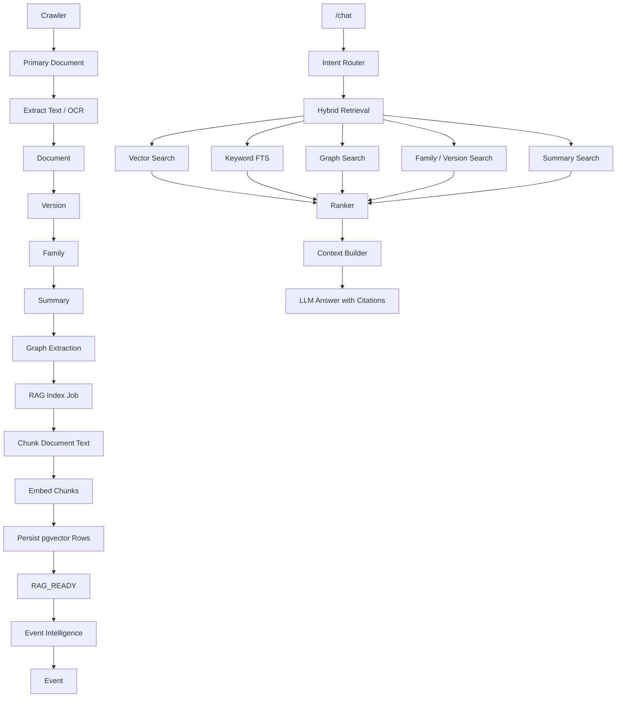

# Step 26 Hybrid RAG Implementation Report

Generated at: 2026-06-30 23:34 IST

## Scope

Step 26 superseded the earlier Step 25 instruction that prohibited RAG work. The implementation was kept backend-only.

Not modified:

- Frontend/UI
- Azure deployment
- WhatsApp integration
- Parallel/Supabase replacement
- Chat redesign

## Readiness Audit

The required pre-code readiness audit was completed first:

- `reports/STEP26_RAG_READINESS.md`

Findings:

- Existing `/chat` used summaries/history but did not retrieve grounded source chunks.
- `document_texts`, summaries, document versions/families, graph tables, and intelligence APIs existed.
- Production ingestion needed automatic RAG indexing after accepted documents persisted.
- Supabase/Postgres with pgvector was the correct vector store path for this step.
- Parallel remains supported for LLM calls; embedding access is abstracted because no verified Parallel embedding endpoint was available during implementation.

## Architecture

## Files Added

- `apps/api/backend/migrations/0014_hybrid_rag.sql`
- `apps/api/backend/migrations/0015_rag_ready_status.sql`
- `apps/api/backend/rag/__init__.py`
- `apps/api/backend/rag/admin.py`
- `apps/api/backend/rag/audit.py`
- `apps/api/backend/rag/chunker.py`
- `apps/api/backend/rag/context_builder.py`
- `apps/api/backend/rag/embeddings.py`
- `apps/api/backend/rag/indexing.py`
- `apps/api/backend/rag/intent.py`
- `apps/api/backend/rag/models.py`
- `apps/api/backend/rag/ranker.py`
- `apps/api/backend/rag/retrieval.py`
- `apps/api/backend/rag/vector_store.py`
- `apps/api/backend/tools/rag_index_worker.py`
- `apps/api/backend/tools/rag_evaluation_report.py`
- `reports/STEP26_HYBRID_RAG_EVALUATION.md`
- `reports/STEP26_RAG_READINESS.md`

## Files Modified

- `.env.example`
- `apps/api/backend/api/routes/admin.py`
- `apps/api/backend/api/routes/chat.py`
- `apps/api/backend/core/config.py`
- `apps/api/backend/core/models.py`
- `apps/api/backend/core/repository.py`

Existing dirty files from Step 25 or unrelated work were left intact and not reverted.

## SQL Migrations

`0014_hybrid_rag.sql` creates:

- `document_chunks`
- `document_chunk_embeddings`
- `document_rag_status`
- `rag_index_jobs`
- `chat_retrieval_audit`

It also creates:

- `vector` extension
- IVFFlat cosine index on chunk embeddings
- GIN full-text index on chunks
- GIN full-text index on documents
- GIN full-text index on summaries
- GIN full-text index on graph stakeholders
- GIN full-text index on graph obligations

`0015_rag_ready_status.sql` updates the completed status to `RAG_READY` and enforces:

- `PENDING`
- `CHUNKED`
- `EMBEDDING`
- `RAG_READY`
- `FAILED`
- `SKIPPED`

## Runtime Configuration

Added configuration keys:

- `EMBEDDING_PROVIDER`: `offline`, `openai`, or `parallel`
- `VECTOR_PROVIDER`: `supabase`
- `RETRIEVAL_PROVIDER`: `supabase`
- `EMBEDDING_MODEL`
- `EMBEDDING_DIMENSION`
- `OPENAI_COMPATIBLE_EMBEDDING_BASE_URL`
- `OPENAI_COMPATIBLE_EMBEDDING_API_KEY`
- `RAG_CHUNK_MIN_TOKENS`
- `RAG_CHUNK_MAX_TOKENS`
- `RAG_CHUNK_OVERLAP_TOKENS`
- `RAG_CONTEXT_MAX_TOKENS`
- `RAG_TOP_K`

Validation used the deterministic offline embedding provider:

- Provider: `offline`
- Model: `deterministic-hash-v1`
- Dimension: `1536`

## Ingestion Integration

Accepted production documents now enqueue RAG indexing automatically after document/version/family/graph work succeeds. The document persists even if RAG enqueueing fails.

Production indexing sequence:

1. Accepted document persists.
2. Latest version is registered.
3. Family assignment is registered.
4. Graph extraction runs through the Step 25 production integration.
5. RAG indexing job is enqueued.
6. The RAG worker chunks document text.
7. Embeddings are generated.
8. Chunks and embeddings are persisted.
9. `document_rag_status.status` becomes `RAG_READY`.
10. Event intelligence continues through the existing event flow.

## Retry Worker

`backend.tools.rag_index_worker` supports:

- `--enqueue-existing`
- `--requeue-processing`
- `--limit`

The worker now claims one job at a time. This prevents a process timeout from stranding a whole batch as `PROCESSING`. Interrupted jobs can be requeued explicitly, and completed jobs are not reprocessed.

## Retrieval Flow

The existing `/chat` endpoint is preserved and now uses Hybrid RAG internally:

1. Store user message.
2. Detect intent.
3. Run vector, keyword, graph, family/version, and summary retrieval.
4. Rank results.
5. Build bounded context.
6. Answer only from retrieved context.
7. Return citations and related questions.
8. Store assistant response.
9. Record retrieval audit row.

The endpoint path and frontend contract remain compatible. New response fields are additive:

- `intent`
- `citations`
- `related_questions`

## Intent Router

Supported intents:

- `deadline`
- `stakeholder`
- `obligation`
- `consultation`
- `tender`
- `amendment`
- `comparison`
- `summary`
- `regulation_lookup`
- `semantic_search`
- `general`

## Ranking Algorithm

Ranking combines:

- Vector similarity
- Keyword score
- Graph score
- Source boost by intent
- Latest-version boost
- Authority boost from recognized issuing bodies
- Freshness boost
- Evidence quality boost
- Deduplication by source/document/chunk

## Prompt Template

The chat prompt now instructs the model to:

- Answer only from retrieved regulatory context.
- Say when evidence is insufficient.
- Cite source IDs from the context.
- Keep regulatory answers concise and grounded.

If no grounded citation exists, chat returns a deterministic insufficient-evidence answer instead of fabricating.

## Admin APIs

Added backend admin endpoints:

- `GET /admin/rag/status`
- `GET /admin/rag/queue`
- `POST /admin/rag/process`
- `POST /admin/rag/requeue-processing`
- `POST /admin/rag/enqueue-existing`
- `GET /admin/rag/chunks`
- `GET /admin/rag/chunks/{document_id}`
- `GET /admin/rag/retrieval`
- `GET /admin/rag/context`
- `GET /admin/rag/prompt`
- `GET /admin/rag/vector-search`

No admin UI changes were made.

## Validation Results

Final database validation:

| Metric | Value |
|---|---:|
| Eligible accepted documents | 42 |
| Documents indexed | 42 |
| Documents with chunks | 42 |
| Documents with embeddings | 42 |
| Documents with `RAG_READY` status | 42 |
| Documents not ready | 0 |
| Chunks generated | 2,561 |
| Embeddings generated | 2,561 |
| Vector index entries | 2,561 |
| Indexing failures | 0 |
| Pending jobs | 0 |
| Failed jobs | 0 |
| Average chunks per document | 60.98 |
| RAG readiness percentage | 100.00% |

Observed job lifecycle latency:

| Metric | Value |
|---|---:|
| Average indexing latency | 1,739,167 ms |
| Minimum indexing latency | 32,052 ms |
| Maximum indexing latency | 4,578,836 ms |

Note: indexing latency is measured from job creation to completion, so it includes queue wait time and the interrupted worker retry window during validation.

## Physical Index Proof

Confirmed indexes:

- `document_chunk_embeddings_vector_idx`
- `document_chunks_search_idx`
- `documents_search_idx`
- `summaries_search_idx`
- `regulatory_graph_stakeholders_search_idx`
- `regulatory_graph_obligations_search_idx`

Missing per-document coverage rows:

- None

## Retrieval Evaluation

Evaluation report:

- `reports/STEP26_HYBRID_RAG_EVALUATION.md`

Benchmark summary:

| Metric | Value |
|---|---:|
| Queries | 6 |
| Average retrieval latency | 2,525.0 ms |
| Average hits retrieved | 10.2 |
| Average Precision@5 proxy | 0.70 |
| Average Recall@10 proxy | 0.68 |
| Average citation accuracy proxy | 0.83 |
| Average grounding rate | 0.83 |
| Average false citation rate proxy | 0.17 |

One benchmark query, `What changed today?`, returned no citations because no matching grounded evidence was found for that phrasing in the indexed corpus. The route handles that as insufficient evidence.

## Security Considerations

- Chat answers are grounded in retrieved context and citations.
- Empty retrieval returns an insufficient-evidence response.
- Retrieval audit rows capture intent, citations, chunks, graph facts, model, and latency.
- Embedding provider selection is explicit through runtime config.
- The deterministic offline provider is available for local validation without external network calls.
- Admin RAG endpoints use the existing admin dependency.

## Future Qdrant Migration Strategy

No Qdrant or Pinecone dependency was added.

If migration is needed later:

1. Keep `VectorStore` as the stable interface.
2. Add a `QdrantVectorStore` implementation behind `VectorStoreFactory`.
3. Preserve chunk IDs and citation metadata as the portability boundary.
4. Backfill vectors into Qdrant from `document_chunks` and `document_chunk_embeddings`.
5. Switch `VECTOR_PROVIDER` only after parity tests pass.

## Known Limitations

- Precision/recall metrics are proxy metrics because no labeled regulatory gold set exists yet.
- Parallel embedding support is abstracted but not validated against an official Parallel embedding endpoint.
- The validation embedding set uses deterministic offline embeddings, suitable for repeatable local validation but not semantic production quality.
- Average indexing latency includes queue/retry time from the interrupted validation run.

## Verification Commands

- `python -m ruff check --no-cache backend`
- `python -m compileall -q backend` with `PYTHONPYCACHEPREFIX` redirected to temp cache
- `python -m pytest -p no:cacheprovider`
- `python -m backend.tools.apply_migration backend\migrations\0014_hybrid_rag.sql`
- `python -m backend.tools.apply_migration backend\migrations\0015_rag_ready_status.sql`
- `python -m backend.tools.rag_index_worker --requeue-processing --limit 50`
- `python -m backend.tools.rag_evaluation_report`

## Final Verdict

Step 26 is implemented and validated for the current accepted corpus:

- Hybrid RAG schema exists.
- Accepted documents are indexed.
- Chunks and embeddings are persisted.
- Vector and full-text indexes are present.
- `/chat` uses grounded hybrid retrieval.
- Admin diagnostics and retry worker exist.
- All eligible accepted documents are `RAG_READY`.
